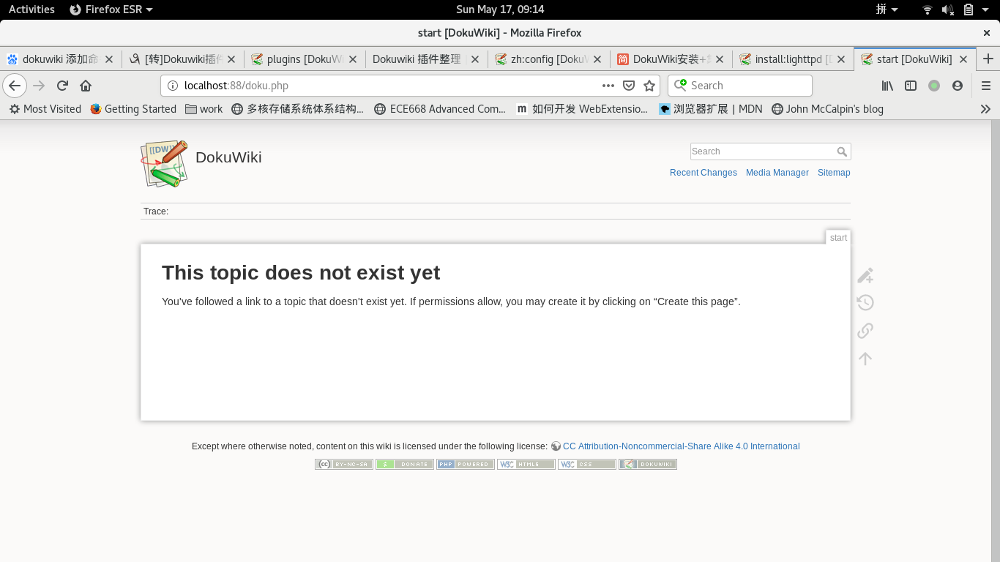
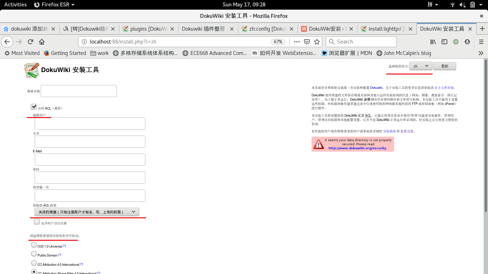
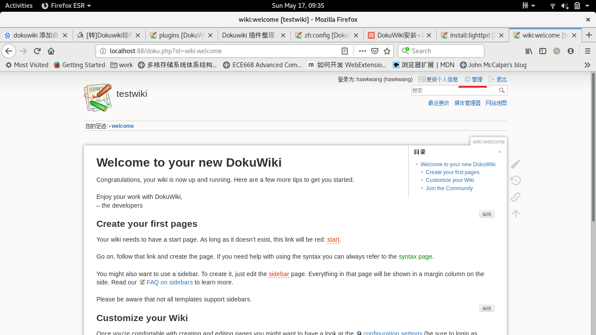

# 	DokuWiki的安装和使用

## 介绍

Dokuwiki是一个基于PHP的轻量化的wiki系统，其主要特点是：wiki的页面通过**文本文件保存**，不使用任何形式的数据库、支持用户管理配置、主题配置已经大量可复用的插件用于扩展已有的wiki系统。所以选择Dokuwiki作为文档共享和管理的主要目的主要基于如下几个特征：

- 易于安装，只需要配置好web server和PHP即可
- 文本保存，可以现有git系统关联，实现自动同步、备份功能；保证已有文档不丢失
- wiki本身带有修改记录功能，可以追溯每个文档页面的更改历史
- wiki页面可以分组(Dokuwiki的命名空间)，wiki页面可以按照不同项目进行分组管理，分组对应到物理存储上既是不同的项目文件夹
- 可以进行用户控制，不授权的用户无法访问相应的wiki页面
- 可以配置插件，用于扩展wiki的功能

我们使用Dokuwiki时，需要查看和使能的特征：

- 如何创建项目分组，项目目录如何与git关联
- 动态添加用户和进行用户管理
- 如何设置不同用户权限使得不同用户不能访问非授权的项目分组
- 支持markdown，目前对于markdown的支持不好，没有找到好的插件，只能使用wiki语法；可以用pandoc进行文档格式转换
- 可以插入表格、图片、程序、附件等，如何保存
- 支持用户评论，可以进行文档讨论和交流
- 支持导出wiki页面为pdf、word或是开源word的格式

## Linux安装

实验系统为Debian9，实际运行系统可能为Ubuntu系统。两者差别不大，安装和处理方式类似，基于的PHP基本现在为7.0版本。

### 支持环境的安装

Dokuwiki支持以下的webserver：lighttpd, nginx, apache。实验以lighttpd进行实验，实际运行视情况而定。这里把各个webserver的配置进行记录

- lighttpd

  ```bash
  sudo apt install lighttpd			# install lighttpd, will as service start
  															# using sudo service lighttpd start/stop/restart to control
  vi /etc/lighttpd/lighttpd.conf		# modify lighttpd configuration
  cat << EOF
  	server.document.root = "dokuwiki-root-path"
  	server.port = <port number>
  	# dokuwiki's root dir should have access right to <group-name>/<user-name>
  	server.groupname = "<group-name>"
  	server.username = "<user-name>"
  EOF
  
  # php-cgi/php-fpm for dokuwiki running
  # php-xml for utf-8 encoding/decoding
  sudo apt install php-cgi php-fpm php-xml
  vi /etc/php/7.0/fpm/php.ini
  cat << EOF
  	cgi.fix_pathinfo=1
  EOF
  
  cp /etc/lighttpd/conf-available/15-fastcgi-php.conf 15-fastcgi-php.conf.bak
  vi /etc/lighttpd/conf-available/15-fastcgi-php.conf
  cat << EOF
  	# modify content as below
  	fastcgi.server += ( ".php" => 
  		((
  			"socket" => "/var/run/php/php7.0-fpm.sock",
  			"broken-scriptfilename" => "enable"
  		))
  	)
  EOF
  sudo lighttpd-enable-mod fastcgi
  sudo lighttpd-enable-mod fastcgi-php
  
  vi /etc/lighttpd/conf-available/50-dokuwiki.conf
  cat << EOF
  	alias.url += ("/dokuwiki" => "/var/www/dokuwiki/dokuwiki")
  
  	$HTTP["url"] =~ "^/dokuwiki" {
    	server.follow-symlink = "enable"
  	}
  
  	$HTTP["url"] =~ "/(\.|_)ht" {
    	url.access-deny = ( "" )
  	}
  	$HTTP["url"] =~ "^/dokuwiki/(bin|data|inc|conf)" {
    	url.access-deny = ( "" )
  	}
  EOF
  sudo lighttpd-enable-mod dokuwiki
  
  sudo service lighttpd force-reload
  sudo service lighttpd restart
  ```

- nginx

- apache

### Dokuwiki安装

```bash
tar -xvf dokuwiki.tar.gz		# extract dokuwiki source to specific dir, change webserver conf to point to dokuwiki root
sudo chown -R <username>:<groupname> dokuwiki-root		# change owner to webserver's user/group

# step3. using http://localhost:<port_number>/ visit, will show dokuwiki page

# step4. if above success, then http://localhost:<port_number>/install.php to init doku environment
```

step3显示的画面



step4的安装界面



- 设置wiki的名称

- 设置管理员

- 选择语言为中文

- 设置ACL政策

  - 开放的wiki			任何人都可以读、写、上传权限
  - 公共的wiki            任何人都可以读，注册用户才有写、上传权限
  - 关闭的wiki            只有注册用户读、写、上传权限

- 设置内容发布许可协议

  选择不要显示任何许可协议信息

- 不向dokuwiki发送匿名数据

登录系统后，显示的内容如下，如果是系统管理员，可以选择管理进行用户和插件等的管理



## 用户配置管理

## 插件配置管理

以管理员身份登录，选择管理，进入插件管理界面，进行插件的检索和更新

目前，需要安装和配置如下的插件

- add new page

  在侧边栏目里添加新的页面的功能

- indexmenu

  创建导航列表

- bookcreator

  将多个wiki页面生成为pdf文档

- dw2pdf

  生成pdf文件，与bookcreator配合使用

- csv

  将csv格式文件渲染为表格

- discussion

  添加评论区

- pagelist

  配合discussion插件使用

- todo

  设置todo列表，可以勾选

- mathpublish

  添加数据公式的渲染

- imgpaste

  支持从剪贴板直接粘贴图片到编辑区

- edittable

  编辑表格

- color

  文字的前景和背景颜色

- issuetracker

  问题跟踪系统

- move

  移动页面和相关的资源文件和链接

- numbered headings

  给标题添加章节号

- templatepagename

  在不同的命名空间创建不同的页面模板

- codemirror                 done

  替换默认的dokuwiki的编辑器

- superacl

  在管理界面指定所有namespace的权限

- popupviewer

  

  用于超链接其他的页面，并在弹出窗口进行预览

- poll

  https://www.ichiayi.com/wiki/tech/dokuwiki_plugin/poll

  用于在页面中发起投票功能

  ```wiki
  <poll [id]>
    [question]
  
    * [option]
    * [option]
    * ...
  </poll>
  ```

- goto

  当当前页面还未编辑时，可以按照某个固定时间设置goto页面

## 文档页面的管理

## 一般的使用方法