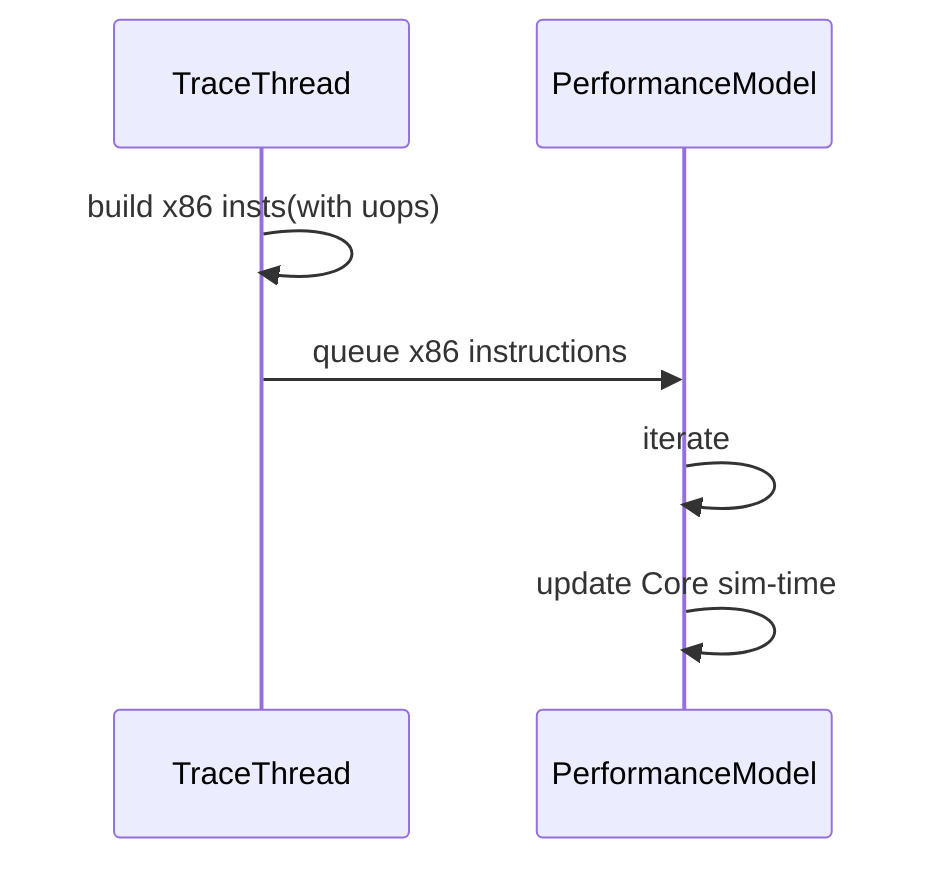
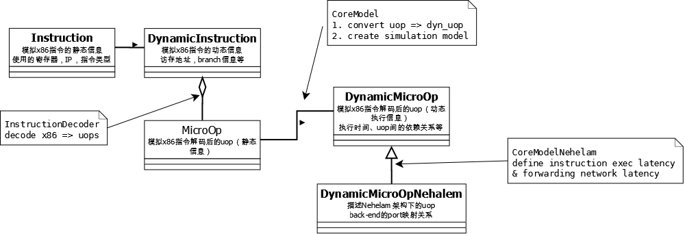
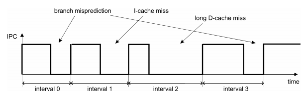
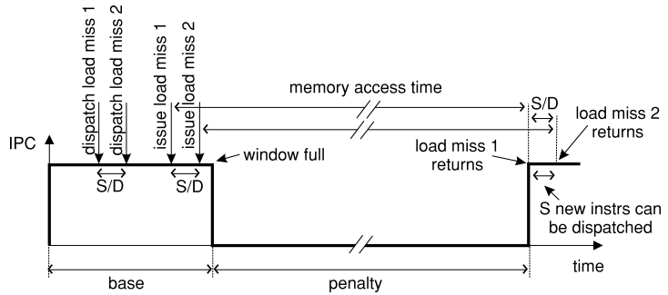
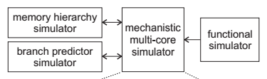
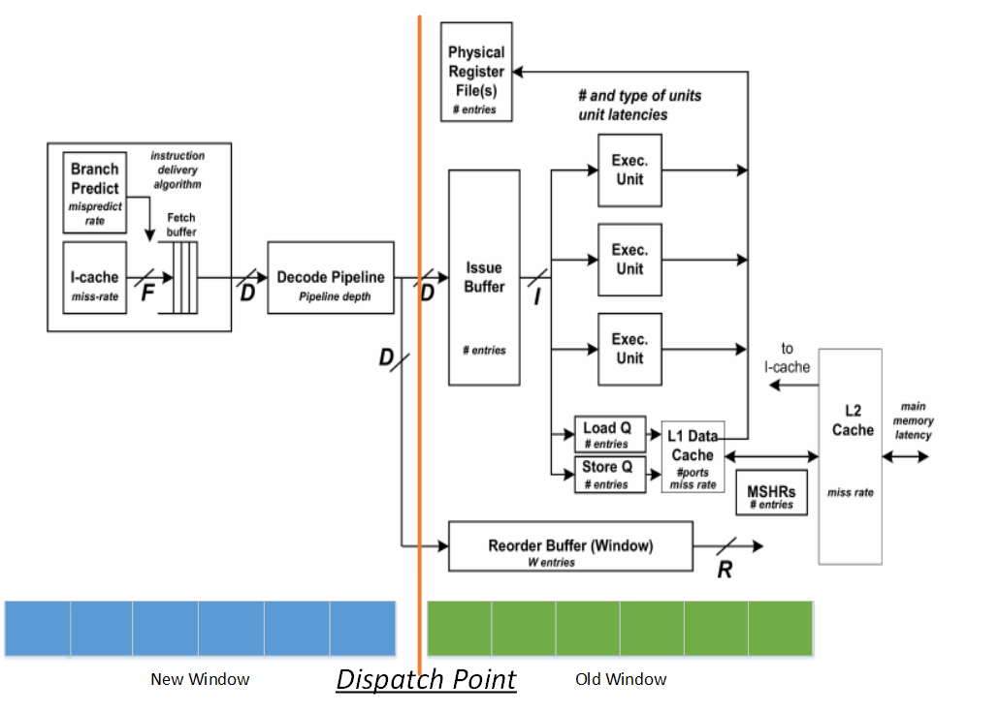
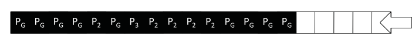
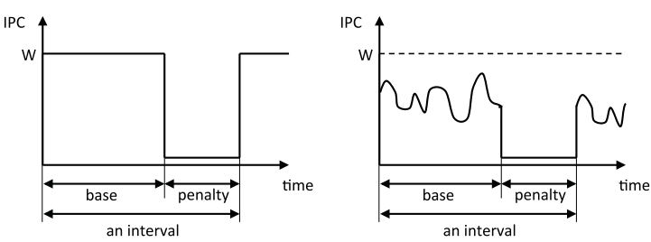
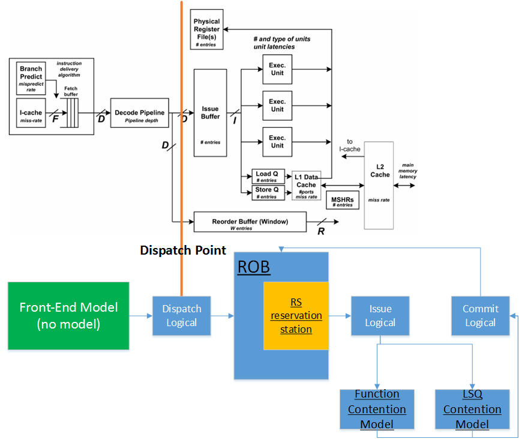

# Core建模

## 对于HW的结构抽象

一个典型的多核处理器结构如下：


Sniper针对每个ProcessorNode进行了建模


基本与实际的硬件结构一一对应

仿真系统与实际运行系统间的映射关系


## SimCore的类关系


## Sniper仿真的运行机制

Parallel simulation，每个Core有一个单独的host thread运行performance model

```c++
// x86 instruction will queue to performance model by trace-frontend
void core_simulate(void) {
  while (true) {
    performance_model->iterate();		// based on x86 instruction
  }
}
```

多个Core host thread之间需要进行同步，采用barrier的方式进行同步(BarrierSyncClient), 每次同步步长为100ns


## Core仿真流程



## Sniper的ISA设计

针对每条x86指令，sniper会生成对应的uop序列，按照如下格式

x86 inst --->

​	load uop-seqs

​	execute uop-seqs

​	store uop-seqs

### 针对Nehelam的uop设计



## Sniper中建模仿真的Intel Core

目前，sniper建模仿真了微架构为Nehlam的Cpu微结构，主要表现在ExecutionPort的分配，和BypassNetwork的建模仿真上

## Sniper中Performance Model的分类

### One-IPC model

一种最为简单的Core模型抽象，其流程为:

```c++
void oneipc_model()
{
  /*
   * no ILP & MLP, one cycle handle one instruction
   */
  if (inst is non-mem op)
    latency += 1;		// trease as 1 cycle inst
  else
    latency += simulate_memsubsystem();		// according to memsubsystem return latency, proceed the core latency
}
```

### Micro-op Model

实现了uop层级(model自己设计的uop ISA)的仿真，这种仿真又提供了两种仿真模型

- interval model
- ROB-based model

ROB-based model相对于interval model可以提供更好的精度，因为对于Core的back-end后端进行了更详细的建模处理

##### micro-op的处理流程

```c++
void microop_model() 
{
  vector<uop> uops = builduop(inst);
  if (uops.size() > 0)
  	latency = uop_model->simulate(uops);
  else {
    // fake instruction, 2 types
    //		1. TLB miss pseudo instruction ==> mimic as serialization instruction
    //		2. mem-sync(pthread sync operation) pseudo instruction  ==> mimic as mem-access instruction, not a real x86 instruction
    uops = build_fake_uops();
    latency = uop_model->simulate(uops);
  }
  
  // synchronize core_time
  synchronize();		// for some latency not calc in the uop_model
}
```

### Interval model

#### Core的微架构


1. ILP (instruction-level parallelism)

   ```assembly
   start [AT&T syntax]:
   	mov eax, ebx		; inst1
   	mov edx, ecx		; inst2
   	add ebx, ecx		; inst3, depent on inst1, inst2
   	mov edi, esi		; inst4
   ```

   ```mermaid
   graph TD
   	inst1((1))
   	style inst1 fill:#f9f,stroke:#333
   	inst2((2))
   	style inst2 fill:#f9f,stroke:#333
   	inst3((3))
   	style inst3 fill:#89,stroke:#333
   	inst4((4))
   	style inst4 fill:#f9f,stroke:#333
   	inst1 --> inst3
   	inst2 --> inst3
   ```

   可以看到，1/2/4可以在同一个Cycle进行Issue，而3需要等到1、2完成之后才可以，这里的ILP=3。ILP和ROB大小、程序行为、编译器有关

2. MLP (memory-level parallelism)

   ```assembly
   start [AT&T syntax]:
   	mov [0x1000], ebx	; inst1, miss
   	mov [0x2000], ecx ; inst2, miss
   	mov [0x3000], edx ; inst3, miss
   	mov [0x5000], eax ; inst4, hit
   ```

   这里的4条指令可以并行运行，只要LSU(Load-Store Unit)单元中有足够的空间放下，那么这4条指令可以并行执行，而不用等待miss的数据返回。MLP和ROB/LSQ大小、程序行为、编译器相关

#### Interval Analysis

从**Dispatch**的角度，将Core的执行看作一个一个的波段，每个波段由Miss Event产生；通过分析不同miss event的penalty构成整个Core执行后的完整时间分布和分析



##### balanced processor假设

当没有miss event发生的时候，Core总是能够以Dispatch Width的速率(IPC=D)执行代码，Core中其他的结构的设计容量足够大，不会导致IPC < D。具体来说，就是要保证上述Core微架构：

1. F(fetch width) >= D
2. R(retire width) >= D
3. I(Issue width) >= D
4. 各种Queue Depth和FIFO depth不会导致处理器因为资源竞争stall

==问题：一般来说，即使可以保证Core中所有结构都是足量设计，也无法保证Core总是按照Dispatch width的速率执行代码，因为程序本身有天然的ILP属性，ILP低的程序，无法做到按照Dispatch width的速率执行，所以这里是模型假设上的overestimate==

##### Miss Event

**front-end event**

1. I-cache miss

   

   **penalty = icache-delay**

   ==问题：这里的penalty没有考虑到fetch buffer的影响。fetch buffer表示Core取回来还没有解码的指令，如果Fetch Buffer中缓存了很多的指令，那么某次I-Cache miss不一定会引起penalty。比如fetch buffer中的指令数 > D*frontend-delay，那么penalty小于icache-delay；比如fetch buffer中目前有16个nop指令，frontend的stage为5，D为2，miss-delay=10，那么penalty=10-16/2+5 = 7==

2. branch miss

   

   **penalty = branch resolution-time + front-end refill time，其中front-end refill time在interval model中是固定的前端pipeline的长度**

**back-end event**

1. short-latency miss

   不考虑。在balanced processor的假设下，这部分delay被Core的乱序机制掩盖

2. long-latency miss

   

   **penalty = miss-latency - W/D， W表示ROB大小；通常，W/D << miss-latency，所以penalty ~= miss-latency**

   long-latency define：通过上图可以看到，long-latency miss指的是当latency不足以被ROB大小覆盖的时候导致的pipeline stall，所以这要求**long-latency > W/D**

   ==问题：实际上，所有delay>W/D的操作都可以归类为long-latency miss，套用这里的分析进行处理；比如float-point div==

**miss event间的overlap**

1. front-end VS. front-end

   因为前端是完全In-order的，所以miss event间也是完全串行的；所以penalty都会作用于Core的time上

2. front-end VS. back-end

   在model中，两者间的overlap < 5%，所以选择无视

   1. front-end前，back-end后

      不存在

   2. back-end前，front-end后

      1. long-latency VS. I-cache miss

         icache-miss发生在long-latency load执行完之后，完全串行；否则认为long-latency掩盖了I-cache miss的延时

      2. long-latency VS. branch miss

         branch-miss在ROB满之后发生，则串行；branch进入ROB，但是依赖long-latency，则串行；否则long-latency掩盖branch miss的延时

3. back-end VS. back-end

   1. load depent load

      完全串行

   2. load indepent load

      

      **这里假设load latency的load有相同的memory access time**

      ==问题：实际上，这种假设是有问题的，无法保证后面overlap的long-latency load的delay一定<=前面的long-latency load的delay，所以会引入误差==

      如何识别indepent load，需要在某个long-latency load往后的W条指令中进行搜索对应的load指令(**这里的indepent包括寄存器**)

      ==问题：这里的long-latency load实际只是一个代表，不一定特别指代load操作，比如float-point的div操作，如果L > W/D，一样可以认为是long-latency load，而这里的indepent load实际上还要考虑resource contention的结果，比如float-point的div如果不能是pipe处理的，且仅有一个对应的处理单元，那么多个div之间实际建立了依赖关系；这里并没有考虑这方面的问题==

##### 时间统计公式

​	$Time_c = N / D + \sum_{i}^{miss-events}{penalty_i}$

#### Interval Model Enhancement

##### 对Interval Analysis的改进

1. 当没有miss event的时候，不认为IPC=dispatch-width，而是考虑到ROB中的指令ILP，使用D~effective~
2. 考虑串行指令
3. 考虑front-end VS. back-end的overlap
4. 考虑每个interval的长度影响
5. 加入了function unit的资源竞争，影响ROB中的指令ILP
6. 考虑front-end branch miss后refill流水线的影响
7. 考虑overlap memory的访问
   1. pending hit，即两笔miss load访问相同的cache line
   2. false indepent的long-latency-load处理

##### 算法实现过程 ("two-window" method)





建立2个Window窗口(old/new window)，每个窗口大小为ROB大小

- old window：表示已经经过dispatch，在back-end中执行的指令。*这里是粗略估计执行的指令，真实Core中，随着retire的进行，并不总能保证有ROB总是满的状态*。这个部分主要用来估计程序中的ILP和D~effective-rate~
- new window：即将进入dispatch的指令，用来进行overlap指令的甄别。为了保证可以看到“足够的”(ROB大小)指令窗口查看overlap指令，算法只在new window处于满的状态下运行

```c++
void inteval_model(inst)
{
  /*
   * interval model always at dispatch-point to handle inst penalty
   * steps (when window full):
   *	1. run function model first for inst(BP and cache model)
   *	2. enumerate inst' miss event, add penalty to core time
   */
  if (!newW->full()) {
    // new window not full, add it
    // and build reg & mem dependency
    newW->add(inst);
    return ;
  }
  
  latency = 0;
  while (newW->full()) {
    // new window already full, run interval simulate
    dispatch_num = 0;
    dispatch_effective = calcDispatchEffective();		// calc dispatch rate for ILP
    
    while (!newW->empty() && !frontend_miss && dispatch_num++ < dispatch_effective){
      dispatch_inst = newW->getDispatchInst();
      if (dispatch_inst->miss_event && !overlap)
        latency += handle-missevent();
    }
    
    if (!newW->empty() !frontend_miss && dispatch_num == dispatch_effectvie) {
    	// means all dispatch_num dispatch in this cycle
      latency += 1;
    }
  }
}
```

##### D~effective~的计算

old-window保存了所有已经Dispatch进入ROB，等待执行或者已经执行的指令，主要计算Interval Core的有效Dispatch Rate(即有效IPC)，这个值反映了程序的ILP特性。

具体的方法：

1. 构造当前old-window的程序数据流图(data-flow)，表示各个指令间的依赖关系

2. 根据具体的模拟的Core的架构，计算各个节点的execution-time，这个时间反映了每条指令completion-time(也是依赖于它的后续指令的issue-time)

3. 计算old-window的"最老"完成时间, CriticalTime~head~ = max(ExecTime~oldest_inst~, CriticalTime~head~)；计算old-window的"最新"完成时间，CriticalTime~tail~ = max(ExecTime~newadd-inst~, CriticalTime~tail~)；计算CriticalPath = CritialTime~tail~ - CritialTime~head~

4. 考虑各个Function Unit资源竞争的影响

   CritialPath = max(CriticalPath, S~i~)，其中S~i~ 表示当前old-window中发送到FuncUnit~i~的指令数完全处理完成需要的Cycle数。

   *举个例子，假设初步计算的CriticalPath=4，有FunctionUnit 0-4，OldWindow中有如下的指令，所有指令没有依赖关系*

   

   *其中，G表示指令可以发送到0，1，4；每个FunctionUnit的处理时延都是1T，且都可以Pipe处理*

   *那么，S~0~ = 3, S~1~ = 3, S~2~ = 5, S~3~ = 1, S~4~ = 3。所以，对于目前的Window来说，全部处理完成需要5个Cycle*

5. 计算D~effective~ = min(D, NumInst~old-win~ / CriticalPath)，利用Little-law(利特尔法则)

*利特尔法则，在一个稳定的系统中，平均吞吐率=在制品数量/平均前置时间*

*例子：你正在排队买快餐，在你前面有19个人在排队，你是第20个，已知收银窗口每分钟能处理一个人的点餐需求，求解你的等待时间。 20/1 = 20分钟*

*对应到计算机中，反映了Bandiwith(吞吐率)，容量(在制品)，和时延(前置时间)的关系*



通过这种方式形成的Inverval不像之前的分析中那么平滑

==问题：通过这种方式进行ILP的评估可能会出现underestimation，因为这样计算出来的Criticalpath不一定是真正的critical-path，可能比实际的critical-path要多几个cycle，要看CriticalTime~head~是否在critical-path上==

##### Miss-Event的处理

1. I-Cache miss的处理

   ```c++
   uint64_t handle_icachemiss(void)
   {
     clearOldWindow(CriticalTime_tail + icache_delay); // 清空OldWindow，并更新CriticalTime_head和CriticalTime_tail到参数值；这样做隐含的意思是当发生icache miss，ROB中的指令一定都会处理完成，ROB处于empty状态
     frontmiss = true;
     return icache_delay;
   }
   ```

2. Branch miss的处理

   ```c++
   uint64_t handle_brmiss(void)
   {
     uint64_t branch_delay = oldW->calcBranchResolutionTime()+frontend_refill_param;
     clearOldWindow(CriticalTime_tail+branch_delay);
     frontmiss = true;
     return branch_delay;
   }
   ```

   处理Branch指令的resolution time的方法：

   ​	branch指令的resolution time指的是branch最早可以执行的时间，所以这里算法采用计算branch最长依赖链的执行时间的方式精确获得branch的最早执行时间

   ​	算法从br依赖的最近节点反向层序遍历整个依赖图，依次累加更新每个节点的执行时间，最后选择累加值最大的那个节点。以下图为例，最终的branch resolution time=2节点上的11

   ```mermaid
   graph TD
   	inst1((1,exec=2))
   	style inst1 fill:#f9f,stroke:#333
   	inst2((2,exec=5))
   	style inst2 fill:#f9f,stroke:#333
   	inst3((3,exec=1))
   	style inst3 fill:#f9f,stroke:#333
   	inst4((4,exec=3))
   	style inst4 fill:#f9f,stroke:#333
   	inst5((5,exec=1))
   	style inst5 fill:#f9f,stroke:#333
   	inst6((6,exec=2))
   	style inst6 fill:#f9f,stroke:#333
   	br((br))
   
   	inst1 -- 0 --> br
   	inst2 -- 6 --> inst3
   	inst3 -- 1 --> inst5
   	inst4 -- 2--> inst6
   	inst3 -- 5 --> inst4
   	inst3 -- 2 --> inst6
   	inst1 -- 6 --> inst3
   	inst5 -- 0 --> br
   	inst6 -- 0 --> br
   ```

   ==问题：这种方式获得resolution time可能比真实HW上的时间长，比如old window中的依赖指令已经执行完毕，那么这里获得的完整依赖链时间就是overestimate。==

3. Serialization指令的处理

   串行指令的目的主要是清空Core pipeline，所以这里的delay主要是old window的"流出"时间

   ```c++
   uint64_t handle_serialization()
   {
     uint64_t serialization_latency = max(CriticalPath, W/D);	// critical path的长度代表了处理完old window中所有指令所需的完整时间，其中的W/D表示以dispatch_rate进行dispatch，所需的cycle数
     clearOldWindow(CriticalPath+serialization_inst_exec_latency);
     return serialization_latency;
   }
   ```

4. Long-latency load miss的处理

   对于long-latency load miss的back-end指令，因为会导致ROB Full从而不能dispatch，所以需要考虑front-end/back-end与其的overlap处理。同时，这里考虑了LSQ(load-store queue)的Queue深度，从而引入了MLP。

   ```c++
   uint64_t handle_longlatencyload()
   {
     uint64_t sched_delay = max(maxProducerTime, newW->getCriticalHead());
     uint64_t longlatency = m_loadstoreq.getCompletionTime(sched_delay, longlatency);	// 考虑load-store queue 竞争的情况下计算load执行的时间
     clearOldWindow(sched_delay + longlatency);
     blockWindow();		// 后向分析后续要进入ROB的指令序列，找到所有overlap的事件
     updateCriticalTail(sched_delay+longlatency);
     return longlatency;
   }
   ```

   - load-store Queue的建模

     ```c++
     uint64_t *m_ldstq;		// load-store queue由时间数组组成，每个entry表示每笔load/store的完成时间
     uint64_t m_t_last;		// 表明上一次最后push进入load-store queue执行的load/store指令的访问时间
     
     uint64_t getCompeletionTime(uint64_t sched_time, uint64_t latency)
     {
       uint64_t new_sched_time = sched_time;
       if (m_outstanding_num == 0)
         return new_sched_time+latency;		// no contention, fully MLP
       
       if (new_sched_time < m_t_last) {
         return new_sched_time+latency;	// no contention delay, but transfer delay
         													  // 这里可能model的行为不对，这里首先假设所有的load/store指令可以进入load-store queue，然后在执行的时候再判断当前的load/store指令是否可以执行，还是延后执行。实际上，real Core在进入load-store queue的时候就会检查load/store指令能否进入，不能的话，dispatch停止。这里的资源模拟的按照程序理解应该是load-store的单元数，但是逻辑上更像是fillQ的个数。有些矛盾，只能是近似的模拟
       }
       else {
         for (int i = 0; i < m_outstanding_num; i++) {
           if (m_ldstq[i] <= new_sched_time)
             break;
         
         	if (m_ldstq[i] < min_sched_time)
             min_sched_time = m_ldstq[i];
         }
         if (i == m_outstanding_num)
           new_sched_time = min_sched_time;
         occupy_entry(i);
         m_t_last = sched_time;
       }
       
       return new_sched_time + latency;
     }
     ```

   - overlap事件的处理

     对于overlap的事件处理过程，扫描newW中的所有指令：

     - 标记后续所有的newW中的指令为ICACHE_OVERLAP
     - 如果uop是serilization指令，停止处理
     - 查找当前uop所有依赖的uop序列(producers)
       - 如果producer依赖当前long-latency load，则标记uop为依赖
       - 如果producer不依赖当前long-latency load，但是本身是long-latency miss load，则依然标记uop为依赖 
     - 对于branch miss指令，且不依赖的指令，标记BPRED_OVERLAP
     - 对于不依赖，但是和long-latency load访问相同cache line的load指令，标记为依赖
     - 对于load指令，如果前面没有mem barrier指令，则标记为DATA_OVERLAP指令，表明MLP

#### ROB model

##### ROB model对于Interval model的改进

- 完整model了Core的back-end功能，主要加强了对于ILP的模拟，实现了Dispatch、Issue、Commit的逻辑
- 指令的ILP处理不再依赖Little-law法则，而是和真实的Core一样进行调度处理

##### ROB Model结构



ROB Model中重点实现了Dispatch/Issue/Commit 3个back-end逻辑，并对ROB和FunctionUnit以及LSQ进行了资源竞争建模

##### 实现


ROB model中以Rob Queue为中心，实现Dispatch/Issue/Commit三个back-end主要功能

```c++
void rob_model(inst)
{
  /*
   * ROB model, simulate detailed back-end ILP & MLP
   */
  add_uops(inst);		// add uops to wait-dispatch window
  
  if (inst->isStore()) {
    // handle inst's effective address calc
    // if address registers already ready(complete time confirm), mark inst address ready
    if (inst->no_address_dependent)
      inst->addressReady = max_time_dependent_ready;
  }
  
  build_reg_dependency(inst);		// build ILP
  build_mem_dependency(inst);		// build ld/st dependency
  
  if (enable_ld_st_forwarding && inst->isLoad()) {
    // for load store forwarding, remove store dependent
    // add store dependee to load dependent
    // ex: 
    //		.... some instruction on addr&data calc, suppose inst1, inst2
    //		mov [addr], data		;store
    //		mov eax, [addr]		;load, depend on store
    // then load can forward from store, here, modify load depend as below:
    //		load depend on store ==> load depend on inst1, inst2
    build_forward_dependent(inst);
  }
  
  // handle dependencies already done case
  handle_dependent_done(inst);
  
  if (rob->size < m_in_rob + 2*dispatch_width)
    // pending enough instruction to handle
    return;
  
  while (true) {
    latency = simulate();
    if (latency == 0)		// no more need handle
      break;
    core_latency += latency;
  }
}
```

在具体实现Simulate的时候，Sniper使用了Event-Driven的方式，以Event的发生时间步进Core的时间，而不是每周期都进行调用

- Dispatch

  Dispatch主要仿真指令在front-end和进入ROB之前的事件，这里主要包括如下几方面：

  1. front-end stall
     1. Branch miss
     2. I-Cache miss

  2. RS Full

     ==问题：在实际的Design中，RS Full不影响指令进入ROB，同时这里模拟的RS是一个unified的RS，而实际硬件中可能是一个distributed的RS==

  3. ROB Full

  ```c++
  uint64_t dispatch() 
  {
    uint64_t next_event = max_time();		// next dispatch event will happen time
    
    if (frontend_stall_until < core_now) {
      // no front-end stall, can dispatch
    	while (m_in_rob < ROB->size()) {
    	  if (rob[m_in_rob]->icache_miss) {
      	  // icache miss, all insts following can't dispatch
        	frontend_stall_until = core_now + icache_miss_delay;
        	break;
      	}
      
      	if (rs_cnt == RS->size())
        	break;
      	m_in_rob++, rs_cnt++;
      
      	if (inst->ready)
        	next_event = min(inst->ready, next_event);
      
      	if (dispatch_cnt == dispatch_width)
        	break;
    	}
    
    	if (m_in_rob == rob->size())
      	// only can dispatch when issue at-least one
      	// it is not very correct point, but no function error
      	return next_event;
    	return min(frontend_stall_until, next_event);
    }
    else {
      // front-end stall, pending
    }
    return next_event;
  }
  ```

- Issue

  Issue处理已经Ready(没有依赖关系)指令的执行和执行后的指令的解依赖处理

  ```c++
  uint64_t issue() 
  {
    uint64_t next_event = max_time();
    
    for (int i = 0; i < m_in_rob; i++) {
      if (rob[i]->m_done) {
        next_event = min(next_event, rob[i]->m_done);
        continue;
      }
      
      (can_issue, need_break) = check_issue();
      if （need_break)
        break;
      
      if (can_issue) {
        issue_uop();			// really execute, and calc execution latency
        
        // iterate insts depend on this already done uop
        for (int i = 0; i < rob[i]->getDependents(); i++) {
          dep_inst = rob[i]->getDependent(i);
          dep_inst->readyMax = max(dep_inst->readymax, rob[i]->m_done);
          dep_inst->removeDep();
          
          if (dep_inst->getDependents() == 0) {
            // no dependees
            dep_inst->ready = dep_inst->readyMax;
          }
          
          if (dep_inst->isStore()) {
            // remove address register dependent
            if (inst in dep_inst->addressDependees())
              dep_inst->readyAddrMax = max(dep_inst->readyAddrMax, inst->m_done);
            if (dep_inst->addressDependees() == 0) {
              // all depend resolved
              dep_inst->readyAddr = dep_inst->readyAddrMax;
            }
          }
        }
        
        // if uop encounter branch miss, update frontend stall time
        if (branch_miss) {
          frontend_stall_until = core_now + branch_penalty - 2;
        }
      }
    }
  }
  ```

  - 不能Issue的条件

    | 条件                      | 说明                                                         |
    | ------------------------- | ------------------------------------------------------------ |
    | inst->ready > core_now    | 指令ready了，但是在**未来**的时间                            |
    | hit mfence && inst->memOp | 指令是load/store指令，但是之前有mfence指令(lfence/sfence处理成mfence)，需要等待mfence结束才可以执行 |
    | mfence指令                | 必须等到是rob_head的时候才能执行<br />==问题：在目前的sniper中实现有问题。sniper的rob_head指的是一次issue的时候第一次issue的条件，而实际硬件指的就是rob head== |
    | serialization指令         | 条件同mfence指令；同时**结束本次Issue**                      |
    | store指令                 | store queue必须有空间<br />==问题：这里的实现也有问题，push store queue在真实硬件上是在dispatch的时候进行的，不是在issue的时候== |
    | load指令                  | load queue必须有空间，且没有unknown address的store指令(store的address register有依赖关系或是在未来才能计算出地址)[使能address_disambiguation]<br />==问题：push load queue也是在dispatch的时候进行的== |
    | 其它的指令                | 没有使能function unit contention model，则issue_cnt <= dispatch_width可以issue；**这里实际上为了保证balanced processor设计的限制，否则会导致Core可能执行的过快**<br />使能function unit contention model，检查uop能否在对应的function unit issue处理 |

  - Function Unit的仿真

    仿照Nehelam的back-end结构构造了Function unit的处理

    具体参考common/performance_model/performance_models/core_model/dynamic_micro_op_nehalem.cc文件

    | Port    | 支持的操作                                        |
    | ------- | ------------------------------------------------- |
    | Port0   | 浮点乘除，向量开方相关指令                        |
    | Port1   | 浮点加减， 64位整形乘，LEA指令，向量精度转换指令  |
    | Port5   | branch指令，向量move和逻辑运算指令                |
    | Port015 | 其它指令                                          |
    | Port05  | 无                                                |
    | Port2   | load指令                                          |
    | Port34  | store指令，一个port计算地址，一个port用来存取数据 |

    对于如下的指令，不支持Pipe操作，即在下一个Cycle function unit不处于ready状态，必须等到当前操作完成function unit才算是ready；这部分通过alu_used_until[alu_type]模拟。这里假定，某类不能pipe的操作只会发送到某个固定的port上

    - 当alu_used_until[alu] < core_time，认为当前操作已经完成，可以进行后续的操作

    主要包括整数/浮点/向量的除法、开方运算

    ==问题：这里的仿真有个问题，当non-pipe的指令在某个port执行的时候，这个port不能issue新的指令，但是model这里的处理不对，只有后面有相同的non-pipe指令需要issue的时候才会block，而非non-pipe的指令即使在当前Port处理non-pipe指令，依然可以issue，这样加快了整个Core的执行过程==

  - Load-Store Queue的仿真

    同interval model中的load-store queue的建模方式

- Commit

  对于Ring3的程序模拟，Commit不用考虑太多情况，只需要按照Commit Width对已完成的uop进行commit，并移出ROB即可

  ```c++
  uint64_t commit() 
  {
    while (!rob->empty() && rob[0]->m_done) {
      if (commit_cnt == commit_width)
        break;
      remove_from_rob();
    }
    
    if (!rob->empty())
    	return rob[0]->m_done;
    return max_time();
  }
  ```
