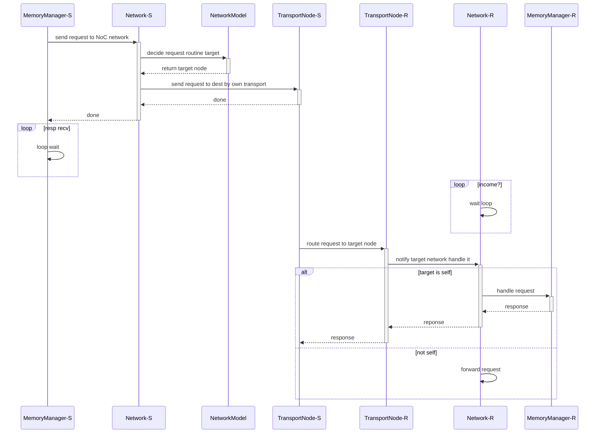

# Memory Subsystem

## memory subsystem类结构

memory subsystem描述了系统中各级Cache、DRAMC和系统互联关系的结构。整个memory subsystem的类图结构如下：


系统中主要提供了两类的memory subsystem:

- MemoryManager\<FastNehalem\>

  只描述各级Cache的hit/miss情况，以及在hit/miss情况下的固定访问延时。类似只看Cache的MPKI(miss-per-KInst)

- MemoryManager\<param_dram_directory_msi\>

  带有Cache-Coherency的memory子系统的模拟，用于反映Cache间一致性消息的传递带来的系统延时

## Param_DRAM_Directory_MSI子系统

### 仿真的组件

- Cache：基础的Cache结构模型，包括Cache的映射关系，大小，替换算法，保存的信息等
- CacheCntlr：Cache-Coherency Controller的Wrapper，对于Shared Cache，CacheCntlr中的CacheMasterCntlr会映射到相同的CacheMasterCntlr
- CacheMasterCntlr：Cache-Coherency Controller，用于处理Cache来自上下层的访问请求，并根据特定的Cache-Coherency Protocol进行状态转换
- CachePerfModel：用于模拟Cache中的时序模型，主要建模tag/data的访问时延，并提供了parallel和sequential两种方式
- Nuca Cache：用于仿真slice化的Cache，比如Intel Ring总线上的LLC，因为LLC分属于不同的节点，所以访问延时不同，类似于NUMA
- DRAM Cache：DRAM侧的缓存Cache
- TLB：仿真TLB的转换过程，但是系统没有涉及PageWalker的处理
- DRAMDirectoryCntlr：DRAM侧的最后一级Snoop Agent，用于监测DRAM和Cache系统间的Cache-Coherency。这个snoop agent可以是一个独立的组件，类似于HIF中的snoop table，也可以是实现在LLC中，由LLC代为实现snoop agent的功能。
- DRAMCntlr：DRAM Controller，用于仿真DRAM控制器的行为
- Network：用于不同Core节点间的互联模型，目前支持如下3种方式
  - BUS：共享总线方式
  - EMesh_hop_by_hop：逐跳模型，支持ring/mesh等
  - EMesh_bycounter：TBD
- ShMemPerfModel：用于分析request的执行路径，并最终给出其时序信息的模型

### 支持的系统架构

系统中的CacheCntlrMap是全局性的一个map结构，为系统中构造任意的Cache子系统结构提供了足够的灵活性。DRAMC也可以通过配置文件指定在哪几个Core上存在。

以CHX002的dual-socket为例


对应到Sniper中的配置如下


==1. 问题：目前sniper的内存控制节点必须位于某一个Core节点的内部，但是对于Intel的Ring/Mesh等结构，IO节点和MEM节点可以是单独的一个节点存在，这个在目前的sniper中还不支持，同时HIF本质上来说不是NoC，所以HIF的功能在sniper的network中需要单独开发==

==2. 问题：如果HIF下面有多个DRAMC通道，目前的sniper无法描述这种情况，需要修改==

### Memory-Subsystem的接口

#### Core的接口

接口设计上，Core调用相应的memory访问接口后，**函数立即放回，并给出最终的命中信息和时序延时信息，不会追踪每个访问在memory-subsystem上的中间状态**

```c++
// Core和mem-subsystem的唯一交互接口
virtual HitWhere::where_t coreInitiateMemoryAccess(
   MemComponent::component_t mem_component,  // 访问的memory组件(哪级Cache/DRAM)
  																					 // 虽然这里给出访问位置，但是没有看到对于UC等不同Cache属性的支持，都是访问L1
   Core::lock_signal_t lock_signal,					// 是否是lock访问，用于多核间的同步访问，类似于Core的lock信号
   Core::mem_op_t mem_op_type,								// Core的读写访问操作
   IntPtr address, UInt32 offset,						// 地址，数据信息等
   Byte* data_buf, UInt32 data_length,
   Core::MemModeled modeled									// 使用的memory仿真模型，不同的仿真模型支持的仿真粒度不同
) = 0;

enum MemModeled {
  // Not at all (pure backdoor access)
  MEM_MODELED_NONE,
  // Count in #accesses/#misses
  MEM_MODELED_COUNT,
  // Count in #accesses/#misses, queue TLBMissInstruction on TLB miss
  MEM_MODELED_COUNT_TLBTIME,
  // Count + account for access latency (using MemAccessInstruction)
  MEM_MODELED_TIME,
  // Count + account for access latency as memory fence (using MemAccessInstruction)
  MEM_MODELED_FENCED,
  // Count + time + return data to construct DynamicInstruction
  MEM_MODELED_RETURN,    //<=== default type
};
```

#### Network的接口

##### NoC网络中的节点包格式

```c++
class NetPacket
{
public:
   subsecond_time_t start_time;					// 包的起始时间
   subsecond_time_t time;								// 包的到达时间
   subsecond_time_t queue_delay;				// 在某个port的stall delay，在port排队等待发出的delay
   PacketType type;											// 包类型
   SInt32 sender;												// 发送者
   SInt32 receiver;											// 接收者
   UInt32 length;												// 包长
   const void *data;										// 包数据
};
```

##### network ==> memory-subsystem

节点内的memory subsystem接收来自其他节点的访问请求，并路由到节点内部的对应目标节点进行处理

```c++
virtual void handleMsgFromNetwork(NetPacket& packet) = 0;
```

##### memory-subsystem ==> network

```c++
virtual void sendMsg(
  PrL1PrL2DramDirectoryMSI::ShmemMsg::msg_t msg_type, 	// 发送的cache-coherency消息
  MemComponent::component_t sender_mem_component, 			// 发送的组件
  MemComponent::component_t receiver_mem_component, 		// 接收的组件
  core_id_t requester, 			// 发送者
  core_id_t receiver, 			// 接收者
  IntPtr address, Byte* data_buf = NULL, UInt32 data_length = 0, 	// 地址/数据等信息
  HitWhere::where_t where = HitWhere::UNKNOWN, 					// 预期hit的位置
  ShmemPerf *perf = NULL, 															// 使用的时序模型
  ShmemPerfModel::Thread_t thread_num = ShmemPerfModel::NUM_CORE_THREADS		// 时序模型分析的Core个数
) = 0;

virtual void broadcastMsg(
  PrL1PrL2DramDirectoryMSI::ShmemMsg::msg_t msg_type, // 发送的cache-coherency消息
  MemComponent::component_t sender_mem_component, 		// 发送的组件
  MemComponent::component_t receiver_mem_component, 	// 接收的组件
  core_id_t requester, 					// 接收者
  IntPtr address, Byte* data_buf = NULL, UInt32 data_length = 0, // 地址/数据等信息
  ShmemPerf *perf = NULL, // 使用的时序模型
  ShmemPerfModel::Thread_t thread_num = ShmemPerfModel::NUM_CORE_THREADS	// 时序模型分析的Core个数
) = 0;
```

### Request的路由(address_home_lookup)

在存在多个Core和DRAM节点的系统中，不同的地址被划分到不同的节点中，所以给定一个address，必须知道address对应的target节点是哪个。这个部分由address_home_lookup来完成。

#### 算法实现

使用了最简单的在多个module间轮询分配的算法

```c++
// |									physical address										 |
// |<-------block num--------->|<-------block offset------>|
//														 |       ahl_param           |
// ahl_param指明了一个PA最低几位属于home address space内的地址，这个参数要求大于一个cache block的大小
// locations表明address home space所在的位置
// total_modules表明有几个address home space， total_modules = locations.size()
int getHome(uint64_t address)
{
  return locations[(address>>ahl_param) % total_modules];
}
```

==问题：在实际的系统实现中，对于address的地址划分不是采用上面简单的轮询分配的算法，而是使用更加复杂的地址位Hash算法计算，这部分需要根据真实的实现进行修改==

#### address_home_lookup由两大功能组成：

##### address在Cache中的映射

这个主要决定地址在LLC中的位置(因为LLC可以是slice化的，所以不同的address在LLC中的位置可以位于不同的节点上)，用于处理cache-coherency一致性的问题。由m_tag_directory_home_lookup进行处理

sniper支持的address在cache中的映射主要有两种组织形式：

- LLC方式：address home的划分由LLC slice决定，每个LLC slice会被X核share，假设系统中有N个核，则N~address_home~ = N / X
- Interleaving方式：类似于LLC方式，这种方式每隔X个核划分为一个address home，假设interleaving的粒度为X，系统中有N个核，则N~address_home~ = N / X

==问题：本质上，没看出这两种方式有什么区别，实践中可能LLC方式就可以了==

##### address在DRAM中的映射

确定address需要访问的DRAMC是哪个。由m_dram_controller_home_lookup进行处理

DRAMC的home address由哪几个Core含有DRAMC决定

==问题：这种结构下，还无法支持多通道的DRAMC，sniper总是假设每个Core下只会含有一个DRAMC==

------

### Cache Hierarchy

#### Cache Controller结构


CacheSet：描述了一个Set的基本情况，主要用于定义不同的way之间的replace策略(当way满的时候，选择将哪个way的信息evict，并保存新的信息)

| Replace Policy | Description                                |
| -------------- | ------------------------------------------ |
| ROUND_ROBIN    | 轮询替换算法                               |
| LRU            | 最近最少使用替换算法                       |
| LRU_QBS        | TBD                                        |
| NRU            | TBD                                        |
| MRU            | TBD                                        |
| NMRU           | TBD                                        |
| PLRU           | 伪LRU替换算法，**ZX的Cache使用的替换算法** |
| SRRIP          | TBD                                        |
| SRRIP_QBS      | TBD                                        |
| RANDOM         | 随机替换                                   |

CacheBlockInfo：定义每个CacheLine中(一个CacheSet有way个CacheLine)保存的信息。sniper中定义了3种不同的blockinfo，但是实际使用的只有sharedblockinfo，里面仅仅保存了<tag, cache_coherency_status>的信息。Cache-Coherency的协议处理不在这里体现。cache_coherency_status在Cache-Coherency的处理中进行描述

##### Cache WorkingFlow


#### Cache Coherency Protocol

目前sniper中支持三种Cache-Coherency Protocol：MSI，MESI，MESIF。同时所有的Cache层级间的关系为**Inclusive**，目前<u>***不支持Exclusive和NENI模式***</u>

##### Cache Coherency架构


在各层Cache之间，目前Sniper使用MSI协议；在DRAM Directory Controller(Snoop Agent)可以使用MSI/MESI/MESIF等协议

##### Cache MSI协议转换图

**协议消息定义**

| Message        | Source              | Description                                                  |
| -------------- | ------------------- | ------------------------------------------------------------ |
| PR_Read        | Core                | 处理器发出的读请求                                           |
| PR_ReadEx      | Core                | 处理器发出的exchange(Read-Modify-Write)请求                  |
| PR_Write       | Core                | 处理器发出的写请求                                           |
| CC_Invalid     | next level Cache    | 下层Cache发送到上层Cache的Query Invalid请求(可以带Data)， Coherency到I |
| CC_Share       | next level Cache    | 下层Cache发送到上层Cache的Query请求(可以带Data)，Coherency到S |
| CA_Upgradereq  | LLC                 | LLC发送到Home Direcotry的upgrade_to_ex的请求，用于Query invalid掉share的cache line |
| DIR_Upgraderep | Home dram directory | Home Direcotry发送到sharer LLC的upgrade_to_ex的响应          |
| DIR_Flushreq   | Home dram directory | Home Direcotry发送到Owner LLC的Query Invalid请求(带Data)     |
| CA_Flushrep    | LLC                 | LLC发送到Home Direcotry的Flush响应(带Data)                   |
| DIR_Invreq     | Home dram directory | Home Direcotry发送到Sharer LLC的Query Invalid请求(无Data)    |
| CA_Invrep      | LLC                 | LLC发送到Home Direcotry的Invalid响应(无Data)                 |
| DIR_Wbreq      | Home dram directory | Home Direcotry发送到Owner LLC的Query请求(可以带Data)         |
| CA_Wbrep       | LLC                 | LLC发送到Home Direcotry的Writeback相应(可以带Data)           |

**Cache Controller状态机**


==问题:对于Sniper实现的Cache Controller的协议状态机，可以看到是一个MSI的实现协议(在LLC的Exclusive处理上与MSI有细微的差别，和实际的MESI处理上主要在于Exclusive状态下收到Write请求，Sniper会继续传递Write请求，而MESI会slient将E->M)==

==疑问: Share_upgrading的隐藏状态下，为什么会收到WBreq的请求；同样会收到Invreq和Flushreq吗？==

##### DRAM Directory Controller(Snoop Agent)

DRAM Directory Controller类似于一个Cache(实际上组织结构上与Cache相似，但是不一定存储Data)。在sniper的实现中，DRAM Directory Controller可以位于DRAM侧，也可以位于LLC侧(LLC侧实际上LLC作为一个Snoop Agent存在，并且带有存储Data功能)

**sniper中DRAM Direcotry Controller组织方式**


DirectoryBlockInfo只存储Cache Coherency状态，目前包括的主要是MESI四个基础状态 {Intel的MESIF协议在Sniper中通过BlockInfo下的forwarder_id表示，只有S状态下会设置这个域}；sharers的信息存储在DirectorySharers的类数据结构中


#### Cache的Performance model

Cache的Performance model用于simulate Cache的tag/data的访问，目前提供两种基本的performance model

- Sequential model： tag和data的访问是串行的，通常使用在高层级的Cache中(比如LLC)
- Parallel model：tag和data的访问是并行的，取决于data latency(sniper设计)，通常使用在低层级的Cache中(比如L1)


#### Cache Prefetch

**Prefetch调用时机**

- 每次Core memory访问后miss或是之前的prefetch hit {如果enable} 情况下，进行prefetch training，并进行prefetch
- 在每层cache都可以含有prefetch module，如果当前memory访问miss或是prefetch hit{如果enable}，进行prefetch training
- 在非lock访问下，进行prefetch调用(如果prefetch成功training，则进行prefetch)
- prefetch发送的request都是PR_Read，即共享读，每次只发送一个prefetch请求

**Prefetch在Cache中的体现**

- CacheBlock中，存在额外的option域，定义CacheBlock的特殊属性{WARMUP，PREFETCH}
- 当某次memory访问是prefetch trigger的，则在option上标记为PREFETCH


**Sniper支持的Prefetch类型**

- None

  不存在prefetcher

- Simple-Prefetch

  基于简单的stride机制的prefetch

  

- Ghb-Prefetch

  一种基于address offset进行组织和管理的复杂prefetch算法。原理是根据历史上针对于相同的address offset的历史访问序列情况预测后面的访问序列情况

  

#### NUCA Cache

Nuca Cache是访问时间不同的Cache，通常用在slice化的LLC中，比如Intel的Ring/Mesh网络中

**NUCA Cache结构**


#### Cache System的性能仿真

对于sniper的仿真而言，cache system的性能主要取决于两个方面：

- 某级Cache内部的pipeline访问，包括tag/data pipeline的访问时延；sniper不仿真对于pipeline的arbitration。pipeline的访问通过固定时延进行建模
- 当本级Cache miss后，request占用mshr(FillQ)的时间，这个时间反映了底层的memory系统对于request的处理速度。mshr通过contention model进行建模

------

### NoC的互联模型(network)

NoC部分用于仿真片上网络的路由部分


Sniper使用多线程的方式仿真NoC的发送/接收。每个Core的Network接口都会创建一个对应的SimThread的仿真线程用于模拟当前Core的Network接口的接收过程

当某个Core要发送request到Network中的时候，首先通过NetworkModel的各类网络模型决定当前request要转发的节点，然后通过Transport接口注入到对应network的Transport中，由Network receive逻辑决定是转发还是由当前Network的MemoryManager来处理当前的request



#### Bus 模型

简单的NoC互联模型，所有的Core都挂在一个独享的全局总线上


#### eMesh_hop_by_hop模型

eMesh_hop_by_hop用于描述多跳的NoC网络，包括line/ring/mesh等形态的NoC


对于line/ring来说，不存在up/bottom的路由路径

#### 其他

TBD

------

### DRAMC模型

DRAMC的部分主要有两部分组成，DRAM-Cache(如果enable)和DRAM-Controller


#### DRAMC Cache

等同于DRAM端的一个简单Cache，仿真方式基本与NUCA Cache一致


#### DRAM Controller

DRAM Controller用于仿真控制DRAM时序的Controller模块。这里的实现是高度抽象的，没有具体DRAM时序的仿真，而是使用bandwidth limiter进行替代


DRAM的performance model主要分为3个基本类型

- Constant Model
  1. DRAMC内部的read/write调度时延通过queue model进行仿真
  2. DRAMC和DRAM Device间的接口时序通过bandwidth limiter仿真
  3. DRAM Device上的访问时延通过固定时延仿真
- Normal Model
  1. DRAMC内部的read/write调度时延通过queue model进行仿真
  2. DRAMC和DRAM Device间的接口时序通过bandwidth limiter仿真
  3. DRAM Device上的访问时延通过正态分布概率模型时延仿真
- Read/Write Model
  1. DRAMC内部的read/write调度时延通过分别建立read、write的queue model分别计算read/write的调度时延进行仿真
  2. DRAMC和DRAM Device间的接口时序通过bandwidth limiter仿真
  3. DRAM Device上的访问时延通过固定时延仿真

------

### ShMemPerfModel时序模型

#### 时序仿真的方法

对于sniper而言，并不单独trace每一条指令或是指令的执行过程，而是先执行完一定的指令后，计算每条指令的执行延时，然后再决定当前Core的时间需要迭代的时间

**sniper VS. gem5**

|              | sniper                                                       | gem5                                                         |
| ------------ | ------------------------------------------------------------ | ------------------------------------------------------------ |
| 执行方式     | function first<br />运行function model为主，然后统计每条指令的执行时间，在选择当前Core的时间步进长度 | execution driven<br />追踪每条指令的完整执行过程，在pipeline中的所有状态，模拟一条指令的完整执行周期 |
| 硬件建模方式 | 抽象出硬件中最为主要的资源竞争部分进行contention model的建模，其他部分都以固定延时进行替代 | 精细建模pipeline的各个阶段，包括指令可能处于的中间状态       |
| 支持投机     | 不支持                                                       | 支持                                                         |
| 仿真角度     | 站在执行的指令角度，统计时间                                 | 站在仿真时间角度，模拟指令的可能状态                         |

**sniper仿真流程**

```c++
void sniper_flow()
{
  uint64_t global_time = 0;
  uint64_t next_cycle = 0;
  vector<request> func_result;
  
  while (!sim_end) {
    // get latest function execution flow
    func_result.append(do_function_model());
    
    // simulate a batch of requests, calc time step
    uint64_t cur_cycle = next_cycle;
    while (!meet_break_event) {
      reqeust req = func_result.pop_front();
      latency = req->execution();
      next_cycle = compute_nextcycle(next_cycle, latency);
    }
    
    // update global time based on time step
    global_time += (next_cycle-cur_cycle);
  }
}
```

sniper中对于时序计算的分类

sniper是多线程仿真程序；对于一个Core来说，系统目前主要划分为两个主要的线程

- User_Thread：用于仿真Core部分的所有时间推演计算
- Sim_Thread：用于仿真Network部分的所有时间推演计算


上图表明一个request的访问延时统计，一次request访问相当于一次函数调用，完成所有Core/Uncore部分的访问，并统计所有execution-path上的时延

**sniper目前统计的执行时延**

- Core：fetch-latency, dispatch-latency, execution-latency{对于ld/st指令，包括core/uncore部分的所有时延}
- cache: tag/data-pipe access latency
- dram directory controller: tag access latency, coherency sync latencies
- network: network queue latency, network transport latency
- DRAM: drame queue latency, dram bus latency, dram device latency

#### 时序仿真的基础组件

sniper中用于支持时序仿真的基础组件是queue model和contention model；queue model用于描述存在资源竞争的系统中，各个独立达到的request等待服务的时间；contention model直接描述对同一个资源竞争导致的服务时间延迟

**Contention Model**

描述某一类的资源的占用情况的模型，通常是硬件中的Queue资源

```c++
struct {
  bool occupy;		// entry occupy or not
  IntPtr tag;			// entry key, used for some search case
  time_t complete_time;		// entry complete time
} resource[N];

time_t computeDelayTime(IntPtr req, time_t visit_time, time_t process_time)
{
  time_t delay = 0;
  if (has_free_slot()) {
    // free space, no contention
    resource[free_idx] = {req, visit_time+process_time};
  }
  else {
    min_idx = find_nearest_complete_request(resource);
    if （visit_time < resource[min_idx].complete_time) {
      // no more space, and should wait
      visit_time = resource[min_idx].complete_time;
      delay = resource[min_idx].complete_time - visit_time;
    }
    // update resource table
    resource[min_idx] = {req, visit_time+process_time};
  }
  return delay;
}
```

**Queue Model**

- queue_model_base

  简单的queue model，通过计算目前queue中已经缓存的request的完成时间的均值(算术、几何或是中位数)来获得当前request的可能开始服务时间，从而计算delay

- queue_model_history_list

  将整个仿真时间切割为若干空闲时间间隔，并将其list起来。如果某个请求的达到时间没有落在某个空闲空间上，说明可能有别的请求正在服务，则当前请求推迟到下一个空闲间隔才能执行

- queue_model_contention

  结合contention model，设计的queue model，服务的等待时间完全由contention model计算出来时间决定

- queue_model_mg1

  利用排队论中的M/G/1模型[系统中的请求到达服从独立、同分布的概率模型，请求的服务时间满足互相独立分布的概率模型，只有一个服务者]，则该模型支持下，每个请求的平均等待时间为

  $W = \frac{\lambda\overline{X}^2}{2(1-\rho)}$

  其中，$\lambda$表示平均到达率，$\overline{X}^2$表示平均服务时间平方，$\rho$表示系统的服务效率

------

## FastNehalem子系统

TBD