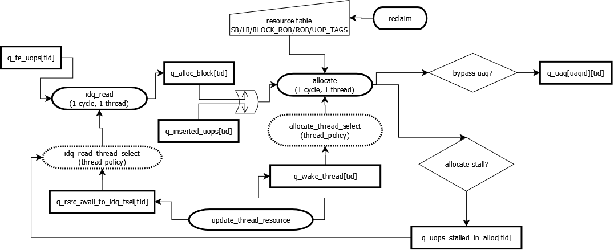

# Allocate Module

## 描述

allocate模块是Core的front-end中的最后一个模块，在allocate模块之后，指令从in-order的前端进入out-of-order的后端处理。所以，所有与后端执行时指令所需要的resource都需要在allocate阶段分配完成。allocate模块是个衔接front-end和back-end的***非常重要模块***

| 相关文件       |             |
| -------------- | ----------- |
| allocate.h/.cc | RAT/ROB top |

## 私有数据结构

### Structure

### SIM_Queue

## 框图

**<u>Allocate structure</u>**



## 流程

***idq_read_thread_select***

```c++
int idq_read_thread_select()
{
  // update control signals by all threads, both are sim_queue
  rsrcs_avail[] = update_rsrcs_avail();
  uops_stall_in_alloc[] = update_uops_stall_in_alloc();
  
  if (single_thread || allocate_perfect_select)
    return 0;			// always start from thread-0
  
  if (curcp->thread_stalling_idq_read > 0) {		// if idq already stall
    local_thread_priority = next_thread(curcp->thread_stalling_idq_read);		// update search counter to next
  	return -1;
  }
  
  bool found_thread = false;
  int thread_id = local_thread_priority;
  do {
    found_thread = true;
    bool checkpoint_recovery = false;
    if (ckp_recovery_check())					// checkpoint mechanism ??? 
      checkpoint_recovery = true;
    
    if (!checkpoint_recovery
        && 
        !rsrcs_avail[thread_id] && !uops_stall_in_alloc[thread_id] && !ready(q_fe_uops[thread_id]))
      found_thread = false;
    
    if (!found_thread)
      thread_id = move_next(thread_id);
  } while (!found_thread && thread_id != local_thread_priority);
  
  if (!found_thread) {
    // if no found, secondary check
    while (!found_thread && thread_id != local_thread_priority) {
      found_thread = ready(q_fe_uops[thread_id]) || uops_stall_in_alloc[thread_id];
      if (!found_thread)
        thread_id = move_next(thread_id);
    }
  }
  if (found_thread)
    local_thread_priority = move_next(thread_id);
  
  return thread_id;
}
```

***idq_read***

```c++
void idq_read(void)
{
  int thread_id = idq_read_thread_select();			// select candidate thread in current cycle
  
  // if idq stall and not perfect allocate thread select, waste cycle
  if (curcp->thread_stalling_idq_read > 0 && !allocate_perfect_select)
    return ;
  
  do {
    // current cycle wheter read new uop
    bool read_new_uop = true;
    
    if (!reuse_block_entry_after_stall && ready(q_alloc_block[thread_id]))
      read_new_uop = false;
    
    while (curcp->idq_read_active[thread_id]				// idq ready
           &&
           read_new_uop														// can fetch new uop
           &&
           ready(q_fe_uops[thread_id])							// uop is decoded, and ready
           &&
           fused_uop || num_uops_in_alloc_block(thread_id) < alloc_width	// bandwidth meet?
           &&
           !fxch_alloc_restriction || num_fxch_in_alloc_block(thread_id) < 1	// if fxch inst
          ) {
      uop = q_fe_uops[thread_id];
      bool is_br = check_uop_br(uop);			// check micro-fusing & macro-fusing
      if (is_br && num_br_in_alloc_block[thread_id] >= restrict_branch_alloc_per_clock)
        // if hit branch alloc max, then thread alloc terminate
        break;
      if (is_br)
        num_br_in_alloc_block[thread_id]++;
      
      push_queue(q_alloc_block[thread_id]);
      if (consume_rob(uop))
        num_uops_in_alloc_block[thread_id]++;			// rob consume 
      add_uops_to_alloc_block = true;
    }
    
    if (add_uops_to_alloc_block)
      orig_num_uops_in_alloc_block[thread_id] = num_uops_in_alloc_block[thread_id];	// backup current allocte uop number
    
    // if perfect alloc thread 
    move_to_next_thread(thread_id);
  } while (allocate_perfect_select && thread_id != start_id);
  
  curcp->last_cycle_idq_read_tsel = thread_id;			// current cycle which thread do idq_read
}
```

