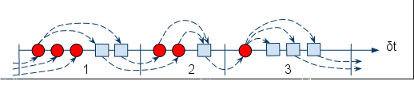
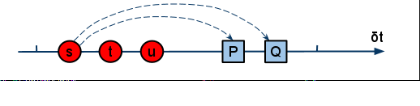
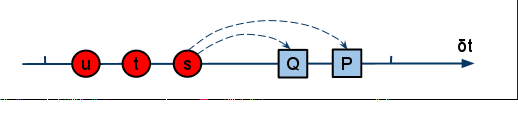
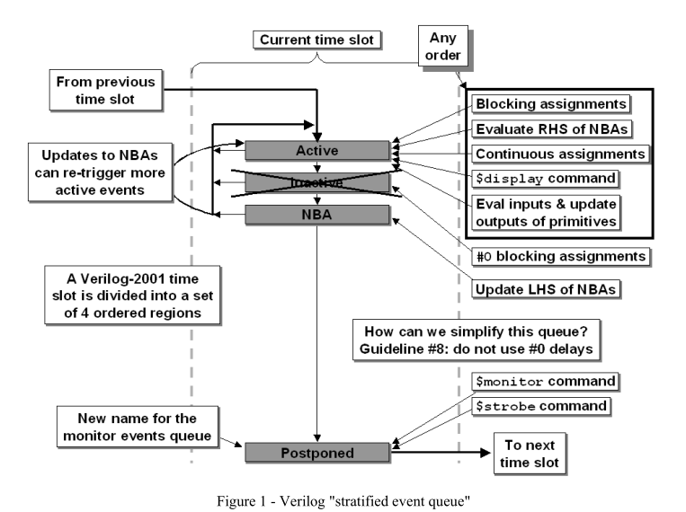
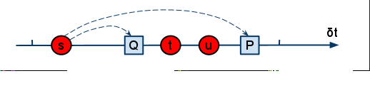

## Overview

总结一些HDL设计中两种经常使用的HDL语言：VHDL和Verilog经常困扰大家的一些问题、备忘和陷阱的提醒。通篇主要以Verilog为主，辅助讨论一些VHDL的问题。

------

## HDL作用

HDL作为硬件电路的构造性**描述语言**，与通常的软件编程语言有很大的不同，主要体现在如下几个方面：

- 语言自身带有concurrency特性，执行时带有concurrency的并发特性，有时钟的概念，反应对应的电路物理结构；软件编程语言自身是顺序描述的，只描述逻辑的顺序结构，执行时没有并发，更多的并发支持是语言外的库的支持

- 可以在不同的水平上对于电路的行为和结构进行描述，最终，语言的产出是**电路结构**；而软件编程语言描述的逻辑的结构，产出的是**计算机识别的逻辑结构**

- 工程的处理流程上的区别

  硬件的工程主要分为三个阶段：

  - 前仿真阶段：是使用仿真器对语言描述的电路行为首先进行逻辑上的仿真，期望达到正确的逻辑功能
  - 综合阶段：相当于软件的编译行为，将描述的电路行为转换为实际的电路物理结构；转换的过程可能并不能反映设计者的真实意图(可能会与仿真结果存在冲突)或是语言特性无法生成对应的电路结构。所以，在实际的工程中，综合支持的语言特性远远少于前仿真可以使用的语言特性(**可综合语言子集**)，综合出的代码必须保证与前仿真在功能上的等价性(**形式化验证**)。所以，对于硬件描述语言，仿真和综合是两个事情。与软件编程语言的编译、执行是不同的概念(软件的编译、执行是一体的，仅仅是对表达的逻辑做了逻辑变换)；而硬件仿真反映的是逻辑的正确性，综合是在逻辑正确性基础上，在实际物理限制下做的电路结构的逻辑变换(变换后，实现的逻辑功能在有时序约束下可能等价，要考虑后仿真的效果)
  - 后仿真阶段：硬件综合后，会成为真正带有逻辑功能的电路结构。这些电路结构在不同的时序约束上可能会表现出和前仿真不一样的执行结果，所以必须重新调整硬件描述语言的组织结构使得这种物理约束可以反应在电路行为的描述上。这个过程中使用实际电路时序约束+语言描述的电路行为再进行仿真，从而检查约束下是否依然可以获得正确的逻辑结果，这个过程有时也被称为**SDF仿真**(SDF文件记录了电路的延时结构)

  软件的工程相对来说，要简单和直接的多：总是经过编译，执行的过程；过程中只需考虑逻辑变换的正确性，而不需考虑其他任何的约束条件

从上面的对比也可以看出，HDL不仅需要定义变量、功能描述之类的基础语法，还要定义描述硬件结构、连接关系的语法，还有并行化语义的语法，这些构成了HDL与软件编程语言最大的不同。但是随着综合器(Synthesis)的发展，HDL的描述能力在逐步的提高，更多的硬件设计无需从电路结构设计开始，而仅仅需要描述实际电路的功能和时序即可(**行为描述**，相关的描述必须符合综合器的规范)。

传统的HDL需要支持硬件如下3个层次的设计需求：

- 行为级描述(Behaviour-Level model)

  行为级仅仅定义硬件的功能和时序，但不描述电路结构。这种实现方式开发方便，但是严重依赖于综合器的能力。目前，大部分HDL代码都是采用这个级别进行描述。这个级别的代码可以大体上进行性能的评估，但是不能进行电路结构和功耗、面级的评估。相对于软件人员来说，这级HDL比较友好，便于理解设计者的逻辑结构

- 寄存器传输级描述(Register-Transfer-Level model)

  将硬件的功能通过Flip-Flop和"逻辑物理线"(wire)的电路连接方式进行描述。在这级描述中，更加关注的是时序电路与组合电路间的划分，即通过Flip-Flop的加入，更加明确电路中结构的组合和基本时序的划分。在这个级，关注时序的划分；有可能也会考虑门级的延时(比如，对于典型的某些经典电路结构，如选择器、比较器等使用不同的运算符组织逻辑会产生不同的组合电路，从而引入不同的门级延时)，这部分可以交由综合器处理，也可以手工按照综合器规范定制更加简洁的电路(需要对综合器生成电路的规则有比较多的了解)。使用RTL级进行描述，意味设计者有更多的自控能力，而不受综合器的综合能力限制，也是最能体现设计者电路设计功力的地方(能否组成最高效的电路结构)

- 门级描述(Gate-Level model)

  综合器综合完成后，对应的HDL生成同等功能下的门级链接电路，组成的原件更多是 & | 门以及反向器，Flip-Flop等最为基础的单元器件。这一级主要用于后仿真处理，考虑门延时、线延时等所有电路中的延时信息。这部分在目前的VLSI的设计中基本不会用于前端设计阶段，只用于后仿真

------

## HDL语言

目前，有2个主流的HDL语言：VHDL和Verilog。两者在描述能力上基本等价，但是在设计理念上有较大的区别。对于需要描述并行结构的HDL语言来说，如何保证仿真结构和综合后结构保持逻辑输出的等价性是一个关键的特征，这个要求对于同样的HDL描述，其运行结果应该是determined，而不能因为仿真技术的不同导致结果的non-determine。这个部分，VHDL比Verilog要好，Verilog在Spec定义中明确给出了几种non-determine的情况，有的是硬件设计者应该避免的，属于硬件设计错误；有的则是语言设计的缺陷。这个会在后面介绍两种语言时给出更多的描述

### VHDL

VHDL的特点：

- 采用Process, Signal描述HDL的并行电路结构。各个Module之间采用统一的Signal进行链接，而**Signal仅仅是逻辑概念，可以对应多个实际物理概念，比如wire、reg**
- **Variable只能用于process内部，立即赋值**
- **Signal可以用于process内部也可以用于模块间链接，赋值采用延迟赋值策略**，Signal的新赋值要等到当前所有active的processes全部terminate后才会生效，之前使用的都是Signal中的old value

VHDL的仿真机制：

VHDL仿真时引入了delta-cycle的概念，在delta-cycle的phase-I，首先执行Signal的update event，这会导致更多依赖的process event在delta-cycle的phase-II执行；然后重复执行delta-cycle的phase-I，如此反复，直到当前delta-cycle没有更多可以执行的event为止，simulator进入到下一个sim_time的仿真



在同样的delta-cycle内，所有的update event都一定在phase-I，而唤醒执行的process一定在phase-II，而在不同phase间执行的event的顺序并不固定，如下是两个可能的执行顺序



**两种执行的顺序都允许，但都可以得到一致、正确的结果**



### Verilog

Verilog的特点：

- 提供了Primitive的电路级门级器件原语，可以方便的进行电路门级的仿真，也可以加入线延迟的仿真；允许用户自定义门级器件(User-Defined-Primitive, UDP)
- 提供了两类基础的硬件结构： net, registers
  - net：用于描述各个模块间的链接关系，有wire, tri, wor, wand等，其中最常用的是wire。这里仅仅表示链接关系，但是否会插入更多的电路门，则由综合器决定
  - registers：用于描述有暂存功能的器件，有reg, integer, real, time等，其中最常用的是reg；但是reg在被综合器综合后，可能会退化为wire，这在使用reg进行组合电路设计中会发生。是否插入更多电路门，由综合器决定
- begin...end是顺序块执行(里面如果包括<=赋值，则前面的执行不会阻止后面的)；fork...join是并行块执行(语句的执行顺序从逻辑来说是并行的，执行顺序也是不固定的，<u>*是否可以综合?*</u>)
- Verilog设计中的一些原则(Guideline)，这些原则主要使用在行为级描述中
  - 建模时序电路时，使用non-blocking赋值，时序电路敏感表只有时钟和复位信号
  - 建模Latch时，使用non-blocking赋值
  - 使用always形式建模组合逻辑时，使用blocking赋值
  - 在建模组合时，对于使用条件赋值的情况，必须把所有可能的组合情况全部都有赋值操作，负责综合会出现latch，全部覆盖则转换为组合逻辑
  - 在相同的always块中进行组合和时序逻辑建模时，使用non-blocking赋值
  - 不要在同一个 always块中同时使用blocking和non-blocking赋值
  - 不要在多个always块中给同一个变量赋值(即使是不重叠的slice也尽量不要这样做)
  - 在进行赋值时，不要使用#0 delay

Verilog的仿真机制：

Verilog中的每条语句都会绑定一个event，大部分是active event

Verilog的Spec中定义了一个可能的基础实现，如下图



eventq的调度顺序如下：

- active

  所有已经触发的event都在active列表上，当active列表上的 queue执行完毕后，会按照图上所示顺序copy其他队列上的event到active上来执行；所有active event的执行顺序不固定

- inactive

  **delay #0**的赋值语句在这里等待执行

- NBA

  所有non-blocking赋值的LHS的更新操作在这里完成；而由non-blocing的LHS更新导致的新的 always的event则都属于active event；对于相同变量的在相同always中的non-blocking赋值，按照source的顺序赋值；对于不同always中的对于相同变量的non-blocking赋值，应该按照always的调度顺序进行赋值

- postpone

  除了上述event之外，在当前sim-T最后执行的event，主要包括\$monitor, \$stobe调用

通过上面的描述，在Verilog中主要包括如下几个方面的non-determine情况：

- 在同一T，对于相同变量的赋值，因为调用顺序的不固定，造成在不同的simulator上运行的时候，可能结果都对，但是不唯一(这在实际电路被称为竞争冒险)

- 当在不同的always块中通过敏感表交互时，因为执行语句的顺序导致的结果不唯一，如下面的程序

  ```verilog
  module TEST();
      reg test = 0;
      reg test2 = 0;
      reg clk = 0;
      
      initial begin
          clk <= 1;		// <=== trigger below always block
          test <= 1;		// <=== will interleave exec with below always block?
          			   // 	   in gplcver, it did
      end
      
      always @(posedge clk) begin
          test2 <= test;
      end
  
      initial begin
          #10 $display(test, " ", test2);		// what's value of test2? 0 or 1
          								  // gplcver: 1 0
          								  // iverilog: 1 1
          								  // result non-determined, nor VHDL
      end
  endmodule
  ```

- always块可能会采用inter-leave的方式执行，而不是执行完一个always块中的代码才能执行另外一个，在多个always块交互时，变量的顺序会决定结果，与是否使用non-blocking赋值无关。例子同上

对于上述例子的说明，通过verilog的仿真调度机制，可以更好的进行说明：

​	always块总是被放到当前的active queue中，而不是其他type的queue中



这里的Q相当于*always block*, s相当于*clk<=1*的NBA过程

------

### Latch和Flip-Flop

简单说，Latch算是电平触发，带有数据保持功能；Flip-Flop采用沿触发，同样具有数据保持功能。从电路实现上说，Flip-Flop比Latch要复杂。***具体看CMOS VLSI的书??***