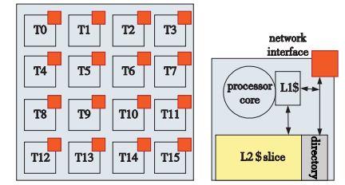

# Core-Manager & Core

## Core-Manager

### 说明

### 结构

### 成员

### 接口

## Core

### 说明

### 结构

#### 类结构

#### 与硬件结构的映射关系

Sniper中的MemSubsystem描述了从各级Cache到DRAM所有的memory子系统间的互连关系；而Network则表明了不同的SimCore Node节点间的互连关系，用于进行NoC各节点间的互连和通信；Core PerfModel则代表了一个Core内部的Pipeline实现

#### SimCore的组成

上图是一个典型的众核系统上的处理节点的结构，sniper对于上图右侧的节点进行了抽象

### 成员

### 接口