# Core建模

## 对于HW的结构抽象

一个典型的多核处理器结构如下：

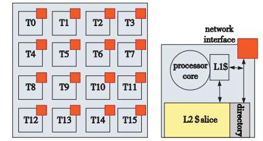

Sniper针对每个ProcessorNode进行了建模

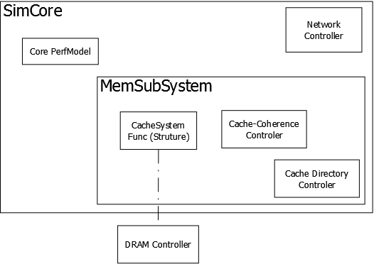

基本与实际的硬件结构一一对应

仿真系统与实际运行系统间的映射关系

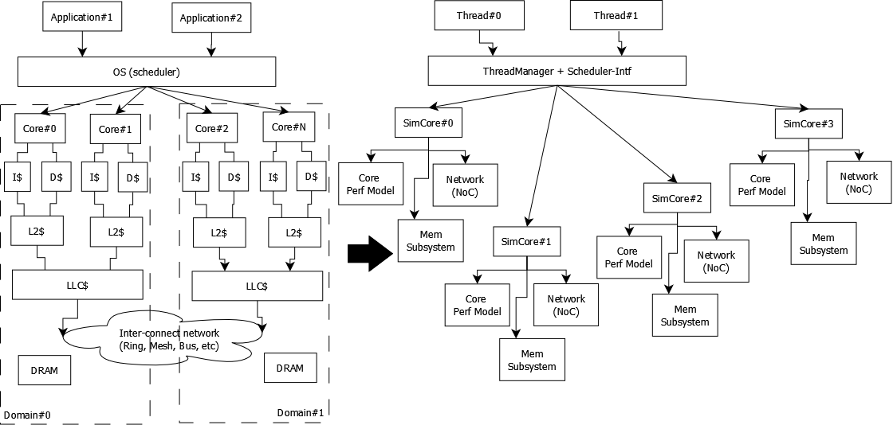

## SimCore的类关系

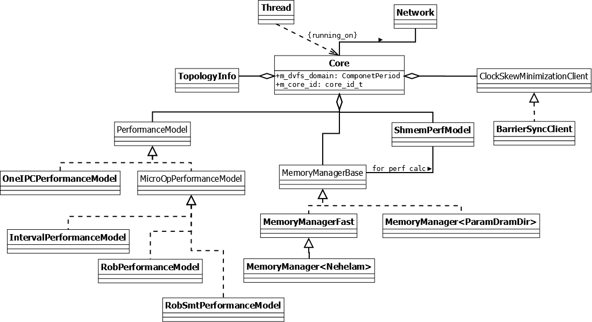

## Sniper仿真的运行机制

Parallel simulation，每个Core有一个单独的host thread运行performance model

```c++
// x86 instruction will queue to performance model by trace-frontend
void core_simulate(void) {
  while (true) {
    performance_model->iterate();		// based on x86 instruction
  }
}
```

多个Core host thread之间需要进行同步，采用barrier的方式进行同步(BarrierSyncClient), 每次同步步长为100ns

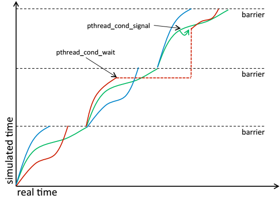

## Core仿真流程

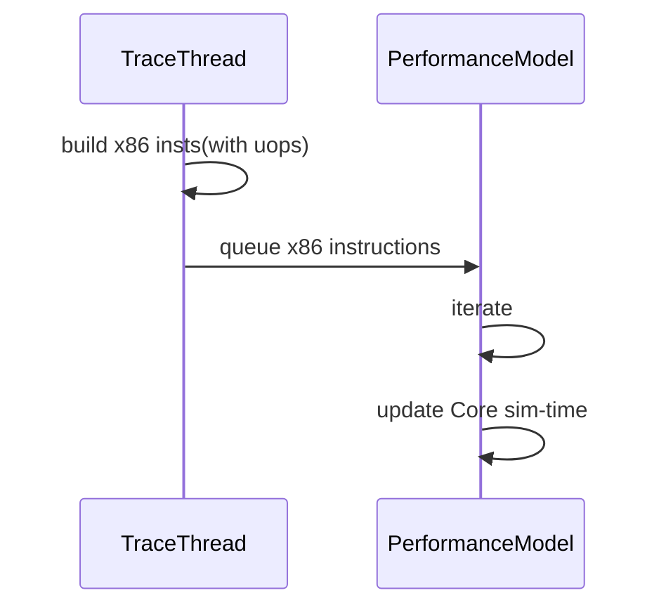

## Sniper的ISA设计

针对每条x86指令，sniper会生成对应的uop序列，按照如下格式

x86 inst --->

​	load uop-seqs

​	execute uop-seqs

​	store uop-seqs

## Sniper中建模仿真的Intel Core

目前，sniper建模仿真了微架构为Nehlam的Cpu微结构，主要表现在ExecutionPort的分配，和BypassNetwork的建模仿真上

## Sniper中Performance Model的分类

### One-IPC model

### Micro-op Model


### Interval model

#### Core的微架构

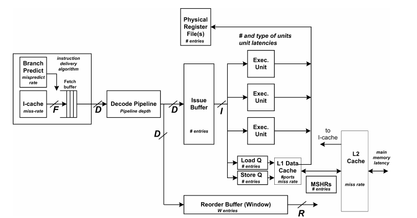

1. ILP (instruction-level parallelism)

   ```assembly
   start [AT&T syntax]:
   	mov eax, ebx		; inst1
   	mov edx, ecx		; inst2
   	add ebx, ecx		; inst3, depent on inst1, inst2
   	mov edi, esi		; inst4
   ```

   ```mermaid
   graph TD
   	inst1((1))
   	style inst1 fill:#f9f,stroke:#333
   	inst2((2))
   	style inst2 fill:#f9f,stroke:#333
   	inst3((3))
   	style inst3 fill:#89,stroke:#333
   	inst4((4))
   	style inst4 fill:#f9f,stroke:#333
   	inst1 --> inst3
   	inst2 --> inst3
   ```

   可以看到，1/2/4可以在同一个Cycle进行Issue，而3需要等到1、2完成之后才可以，这里的ILP=3。ILP和ROB大小、程序行为、编译器有关

2. MLP (memory-level parallelism)

   ```assembly
   start [AT&T syntax]:
   	mov [0x1000], ebx	; inst1, miss
   	mov [0x2000], ecx ; inst2, miss
   	mov [0x3000], edx ; inst3, miss
   	mov [0x5000], eax ; inst4, hit
   ```

   这里的4条指令可以并行运行，只要LSU(Load-Store Unit)单元中有足够的空间放下，那么这4条指令可以并行执行，而不用等待miss的数据返回。MLP和ROB/LSQ大小、程序行为、编译器相关

#### Interval Analysis

从**Dispatch**的角度，将Core的执行看作一个一个的波段，每个波段由Miss Event产生；通过分析不同miss event的penalty构成整个Core执行后的完整时间分布和分析

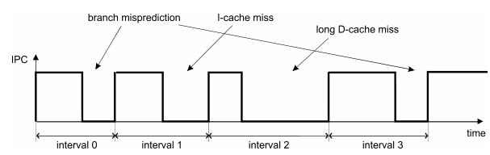

##### balanced processor假设

当没有miss event发生的时候，Core总是能够以Dispatch Width的速率(IPC=D)执行代码，Core中其他的结构的设计容量足够大，不会导致IPC < D。具体来说，就是要保证上述Core微架构：

1. F(fetch width) >= D
2. R(retire width) >= D
3. I(Issue width) >= D
4. 各种Queue Depth和FIFO depth不会导致处理器因为资源竞争stall

==问题：一般来说，即使可以保证Core中所有结构都是足量设计，也无法保证Core总是按照Dispatch width的速率执行代码，因为程序本身有天然的ILP属性，ILP低的程序，无法做到按照Dispatch width的速率执行，所以这里是模型假设上的过估计==

##### Miss Event

front-end event

1. I-cache miss

   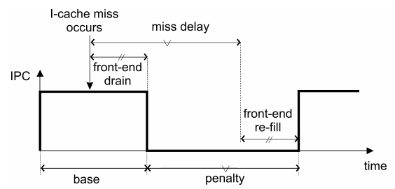

   **penalty = icache-delay**

   ==问题：这里的penalty没有考虑到fetch buffer的影响。fetch buffer表示Core取回来还没有解码的指令，如果Fetch Buffer中缓存了很多的指令，那么某次I-Cache miss不一定会引起penalty。比如fetch buffer中的指令数 > D*frontend-delay，那么penalty小于icache-delay；比如fetch buffer中目前有16个nop指令，frontend的stage为5，D为2，miss-delay=10，那么penalty=10-16/2+5 = 7==

2. branch miss

   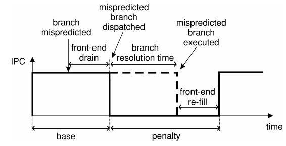

   **penalty = branch resolution-time + front-end refill time，其中front-end refill time在interval model中是固定的前端pipeline的长度**

back-end event

1. short-latency miss

   不考虑。在balanced processor的假设下，这部分delay被Core的乱序机制掩盖

2. long-latency miss

   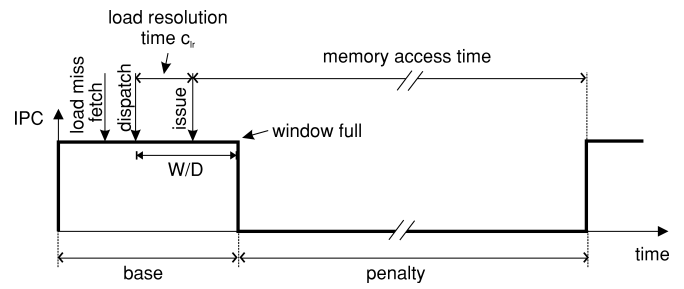

   **penalty = miss-latency - W/D， W表示ROB大小；通常，W/D << miss-latency，所以penalty ~= miss-latency**

miss event间的overlap

1. front-end VS. front-end

   因为前端是完全In-order的，所以miss event间也是完全串行的；所以penalty都会作用于Core的time上

2. front-end VS. back-end

   在model中，两者间的overlap < 5%，所以选择无视

   1. front-end前，back-end后

      不存在

   2. back-end前，front-end后

      1. long-latency VS. I-cache miss

         icache-miss发生在long-latency load执行完之后，完全串行；否则认为long-latency掩盖了I-cache miss的延时

      2. long-latency VS. branch miss

         branch-miss在ROB满之后发生，则串行；branch进入ROB，但是依赖long-latency，则串行；否则long-latency掩盖branch miss的延时

3. back-end VS. back-end

   1. load depent load

      完全串行

   2. load indepent load

      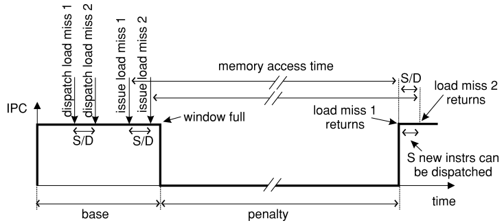

      **这里假设load latency的load有相同的memory access time**

      如何识别indpent load，需要在某个long-latency load往后的W条指令中进行搜索对应的load指令(**这里的indepnt包括寄存器和内存地址**)

##### 时间统计公式

$Time_c = N / D + \sum_{i}^{miss-events}{penalty_i}$

#### Interval Model Enhancement

##### 对Interval Analysis的改进

1. 当没有miss event的时候，不认为IPC=dispatch-width，而是考虑到ROB中的指令ILP，使用D~effective~
2. 考虑串行指令
3. 考虑front-end VS. back-end的overlap
4. 考虑每个interval的长度影响
5. 加入了function unit的资源竞争，影响ROB中的指令ILP
6. 考虑front-end branch miss后refill流水线的影响
7. 考虑overlap memory的访问
   1. pending hit，即两笔miss load访问相同的cache line
   2. false indepent的long-latency-load处理

##### 算法实现过程

#### ROB model