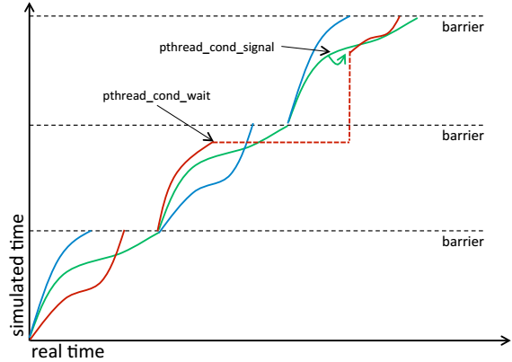

# Study Memo

## sniper是什么

sniper是一个架构探索仿真器，有如下特点

- 基于Pin实现，支持multi-program，multi-thread的仿真，只支持x86仿真
- 非系统级别仿真，仅仅支持ring-3程序
- 并行仿真，运行速度快
- 仅仅是trace仿真，不能仿真false-path的指令
- Core model做过高度抽象，不能用来仿真core内部的所有细节
- 和python结合，支持针对App的多方位，多图表分析，比如cpi-stack等

## sniper怎么做的

- 分为两种模式

  - pin-mode：直接体现为pin-tool的模式，只能用来进行multi-thread的仿真，但是集成度高，速度最快
  - standalone-mode：通过管道的方式实时trace执行，支持multi-thread, multi-program，速度有些影响，因为需要传递trace信息

- 多线程仿真

  - 对于standalone-mode：每个trace-frontend都是一个独立的host thread，代表了app的执行情况
  - 每个performance core：可以单独实现为一个host thread，也可以作为trace-frontend的某个函数调用(默认方式)
  - network(NoC部分)：每个node都是一个单独的host thread，用来转发相关节点的transaction

- 多线程仿真的同步问题

  目前sniper提供了3种同步的方式

  - None: 不同步

  - random-pair：随机两个thread同步

  - barrier：运行一定间隔后，全局同步。[默认]，同步步长为100ns

    

    sniper多线程仿真的问题主要会造成“因果关系错误(causality-error)”，但是按照作者的说法，这类错误影响有限，只要保证平均带宽(average bandwidth)是正确就可以

## sniper效果如何

目前内部版本已经完成针对Core-2的验证，公开版本正在进行nehalam架构的验证

benchmark: Splash2

验证需要统一的环境

验证结果：大约固定有25%的误差

## sniper怎么用

- 修改config配置文件，堆叠方式，可以通过--g制定某个特定的参数值
- tools/*.py包含若干可用的处理统计信息的脚本
- 可以使用python的sim package或者c++的simapi对应用程序进行修改、统计