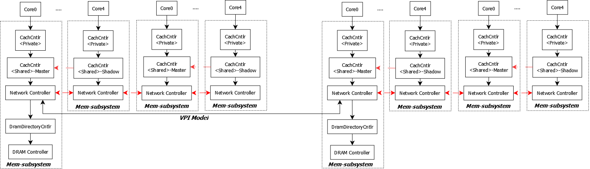

# Memory Subsystem

## memory subsystem类结构

memory subsystem描述了系统中各级Cache、DRAMC和系统互联关系的结构。整个memory subsystem的类图结构如下：


系统中主要提供了两类的memory subsystem:

- MemoryManager\<FastNehalem\>

  只描述各级Cache的hit/miss情况，以及在hit/miss情况下的固定访问延时。类似只看Cache的MPKI(miss-per-KInst)

- MemoryManager\<param_dram_directory_msi\>

  带有Cache-Coherency的memory子系统的模拟，用于反映Cache间一致性消息的传递带来的系统延时

## Param_DRAM_Directory_MSI子系统

### 仿真的组件

- Cache：基础的Cache结构模型，包括Cache的映射关系，大小，替换算法，保存的信息等
- CacheCntlr：Cache-Coherency Controller的Wrapper，对于Shared Cache，CacheCntlr中的CacheMasterCntlr会映射到相同的CacheMasterCntlr
- CacheMasterCntlr：Cache-Coherency Controller，用于处理Cache来自上下层的访问请求，并根据特定的Cache-Coherency Protocol进行状态转换
- CachePerfModel：用于模拟Cache中的时序模型，主要建模tag/data的访问时延，并提供了parallel和sequential两种方式
- Nuca Cache：用于仿真slice化的Cache，比如Intel Ring总线上的LLC，因为LLC分属于不同的节点，所以访问延时不同，类似于NUMA
- DRAM Cache：DRAM侧的缓存Cache
- TLB：仿真TLB的转换过程，但是系统没有涉及PageWalker的处理
- DRAMDirectoryCntlr：DRAM侧的最后一级Snoop Agent，用于监测DRAM和Cache系统间的Cache-Coherency。这个snoop agent可以是一个独立的组件，类似于HIF中的snoop table，也可以是实现在LLC中，由LLC代为实现snoop agent的功能。
- DRAMCntlr：DRAM Controller，用于仿真DRAM控制器的行为
- Network：用于不同Core节点间的互联模型，目前支持如下3种方式
  - BUS：共享总线方式
  - EMesh_hop_by_hop：逐跳模型，支持ring/mesh等
  - EMesh_bycounter：TBD
- ShMemPerfModel：用于分析request的执行路径，并最终给出其时序信息的模型

### 支持的系统架构

系统中的CacheCntlrMap是全局性的一个map结构，为系统中构造任意的Cache子系统结构提供了足够的灵活性。DRAMC也可以通过配置文件指定在哪几个Core上存在。

以CHX002的dual-socket为例


对应到Sniper中的配置如下



==1. 问题：目前sniper的内存控制节点必须位于某一个Core节点的内部，但是对于Intel的Ring/Mesh等结构，IO节点和MEM节点可以是单独的一个节点存在，这个在目前的sniper中还不支持，同时HIF本质上来说不是NoC，所以HIF的功能在sniper的network中需要单独开发==

==2. 问题：如果HIF下面有多个DRAMC通道，目前的sniper无法描述这种情况，需要修改==

### Memory-Subsystem的接口

#### Core的接口

接口设计上，Core调用相应的memory访问接口后，**函数立即放回，并给出最终的命中信息和时序延时信息，不会追踪每个访问在memory-subsystem上的中间状态**

```c++
// Core和mem-subsystem的唯一交互接口
virtual HitWhere::where_t coreInitiateMemoryAccess(
   MemComponent::component_t mem_component,  // 访问的memory组件(哪级Cache/DRAM)
  																					 // 虽然这里给出访问位置，但是没有看到对于UC等不同Cache属性的支持，都是访问L1
   Core::lock_signal_t lock_signal,					// 是否是lock访问，用于多核间的同步访问，类似于Core的lock信号
   Core::mem_op_t mem_op_type,								// Core的读写访问操作
   IntPtr address, UInt32 offset,						// 地址，数据信息等
   Byte* data_buf, UInt32 data_length,
   Core::MemModeled modeled									// 使用的memory仿真模型，不同的仿真模型支持的仿真粒度不同
) = 0;

enum MemModeled {
  // Not at all (pure backdoor access)
  MEM_MODELED_NONE,
  // Count in #accesses/#misses
  MEM_MODELED_COUNT,
  // Count in #accesses/#misses, queue TLBMissInstruction on TLB miss
  MEM_MODELED_COUNT_TLBTIME,
  // Count + account for access latency (using MemAccessInstruction)
  MEM_MODELED_TIME,
  // Count + account for access latency as memory fence (using MemAccessInstruction)
  MEM_MODELED_FENCED,
  // Count + time + return data to construct DynamicInstruction
  MEM_MODELED_RETURN,    //<=== default type
};
```

#### Network的接口

##### NoC网络中的节点包格式

```c++
class NetPacket
{
public:
   subsecond_time_t start_time;					// 包的起始时间
   subsecond_time_t time;								// 包的到达时间
   subsecond_time_t queue_delay;				// 在某个port的stall delay，在port排队等待发出的delay
   PacketType type;											// 包类型
   SInt32 sender;												// 发送者
   SInt32 receiver;											// 接收者
   UInt32 length;												// 包长
   const void *data;										// 包数据
};
```

##### network ==> memory-subsystem

节点内的memory subsystem接收来自其他节点的访问请求，并路由到节点内部的对应目标节点进行处理

```c++
virtual void handleMsgFromNetwork(NetPacket& packet) = 0;
```

##### memory-subsystem ==> network

```c++
virtual void sendMsg(
  PrL1PrL2DramDirectoryMSI::ShmemMsg::msg_t msg_type, 	// 发送的cache-coherency消息
  MemComponent::component_t sender_mem_component, 			// 发送的组件
  MemComponent::component_t receiver_mem_component, 		// 接收的组件
  core_id_t requester, 			// 发送者
  core_id_t receiver, 			// 接收者
  IntPtr address, Byte* data_buf = NULL, UInt32 data_length = 0, 	// 地址/数据等信息
  HitWhere::where_t where = HitWhere::UNKNOWN, 					// 预期hit的位置
  ShmemPerf *perf = NULL, 															// 使用的时序模型
  ShmemPerfModel::Thread_t thread_num = ShmemPerfModel::NUM_CORE_THREADS		// 时序模型分析的Core个数
) = 0;

virtual void broadcastMsg(
  PrL1PrL2DramDirectoryMSI::ShmemMsg::msg_t msg_type, // 发送的cache-coherency消息
  MemComponent::component_t sender_mem_component, 		// 发送的组件
  MemComponent::component_t receiver_mem_component, 	// 接收的组件
  core_id_t requester, 					// 接收者
  IntPtr address, Byte* data_buf = NULL, UInt32 data_length = 0, // 地址/数据等信息
  ShmemPerf *perf = NULL, // 使用的时序模型
  ShmemPerfModel::Thread_t thread_num = ShmemPerfModel::NUM_CORE_THREADS	// 时序模型分析的Core个数
) = 0;
```

### Request的路由(address_home_lookup)

在存在多个Core和DRAM节点的系统中，不同的地址被划分到不同的节点中，所以给定一个address，必须知道address对应的target节点是哪个。这个部分由address_home_lookup来完成。

#### 算法实现

使用了最简单的在多个module间轮询分配的算法

```c++
// |									physical address										 |
// |<-------block num--------->|<-------block offset------>|
//														 |       ahl_param           |
// ahl_param指明了一个PA最低几位属于home address space内的地址，这个参数要求大于一个cache block的大小
// locations表明address home space所在的位置
// total_modules表明有几个address home space， total_modules = locations.size()
int getHome(uint64_t address)
{
  return locations[(address>>ahl_param) % total_modules];
}
```

==问题：在实际的系统实现中，对于address的地址划分不是采用上面简单的轮询分配的算法，而是使用更加复杂的地址位Hash算法计算，这部分需要根据真实的实现进行修改==

#### address_home_lookup由两大功能组成：

##### address在Cache中的映射

这个主要决定地址在LLC中的位置(因为LLC可以是slice化的，所以不同的address在LLC中的位置可以位于不同的节点上)，用于处理cache-coherency一致性的问题。由m_tag_directory_home_lookup进行处理

sniper支持的address在cache中的映射主要有两种组织形式：

- LLC方式：address home的划分由LLC slice决定，每个LLC slice会被X核share，假设系统中有N个核，则N~address_home~ = N / X
- Interleaving方式：类似于LLC方式，这种方式每隔X个核划分为一个address home，假设interleaving的粒度为X，系统中有N个核，则N~address_home~ = N / X

==问题：本质上，没看出这两种方式有什么区别，实践中可能LLC方式就可以了==

##### address在DRAM中的映射

确定address需要访问的DRAMC是哪个。由m_dram_controller_home_lookup进行处理

DRAMC的home address由哪几个Core含有DRAMC决定

==问题：这种结构下，还无法支持多通道的DRAMC，sniper总是假设每个Core下只会含有一个DRAMC==

------

### Cache结构

#### Cache的基本结构


CacheSet：描述了一个Set的基本情况，主要用于定义不同的way之间的replace策略(当way满的时候，选择将哪个way的信息evict，并保存新的信息)

| Replace Policy | Description                                |
| -------------- | ------------------------------------------ |
| ROUND_ROBIN    | 轮询替换算法                               |
| LRU            | 最近最少使用替换算法                       |
| LRU_QBS        | TBD                                        |
| NRU            | TBD                                        |
| MRU            | TBD                                        |
| NMRU           | TBD                                        |
| PLRU           | 伪LRU替换算法，**ZX的Cache使用的替换算法** |
| SRRIP          | TBD                                        |
| SRRIP_QBS      | TBD                                        |
| RANDOM         | 随机替换                                   |

CacheBlockInfo：定义每个CacheLine中(一个CacheSet有way个CacheLine)保存的信息。sniper中定义了3种不同的blockinfo，但是实际使用的只有sharedblockinfo，里面仅仅保存了<tag, cache_coherency_status>的信息。Cache-Coherency的协议处理不在这里体现。cache_coherency_status在Cache-Coherency的处理中进行描述

##### Cache WorkingFlow


#### Cache-Coherency Protocol

目前sniper中支持三种Cache-Coherency Protocol：MSI，MESI，MESIF。同时所有的Cache层级间的关系为**Inclusive**，目前<u>***不支持Exclusive和NENI模式***</u>

##### 基本Cache-Coherency架构


在各层Cache之间，目前Sniper使用MSI协议；在DRAM Directory Controller(Snoop Agent)可以使用MSI/MESI/MESIF等协议

##### Cache MSI协议转换图


##### CacheLine状态转换图和协议消息表

| Current State            | Coherency Msg                    | Next State       | Action                                                       | Dest                    |
| ------------------------ | -------------------------------- | ---------------- | ------------------------------------------------------------ | ----------------------- |
| **Caches**               |                                  |                  |                                                              |                         |
| Invalid                  | READ                             | Shared/Exclusive | Replace,  BACK_INVAL(INVALID+WRITE-BACK Dirty Data)          | Previous Level Cache    |
|                          |                                  |                  | EVICT                                                        | Next Level Component    |
|                          |                                  |                  | READ                                                         | Next Level Component    |
| Invalid                  | READ                             | Shared/Exclusive | No replace, READ                                             | Next Level Component    |
| Invalid                  | READ_EX(read-modify-write)/WRITE | Modified         | Replace，BACK_INVAL(INVALID+WRITE-BACK Dirty Data)           | Previous Level Cache    |
|                          |                                  |                  | EVICT                                                        | Next Level Component    |
|                          |                                  |                  | READ_EX/WRITE                                                | Next Level Component    |
| Invalid                  | READ_EX/WRITE                    | Modified         | No replace, READ_EX/WRITE                                    | Next Level Component    |
| Exclusive                | READ                             | Exclusive        | return data                                                  | N.A.                    |
| Exclusive                | READ_EX/WRITE                    | Modified         | ==READ_EX/WRITE==<br />==这里的E状态遇到Write的时候仍然会发送到下一级Cache，所以这里的E等同于S状态，在整个Cache Level中实现的是MSI的协议== | ==Next Level Componet== |
| Shared                   | READ                             | Shared           | return data                                                  | N.A.                    |
| Shared                   | READ_EX/WRITE                    | Modified         | READ_EX/WRITE                                                | Next Level Component    |
| Modified                 | READ                             | Modified         | return data                                                  | N.A.                    |
| Modified                 | READ_EX/WRITE                    | Modified         | return/write data                                            | N.A.                    |
| Owned(Not used)          |                                  |                  |                                                              |                         |
| **下行(LLC->Directory)** |                                  |                  |                                                              |                         |
| Invalid                  | READ                             | N.A.             | SH_REQ                                                       | TAG_DIR(H)              |
| Invalid                  | READ_EX/WRITE                    | N.A.             | EX_REQ                                                       | TAG_DIR(H)              |
| Exclusive                | READ                             | N.A.             | N.A.                                                         | N.A.                    |
| Exclusive                | READ_EX/WRITE                    | N.A.             | EX_REQ                                                       | TAG_DIR(H)              |
| Shared                   | READ                             | N.A.             | N.A.                                                         | N.A.                    |
| Shared                   | READ_EX/WRITE                    | SHARED_UPGRADING | UPGRADE_REQ                                                  | TAG_DIR(H)              |
| Modified                 | READ                             | N.A.             | N.A.                                                         | N.A.                    |
| Modified                 | READ_EX/WRITE                    | N.A.             | N.A.                                                         | N.A.                    |
| **上行(Directory->LLC)** |                                  |                  |                                                              |                         |
| Uncached                 | EX_REQ                           | Modified         | EX_REP                                                       | LLC(R)                  |
|                          |                                  |                  |                                                              |                         |
|                          |                                  |                  |                                                              |                         |
|                          |                                  |                  |                                                              |                         |
|                          |                                  |                  |                                                              |                         |
|                          |                                  |                  |                                                              |                         |
|                          |                                  |                  |                                                              |                         |
|                          |                                  |                  |                                                              |                         |
|                          |                                  |                  |                                                              |                         |
|                          |                                  |                  |                                                              |                         |
|                          |                                  |                  |                                                              |                         |
|                          |                                  |                  |                                                              |                         |
|                          |                                  |                  |                                                              |                         |
|                          |                                  |                  |                                                              |                         |
|                          |                                  |                  |                                                              |                         |
|                          |                                  |                  |                                                              |                         |
|                          |                                  |                  |                                                              |                         |
|                          |                                  |                  |                                                              |                         |
|                          |                                  |                  |                                                              |                         |
|                          |                                  |                  |                                                              |                         |

#### DRAM Directory Controller (Snoop Agent)

#### Cache的Performance model

#### Cache Prefetch

#### NUCA Cache

------

### NoC的互联模型(network)

#### Bus 模型

#### 其他

------

### DRAMC模型

#### DRAMC Cache

#### DRAMC的时序模型

------

### ShMemPerfModel时序模型

------

## FastNehalem子系统

TBD