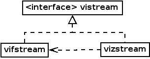

# record-trace Pin tool

## Overview

sniper在全trace的情况下，通过管道进行多进程的协同仿真，速度可以达到500KIPS~1MIPS。

<u>*通过分析发现, PIN的运行速度与被trace的程序的循环结构有很大的关系，比如，写一个没有任何跳转的程序*</u>

<u>*times 10000 mov eax, eax*</u>

<u>*PIN的执行速度只有30~40KIPS左右，对于通常的Application，程序天然带有很多的循环结构，所以PIN的效率较高*</u>

- Thread_data是管理所有被instrument的APP thread的管理结构
- Sift_writer SIFT格式的写接口类  用于生成SIFT格式的序列化数据
- Sift_reader SIFT格式的读接口类  用于SIFT格式的反序列化数据
- 支持SystemCall的传递执行
- 支持ROI(range-of-interesting)

## Pin Trace Point

表中是trace point的总结信息，更信息的处理说明见后面

| callback                    | trace point                       | response file |
| --------------------------- | --------------------------------- | ------------- |
| <u>**Systemcall**</u>       |                                   |               |
| syscallEntryCallback        | PIN_AddSyscallEntryFunction       | Y             |
| syscallExitCallback         | PIN_AddSyscallExitFunction        | Y             |
| <u>**Thread**</u>           |                                   |               |
| threadStart                 | PIN_AddThreadStartFunction        | N             |
| threadFinish                | PIN_AddThreadFiniFunction         | N             |
| **<u>Routine</u>**          |                                   |               |
| routineCallback             | RTN_AddInstrumentFunction         | N             |
| **<u>Instruction(BBV)</u>** |                                   |               |
| traceCallback               | TRACE_AddInstrumentFunction       | N             |
| extraeImgCallback           | IMG_AddInstrumentFunction         | N             |
| **<u>Emulation</u>**        |                                   |               |
| insCallback                 | INS_AddInstrumentFunction         | Y             |
| traceCallback               | TRACE_AddInstrumentFunction       | Y             |
| rtnCallback                 | RTN_AddInstrumentFunction         | Y             |
| imgCallback                 | IMG_AddInstrumentFunction         | Y             |
| <u>**Routine_Trace**</u>    |                                   |               |
| routineCallback             | RTN_AddInstrumentFunction         | N             |
| traceCallback               | TRACE_AddInstrumentFunction       | N             |
| <u>**ProcessControl**</u>   |                                   |               |
| Fini                        | PIN_AddFiniFunction               | N             |
| Detach                      | PIN_AddDetachFunction             | N             |
| followChild                 | PIN_AddFollowChildProcessFunction | N             |
| forkBefore                  | PIN_AddForkFunction               | Y             |
| forkAfterInChild            | PIN_AddForkFunction               | N             |

**<u>SystemCall</u>**		用于Systemcall的仿真和结果回传，仿真Linux的若干系统调用

***syscallEntryCallback***

TracePoint		--- PIN_AddSyscallEntryFunction

response file		--- Yes

当last_syscall_emulated设置为true的时候，则设置syscall_number为SYS_getpid，执行一个dummy getpid的系统调用

***syscallExitCallback***

TracePoint		--- PIN_AddSyscallExitFunction

response file		--- Yes

当last_syscall_emulated为true的时候，将sniper返回的syscall的返回值设置到RAX中


**<u>Thread</u>**			用于thread的创建和销毁管理

***threadStart***

TracePoint		--- PIN_AddThreadStartFunction

response file		--- No

thread的创建主要经过如下几个步骤:

- 如果需要使用emulate syscall的方式创建thread，那么需要获得系统分配的tid_ptr（OS分配的结构），这个过程需要获得new_threadid_lock锁

- 更新全局的thread_data结构，找到对应的thread_id（PIN分配的）的entry，填充结构体

- - thread_num更新
  - bbv结构初始化
  - 打开trace用的文件/管道
  - 设置thread处于running/trace状态

***threadFinish***

TracePoint		--- PIN_AddThreadStartFunction

response file		--- No

thread的销毁经过如下几个步骤：

- 如果当前thread是最后一个thread，且enable systemcall模拟，那么直接发送SYS_exit_group的系统调用
- 设置thread处于非running/trace状态
- 创建PIN的内部线程用于进一步的thread释放（因为thread_fini有可能在另外一个thread      context上面被调用，比如调用pthread_kill之类）


**<u>Routine</u>** 		主要用于处理MPI相关的wrapper函数，在大型分布式系统中有作用，对于单机的benchmark可以忽略

***routineCallback***

TracePoint		--- RTN_AddInstrumentFunction

response file		--- No


<u>**Instruction(BBV)**</u>			核心的trace部分(主要是traceCallback)，用于trace每条x86指令的静态和动态指令信息；同时处理额外加载的动态库的处理(主要是指MPI  trace库，和上面的routine配合使用)

***traceCallback***

TracePoint		--- TRACE_AddInstrumentFunction

response file		--- No

- 对于extrae image的，如果属于extrae image的区间, 那么不进行trace

- 对于BBL中的每条inst

- - 插入xchg       bx, bx的magic instruction，用于Application和sniper进行通信的API

  - 是否为Syscall，如果是，插入Syscall的模拟程序，这个和上面的SystemCall的两个API配合使用，用来在sniper中模拟不同的系统调用

  - 是否为endROI的标志，如果是，则结束当前ROI仿真，关闭所有的通信通道

  - 对于!(Sift::ModeDetailed       || Sift::ModeMemory)

  - - 在BBL        Level插入指令运行数目统计的函数

  - 对于Sift::ModeDetailed

  - - 对于含有memory操作的指令，插入函数用于动态获取指令运行时访问的memory信息
    - 每条指令调用sendInstruction将指令信息发送到sniper模拟器，这里包含了指令的跳转指令情况

  - 对于Sift::ModeMemory

  - - 这里只关心和Memory相关的地址访问，主要包含3类，        Fetch/Load/Write；Fetch只关心与跳转相关的指令(branch/fallthrough)，对于其他类型指令使用ins_count进行代替，传入到sniper模拟器

***extraeImgCallback***

TracePoint		--- IMG_AddInstrumentFunction

response file		--- No

查找libmpitrace的额外的动态库，如果找到了，放入extrae_image的信息中

```c++
{
	BOOL           	linked;
	ADDRINT     		top_addr;
	ADDRINT     		bottom_addr;
	BOOL            got_init;      // unused
	BOOL            got_fini;      // unused
}
```


<u>**Emulation**</u>		仿真系统中的若干和Simulator相关的指令，函数和相关的library中的函数（如performance library PAPI）等

***insCallback***

TracePoint		--- INS_AddInstrumentFunction

response file		--- Yes

处理rdtsc和cpuid指令

***traceCallback***

TracePoint		--- TRACE_AddInstrumentFunction

response file		--- Yes

处理\_\_kmp_reap_monitor和\_\_kmp_internal_end_atexit，这两个主要是ICC/openMP的实现相关，简单调用系统的exit函数

***rtnCallback***

TracePoint		--- RTN_AddInstrumentFunction

response file		--- Yes

若干系统函数的替换

sched_getcpu

get_nprocs/__get_nprocs

get_nprocs_conf/__get_nprocs_conf

clock_gettime/__clock_gettime

Gettimeofday

获得系统exit函数的地址

***imgCallback***

TracePoint		--- IMG_AddInstrumentFunction

response file		--- Yes

处理libpapi库相关


<u>**RoutineTrace**</u>		用于函数的进入/退出的trace，call-graph的build，这里支持tail-call和longjmp的调用

***routineCallback***

TracePoint		--- RTN_AddInstrumentFunction

response file		--- No

用于函数的进入/退出的trace

- routineEnter

  记录当前routine进入时对应routine的IP和stack信息，并通知sniper模拟器routineChange(Sift::RoutineEnter, ip, esp)，记录last_routine为当前routine的IP

- routineExit

  通知sniper模拟器routineChange(Sift::RoutineExit, ip, esp)，标记last_routine为invalid(-1)

***traceCallback***

TracePoint		--- TRACE_AddInstrumentFunction

response file		--- No

Trace routine是从哪条指令进入的

- 对于每一次的routine中的BBL调用，通知sniper模拟器routineChange(Sift::RoutineAssert,      ip, esp)，用于trace后续的call的调用处理
- 设置last_call_site变量，表明某个BBL属于某个routine的时候，是从哪个IP进入的


<u>**ProcessControl**</u>		用于进程控制的trace，比如进程退出，解trace，fork自进程等

***Fini***

TracePoint		--- PIN_AddFiniFunction

response file		--- No

关闭所有和sniper的通信通道

***Detach***

TracePoint		--- PIN_AddDetachFunction

response file		--- No

Pin断开被trace的程序，目前什么都不做，个人感觉会有些问题

***followChild***

TracePoint		--- PIN_AddFollowChildProcessFunction

response file		--- No

对于处于ROI的程序，不跟踪子进程；否则跟踪子进程

***forkBefore***

TracePoint		--- PIN_AddForkFunction

response file		--- Yes

调用Fork通知sniper模拟器，创建了新的子进程，并返回子进程ID（这个ID不知道是否是系统ID）

***forkAfterInChild***

TracePoint		--- PIN_AddForkFunction

response file		--- No

对于新创建的子进程，进行子进程的环境初始化：

- 将forkBefore获得的child_app_id赋值给app_id
- 清除已经map的routine表
- 初始化num_thread=1
- 初始化主线程的bbv为一个新的bbv结构
- 打开与sniper模拟器的通信通道

问题：对于这个callback，可能只会在fork子进程之后调用一次，而后续所有Pin的instrument是否在子进程有效，按照我目前理解，是由FollowChild的callback控制的

## Key Structure

| Field                    | Type                               | Description                                                  |
| :----------------------- | ---------------------------------- | ------------------------------------------------------------ |
| output                   | Sift::Writer *                     | Pin tool端用于发送trace数据到文件或是管道的通道抽象类        |
| dyn_address              | UINT64 [SIFT::MAX_DYNAMIC_ADDRESS] | 表明当前指令操作的内存地址                                   |
| num_dyn_addresses        | UINT32                             | 表明当前指令操作的内存地址个数，动态更新                     |
| bbv                      | Bbv *                              | 应该是用在sim-point中的bbv信息统计，这里的BBV主要用于做BBV的投影计算，投影后的结果会给sim-point用来做统计 |
| thread_num               | UINT64                             | 表示当前thread是当前trace进程的第几个thread；<br />对于使用SIFT的多线程程序，必须使用responsefile通知sniper simulator被trace进程的线程创建情况 |
| bbv_base                 | ADDRINT                            | 记录当前bbv的起始地址                                        |
| bbv_count                | UINT64                             | 当前bbv所含有的指令个数，这个是在运行过程中动态构建          |
| bbv_last                 | ADDRINT                            | 当前bbv中下一条指令的指令=刚刚执行指令的地址+指令长度<br />如果新的eip ！= bbv_last说明一个新的BBV开始了（出现了跳转） |
| bbv_end                  | BOOL                               | 表明当前bbv是否应该结束，目前对于non-taken的branch人为截断   |
| blocknum                 | UINT64                             | 表明生成的trace文件的片断个数，和KnobBlocksize配合使用       |
| icount                   | UINT64                             | 在所有模式下运行的总指令个数，dump的时候会按照命令行的分块大小来进行拆分 |
| icount_cacheonly         | UINT64                             | 在cacheonly模式下执行时的指令个数                            |
| icount_cacheonly_pending | UINT64                             | 从上一次的memory访问的指令到当前memory访问指令之间有多少条指令流过(这个只在callback中进行了静态的统计，实际并不准确，因为有一些conditional执行的指令只能在运行时动态决定) |
| icount_detailed          | UINT64                             | 在detailed模式下运行的总指令个数                             |
| icount_reported          | UINT64                             | 在非detailed模式下运行的总指令个数                           |
| last_syscall_number      | ADDRINT                            | 基本没用用的变量，猜测用于调试使用，记录最近被sniper模拟的系统调用号 |
| last_syscall_returnval   | ADDRINT                            | 上一次系统调用sniper模拟器返回的值                           |
| flowcontrol_target       | UINT64                             | 非常关键的一个变量，用于进行不同trace程序（被仿真的Core）之间与sniper模拟器的同步频率，是一个阈值变量=icount(已执行指令数)+KnobFlowControl(设定同步步长) |
| tid_ptr                  | ADDRINT                            | OS分配的thread_id信息，用于sniper进行thread的管理，需要拿new_threadid_lock锁；当需要和OS交互进行thread处理的时候，需要使用这个结构 |
| last_routine             | ADDRINT                            | 表明当前所在的routine的routine地址                           |
| last_call_site           | ADDRINT                            | 表明进入最近一次call的指令地址                               |
| last_syscall_emulated    | BOOL                               | 表明上一次的系统调用的处理是否由sniper模拟器模拟还是由host OS处理 |
| running                  | BOOL                               | 表明当前thread是否被trace运行                                |
| should_send_threadinfo   | BOOL                               | 一个pending变量，表明pin端是否发送thread info到sniper端，通知有新的thread被创建 |


## Communication Interface

### Port Interface

管道类的类关系图 (以output stream为例), input stream类似



vostream是接口定义，由vofstream和ozstream两个实现类继承，其中ozstream类使用zlib进行压缩，将压缩过后的数据再通过内部的vostream接口(实际上是vofstream类)写出到外部的文件

vofstream将外部连接封装为文件对象，可以是管道、普通文件

### Packet Format

| Field                | Type        | Description                                                  |
| -------------------- | ----------- | ------------------------------------------------------------ |
| **<u>Header</u>**    |             |                                                              |
| magic                | uint32_t    | 通信信道魔术  "SIFT"                                         |
| size                 | uint32_t    | reserved段的extra-header的大小，目前设置为0                  |
| options              | uint64_t    | 表明通信包的一些选项<br />CompressionZlib = 1,       是否对数据包进行zlib压缩<br />ArchIA32 = 2,                     当前仿真的系统是否为32位<br />IcacheVariable = 4,           按注释来说，表明是否每条指令都需要icache simulate，实际代码中没有用到<br />PhysicalAddress = 8,        传递的memory地址是否使用物理地址 |
| reserved             | uint8 []    | Unused                                                       |
| <u>**Record**</u>    |             | 为不同目的设计的通信结构，整体是个union                      |
| ***Instruction***    |             |                                                              |
| size                 | uint8_t:4   |                                                              |
| num_addresses        | uint8_t:2   |                                                              |
| is_branch            | uint8_t:1   |                                                              |
| taken                | uint8_t:1   |                                                              |
| addresses            | uint64_t [] |                                                              |
| ***InstructionExt*** |             |                                                              |
| type                 | uint8_t:4   |                                                              |
| size                 | uint8_t:4   |                                                              |
| num_addresses        | uint8_t:2   |                                                              |
| is_branch            | uint8_t:1   |                                                              |
| taken                | uint8_t:1   |                                                              |
| is_predicate         | uint8_t:1   |                                                              |
| executed             | uint8_t:1   |                                                              |
| addr                 | uint64_t    |                                                              |
| addresses            | uint64_t [] |                                                              |
| ***Other***          |             |                                                              |
| zero                 | uint8_t     | placeholder，用于区别于***Instruction***和***InstructionExt***两种类型的request |
| type                 | uint8_t     | 具体的other request的编码信息<br />RecOtherIcache  = 0,<br />RecOtherOutput,<br />RecOtherSyscallRequest,<br />RecOtherSyscallResponse,<br />RecOtherNewThread, <br />RecOtherNewThreadResponse,<br />RecOtherMemoryRequest,<br />RecOtherMemoryResponse,<br />RecOtherJoin,<br />RecOtherJoinResponse, <br />RecOtherEndResponse, <br />RecOtherIcacheVariable,<br />RecOtherSync,<br />RecOtherSyncResponse, <br />RecOtherLogical2Physical,<br />RecOtherMagicInstruction,<br />RecOtherMagicInstructionResponse,<br />RecOtherRoutineChange,<br />RecOtherRoutineAnnounce,<br />RecOtherEmu,<br />RecOtherEmuResponse,<br />RecOtherFork,<br />RecOtherForkResponse, <br />RecOtherInstructionCount,<br />RecOtherCacheOnly,<br />RecOtherEnd = 0xff, |
| size                 | uint32_t    |                                                              |
| data                 | uint8_t []  |                                                              |

### Other Packet Detail & Relation

| Message                          | Structure                                                    | corresponder                                                |
| -------------------------------- | ------------------------------------------------------------ | ----------------------------------------------------------- |
| RecOtherIcache                   | {<br />uint64_t based_addr;<br />uint8_t data[ICACHE_BUFFER(0x1000)];<br />} | N.A.                                                        |
| RecOtherOutput                   | {<br />uint8_t fd;   // 写入的文件fd<br />const char * data; // size由参数设定，写入字符串<br />} | N.A.                                                        |
| RecOtherSyscallRequest           | {<br />具体系统调用参数传递顺序参考Linux或是Windows的系统调用约定<br />uint16_t syscall_num; // 调用号<br />syscall_args_t args; // 调用参数<br />syscall_args_t => uint32/uint64_t [6]<br />参数排列顺序<br />32位系统           64位系统<br />ebx                      rdi<br />ecx                       rsi<br />edx                      rdx<br />esi                        r10<br />edi                       r8<br />ebp                      r9<br />} | RecOtherSyscallResponse<br />RecOtherMemoryRequest          |
| RecOtherSyscallResponse          | {<br />uint64_t ret_code; // 调用返回值<br />}               | N.A.                                                        |
| RecOtherNewThread                | {}                                                           | RecOtherNewThreadResponse                                   |
| RecOtherNewThreadResponse        | {<br />int32_t ret_code; // 创建新线程的返回值<br />}        | N.A.                                                        |
| RecOtherMemoryRequest            | {<br />uint64_t d_data; // memory访问的addr<br />uint32_t data_size; // memory访问的长度<br />MemoryLockType lock_signal; //memory访问的lock类型<br />MemoryOpType mem_op; //memory的类型<br /><!--Optional for memwrite--><br />char * data_buffer; // 写请求的数据<br />}<br /><br />MemoryLockType {<br />MemoryInvalidLock = 0, <br />MemoryNonLock,<br />MemoryLock,<br />MemoryUnlock<br />}<br /><br />MemoryOpType {<br />MemoryInvalidOp = 0, <br />MemoryRead,<br />MemoryWrite,<br />} | RecOtherMemoryResponse                                      |
| RecOtherMemoryResponse           | {<br />uint64_t addr; //check request发送的地址<br />MemoryOpType type; //check request发送的类型，目前没有使用<br /><!--optional for memread--><br />char *data_buffer; // read返回的data，长度由request时长度决定<br />} | N.A.                                                        |
| RecOtherJoin                     | {<br />int32_t thread_id; // 需要等待的thread的id<br />}     | RecOtherJoinResponse                                        |
| RecOtherJoinResponse             | {<br />int32_t ret_code; //模拟器返回的join结果<br />}       | N.A.                                                        |
| RecOtherEndResponse              | 目前不使用                                                   | N.A.                                                        |
| RecOtherIcacheVariable           | {<br />uint64_t base_addr; <br />uint8_t data[16];<br />}<br />和RecOtherIcache区别是这里只发送一条指令的地址和machine code | N.A.                                                        |
| RecOtherSync                     | {}                                                           | RecOtherSyncResponse<br />RecOtherMemoryRequest             |
| RecOtherSyncResponse             | {<br />Mode mode; //返回Pin-tool的运行模式<br />}<br /><br />Mode {<br />ModeUnknown,<br />ModeIcount<br />ModeMemory<br />ModeDetailed<br />ModeStop<br />} | N.A.                                                        |
| RecOtherLogical2Physical         | {<br />uint64_t vp; // 虚拟地址页<br />uint64_t pp; // 实际App的物理地址页<br />} | N.A.                                                        |
| RecOtherMagicInstruction         | { // 魔术指令的3个参数<br />uint64_t a;<br />uint64_t b;<br />uint64_t c;<br />}<br /><br />系统中包含的魔术指令<br />1. xchg bx, bx        用于Application和Sniper模拟器进行精细交互的fake指令<br />a=>gax, b=>gbx, c=>gcx<br />2. ImplicitROI Begin<br />a=>SIM_CMD_ROI_START, b=>0, c=>0<br />3. ImplicitROI End<br />a => SIM_CMD_ROI_END, b => 0, c => 0 | RecOtherMagicInstructionResponse<br />RecOtherMemoryRequest |
| RecOtherMagicInstructionResponse | {<br />uint64_t result; // 魔术指令返回的结果<br />}         | N.A.                                                        |
| RecOtherRoutineChange            | {<br />RoutineOpType(uint8_t) event; // routine的消息<br />uint64_t eip; // routine对应的ip<br />uint64_t esp; // routine对应的堆栈<br />uint64_t callEip; //call routine的ip<br />}<br /><br />RoutineOpType {<br />RoutineEnter = 0,<br />RoutineExit,<br />RoutineAssert,<br />} | N.A.                                                        |
| RecOtherRoutineAnnounce          | {<br />uint64_t eip; // routine的起始ip<br />uint16_t len_name; // routine名字长度<br />uint16_t img_name; // routine所在的img的名字长度<br />uint64_t offset; // routine在img中的加载偏移<br />uint32_t line; // 调试信息，routine的行号<br />uint32_t column; //调试信息， routine的列号<br />uint16_t len_filename; // 调试信息， 源文件<br />} | N.A.                                                        |
| RecOtherEmu                      | {<br />EmuType(uint16_t) type; // 类型<br />EmuRequest request; // 请求<br />}<br /><br />EmuType {<br />EmuTypeRdtsc,<br />EmuTypeGetProcInfo,<br />EmuTypeGetTime,<br />EmuTypeCpuid,<br />EmuTypeSetThreadInfo,<br />EmuTypePAPIstart,<br />EmuTypePAPIread,<br />}<br /><br />EmuRequest union {<br />  struct {<br />  } rdtsc;<br />  struct {<br />  } getprocinfo;<br />  struct {<br />  } gettime;<br />  struct {<br />    uint32_t eax, ecx;<br />  } cpuid;<br />  struct {<br />  pid_t tid;<br />  } setthreadinfo;<br />  struct {<br />    int eventset;<br />  } papi;<br />} | RecOtherEmuResponse<br />RecOtherMemoryRequest              |
| RecOtherEmuResponse              | {<br />uint8_t result; // 结果<br />EmuReplay resp; // 具体结果，根据request 类型决定<br />}<br /><br />EmuReply union {<br />  struct {<br />    uint64_t cycles;<br />  } rdtsc; <br />  struct {<br />    uint64_t procid, nprocs, emunprocs;<br />  } getprocinfo;<br />  struct {<br />    uint64_t time_ns<br />  }gettime;<br />  struct {<br />    uint32_t eax, ebx, ecx, edx;<br />  } cpuid;<br />  struct {<br />  } setthreadinfo;<br />  struct {<br />    long long values[NUM_PAPI_COUNTERS];<br />  } papi;<br />} | N.A.                                                        |
| RecOtherFork                     | {}                                                           | RecOtherForkResponse                                        |
| RecOtherForkResponse             | {<br />uint32_t result; // fork的处理结果<br />}             | N.A.                                                        |
| RecOtherInstructionCount         | {<br />uint32_t icount; // 当前simulate的总指令数<br />}     | RecOtherSyncResponse                                        |
| RecOtherCacheOnly                | {<br />uint8_t icount; // memory指令之前运行的非memory指令数<br />CacheOnlyType(uint8_t) type; // memory的类型<br />uint64_t eip; //memory访问的ip<br />uint64_t address; //访存的地址(可以是IP/data-memory)，IP只针对跳转指令<br />} | N.A.                                                        |


### Writer Implementation [Sift::Writer]

Writer的设计主要是使用上面定义的消息格式在不同环境下发送不同的消息给到sniper模拟器使得sniper对于trace的应用程序的执行状态可以记录

| Field                      |                                   |                                                              |
| -------------------------- | --------------------------------- | ------------------------------------------------------------ |
| output                     | vostream *                        | Writer模块写package信息的通信通道                            |
| response                   | vistream *                        | Writer模块用于接收信息的通信通道                             |
| last_address               | uint64_t                          | 记录下一条将要执行的指令ip                                   |
| icache                     | unordered_map<uint64_t, bool>     | 记录哪些指令的地址已经发送到sniper模拟器端了(和m_requires_icache_per_insn变量有关) |
| fd_va                      | int                               | 打开的/proc/self/pagemap的fd                                 |
| m_va2pa                    | unorderd_map<intptr_t, bool>      | 某个va page到 pa page的映射是否存在                          |
| m_response_filename        | char *                            | 接收通道的文件名                                             |
| m_id                       | uint32_t                          | 当前writer对应的编号，相当于对应的app_id                     |
| m_requires_icache_per_inst | bool                              | 是否对于每个instruction都发送icache的相关的信息              |
| m_send_va2pa_mapping       | bool                              | 是否发送va2pa的转换映射信息                                  |
| ninstrs                    | uint64_t                          | 统计信息，运行了多少条指令                                   |
| hsize                      | uint64_t[16]                      | 统计信息，指令长度的直方图                                   |
| haddr                      | uint64_t[MAX_DYNAMIC_ADDRESSES+1] | 统计信息，指令内存操作数的直方图                             |
| nbranch                    | uint64_t                          | 统计信息，有多少条branch指令                                 |
| npredicate                 | uint64_t                          | 统计信息，有多少条predicated指令                             |
| ninstrsmall                | uint64_t                          | 统计信息，有多少条simple格式指令                             |
| ninstrext                  | uint64_t                          | 统计信息，有多少条ext格式指令                                |
| **Interface**              |                                   |                                                              |
| End                        |                                   | 表明仿真结束                                                 |
| Instruction                |                                   | 发送每条指令信息到sniper模拟器                               |
| InstructionCount           |                                   | 发送执行的指令数目统计信息到sniper模拟器                     |
| CacheOnly                  |                                   | 发送仅仅和memory访问相关的指令信息到sniper模拟器             |
| Output                     |                                   | 发送Application的debug和output信息到sniper模拟器             |
| Syscall                    |                                   | 发送需要执行的SystemCall系统调用信息到sniper模拟器           |
| NewThread                  |                                   | 发送Application新创建的thread信息到sniper模拟器              |
| Join                       |                                   | 发送thread join的消息到sniper模拟器                          |
| Sync                       |                                   | 发送Pin和sniper模拟器间的Sync消息，用于同步不同Pin-tool的执行同步情况 |
| Magic                      |                                   | 发送特殊指令信息到sniper模拟器                               |
| Emulate                    |                                   | 发送需要emulation的指令或是函数信息到sniper模拟器            |
| Fork                       |                                   | 发送Application Fork子进程的信息到sniper模拟器               |
| RoutineChange              |                                   | 发送Application执行子程序的信息到sniper模拟器                |
| RoutineAnnounce            |                                   | 发送Application的子程序静态信息到sniper模拟器                |
| **Callback**               |                                   |                                                              |
| GetCodeFunc                |                                   | 用于获得某个ip地址所对应的code binary data                   |
| HandleAccessMemoryFunc     |                                   | 用于Sift::Writer访问Application内存的API                     |


### Reader Implementation [Sift::Reader]

Reader的设计主要是通过和Writer的交互，将Pin-tool端发送的Application执行情况反序列化为sniper模拟器使用的对象

| Field                         |                                                   |                                                              |
| ----------------------------- | ------------------------------------------------- | ------------------------------------------------------------ |
| input                         | vistream*                                         | Reader模块读取package信息的通信通道                          |
| response                      | vostream*                                         | Reader模块用于发送response的通信通道                         |
| filesize                      | uint64_t                                          | 返回trace文件的大小                                          |
| inputstream                   | ifstream *                                        | 输入的通信通道或是文件对象                                   |
| m_filename                    | char *                                            | 输入的通信通道或是文件名                                     |
| m_response_filename           | char *                                            | 响应通信通道或是文件名                                       |
| xed_initialized               | static bool                                       | Intel xed编解码库是否初始化                                  |
| m_xed_state_init              | xed_state_t                                       | Intel xed编解码库的初始化状态，使用32位解码还是64位解码      |
| last_address                  | uint64_t                                          | 记录下一条将要执行的指令ip                                   |
| icache                        | unordered_map<uint64_t, const uint8_t*>           | 实际是Application端访问过的指令空间的shadow memory，按照指令页组织 |
| scache                        | unordered_map<uint64_t, const StaticInstruction*> | X86指令的缓存结构                                            |
| vcache                        | unordered_map<uint64_t, uint64_t>                 | va=>pa  映射的缓存结构                                       |
| m_id                          | uint32_t                                          | 表明是第几个被trace的程序，这个值和writer端的m_id要对应，反映的实际上thread编号 |
| m_trace_has_pa                | bool                                              | 表明writer发送的地址是否是pa，实际上发送的仍然是va，只不过前面附带了va=>pa转换 |
| m_seen_end                    | bool                                              | 表明是否Pin-tool已经发送了End package，表明仿真结束          |
| m_last_sinst                  | const StaticInstruction *                         | 记录的刚刚执行的x86指令，实际上是一个简单的缓存，用于快速获得下一条待执行的x86指令<br />==NOTE：对于目前sniper的实现，对于SMC的代码是无法处理的，因为内部的缓存结构都没有清除== |
| **Interface**                 |                                                   |                                                              |
| Read                          |                                                   | 主循环，用于处理各种从Writer端收到的消息，并根据不同的消息格式返回不同的处理方式<br />1. 对于不同类型的other消息<br />1.1 除了End消息，其他都是在read循环中处理完成，使用下面描述的一系列回调函数<br />1.2 End消息，返回false，表示仿真结束<br />2. 对于Instruction的2类消息<br />build相应的x86指令，返回对应的x86指令和true |
| AccessMemory                  |                                                   | 对于sniper模拟器的接口用于访问Pin-tool端的memory数值，发起RecOtherMemoryRequest package<br />==NOTE : sniper模拟器在什么情况下有需求必须访问数据???== |
| getPosition                   |                                                   | 获得trace文件的当前位置，只对trace文件有效，管道应该无效     |
| getLength                     |                                                   | 获得trace文件的大小，只对trace文件有效，管道应该无效         |
| getTraceHasPhysicalAddresses  |                                                   | 查询trace文件是否使用PA                                      |
| va2pa                         |                                                   | 用于将va转换为pa的接口                                       |
| [internal]sendSyscallResponse |                                                   | 用于发送systemcall的执行结果                                 |
| [internal]sendEmuResponse     |                                                   | 用于发送emulation操作的执行结果                              |
| [internal]sendSimpleResponse  |                                                   | 用于发送其他不同的other record package响应的执行结果         |
| **Callback**                  |                                                   |                                                              |
| handleInstructionCountFunc    |                                                   | 由上层注册进入处理InstructionCount package消息               |
| handleCacheOnlyFunc           |                                                   | 由上层注册进入处理CacheOnly package消息                      |
| handleOutputFunc              |                                                   | 由上层注册进入处理Output package消息                         |
| handleSyscallFunc             |                                                   | 由上层注册进入处理Syscall package消息                        |
| handleNewThreadFunc           |                                                   | 由上层注册进入处理NewThread package消息                      |
| handleForkFunc                |                                                   | 由上层注册进入处理Fork package消息                           |
| handleJoinFunc                |                                                   | 由上层注册进入处理Join package消息                           |
| handleMagicFunc               |                                                   | 由上层注册进入处理Magic package消息                          |
| handleEmuFunc                 |                                                   | 由上层注册进入处理Emulate package消息                        |
| handleRoutineChangeFunc       |                                                   | 由上层注册进入处理RoutineChange package消息                  |
| handleRoutineAnnounceFunc     |                                                   | 由上层注册进入处理RoutineAnnounce package消息                |

对于Build出来的指令，分为2种类别

DynamicInstruction和StaticInstruction

- DynamicInstruction     指令动态执行信息，比如是否执行，访问的memory地址等

  ```c++
  typedef struct {
    const StaticInstruction *sinst; // 包含指令静态信息
    uint8_t num_addresses;
    uint64_t addresses[MAX_DYNAMIC_ADDRESSES];
    bool is_branch;  // 是否是跳转指令，实际也应该是静态信息
    bool taken;      // 是否taken，动态信息
    bool is_predicate; // 是否conditional 指令，比如rep, cmov等
    bool executed;   // 对于conditional指令是否执行了
  } Instruction;
  ```


- StaticInstruction   指令静态信息，目前sniper通过获取指令binary data后xed解码获得指令静态信息

  ```c++
  class StaticInstruction {
  public:
    StaticInstruction()
      :xed_inst() {}
    	,uint64_t addr;
    	,uint8_t size;
    	,uint8_t data[16];
    	,xed_decoded_inst_t xed_inst; // 关键，包含了指令所有静态信息，xed中通过解码获
    	,const StaticInstruction *next; // buffer作用，用于获得下一条x86指令
  };
  ```


## Work Sequence

主要说明record-trace PIN tool端的workflow流程

### ProcessControl

### ThreadControl

- createThread

  这里的thread交互处理主要针对的是使用pthread创建的thread，这类thread在kernel中会使用sys_clone(FLAG|=CLONE_THREAD)的方式进行创建；sniper模拟器需要模拟这个部分是因为sniper截获模拟了pthread的若干处理函数，所以需要知道thread具体的状态，需要通过tidptr(intptr_t)结构获得

  对于不是pthread创建的thread，sniper并不知道thread的创建，按照目前的理解，也无法进行通信

  ```mermaid
  sequenceDiagram
  	participant pin as Pin
  	participant trT as TraceThread
  	participant trM as TraceManager
  	participant thM as ThreadManager
  	
  	alt sys_clone(~CLONE_THREAD{CLT})
  		Note over pin: CLT for pthread
  		pin ->> pin: Host OS handle
  	else sys_clone(CLONE_THREAD), need to set futex
  		pin ->> pin: create %app.%th.sift trace channel
  		pin ->> pin: save children's tidptr
  		pin ->>+ trT: RecOtherNewThread
  		trT ->>+ trM: create thread
  		trM ->> trM: attach %app.%th.sift trace channel
  		trM ->>+ trT: create trace thread
  		trT ->>- trM: return tthread [host thread]
  		trM ->>+ thM: create virtual thread
  		thM ->>- trM: add thread to Scheduler
  		trM ->> trT: spawn tthread [host thread]
  		trM ->>- pin: done
  	end
  ```

- exitThread

  主要描述当某个thread执行结束的时候，如何和sniper仿真器交互进行thread的exit和pthread_join的操作

  ```mermaid
  sequenceDiagram
  	participant pin as Pin
  	participant trT as TraceThread
  	participant trM as TraceManager
  	participant scM as SysCallModeling
  	participant thM as ThreadManager
  	
  	Note left of pin: threadExit path
  	alt tg last thread
  		pin ->>+ trT: syscall(SYS_exit_group)
  		trT ->> trT: stop all threads in tg
  		trT ->> trM: send signalDone for all threads in tg
  		trT ->>- pin: done
  	else not last thread for pthread_join
  		pin ->>+ trT: syscall(SYS_futex)
  		trT ->>+ scM: handle FutexWake syscall
  		scM -->> trM: access Pin Memory for tidptr
      trM -->> pin: access Pin Memory for tidptr
      scM ->> scM: wakeup waiting threads
      scM ->> thM: resume virtual thread
      scM ->>- trT: ret val
      trT ->>- pin: done
  	end
  ```


### Instruction Execution

- SysCall execution

  描述程序执行过程中，遇到syscall的执行时，Pin和Sniper之间的交互处理

  | Number ship to Sniper                 | Sniper emulate?       | Thread hangup? |
  | ------------------------------------- | --------------------- | -------------- |
  | SYS_clone [创建线程]                  | notify (host emulate) | no             |
  | SYS_read [??]                         | notify (host emulate) | yes            |
  | SYS_write [??]                        | notify (host emulate) | no             |
  | SYS_wait4 [等待子进程]                | notify (host emulate) | yes            |
  | SYS_futex [同步信号，pthread相关]     | emulate               | no             |
  | SYS_sched_yield [主动让渡CPU]         | emulate               | no             |
  | SYS_sched_setaffinity [设置CPU亲和性] | emulate               | no             |
  | SYS_sched_getaffinity [获得CPU亲和性] | emulate               | no             |
  | SYS_nanosleep [nano sleep睡眠]        | emulate               | no             |
  | SYS_exit_group [整个thread group退出] | notify (host emulate) | no             |


  ```mermaid
  sequenceDiagram
  	participant app as Application
  	participant pin as Pin
  	participant trT as TraceThread
  	participant scM as SyscallModeling
  	
  	alt emulate?
  		app ->> pin: [before syscall ins] syscall emulate
  		pin ->> trT: syscall emulate for selected syscall
  		trT ->>+ scM: syscall handle
  		alt real emulate
  			scM ->> pin: ret val
  			app ->> app: [syscall enter], fake syscall(SYS_getpid)
  			app ->>+ pin: [syscall exit], retreive ret val
  			pin ->>- app: ret val
  		else notify
  			scM ->>- pin: fake val (thread maybe hangup)
  			app ->> pin: [syscall enter]
  			pin ->> app: no handle, host handle
  			app ->> pin: [syscall exit]
  			pin ->> app: no val, host val
  		end
  	else host?
  		app ->> app: host handle syscall
  	end
  ```

- Call/Exit Routine function

  描述基于Routine粒度的统计和trace信息；TBD

- Instruction Execution

  描述每条执行过程中与sniper模拟器的交互处理

  ```mermaid
  sequenceDiagram
  	participant app as Application
  	participant pin as Pin
  	participant sfr as SiftReader
  	participant trT as TraceThread
  	
  	app ->> pin: insCallback for mem-access/branch-info, etc
  	pin ->> sfr: send machine-code/va2pa/inst-info
  	sfr ->> sfr: build dynamicInst & staticInst
  	sfr ->> trT: send dynamicInst
  ```


