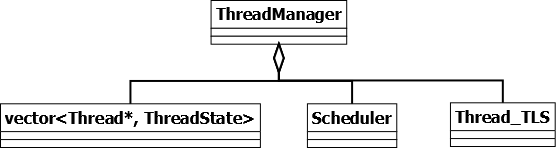
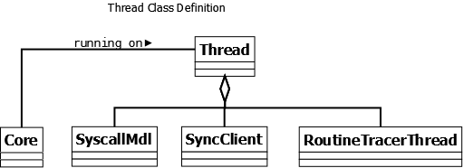

# Thread-Manager & Thread

## Thread-Manager

### 说明

Thread manager用来管理所有抽象的Application对应的Thread集合，类似于OS调度器，可以使得被模拟的Application的Thread执行迁移，挂起，唤醒，执行等功能，同时，线程间的同步功能也在这里完成

### 结构

- vector<Thread\*, ThreadState>: 用来管理所有Application创建的thread，每个thread被分配独有的ID。具体实现的时候，Thread\*和ThreadState是分别通过两个vector进行管理，但是对应的index指的是同一个Thread结构
- Scheduler：用于完成ThreadManager管理的thread的调度处理
- Thread_TLS：TLS(线程相关数据结构)；Sniper中的TraceThread是host thread，相当于设置某个TraceThread的线程TLS绑定到对应的某个Thread上面

### 成员

| 成员                | 类型                        | 说明                                                         |
| ------------------- | --------------------------- | ------------------------------------------------------------ |
| m_thread_lock       | Lock                        | 访问ThreadManager数据结构时使用的互斥锁；因为ThreadManager会运行在不同的TraceThread的执行环境下，所以在多线程环境下，需要互斥锁的处理 |
| m_thread_state      | vector\<ThreadState\>       | 已经分配的Thread的管理的状态                                 |
| m_threads           | vector\<Thread\*\>          | 已经分配的Thread仿真对象                                     |
| m_thread_spawn_list | queue\<ThreadSpawnRequest\> | ==看起来用于Pin的spawn thread的处理，目前的版本分析不需要==  |
| m_thread_tls        | TLS \*                      | 用于设置当前TraceThread的host thread对应的TLS，TLS这里就是Thread仿真对象的指针 |
| m_scheduler         | Scheduler \*                | 用于Thread进行调度的算法调度器                               |

### 接口

| 接口                      | 功能                                  |
| ------------------------- | ------------------------------------- |
| set/get_XXX               | 用于设置内部成员变量的set/get函数     |
| <u>**for TraceMgr**</u>   |                                       |
| createThread              |                                       |
| <u>**Thread service**</u> |                                       |
| spawnThread               | used in Pin-tool mode                 |
| joinThread                |                                       |
| getThreadToSpawn          | used in Pin-tool mode                 |
| waitForThreadStart        |                                       |
| <u>**Event**</u>          |                                       |
| onThreadStart             |                                       |
| onThreadExit              |                                       |
| <u>**Misc**</u>           |                                       |
| stallThread/_async        |                                       |
| resumeThread/_async       |                                       |
| moveThread                | 用于scheduler调度时执行线程的迁移动作 |

### 流程

TBD

## Thread

### 说明

Trace thread抽象了一个Application对应的可执行线程，里面需要包含处理SystemCall的调用，执行同步的问题(SyncClient)[？？]，以及该Application thread执行的代码routine的trace

### 结构

### 成员

| 成员            | 类型                   | 说明                                                         |
| --------------- | ---------------------- | :----------------------------------------------------------- |
| m_thread_id     | thread_id_t            | SInt32类型, 由ThreadManager分配，表明了当前被测试进程中存在的thread的编号，从0开始。0代表当前进程的主线程 |
| m_app_id        | app_id_t               | 当前thread所属的进程id                                       |
| m_name          | String                 | 当前线程的名字，这个通过Sift接口通过Pin进行设置              |
| m_cond          | ConditionVariable      | 类似于pthread的condition variable的接口对象                  |
| m_wakeup_time   | SubsecondTime          | 当前线程被唤醒的时间                                         |
| m_wakeup_msg    | void \*                | 当前线程被唤醒的原因                                         |
| m_core          | Core \*                | 当前线程被调度执行的仿真Cpu对象                              |
| m_syscall_model | SyscallMdl \*          | 当前线程对应的syscall的执行环境                              |
| m_sync_client   | SyncClient \*          | 目前不清楚具体用途                                           |
| m_rtn_tracer    | RoutineTracerThread \* | 当前线程trace routine执行过程的对象                          |
| m_va2pa_func    | va2pa_func_t           | 进行VA->PA转换的函数指针                                     |

### 接口

| 接口名称         | 功能                                                         |
| ---------------- | ------------------------------------------------------------ |
| getCore          | 返回当前thread所运行的仿真Core对象，如果thread没有被分配到任何的Core上，返回NULL |
| setCore          | 设置当前thread运行的Core对象                                 |
| reschedule       | 进行当前thread的schedule动作                                 |
| updateCoreTLS    | 更新Core上面的TLS(thread-local storage)。在sniper中，每个Core是通过一个host thread进行模拟的，通过使用TLS结构，thread可以访问到自己的私有存储结构，操作方法就像操作普通的变量一样。Thread结构就是Core中的TLS |
| getSyscallMdl    | 返回SyscallMdl的系统调用执行环境                             |
| getSyncClient    |                                                              |
| getRoutineTracer | 返回RoutineTrace的对象                                       |
| wait             | 当thread需要进行sync的同步操作时，使用的wait接口             |
| signal           | 当thread需要进行sync的同步操作时，使用的signal接口           |
| va2pa            | 进行当前thread的VA->PA转换                                   |

从接口的定义上，可以看出来，Thread类更像是一个容器(container)类，主要用来封装每个被模拟的Thread的具体的执行环境，同时兼具实现OS上面的调度实现功能