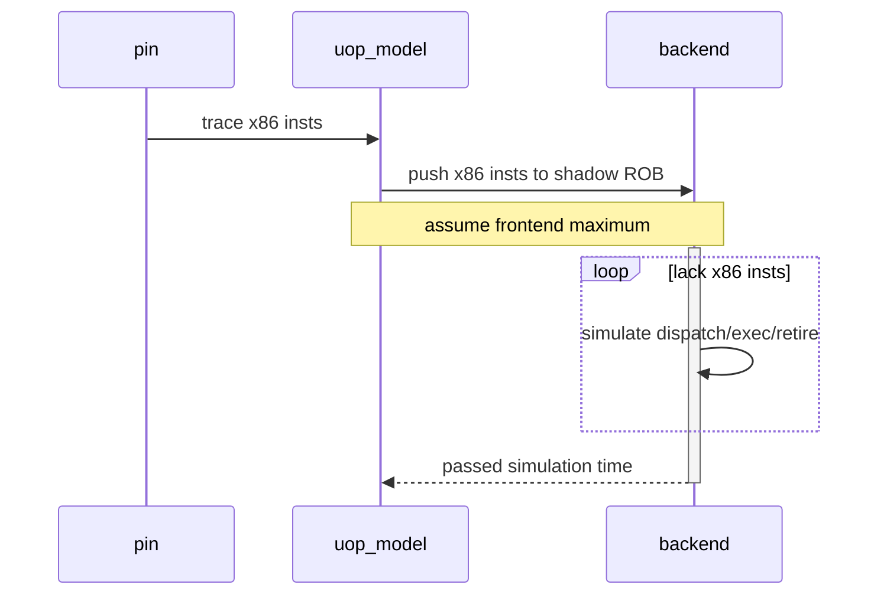
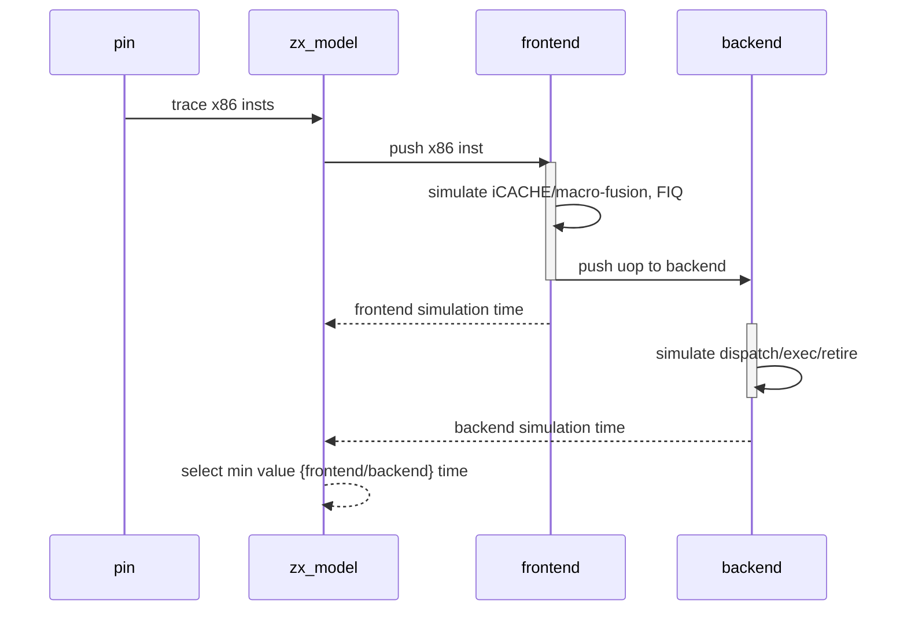

# 兆芯单核memory带宽分析

## glibc的memcpy实现分析

测试环境

- OS: Ubuntu 18.04
- glic: 2.27

glibc memcpy代码分析

在glibc的2.27的实现中，对于memcpy的函数实现，glibc无论在动态链接还是静态链接的情况下，都采用了一种ifunc的机制进行处理。ifunc机制的引入主要是为了针对特定的硬件平台提供针对该平台的特定优化版本。

ifunc的实现机制

​	ifunc机制借助于.rela.plt和.plt两个elf section实现。其中，.plt字段定义了运行时候memcpy的具体的调用版本，整个代码的结构如下

```assembly
ENTRY_memcpy:
	jmpq	*offset(%rip)			# <GLOBAL_OFFSET_TABLE offset_memcpy>
	xchg	%ax, %ax
```

在静态链接的情况下：

​	这个`GLOBAL_OFFSET_TABLE(offset_memcpy)`的修改是在整个程序启动时，由glibc的初始化程序负责调用完成的，具体的位置是在libc_start_main(libc-start.c[csu])->ARCH_SETUP_IREL函数中完成的。这个函数会依次调用.rela.plt section中的需要重定位的函数的selector函数进行.plt中的重定位处理

具体的selector函数通过如下的格式进行定义

```c
#define foo __redirect_foo
#include <foo.h>
#undef foo

extern __typeof(__redirect_foo) __foo_default attribute_hidden;
extern __typeof(__redirect_foo) __foo_specail attribute_hidden;

libc_ifunc_redirect(__redirect_foo, __new_foo, IFUNC_SELECTOR());	// IFUNC_SELECTOR宏用于定义selector函数
versioned_symbol(libc, __new_foo, foo, GLIBC_2_14);
```

一个典型的selector函数的实现：

```c
static inline void *
IFUNC_SELECTOR (void)
{
  const struct cpu_features* cpu_features = __get_cpu_features ();

  if (CPU_FEATURES_ARCH_P (cpu_features, Prefer_ERMS))
    return OPTIMIZE (erms);

  if (CPU_FEATURES_ARCH_P (cpu_features, AVX512F_Usable)
      && !CPU_FEATURES_ARCH_P (cpu_features, Prefer_No_AVX512))
    {
      if (CPU_FEATURES_ARCH_P (cpu_features, Prefer_No_VZEROUPPER))
	return OPTIMIZE (avx512_no_vzeroupper);

      if (CPU_FEATURES_CPU_P (cpu_features, ERMS))
	return OPTIMIZE (avx512_unaligned_erms);

      return OPTIMIZE (avx512_unaligned);
    }
	...
}
```

基本通过判断cpu_feature的信息来进行函数版本的不同选择，这里cpu_feature的结构定义如下(sysdeps/x86/cpu-features.h)；可以看到仅仅针对intel/amd进行了定义和处理

```c
struct cpu_features
{
  enum cpu_features_kind
    {
      arch_kind_unknown = 0,
      arch_kind_intel,
      arch_kind_amd,
      arch_kind_other
    } kind;
  int max_cpuid;
  struct cpuid_registers
  {
    unsigned int eax;
    unsigned int ebx;
    unsigned int ecx;
    unsigned int edx;
  } cpuid[COMMON_CPUID_INDEX_MAX];			// <= 硬件定义的feature
  unsigned int family;
  unsigned int model;
  /* The state size for XSAVEC or XSAVE.  The type must be unsigned long
     int so that we use
	sub xsave_state_size_offset(%rip) %RSP_LP
     in _dl_runtime_resolve.  */
  unsigned long int xsave_state_size;
  /* The full state size for XSAVE when XSAVEC is disabled by
     GLIBC_TUNABLES=glibc.tune.hwcaps=-XSAVEC_Usable
   */
  unsigned int xsave_state_full_size;
  unsigned int feature[FEATURE_INDEX_MAX];	// <= glibc自定义的一些feature字段
  /* Data cache size for use in memory and string routines, typically
     L1 size.  */
  unsigned long int data_cache_size;
  /* Shared cache size for use in memory and string routines, typically
     L2 or L3 size.  */
  unsigned long int shared_cache_size;
  /* Threshold to use non temporal store.  */
  unsigned long int non_temporal_threshold;
};
```

在静态链接下，cpu-feature的初始化是在 libc_start_main->ARCH_INIT_CPU_FEATURES()的宏中完成的。

至此，在不同的CPU硬件上如何选择最优的memcpy的版本的过程基本解释完毕。

在测试的两台机器上，memcpy分别对应的版本如下：

CHX002 Cent_id

​	__memmove_sse2_unaligned		sysdeps/x86_64/multiarch/memmove-vec-unaligned-erms.S

HASWELL

​	__memmove_avx_unaligned_erms	sysdeps/x86_64/multiarch/memmove-vec-unaligned-erms.S

两者使用的代码模板一致，而使用的指令略有不同

|                                  | CHX002      | HASWELL  |
| -------------------------------- | ----------- | -------- |
| VEC_SIZE  (一次load/store的大小) | 16B         | 32B      |
| VEC  (使用的vector寄存器)        | xmm         | ymm      |
| PREFETCHNT (模板指令中没有使用)  | prefetchnta |          |
| VMOVNT  (non-temporal move)      | movntdq     | vmovntdq |
| VMOVU  (unaligned move)          | movups      | vmovdqu  |
| VMOVA  (aglined move)            | movaps      | vmovdqa  |

模板代码实现结构

TBD

```assembly
/* memmove/memcpy/mempcpy is implemented as:
   1. Use overlapping load and store to avoid branch.
   2. Load all sources into registers and store them together to avoid
      possible address overlap between source and destination.
   3. If size is 8 * VEC_SIZE or less, load all sources into registers
      and store them together.
   4. Otherwise, if address of destination > address of source, backward copy
      4 * VEC_SIZE at a time with unaligned load and aligned store.
      Load the first 4 * VEC and last VEC before the loop and store
      them after the loop to support overlapping addresses.
   5. Otherwise, forward copy 4 * VEC_SIZE at a time with unaligned
      load and aligned store.  Load the last 4 * VEC and first VEC
      before the loop and store them after the loop to support
      overlapping addresses.
   6. If size >= __x86_shared_non_temporal_threshold and there is no
      overlap between destination and source, use non-temporal store
      instead of aligned store.
*/
```

| 条件 | 使用的copy指令 |
| ---- | -------------- |
|      |                |
|      |                |
|      |                |
|      |                |
|      |                |
|      |                |

对于CHX002使用Intel_id的情况，memcpy执行的代码路径为

CHX002 Intel_id

​	__memcpy_ssse3		sysdeps/x86_64/multiarch/memcpy-ssse3.S

对于glibc而言，对于CHX002 Intel_id的路径选择与Cent_id不同，主要在于init_cpu_features函数中，没有对于`cpuid 0x1`的结果进行保存[只针对Intel/AMD的CPU保存`cpuid 0x1`的结果]

__memcpy_sse3使用的代码模板如下：

TBD

------

GCC/ICC编译的openmp程序的结构分析

TBD

------

## glibc memcpy的性能测试结果

对于GCC O2优化下编译的stream copy程序，其主要汇编代码如下：

```assembly
		xor %rax, %rax
LL: movsd (%r15, %rax, 8), %xmm0
	  movsd %xmm0, 0x0(%r13, %rax, 8)
	  add $0x1, %rax
	  cmp $0x989680, %rax ;对于非openmp的编译
	  cmp %rax, %rdx			;对于openmp的编译，rdx包含0x989680
	  jne LL
```

更具体的数据请参考[memcpy_test.xlsx](./memcpy_test.xlsx)

1. Case-1 不进行memcpy的动作，单纯测试循环的差别

   |          | CHX002                         | INTEL                          |
   | -------- | ------------------------------ | ------------------------------ |
   | 非openmp | 30000000/2000000, uop=30000000 | 30000000/1000000, uop=20000000 |
   | openmp   | 30000000/1000000, uop=20000000 | 30000000/1000000, uop=20000000 |

   可以看到，在非openmp的方式下，CHX002没有使用macro-fusion，导致uop个数与指令个数相同

2. Case-2 进行基于不同数组大小的stream memcpy测试

   统计不同Core在不同Cache level hit情况下的throughput情况

   测试在开启prefetch的情况下进行

   |               | Intel Haswell 2.7GHz | CHX002 2.7GHz |
   | ------------- | -------------------- | ------------- |
   | L1 Cache Hit  | 40.70GB/s            | 25.78GB/s     |
   | L2 Cache Hit  | 32.01GB/s            | N/A           |
   | LLC Cache Hit | 25.64GB/s            | 15.29GB/s     |
   | DRAM Hit      | 12.42GB/s            | 9.04GB/s      |

3. Case-3根据不同的数组大小测试各级Cache的latency

   测试在关闭prefetch的情况下进行

   |               | Intel Haswell 2.7GHz | CHX002 2.7GHz |
   | ------------- | -------------------- | ------------- |
   | L1 Cache Hit  | ~4                   | 4             |
   | L2 Cache Hit  | 12-4=8               | N/A           |
   | LLC Cache Hit | ~40-12-4=24          | 34-2*4=26     |
   | DRAM Hit      | \~130-\~215          | \~225-\~300   |

4. TBD

------

## memcpy在sniper中的模拟仿真

### Core Pipeline的调整

整个仿真基于sniper中的rob_performance_model进行仿真，主要添加macro-fusion、port-binding、LSQ的模拟等功能。在实际仿真测试过程中，发现CHX002的前端设计存在瓶颈，在包含macro-fusion的情况下(3条x86指令对应2条uop)，前端无法达到最大的throughput。所以必须重新设计sniper中的performance model来进行前端的模拟。

原始的sniper中rob_performance_model的实现



对于这种实现方法，始终认为backend是贡献性能的瓶颈，而前端总是可以满足backend的最大的指令throughput的需求，在这里指dispatch_width

而对于CHX002来说，无法满足这个假设条件，所以需要重新设计一个新的performance model。这个是预想的performance model的工作流程



这样设计的方式，会增加仿真时的运行时开销，因为增加一个frontend的仿真，原来的sniper设计只需要把ROB填满，然后循环仿真backend即可；按照目前的设计，则必须每来一条x86都进行一次仿真，只有当frontend的instruction_queue(FIQ)满了之后，才能进行循环仿真

zx_model的工作流程

```c++
void handleInstruction(DynamicInstruction *inst)
{
  SubsecondTime latency = ZERO;
  
  // push x86 inst to frontend inst_queue
  frontend.push_x86(inst); 
  
  // start simulation
  while (true) {
    // no enough x86 to simulate
    if (frontend.needMore())
      break;
    
    // update core simulation time to current cycle
    updateCoreTime();
    
    frontend.execute();
    backend.execute(simulate_instruction);
    
    // update statistics counter
    instruction_count += simulate_instruction;
  }
}
```

frontend的工作流程

```c++
SubsecondTime execute(DynamicInstruction *inst)
{
  // ------simulate fetch
  if (!in_wrong_path) {
    // simulate x86 insts not in FIQ
    while (fetch_ptr < inst_queue.size()) {
      DynamicInstruction *x86 = inst_queue.at(fetch_ptr);
      // simulate fetch&BPU and return fetch latency
      need_break = simFetch(x86, latency);
      
      // fetch interrupt instruction stream, then wait for latency
      if (need_break) {
        register_next(latency);
        break;
      }
      fetch_ptr++;
    }
  }
  
  // ------simulate decode
  num_to_decode, latency = scan_fiq();		// scan FIQ to find ready x86 to decode
  																				// not more than decodeWidth
  // decode, including macro-fusion
  // each decode simulate will from slot#0
  decode(num_to_decode);
  
  // current cycle simulate done, wait for next decode phase
  register_next(latency);
}
```

对于frontend的仿真，需要考虑如下几个问题

1. 对于frontend来说，instruction queue是最为主要提供performance的queue，所以主要建模instruction queue
2. 因为frontend是in-order的，所以icache miss，BPU mispredict等penalty都是会直接体现在instruction queue的decode latency上的
3. 当ROB满的时候，因为instruction queue还可以cover一部分的frontend的latency，所以ROB满的时候，instruction queue还可以进入指令，访问icache， BPU predict等。所以，对于fetch来说可以单独注册fetch的处理latency，而不是仅仅进行latency的仿真，等到实际decode的时候采取访问icache，从而造成model访问icache的时间可能延后很多(在ROB满的情况)

backend的工作流程

```c++
SubsecondTime execute(void)
{
	// split ROB alloc & rename logic
  // simulate Dispatch/Exec/Commit stage
  // follow current sniper's ROB_model design
}
```

### MOB的调整

原始ROB_performance model中，对于MOB的模拟相对比较简单，只考虑了访存latency对于ld/st queue的占用时间，但是MOB中的ld/st queue的占用时间处理和实际的处理器并不一致。

实际处理器的ld/st queue的流程

1. rename stage --- 进行ld/st queue的entry分配，如果这里分配不成功，则uop只能发送到ROB中，但是无法进入RS； 同时，rename stage会根据memory alias table记录的情况检查ld/st之间的依赖关系，如果两者有依赖关系，那么直接建立dependency，否则，在执行的过程中，可能会有ld bypass st的情况，这种情况下，ld需要进行replay (==问题：这种replay，在sniper的结构中是否可以模拟出来？==)
2. schedule stage --- 当ld/st指令的操作数都ready之后，ld/st通过预先分配好的ld/st 的RS-port发送到MOB的pipeline中进行执行(==需要区分出来sta、std两类不同的store uop==)。如果st执行的时候，发现有个new ld已经执行完毕，那么这笔ld需要进行replay。同时，在此执行过程中，会访问TLB/PAGEWALKER/DCACHE等硬件，并设置不同的执行latency。对于store来说，执行仅仅是进行RFO的操作，并不会把data写入到DCACHE中，而是先写入到st queue的store buffer中
3. complete stage --- ld/st执行执行完毕后，wakeup dependent的执行
4. retire stage --- 对于ld/st来说，只有当ROB中的ld/st uop retire之后，对应的ld/st queue中的entry才会被释放掉；特别地，对于st来说，这时才会把data写入到DCACHE中，并修改MESI为M (保证store是program-order)。[==对于多核系统来说，这个特性显得非常重要，因为当某个core的st已经complete，但是没有retire的时候，是会被另外core给snoop，从而进行replay的；这个是否可以在sniper中建模，需要认真评估。对于单核系统，MESI协议的变化时机显得并不是特别重要，当然对于因为evict引起的st replay在单核上依然会出现==]

Sniper中ld/st queue的流程

1. rename stage --- 不进行任何的处理
2. schedule stage --- 指令操作ready的情况下，检查ld/st queue的分配情况，在此时根据ld/st queue的分配情况决定是否可以issue
3. compelete stage --- wakeup dependent的执行，释放ld/st queue的分配
4. retire stage --- 没有处理，所有的MESI状态都在schedule那个时刻的调用决定了

Sniper仿真的失真分析

- sniper的MOB并没有按照HW的实际的时间点来进行占用、释放。这会导致如下的问题：Sniper对于MOB的占用更理想，从而会加速后续指令的dispatch速度，从而影响到RS-port的分发情况
- 没有区分sta/std的操作，导致port的占用不符合实际的HW情况
- 没有retire store的操作，MESI的修改的时机与HW不一致(==是否修改需要评估==)，这个对于单核memcpy的分析无影响

计划修改的sniper MOB行为

- 添加sta/std的micro-fusion的处理。通常，需要将有store行为的x86分为两个uop(但是占用同一个uop entry)，sta/std；但是对于CHX002较为特殊，没有特定的std uop，所有的std指令被隐含在execution的操作上
- 修改MOB中的ld/st的分配和释放机制，目前可以简单的把RFO操作等同于store操作，只是store queue的释放调整到retire之后，这样做不符合MESI的变化，但是对于单核问题研究无影响

关于micro-fusion的处理

sniper的调度基于ROB进行，对于micro-fusion的uop，只占用一个ROB entry，而调度的实体有2个sta/std。在进行instruction decoder的时候，可以直接区分sta/std uop，在进入backend处理时，需要考虑如下

- 分配ROB的entry是实际为1
- 进行RS dispatch和schedule的时候，两个占用同一个entry的uop需要分别考虑
- 执行的时候，两个uop分别考虑
- commit时，两者都done之后，进行commit

micro-fusion的仿真方案

​	复用当前的robEntry的仿真结构，每个micro-fusion的指令占用N个robEntry，但是仿真时，名义rob个数为1，这样所有的仿真算法和结构不需要大的修改，对于Backend来说，需要作如下修改：

- allocate rob的时候，分配实际的robEntry，但是名义只有一个rob占用
- dispatch阶段，对于micro-fusion的指令一起考虑，算所一次dispatch counter
- commit阶段，只有micro-fusion的指令全部完成，才可以commit，否则不能commit

临时的修改

- microuop对于store指令分开为sta/std，以sta为主
- dynamicMicroOp同microop的处理方式
- 对于上述两个结构，有些info需要同时设置到micro-fusion的多个uop中

==后续，需要大幅调整当前sniper中的uop等结构设计==

关于MOB的修改

- 为每个robEntry添加一个ld/st index，用于指名分配的ld/st单元index，ld/st的分配放入到dispatch stage
- 所有的ld/st的操作全部放入到MOB中，对于memory barrier的指令同样放入到里面
- 对于ld/st来说，entry的释放由指令在ROB中commit的时间点决定，不在像目前的sniper中执行完毕后立刻释放
- 对于store来说，commit之后执行写回动作

