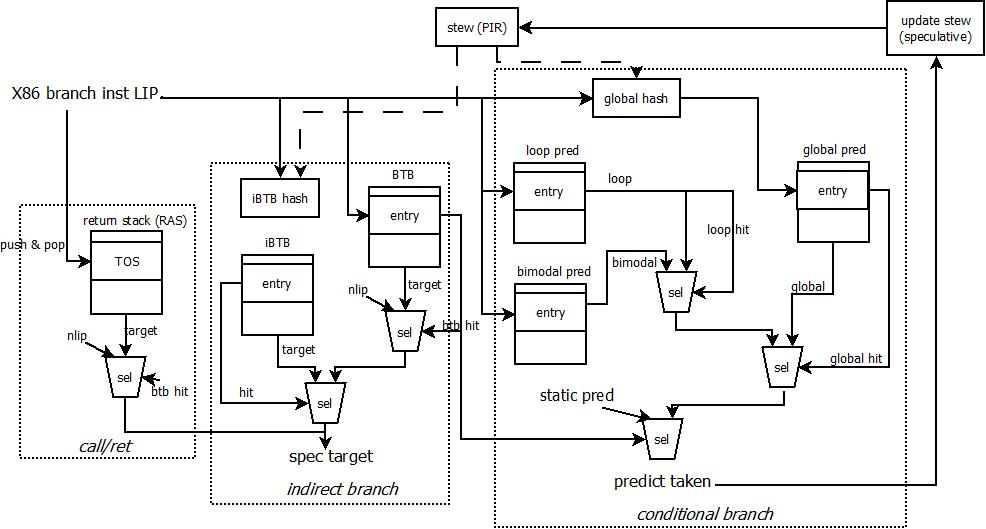
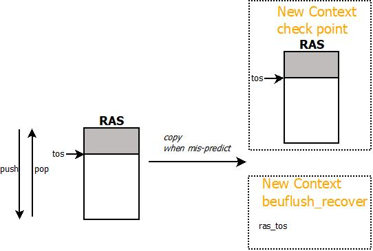

[TOC]

## Branch Predictor的结构

模拟器中的Branch Predictor结构采用了BG(bimodal+global history)或是BGG(bimodal + big global history)的结构，其branch predictor的具体结构和相互关系如下：

模拟器中各部分预测结构的基本信息（以cpu-demo.cfg为例）

targetglobalS entry {target, tag, tid}

| module                                      | parameters                                                   | entry structure                                              |
| ------------------------------------------- | ------------------------------------------------------------ | ------------------------------------------------------------ |
| RAS                                         | setting_ras_depth(16) entries                                | {lip_VA}                                                     |
| iBTB                                        | setting_fe_indirect_size(256) entries setting_fe_indirect_assoc(1) ways | {target_VA}                                                  |
| global iBTB exclusive with iBTB        | setting_fe_indirect_size(256) entries direct map        | tag target_VA tid                                  |
| BTB                                         | setting_fe_bpu_btb_size(2048) entries setting_fe_bpu_btb_assoc(4) ways tag setting_btb_tag_size(9) bits | tag target_VA uop_OPCODE counter last_stew last_bigstew mru_bit miss disagree_static_pred |
| global predictor                            | setting_fe_bpu_global_size(2048) entries setting_fe_bpu_global_assoc(4) way | tag satuar counter counter_bl_0   not tk satuar counter counter_bl_1   tk satuar counter |
| bimodal predictor                           | setting_fe_bpu_bimodal_size(4096) entries setting_fe_bpu_bimodal_assoc(1) ways | tag(maybe) satuar counter                               |
| loop predictor                              | setting_fe_bpu_loop_size(128)entries setting_fe_bpu_loop_assoc(2) ways setting_loop_tag_size(6) | tag learn_mode predict_mode relearn_mode validate_mode spec prediction max_counter real_counter spec_counter |
| l2 bimodal predictor setting_l2_bpu(1) | setting_l2_bimodal_size(8192) entries setting_l2_bimodal_assoc(4) ways setting_l2_tag_size(8) | tag satuar counter                                      |
| big global predictor                        | setting_fe_bpu_bigglobal_size(2048) entries setting_fe_bpu_bigglobal_assoc(4) ways setting_bigg_tag_size(26) | tag satuar counter counter_bl_0   not tk satuar counter counter_bl_1   tk satuar counter |
| stew length                                 | setting_fe_stew_length(15)-bit                               |                                                              |
| bigstew length                              | setting_fe_bgg_history(37)-bit                               |                                                              |
| static predictor                            | absolutely branch       always-taken conditional branch       backward, taken       forward, not-taken |                                                              |

**<u>index的生成</u>**

对于不同的BPU预测表结构，需要采用不同的function产生表结构的index索引

- RAS

  index = tos

- iBTB

  lip = setting_use_last_byte(1)? (nlip-1): lip

  setting_shift_lip_offset_ind(1)

  ​	index = {lip[3:0], iBTB_hash}

  else

  ​	index = {iBTB_hash}

- BTB

  当BTB使用全地址时，全地址宽度为59-bit

  lip = setting_use_last_byte(1)? (nlip-1): lip

  setting_shift_lip_offset_btb(1)

  ​	index = {lip[3:0], lip[(tag+set)_bits+4:4]}

  else

  ​	index = lip[(tag+set)_bits:0]

- global iBTB

  旧的iBTB的实现，thread-aware，并且含有tag信息

  setting_CPU1_indirect_predictor(0)

  ​	index = iBTB_hash[stew_len+1:stew_len+1-set_bits]

  ​	tag = iBTB_hash[stew_len+1-set_bits:0]

  else

  ​	index = iBTB_hash[set_bits:0]

  ​	tag = iBTB_hash[stew_len+1:index_size]

- global predictor

  setting_shift_lip_offset_g(1)

  ​	index = {lip[3:0], global_hash}

  else

  ​	index = {global_hash}

- bimodal predictor

  lip = setting_use_last_byte(1)? (nlip-1): lip

  ! setting_bimodal_have_tag(0)

  ​	index = lip[set_bits:0]

  setting_bimodal_msb_tid(1)

  ​	index = {lip[:set_bits+1] (tag), tid, lip[set_bits-1:0]}

- loop predictor

  lip = setting_use_last_byte(1)? (nlip-1): lip

  setting_shift_lip_offset_loop(1)

  ​	index = {lip[3:0], lip[(tag+set)_bits+4:4]}

  else

  ​	index = lip[(tag+set)_bits:0]

  setting_loop_msb_tid(1)

  ​	index = {lip[(tag+set)\_bits:set\_bits+1] , tid, lip[set\_bits-1:0]}

- L2 bimodal predictor

  lip = setting_use_last_byte(1)? (nlip-1): lip

  setting_l2_have_tag(1)

  ​	index = lip[(tag+set)_bits:0]

  else

  ​	index = lip[set_bits:0]

- big global predictor

  lip = setting_use_last_byte(1)? (nlip-1): lip

  setting_shift_lip_offset_bigg(1)

  ​	index = {lip[3:0], global_hash[(tag+set)_bits:0]}

  else

  ​	index = {global_hash[(tag+set)_bits:0]}

**<u>hash函数的设计</u>**

针对indirect branch和conditional branch来说，为了提高预测准确度，在生成相关表结构的index索引前，需要对index值进行hash函数处理

**<u>1. indirect branch hash (iBTB_hash)</u>**

- index      <===   iBTB_hash

  add_ind_to_stew(1)

  ​	! add_target_to_ind_index(1)

  ​		index = stew[stew_len:0] ^ lip[stew_len:0]

  ​	else	// add target address to stew

  ​		index = stew[5:0]<<(stew_len-6) ^ stew[stew_len:6] ^ lip[stew_len+5:5]

  else

  ​	index = stew[stew_len:0]

- bigindex

  add_ind_to_stew(1)

  ​	! add_target_to_ind_index(1)

  ​		bigindex = bigstew[bigstew_len:0] ^ lip[bigstew_len:0]

  ​	else

  ​		bigindex = bigstew[5:0]<<(bigstew_len-6) ^ bigstew[bigstew_len:6] ^ lip[bigstew_len+5:5]

  else

  ​	bigindex = bigstew[bigstew_len:0]

**<u>2. conditional branch hash (global_hash)</u>**

- index

  ! setting_shift_lip_offset_g(1)

  ​	index = stew[stew_len:0] ^ lip[stew_len:0]

  else

  ​	index = stew[stew_len:0] ^ lip[stew_len+4:4]

- bigindex

  ! setting_shift_lip_offset_g(1)

  ​	index = bigstew[bigstew_len:0] ^ lip[bigstew_len:0]

  else

  ​	index = bigstew[bigstew_len:0] ^ lip[bigstew_len+4:4]

### 投机执行的处理

模拟器支持投机执行，在投机路径上执行的指令是预测错误的指令，最终当模拟器发现预测错误的时候，会将投机路径上的指令全部清除掉。但是在flush之前，BPU依然会对投机路径上的指令进行预测。flush之后，需要将BPU的预测表状态恢复到投机前的状态，从而使得投机路径上的预测不会影响正常路径上的指令预测。为此，对于BPU预测表的投机预测会对某些数据结构进行修改，这些修改会随着uop传递到模拟器的backend，最终在执行完毕后，决定是进行BPU的update，还是进行BPU的flush动作。

BPU在SMT的情况下，被多个phythread进行共享，但是预测表中的某些数据结构被投机更新了，这需要保存到每个phythread的执行context中，包括：

| Field                        | Description                                                  |
| ---------------------------- | ------------------------------------------------------------ |
| stew                         | 全局历史跳转信息， 15bit                                     |
| bigstew                      | 更长的历史跳转信息，37bit                                    |
| ras_stack[MAX_RAS_SIZE(513)] | call/ret的return stack预测器                                 |
| ras_tos                      | 当前ras中的栈指针                                            |
| call_depth                   | call的递归深度，当递归深度为0时，表示当前ras为空             |
| global_history               | 全局的golden的历史跳转信息                                   |
| target                       | 跳转目标， VA                                                |
| last_br                      | 导致mis-predict的branch uop，会创建新的投机执行上下文 (Context) |

### BPU的预测

在frontend进行指令fetch的时候，需要对LIP进行next_lip的预测，这个部分由BPU完成，在预测时，只有少量的预测表结构进行投机更新——被投机更新的结构都在Context中进行保存(见“投机执行的处理”)，其他的结构仅仅进行读取处理

**<u>注：模拟器中的预测是在fetch之后，并且已经知道指令类型后进行的，这是模拟器的一种优化模拟，与实际硬件实现有一定的出入</u>**

在预测时，不同的branch类型会使用不同的预测表结构，下面针对不同的预测表结构在进行预测时进行说明，预测时，表结构仅仅进行读取，而不进行任何更新(除了btb和bimodal，更新的内容与下次预测内容无关)

- RAS

  

  - 对于call，将当前target压入ras，tos+1
  - 对于return, tos-1，将当前target弹出ras

  当ras在投机路径上，如果遇到mis-predict的情况，那么分为几种类型处理

  - setting_ras_checkpointed_stack(1)，copy当前ras的所有内容到phythread的context中，恢复时直接copy恢复
  - setting_ras_recover_tos_beuflush(0)，仅仅copy当前的tos指针，而ras中的内容不恢复
  - 或者不恢复

- iBTB

  目前实现的iBTB为direct-map的表，使用相应的index索引后，输出对应的target VA地址。iBTB不是thread-aware的。iBTB不能投机更新

- global iBTB

  如果使用旧式的iBTB，那么这个iBTB是thread-aware且含有tag信息的。如果都匹配，输出对应的target VA。global iBTB不能投机更新

- BTB

  对于direct branch(包括jcc和jmp、call等)和return指令，必须是btb hit，否则当前的branch算作mis-prediction(相当于fallthrough)。BTB是thread-aware的

- bimodal

  所有的conditional branch首先需要bimodal hit，如果bimodal不hit，那么直接使用L2 bimodal的预测或是静态预测器结果。bimodal输出的是饱和计数器结果

- global predictor

- loop predictor

- L2 bimodal predictor

  当bimodal预测conditional branch miss或是btb miss的时候，使用L2 bimodal的预测结果。L2 bimodal工作在两种模式下

  - setting_l2_predict_opposite(1)，bimodal的hit是对static predictor结果的修正——如果L2 bimodal hit，那么预测结果为static predictor取反
  - L2 bimodal预测结果为饱和计数器

- big global predictor

下面，针对不同的branch类型的预测进行详细说明

- call_indirect

  **<u>ras的压栈处理</u>**

  - setting_call_to_ras_opt(1)，如果target != next_lip，进行ras压栈
- 直接进行ras压栈
  
**<u>跳转地址(target)的预测</u>**
  
- 使用iBTB部分进行预测
  
**<u>跳转方向(taken)的预测</u>**
  
  - 直接跳转，

- jmp_indirect / jmpnear_indirect

  **<u>跳转地址(target)的预测</u>**

  - 使用iBTB进行预测

- ujcc / ujmp_onedesc

- ujcc_indirect / ujmp_indirect

- call_direct

- jmp_direct

- return_indirect

- jcc

**预测结果的保存**

### BPU的更新

## 模拟器的投机执行机制