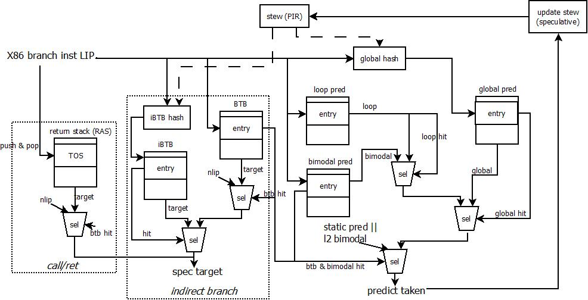

[TOC]

## Branch Predictor的结构

模拟器中的Branch Predictor结构采用了BG(bimodal+global history)或是BGG(bimodal + big global history)的结构，其branch predictor的具体结构和相互关系如下：

模拟器中各部分预测结构的基本信息（以cpu-demo.cfg为例）

targetglobalS entry {target, tag, tid}

| module            | parameters                                                   | entry structure                                              |
| ----------------- | ------------------------------------------------------------ | ------------------------------------------------------------ |
| RAS               | setting_ras_depth(16) entries                                | {lip_VA}                                                     |
| iBTB              | setting_fe_indirect_size(256) entries, setting_fe_indirect_assoc(1) ways | {target_VA}                                                  |
| BTB               | setting_fe_bpu_btb_size(2048) entries, setting_fe_bpu_btb_assoc(4) ways tag setting_btb_tag_size(9) bits | target_VA uop_OPCODE counter last_stew last_bigstew mru_bit miss disagree_static_pred tag (offset + btb_tag_size(9)) |
| global predictor  | 2048 entries, 4-way hash_func:      hash_index = stew[15:0] ^ IP[15:0]      hash_index = stew[15:0] ^ IP[19:4] index = {IP[4:0], hash_index} | satuar counter counter_bl_0   not tk satuar counter counter_bl_1   tk satuar counter |
| bimodal predictor | 4096 entries, direct-map IP[tid[0], bimodal_len[-1, -2]:0] | satuar counter                                               |
| loop predictor    | 128entries, 2-way tag[5:0], MSB=tid                     | learn_mode predict_mode relearn_mode validate_mode spec prediction max_counter real_counter spec_counter |
| stew length       | setting_fe_stew_length(15)-bit                               |                                                              |
| bigstew length    | setting_fe_bgg_history(37)-bit                               |                                                              |

### 投机执行的处理

模拟器支持投机执行，在投机路径上执行的指令是预测错误的指令，最终当模拟器发现预测错误的时候，会将投机路径上的指令全部清除掉。但是在flush之前，BPU依然会对投机路径上的指令进行预测。flush之后，需要将BPU的预测表状态恢复到投机前的状态，从而使得投机路径上的预测不会影响正常路径上的指令预测。为此，对于BPU预测表的投机预测会对某些数据结构进行修改，这些修改会随着uop传递到模拟器的backend，最终在执行完毕后，决定是进行BPU的update，还是进行BPU的flush动作。

BPU在SMT的情况下，被多个phythread进行共享，但是预测表中的某些数据结构被投机更新了，这需要保存到每个phythread的执行context中，包括：

| Field                        | Description                                                  |
| ---------------------------- | ------------------------------------------------------------ |
| stew                         | 全局历史跳转信息， 15bit                                     |
| bigstew                      | 更长的历史跳转信息，37bit                                    |
| ras_stack[MAX_RAS_SIZE(513)] | call/ret的return stack预测器                                 |
| ras_tos                      | 当前ras中的栈指针                                            |
| call_depth                   | call的递归深度，当递归深度为0时，表示当前ras为空             |
| global_history               | 全局的golden的历史跳转信息                                   |
| target                       | 跳转目标， VA                                                |
| last_br                      | 导致mis-predict的branch uop，会创建新的投机执行上下文 (Context) |

### BPU的预测

在frontend进行指令fetch的时候，需要对LIP进行next_lip的预测，这个部分由BPU完成，在预测时，只有少量的预测表结构进行投机更新——被投机更新的结构都在Context中进行保存(见“投机执行的处理”)，其他的结构仅仅进行读取处理

**<u>注：模拟器中的预测是在fetch之后，并且已经知道指令类型后进行的，这是模拟器的一种优化模拟，与实际硬件实现有一定的出入</u>**

下面，针对不同的branch类型的预测进行详细说明

- call_indirect

  **<u>ras的压栈处理</u>**

  

  设置了setting_call_to_ras_opt(true)，则target != next_lip

  - 将当前target压入ras，tos+1

  在投机路径上，如果遇到mis-predict的情况，那么分为两种类型处理

  - setting_ras_checkpointed_stack(1)，copy当前ras的所有内容到phythread的context中，恢复时直接copy恢复
  - setting_ras_recover_tos_beuflush(0)，仅仅copy当前的tos指针，而ras中的内容不恢复

  **<u>跳转地址(target)的预测</u>**

  参考jmp_indirect / jmpnear_indirect部分

- jmp_indirect / jmpnear_indirect

  **<u>index的生成</u>**

  if add_ind_to_stew(1)

  ​	if ! add_target_to_ind_index(1)

  ​		index = stew[stew_len-1:0] ^ IP[stew_len-1:0]

  ​	else

  ​		index = stew[5:0]<<(stew_len-6) ^ stew[stew_len-1:6] ^ IP[stew_len+4:5]

  else

  ​	index = stew[stew_len-1:0]

  **<u>bigindex的生成</u>**

  if add_ind_to_stew(1)

  ​	if ! add_target_to_ind_index(1)

  ​		bigindex = bigstew[bigstew_len-1:0] ^ IP[bigstew_len-1:0]

  ​	else

  ​		bigindex = bigstew[5:0]<<(bigstew_len-6) ^ bigstew[bigstew_len-1:6] ^ IP[bigstew_len+4:5]

  else

  ​	bigindex = bigstew[bigstew_len-1:0]

  **<u>跳转地址(target)的预测</u>**

  if setting_shift_lip_offset_ind(1)

  ​	lip_offset = X86 first_byte or X86 last_byte (setting_use_last_byte(1))

  ​	ind_index = index | lip_offset << stew_len

  else

  ​	ind_index = index

  if setting_new_indirect(1)

  ​	hit = read iBTB by ind_index

  else

  ​	hit = read global indirect table

  if ! hit

  ​	if setting_shift_lip_offset_btb(1)

  ​		btb_index = (X86 last_byte or first_byte) >> 4

  ​	else

  ​		btb_index = (X86 last_byte or first_byte)

  ​	if setting_shift_lip_offset_btb

  ​		btb_index = lip_offset<<btb_len | btb_index,  btb_index = {lip_offset, btb_index_bits}

  ​	hit = read btb table

- ujcc / ujmp_onedesc

- ujcc_indirect / ujmp_indirect

- call_direct

- jmp_direct

- return_indirect

- jcc

**预测结果的保存**

### BPU的更新

## 模拟器的投机执行机制