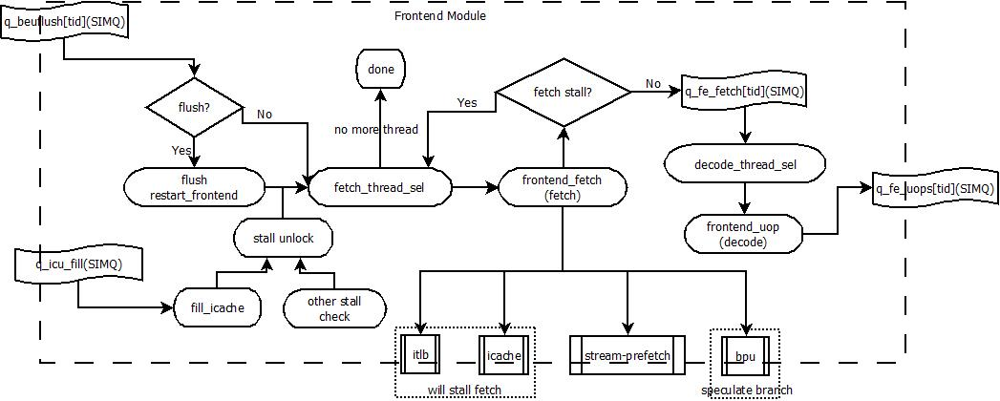
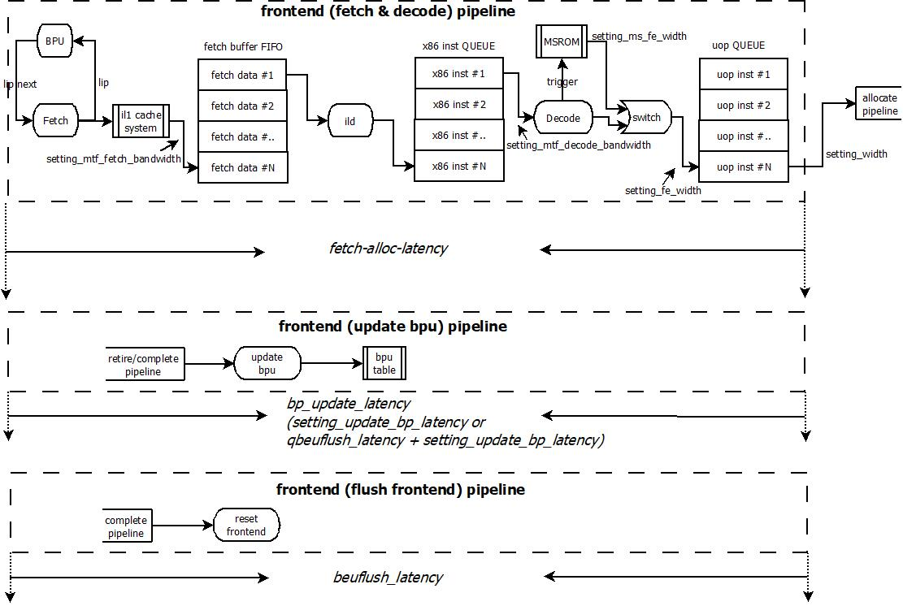
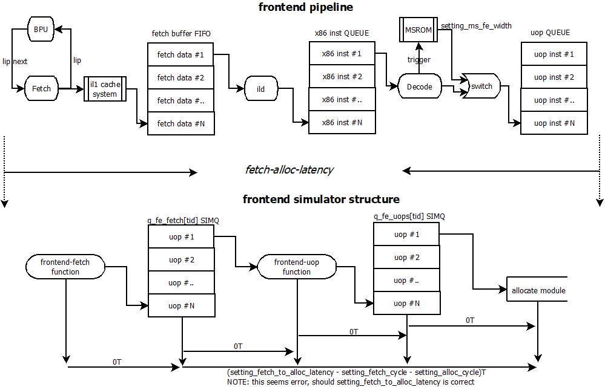
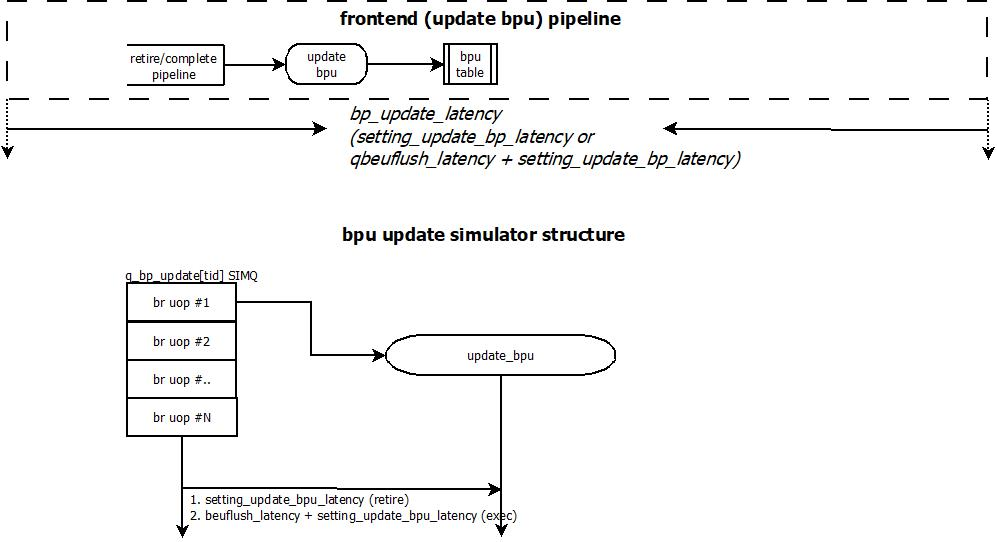
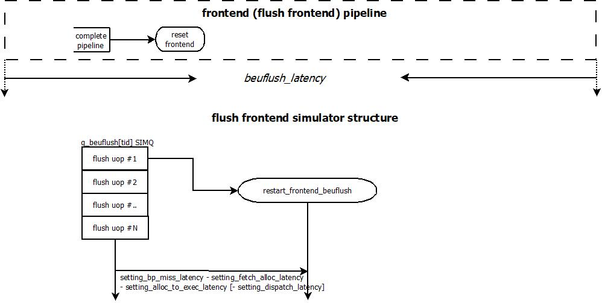
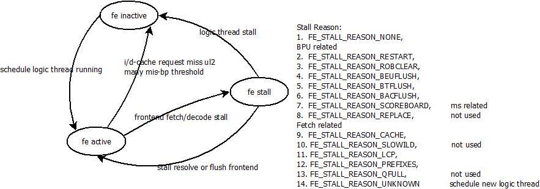

[TOC]

## Frontend特性

- 每T最多解码出4条uop(setting_fe_width)
- 每次Fetch读取16B(mtf_fetch_bandwidth)的数据
- 每次Decode可以处理16B(mtf_decode_bandwidth)的数据
- 每次Decode可以处理的对齐的chunk数据(mtf_decode_aligned_chunks)
- 支持fetch_fusion(ild之后完成)
- branch predict预测
- macro-fusion / micro-fusion

## Front-end的仿真流程结构

frontend主要完成如下功能：

1. 当backend需要flush frontend的时候，frontend进行reset，并根据backend的要求进行flush和reset。双方交互的接口为q_beuflush[tid] SIMQ。该SIMQ中存储着所有mispredict或是需要flush frontend的uop。frontend flush前端所有的queue，并根据该uop的信息reset前端的fetch状态

2. 检查每个phythread的stall reason是否已经unblock (stall reason会在后续详述)

3. 对于SMT系统，需要根据每个phythread的状态，按照一定的冲裁算法进行fetch thread的选择；每T不一定只有一个phythread会执行fetch动作

4. frontend_fetch模拟真正的fetch动作

   - MTF fetch

     1. 读取ITLB，进行VA->PA的地址翻译；如果ITLB miss，进入PMH进行进一步处理
     2. 读取ICACHE，如果ICACHE miss，则进行L2 Cache的读取；返回的response放入q_icu_fill SIMQ中；该SIMQ表示已经fetch的ICACHE miss line data已经返回
     3. push stream-prefetch，进行指令的prefetch预测处理
     4. 进行BPU预测处理，如果预测不成功，建立投机堆栈

   - MS fetch

     X86指令需要trigger MSROM，执行MSROM的fetch动作，进行MSROM的时序模拟

   - PERFECT fetch

     完美fetch模拟，在这种情况下，不会出现itlb/icache miss以及bpu mis-predict情况，直接可以进行后续解码

5. 当fetch没有出现stall的时候，将模拟取指得到的fetch line指令送入q_fe_fetch[tid] SIMQ中，该SIMQ代表进行了ILD处理，等待进行decode的X86指令

6. 根据每个phythread状态选择decode thread，进行decode动作

7. frontend_uop模拟真正的decode动作

   - 进行指令翻译，通过XLAT的直接翻译
   - 需要进入MSROM进行取值翻译的过程——重置fetch为MS_FETCH
   - micro-fusion/macro-fusion/unlimination的处理 （fusing相关， decode-fusion)

8. 解码后的指令放入q_fe_uops[tid] SIMQ，该SIMQ代表已经进行解码的uop序列，准备进行后续的处理

## Frontend的Pipeline结构

Core的frontend是一种In-Order的pipeline结构，如下图所示：

Frontend的Pipeline结构由3段流水线构成：

- fetch&decode pipeline
  - fetch / bpu

    根据当前phythread的lip值进行lip_next的预测(bpu)，并访问il1 cache system进行指令读取，每次读取setting_mtf_fetch_bandwidth的指令data，目前设计为16B；如果il1 cache system出现miss，那么等待il1 cache miss done后进行后续处理 (icache fetch stall)

  - ild

    完成指令的切分处理，并将切分后的x86指令存入x86 inst QUEUE中；在ild过程中，frontend存在stall的情况 (ild stall)；视配置情况，进行fusing的处理 (默认在decode处理)

  - decode

    对x86指令进行解码，翻译为对应的uop序列；对于译码较多的X86指令，则需要trigger MSROM进行进一步译码；在译码过程中完成macro-fusion / micro-fusion。在decode过程中，存在stall情况 (decode stall)

- bpu update pipeline

  当branch指令retire或是complete后，需要进行bpu表结构的更新，用于以后branch指令的预测

- frontend flush pipeline

  当branch指令在执行后，发现出现了mispredict的情况，此时需要重置frontend，从正确的位置重新抓取指令执行

## Frontend Pipeline在模拟器中实现

- Fetch & Decode pipeline

  基于frontend是In-Order的pipeline结构的特点，模拟器在实现frontend的时序结构的时候进行了抽象，将frontend抽象为2个功能模块，并根据pipeline stage和pipeline buffer设置SIMQ的大小，按照fetch-alloc-latency设置SIMQ的延迟信息，用于仿真frontend的latency

  

  模拟器中function与pipeline结构的function的对应关系如下：

  - frontend-fetch：实现Fetch、BPU、ILD、Decode (包括MSROM和XLAT解码)的功能
  - frontend-uop：实现micor-fusion、macro-fusion功能

  SIMQ用于实现pipeline的延迟和Buffer结构：

  - q_fe_fetch[tid] SIMQ

    用于模拟读取且切分的X86指令，实际存储使用uop格式；

    - size：设计为frontend pipeline stage和内部所有buffer结构的总大小，表明可以有多少的X86指令可以in-flight，包含3个部分：

      max_uops_per_fetch  --- 一次fetch可以解码出来的uop个数， setting_fetch_width (4) *  XLAT_UOP_NUM (4)

      max_uops_per_line  --- 一次可解码的最大uop个数，**setting_fe_width * max_uops_per_fused**，代码中这个设计应该有问题，实际应该就是setting_fe_width (4)

      max_uops_per_fused --- 一个uop最大可fused的uop个数；最大为5，实际与设置的fusing规则相关
      - 路上buffer

        pipeline stage的buffer, T= (fetch_to_alloc_latency (16) / fe_clock (2) + 1) * MAX(max_uops_per_fetch, max_uops_per_line) * max_uops_per_fused

        表明经过T这么长时间后，fetch可以进入的uop个数 (这个个数也代表了可以fetch的X86指令数)

      - fetch data buffer

        setting_fe_fetch_buffers (0) * MAX (max_uops_per_fetch, max_uops_per_line) * max_uops_per_fused

        表明读取到Fetch buffer中的Data包含的最大个数的uop个数 (这个个数也代表了最大可能的X86指令数)

      - x86 inst queue

        setting_fe_iq_size (18) * MAX(MAX_XLAT_UOPS, setting_fe_mswidth)

        表明X86 inst queue中可以解码出来的最大 uop个数，每个entry代表一条X86指令

    - latency：设置为fetch-alloc的pipeline latency—— **setting_fetch_to_alloc_latency(16) - setting_fe_clock(2) - setting_alloc_clock(2)**；这个设计应该有点问题，就是setting_fetch_to_alloc_latency 

  - q_fe_uops[tid] SIMQ

    用于模拟X86解码后的uop输出，和micro-fusion、macro-fusion处理后的uop

    - size：

      依据不同的管理方式

      - uops：设计为uop_queue的size (uq_size = setting_fe_uq_size/nthread)，uq_size * max_uops_per_fused
      - chunk：按照一次最大解码的X86指令个数管理，即uq_size一个entry表示一次最大的X86解码个数，uq_size * MAX(max_uops_per_mtf, max_uops_per_chunk) * max_uops_per_fused

    - latency：0，在这个queue中不体现任何时序信息

- bpu update pipeline

  对于bpu update的pipeline的仿真，模拟器的实现相对比较简单

  

  SIMQ 用于实现pipeline的延时结构：

  - q_bp_update[tid] SIMQ

    用于保存执行完成的branch uop，并根据branch uop的branch info进行bpu表结构的更新

    - size：为实际ROB大小(因为每个进入ROB的指令都可能是branch uop)，setting_max_rob_size (按照thread进行均分)
    - latency：在模拟器中，这个延迟设置为一个固定的延迟，为setting_update_bp_latency (14)

- beuflush pipeline

  对于beuflush的pipeline的仿真，模拟器的实现相对比较简单，且是在frontend的cycle函数的一开始进行调用

  

  SIMQ 用于实现pipeline的延时结构：

  - q_beuflush[tid] SIMQ

    用于保存执行完成且mis-predict的branch uop，frontend使用这个SIMQ来获取需要重置的IP，并根据新的IP信息进行指令读取

    - size：设置为latency + 1，说明这个SIMQ本身是一个用于延时实现的Queue
    - latency：latency在模拟器中为固定延迟 setting_bpmiss_latency (30) - setting_fetch_to_alloc_latency (16) - setting_alloc_to_exec_latency (8) [- setting_dispatch_latency (6)]；这里的设置反映了一条branch uop最理想情况下通过core pipeline发现branch mis-predict需要flush frontend的时间

## SMT下的Frontend管理

### phythread的frontend status

- fe_inactive ---> fe_active

  phythread没有调度logic thread进行执行；当phythread manager调度了一个logic thread在当前phythread执行时，当前phythread切换到active状态，并准备参与到frontend部分的phythread竞争

- fe_active ---> fe_inactive

  当phythread遇到一些较大的stall的原因的时候，当前phythread变为inactive状态；同时此时执行的logic thread进行switch out处理，并换入新的logic thread进行执行。

  较大的stall原因：

  - i/d request miss in ul2 (LLC)

    logic thread有比较多的i/d request ul2 miss，进行logic thread switch；对于这种情况，logic thread会等待较长的时间

  - many branch mis-predict threshold

    当某个logic thread出现较多的branch mispredict的时候，需要进行logic thread switch

- fe_active ---> fe_stall

  当前phythread还是处于active状态，但是会造成当前phythread的frontend stall，stall的时间不等

  | Stall Reason               | Why                                                          | Stall Cycle                                                  |
  | -------------------------- | ------------------------------------------------------------ | ------------------------------------------------------------ |
  | FE_STALL_REASON_NONE       | No Stall                                                     | N.A.                                                         |
  | FE_STALL_REASON_RESTART    | frontend after resetting                                     | 0                                                            |
  | FE_STALL_REASON_ROBCLEAR   | ROB triggered big flush, will reset ROB, backend, and frontend | bpmiss_latency - fetch_to_alloc_latency - alloc_to_exec_latency |
  | FE_STALL_REASON_BEUFLUSH   | mis-predict, flush frontend, refetch from correct LIP        | bpmiss_latency - fetch_to_alloc_latency - alloc_to_exec_latency - dispatch_latency |
  | FE_STALL_REASON_BTFLUSH    | branch predict taken, will trigger btflush, but why?         |                                                              |
  | FE_STALL_REASON_BACFLUSH   | BTB miss 1. cond br & predict taken 2. direct br 3. ! indirect br (handle in be) | default: mtf_latency / fe_clock - 1 + 1 setting: 14 + 1 |
  | FE_STALL_REASON_SCOREBOARD | MSROM READ_SCOREBOARD SET_SCOREBOARD               | fe_ms_scoreboard_stall                                       |
  | FE_STALL_REASON_REPLACE    | NOT used                                                     | N.A.                                                         |
  | FE_STALL_REASON_CACHE      | miss in ITLB/ICACHE                                          | depend on pmh or cache reload                                |
  | FE_STALL_REASON_SLOWILD    | which means slow ild decode, but split to PREFIXES & LCP 2 parts, NOT used | N.A.                                                         |
  | FE_STALL_REASON_LCP        | length-change-prefix encounter                               | mtf_num_bubbles_prefixes_lcp or mtf_num_bubbles_prefixes_lcp * 2 |
  | FE_STALL_REASON_PREFIXES   | see many prefixes                                            | mtf_num_bubbles_prefixes_toomany * (num_prefixes-1)/2        |
  | FE_STALL_REASON_QFULL      | NOT used                                                     | N.A.                                                         |
  | FE_STALL_REASON_UNKNOWN    | new logic thread switch in                                   |                                                              |

### working thread的调度策略

TBD

### fetch的工作条件

从fetch的工作条件可以看出，fetch的功能逻辑是共享资源，只要有任意一个phythread完成了fetch的操作，那么其他phythread则不能在同T进行fetch

- 当前phythread的fetch没有stall
- ！任意一个phythread已经完成了fetch
- frontend处于active状态——有需要执行的logic thread
- thread_ready，表明当前cycle的frontend的执行cycle已到
- 当前phythread不处于mwait状态 (mwait意味着处理器进入C-state，等待monitor或是中断唤醒)
- 当前的frontend pipeline没有被某个phythread独占 (frontend_lock == FRONTEND_NOLOCK)，或者当前调度的phythread独占frontend pipeline
- 使用的rob没有超过threshold；**这个为什么加入，这里还没有ROB问题**

### decode的工作条件

从decode的工作条件可以看出，decode的功能逻辑不像是共享资源，而是每个phythread有自己单独的解码逻辑

- 当前phythread的decode没有stall —— 当前uop queue没有full
- frontend处于active状态——有需要执行的logic thread
- thread_ready，表明当前cycle的frontend的执行cycle已到
- 使用的rob没有超过threshold；**这个为什么加入，这里还没有ROB问题**

## 功能实现

### Fetch

这部分主要进行Instruction Data的读取，将读取后的Instruction Data送入ild流水线中进行X86指令切分。

在fetch流水线阶段，主要完成如下功能——从逻辑上说，这些功能间是串行完成的，但实际HW实现中，有可能是并行的

- 根据LIP进行next fetch的地址预测；如果预测失败(模拟器中可以提前知道是否失败)，那么创建投机路径
- 读取ITLB，完成VA->PA的映射关系；如果ITLB miss，则通过PMH module进行page walker，标记为CACHE_STALL
- 读取ICACHE，读取instruction data；如果ICACHE miss，则通过ul2进行data读取；这个过程中可能会将当前logic thread switch-out，标记为CACHE_STALL

- 每次读取的instruction data的大小为mtf_fetch_bandwidth (16) Byte

对于CACHE_STALL而言，其stall时间由后续module的处理完成时间决定

### Instruction-Lenght-Decode (ild)

这部分主要进行prefix和Length-Change-Prefix (LCP)的识别和处理。如果当前遇到了LCP stall，这被认为是**slow ild (sild)**的处理；而对于LCP_PREFIXES的情况，不设置为sild。在实际的ild流水线中，如果当前被处理的X86指令遇到了下述的两种STALL条件，那么等待当前stall条件完成，继续进行后续指令处理，但是对于两种stall的方式，流水线有不同的处理方式：

- prefix stall              遇到一次，计算一次penalty；ild流水线依然可以被多个phythread共享
- LCP stall                遇到一次，计算一次penalty，ild流水线进入slow ild模式，在这种模式下，ild流水线不能被多个phythread共享，sild的退出模式为处理完当前fetch line，已经进入下一个fetch line的处理

**两种ild stall类型**

- prefix的处理

  每次prefixes (>2)对于frontend stall的cycle为setting_mtf_num_bubbles_prefixes_toomany (0)，设置frontend_stall_reason为LCP_PREFIXES；结束当前的处理cycle

- LCP的处理

  LCP主要包括两个部分部分：

  - 0x66 (operand-prefix)     改变operand size，修改operand size为！default operand size，default operand size由当前Core运行模式决定：16bit：16位， 32bit：32位，64bit：32位
  - 0x67 (address-prefix)     改变address size，修改address size为！default address size，default address size由当前Core运行模式决定：16bit：16位，32bit：32位，64bit：64位，在64bit模式下，不能进行16bit的address模式

  LCP对于Core运行时的影响，主要体现在识别代码边界上。因为X86指令属于变长编码指令，所以需要在给定量的指令数据上确定每条X86代码的边界，而LCP主要会影响X86编码中的displacement (address-prefix)和immediate (operand-prefix)这两个部分的解析，从而影响后续X86指令的识别

  当前的模拟器只模拟了支持SSE 1/2/3/4指令集的64位X86处理器。下图是该指令集的X86指令的编码格式

  

  这个编码格式对于LCP有如下一些特点：

  - legacy prefixes group包括0x67, 0x66两个prefix，引入的REX prefix会用于处理SSE相关和64位等特定情况
  - 存在一类特殊的编码类型：对于某些SSE指令，0x66不属于legacy prefix，而是属于opcode中的mandatory prefix，可以作为mandatory prefix的legacy prefix还包括0xF2, 0xF3。对于采用mandatory prefix进行编码的指令，REX prefix必须位于mandatory prefix和opcode (opcode包括escape byte和opcode byte)之间

  所以，LCP对于指令切分的影响在于要确定当前遇到的0x66是属于legacy prefix还是mandatory prefix，而这必须在Core完全看到一条X86指令的opcode后才能确定。所以，在处理LCP的问题时，会遇到如下情况：

  

  从这里可以看出，对于LCP是否会引起frontend stall的情况，只要ild已经获得了当前X86指令的opcode——此时0x66是否是一个legacy operand prefix已经已知，且是否存在displacement和immediate也是已知的——那么，是否stall只对发现opcode的那个ild cycle有效；唯一比较特殊的情况是对于opcode在两个fetch line都存在的情况下，会多引入一次frontend stall

  每次LCP对于frontend stall的cycle为mtf_num_bubbles_prefixes_lcp (6)，设置frontend_stall_reason为LCP_STALL；结束当前的处理cycle

### Decode

这部分完成X86指令的译码处理，其主要完成如下几方面的功能：

- X86->uop的翻译——function model已经完成
- trigger MSROM——根据function model的uop序列进行判断
- fusion的处理
- 对于在frontend执行的branch指令，进行第一次mis-predict和flush的处理

#### Fusion

#### MSROM Fetch

### Flush

