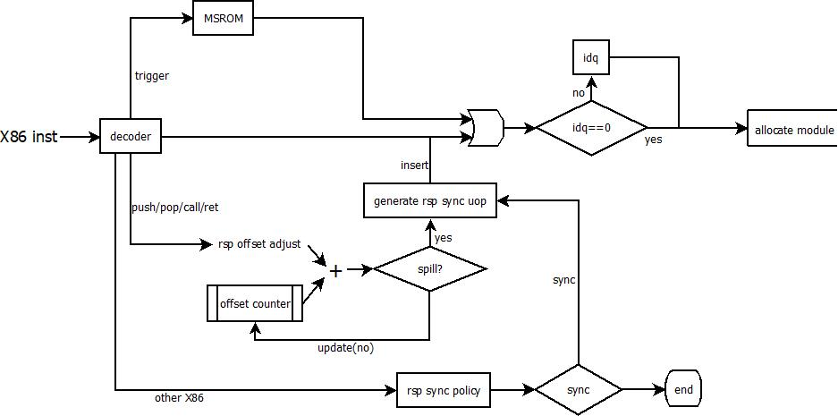

[TOC]

## Fusion的分类

处理器中有如下两种fusion机制，对于哪些情况下可以fusion，这个完全由处理器的Uop的指令格式决定。对于模拟器中的uop指令格式在uISA中进行描述

### micro-fusion

多个uop占用同相同的物理资源，这样在decode/rat/rob/retire阶段都占用减少的资源，到了backend执行时会被split成多个uop，送到多个执行单元进行执行；这部分的处理是编码在uop的属性中，为静态信息，哪些micro-fusion会被开启，由模拟器中的 fused_opt的开关决定。

**<u>在SDM中的Sandy-bridge架构， 如下情况会被处理为micro-fusing</u>**

- **<u>All stores to memory, including store immediate. Stores execute internally as two separate functions, store-address and store-data.</u>** 
- **<u>All instructions that combine load and computation operations (load+op), for example: ADDPS XMM9, OWORD PTR [RSP+40], FADD DOUBLE PTR [RDI+RSI*8], XOR RAX, QWORD PTR [RBP+32]</u>**
- **<u>All instructions of the form "load and jump," for example: JMP [RDI+200], RET</u>**
- **<u>CMP and TEST with immediate operand and memory</u>** 
- **<u>特别的，对于某些微架构(如Sandy-Bridge)对于RIP的寻址方式无法进行micro-fusing</u>**

目前模拟器中支持如下种类的micro-fusion功能

| fusing bit (start from 0)  [enable by config] | description                                                  |
| --------------------------------------------- | ------------------------------------------------------------ |
| FUSE_OPT_1    [1]                             | esp_folding push<br />push：<br />        zero = ista ss: 0(rsp + (-1)\*op_size)  BOM, ESP_FOLD<br />        zero = std op_src<br />        rsp = lea ss: 0(rsp + (-1)\*op_size)   EOM, FUSE_OPT_1 |
| FUSE_OPT_2    [1]                             | esp_folding pop<br />pop：<br />        dst  = load ss: 0(rsp + 0)    BOM, ESP_FOLD<br />        rsp = lea ss: 0(rsp  + 1\*op_size)   EOM, FUSE_OPT_2 |
| FUSE_OPT_13  [0]                              | 当前model中没有使用                                          |
| FUSE_OPT_8    [1]                             | store_address和store_data间融合，针对int类型store-data<br />mov %reg, (mem)：<br />       zero = ista seg: disp (base + index*scale)   BOM<br />       zero = std src_reg   EOM, FUSE_OPT_8 |
| FUSE_OPT_14  [1]                              | 类似于FUSE_OPT_8，但是针对于float类型store-data<br />movss %reg, (mem)：<br />       zero = ista seg: disp (base + index*scale)   BOM<br />       zero = fstd src_reg, 0  EOM, FUSE_OPT_14 |
| FUSE_OPT_3    [0]                             |                                                              |
| FUSE_OPT_4    [1]                             | int类型的load-op                                             |
| FUSE_OPT_5    [1]                             | 只用于对于@{grp} %dst此类型的X86指令，该指令翻译为两条uop，分别有标识BOTOP, EOTOP |
| FUSE_OPT_6    [1]                             | SIMD与FP的load-op的fusion                                    |
| FUSE_OPT_17  [1]                              | 对于形如 opcode (mem), %reg, $imm形式的X86指令，翻译为load-op。例如：cmpps |
| FUSE_OPT_20  [1]                              | 对于load-op的fusion，其中的op的srcs操作数只能只有1个         |
| FUSE_OPT_19  [1]                              | int类型的load-mul                                            |
| FUSE_OPT_11  [1]                              | 于FUSE_OPT_14的使用位置基本相同，都是ista / fstd  FUSE_FLAG的序列，没有看出更细微的差别 |
| FUSE_OPT_12  [1]                              | mem-op_imm的fusion，mem可以是load或是sta, op_imm可以是std或者alu运算 |
| FUSE_OPT_15  [1]                              | op-tickle_execute fusion, 用于indirect branch指令；tickle_execute用于检查当前的跳转地址是否符合当前segment的属性 |
| FUSE_OPT_16 [1]                               | esp_calc-indirect call/ret fusion                            |
| FUSE_OPT_7    [0]                             | load-stAD的fusion                                            |
| FUSE_OPT_9    [0]                             | eflags_op-op的fusion                                         |
| FUSE_OPT_18  [0]                              | rsp_calc-[in]direct_call的fusion                             |
| FUSE_OPT_10  [0]                              | 猜测为寄存器high/low的两个部分的fusion，例如：rsqrtps, rcpps |
| FUSE_OPT_21  [0]                              | 没有使用                                                     |

在实际的模拟器实现中，只有如下情况会造成micro-fusion的叠加(多个uop合并为一个uop)：

- esp-folding (FUSE_OPT_1 | FUSE_OPT_2)
- FUSE_OPT_12
- FUSE_OPT_15 && FUSE_OPT_16
- FUSE_OPT_18

对于其他的micro-fusion情况，只能实现两条uop之间的合并

#### ESP Folding (stack engine)

对于PUSH/POP类的X86指令，翻译后的uop序列中会包括一条mem uop会一条调整rsp的alu uop，当有多个PUSH/POP的X86指令连续执行的时候，rsp的alu uop会造成一个比较长的串行依赖链结构。所以，模拟器中实现了一个针对rsp的alu uop的特定优化——stack engine (ESP Folding)——通过特定的硬件直接在解码阶段计算rsp的alu uop，这条alu uop实际可以在RAT阶段直接retire，而不用进入执行单元进行计算。同时，这条alu的uop会和前面的mem uop进行fusion。但是在RAT阶段会再次打开。例如：

```assembly
{x86_Dst} = load{x86_OSize} SS: Zero({x86_Src}+Zero*0){x86_SSize} {BOM ESP_FOLD }  ;<--- ESP FOLD flag, 表明对于当前uop的ESP寄存器不用于srcs和dst
{x86_Src} = lea{x86_SSize} SS: Zero({x86_Src}+imm_0x1*{x86_OSize}{x86_SSize} {EOM FUSE_OPT_2 } ; <--- alu uop fusion with mem uop
```

##### stack engine的机制

模拟器为了实现上述的ESP Folding机制，设计了一个HW的stack engine，用于对PUSH/POP/CALL/RET等堆栈指令快速计算堆栈指针，减少uop间的依赖关系

**模拟器中的相应开关**

esp_folding(1)				 支持 esp folding的micro-fusion

esp_sync_enable(1)		支持esp sync uop的动态插入

**stack engine的实现逻辑**

对于每个phythread，模拟器在decoder stage维护一个offset的counter，每个对于RSP的PUSH/POP/CALL/RET等堆栈调整操作会直接进入stack engine转换为对于offset counter的计算；同时对于其他的X86指令则会根据一定规则判断是否需要进行RSP的同步操作。如果需要进行RSP的同步操作，那么需要在decoder阶段动态插入rsp sync的uop



**硬件资源**

phythread->esp_offset，这个counter的大小为esp_offset_max(256 [8bit])

**ESP sync的策略**

通过offset counter的计算，HW将多个连续的堆栈操作X86指令间的依赖去掉，使得指令可以并行执行，但是同时带来一个问题是，执行的RSP与架构的RSP之间存在值的偏差，两者的偏差在模拟器中会随着当前的堆栈调整uop一直传递到最后的retire阶段。

但是，在frontend抓取和解码的指令过程中，有些X86指令将rsp作为src、dst的操作数，并且可能某些X86需要trigger MSROM进行执行，所以在这些情况发生的情况下，需要将执行的RSP与架构的RSP进行同步，使得指令可以获得正确的RSP值。模拟器中支持如下的sync策略：

- ESP_SYNC_NONE (0)

  - 当前offset counter = 0，说明完全同步，不需要同步
  - 已经处理到X86指令边界或是下一个uop来自MSROM

- ESP_SYNC_OVERFLOW(1)

  offset counter溢出的情况(上溢、下溢)

- ESP_SYNC_MS(2)

  当前的解码路径需要切换到MSROM

- ESP_SYNC_SRC(3)

  当前的RSP作为X86指令的src operand

  - 对于带有ESP_FOLD标志的uop(表明当前RSP是folding的)，不需要sync
  - 对于memory操作，rsp作为base寄存器
    - esp_sync_on_base=0，不进行sync
    - esp_sync_on_base(1)=1，总是sync
    - esp_sync_on_base=2，disp != 0进行sync
  - 其他情况，需要进行sync

- ESP_SYNC_DST(4)

  当前的RSP作为X86指令的dst operand

  - 对于带有ESP_FOLD标志的uop(表明当前RSP是folding的)，不需要sync
  - esp_sync_on_dst(1) && dst reg == rsp

**<u>问题</u>**：对于标记了ESP_FOLD的xadd uop(在ret $immed的X86指令中)，貌似stack engine的处理不正确，这个immed的值没有被加到offset counter中，导致这里的rsp sync会有滞后

**esp sync的操作**

当判读需要插入一个esp sync的uop的时候，stack engine会在X86指令解码前，插入一条sync的uop，其格式如下：

```c++
xadd/xsub rsp, immed(offset_counter value)
```

并将offset counter清零

这条插入的uop可能设置unlaminated属性(laminate_esp_sync)

#### Laminate RMW

对于uop标有RMW_LAM的属性的uop，需要进行Laminate RMW的处理，laminate_RMW的支持需要FUSE_OPT_4和FUSE_OPT_12的支持。

Laminate RMW的uop的特点如下：

- 在decoder阶段多个uop作为一个uop进行解码
- 在rat阶段，因为ROB的srcs的个数限制，uop无法作为单一uop进行依赖追踪，所以需要重新分解为多个uop，被标记为RMW_LAM的uop需要被split为一个新的uop

```assembly
; 典型的laminate rmw
TMP0 = iload_intent{x86_OSize} {x86_Seg}: {x86_Disp}({x86_Base}+{x86_Index}*{x86_Scale}{x86_ASize} {BOTOP }
TMP2 [ALLFLAGS]  = {x86_Opcode}{x86_OSize}  {FUSE_OPT_4 }
Zero = ista{x86_OSize} {x86_Seg}: {x86_Disp}({x86_Base}+{x86_Index}*{x86_Scale}{x86_ASize} 
Zero = std{x86_OSize} TMP2 {EOM RMW_LAM EOTOP }
```

### macro-fusion

多个X86指令在解码时被翻译为一条uop，这样在decode/rat/rob/retire阶段都占用较少的资源，即使到了backend执行时，也不会被重新split成多个uop；这部分的处理是在模拟器的decode阶段完成，其模拟器中只支持2条X86指令之间的macro-fusion。目前模拟器中支持如下种类的macro-fusion功能

| fusing option                        | fusing type        |
| ------------------------------------ | ------------------ |
| fusing_GNRJ (1)                      | FUSING_OP_JCC      |
| fusing_CPU1 (1) based on fusing_GNRJ | FUSING_OP_JCC      |
| fusing_opjcc (0)                     | FUSING_OP_JCC      |
| fusing_loadjmp (0)                   | FUSING_LOAD_JMP    |
| fusing_moveop_int (0)                | FUSING_MOVE_OP_INT |
| fusing_moveop_fp (0)                 | FUSING_MOVE_OP_FP  |
| fusing_negadd (0)                    | FUSING_NEG_ADD     |
| fusing_loadop_int (0)                | FUSING_LOAD_OP_INT |
| fusing_loadop_fp (0)                 | FUSING_LOAD_OP_FP  |
| fusing_opop_int (0)                  | FUSING_OP_OP_INT   |
| fusing_opop_fp (0)                   | FUSING_OP_OP_FP    |

#### macro-fusion的前置条件

对于macro-fusion来说，两个被fusion的X86需要满足如下的前置条件，才有可能进行macro-fusion——实际实现的时候使用uop进行判断

- 两个X86必须来自于同一个phythread

  两个uop来自于同一个phythread

- 两个X86从XLAT解码

  - 两个uop来自于同一个fe source
  - 两个uop必须是X86解码出来的uop，不能是人工创造的(esp_sync或是MSROM)

- 第一个X86不能已经macro-fusion，意味着目前只检查两条X86之间的fusion

- 第二个X86指令不能是micro-fusion的X86

- 两个X86指令必须在exec进行执行，不能在RAT端执行完成(比如zero-idiom, esp-folding等)

- 两个X86不能是fxchg指令

- 第一条X86指令不能是跳转指令

- 第二条X86指令不能是带有访存的X86指令

- 如果不是intra-fusing(两条X86指令的uop个数都>1，两条X86指令可以做局部fuse)，则两条X86指令只能翻译为1条uop (这里的1条uop指micro-fusion之后的uop)；意味着第一条X86可以micro-fusion，第二条必须是翻译为1条Uop的X86指令；如果第一条X86是micro-fusion的，那么第二条X86必须是Jcc指令

如下是针对不同fusing option进行的检查

- FUSING_OP_JCC

  first is op; second is jcc

  不能fuse的条件

  - first 是shift_or_rotate指令 (shr, shl, sar, sal, rcl, rcr, rol, ror)

  - first 不是simple alu指令 (整形运算单元add/sub/and/or/xor)

  - first是一条带有mem操作的指令，且含有立即数 (cmp immed, (mem))

  - 除了fusing_opjcc和fusing_GNRJ选项判断情况的其他情况

    - fusing_opjcc

      - 采用fusing_opjcc_not_dest  (0)， 则first有dest register (除了tmp register或是null register [immed or sink])
      - 对于second的jcc指令，根据跳转的cc和相应的选项进行判断

      | Jcc type             | fuse option             |
      | -------------------- | ----------------------- |
      | ja/jae/jb/jbe        | fusing_opjcc_not_C (0)  |
      | jo/jno/jl/jge/jle/jg | fusing_opjcc_not_O (0)  |
      | js/jns/jl/jge/jle/jg | fusing_opjcc_not_S (0)  |
      | jp/jnp               | fusing_opjcc_not_PA (0) |
      | je/jne/jbe/ja/jle/jg | fusing_opjcc_not_Z (0)  |

    - fusing_GNRJ 可以fuse的条件

      | first op                                          | second op                                                    |
      | ------------------------------------------------- | ------------------------------------------------------------ |
      | cmp reg, reg<br />cmp *AX, Iz<br />cmp reg, Iz    | fusing_CPU1 (1)<br />   4: LE/NG, NLE/G<br />   3: P/PE, NP/PO<br />   2: L/NGE, NL/GE<br />   1: O, NO, S, NS<br />   0: B/NAE/C, NB/AE/NC, Z/E, NZ/NE, BE/NA, NBE/A |
      | test reg, reg<br />test *AX, Iz<br />test reg, Iz | jcc                                                          |

- FUSING_LOAD_JMP

  load的X86 + [in]direct branch (not jcc), fuse

- FUSING_LOAD_OP_INT / FUSING_LOAD_OP_FP

  load + op, LOAD_OP_FP的情况对应load的dest reg是fp reg, fuse

- FUSING_MOVE_OP_INT / FUSING_MOVE_OP_FP

  mov + op, fuse

- FUSING_NEG_ADD

  neg+add, fuse

- FUSING_OP_OP_INT / FUSING_OP_OP_FP

  op+op，两个X86的操作数类型必须是相同的类型

#### macro-fusion的具体操作

模拟器中的uop有10个source操作数，1个dest操作数，sink_reg和immhacked_reg也算作操作数，但是算作NULL_REG类型，在进行macro-fusion的分析时不进行考虑。当模拟器已经检查了两个X86可以fuse后，进一步对两个X86的uop的src, dst操作数进行进一步分析

- 指令1的dst reg不能是FpSp类型 (Fp Control reg，例如：FPCW, FPSW, FC0-3等)，如果是，不能fuse
- 指令1的src reg不能包含control类型 (例如：cr3, cr0等)，如果是，不能fuse
- 针对指令1中的FP/INT类型的src， dst，immed操作数进行统计；如果没有FP/INT类型的操作数，不能fuse
- 针对指令2中的FP/INT类型的src，dst，immed操作数进行统计

按照HW fused的硬件约束条件，查看是否满足fuse条件：

- fused指令的总INT/FP src操作数 <= fusing_src_int(3) 且 fusing_src_fp(3)
- fused指令的总dst操作数 <= fusing_dst (1), 总src操作数 <= fusing_src(3)
- fused指令写INT/FP寄存器  <= fusing_dst_int(3)且fusing_dst_fp(3)
- 如果fusing_dep_only(1)，那么指令2必须依赖于指令1；这个依赖包括两个：
  - 指令2的rflags完全被指令1的wflags覆盖
  - 指令2的src里面有指令1的dst
- 对于FUSING_LOAD_OP_FP/INT或是FUSING_OP_OP_FP/INT类型的fuse，如果fusing_src1_only(0)，那么指令2的第1个src必须是指令1的dst
- 对于immed的特殊讨论
  - fusing_allow_2_immediates (0)，则可以有两个immed操作数
  - 否则，immed操作数只能有1个
    - 对于fusing_allow_op_immediate_op_jcc(0)，且指令2是jcc的情况，指令1的immed操作数不统计
    - 对于指令1是带有load的操作，且immed value = 0，immed不统计
      - fusing_allow_zero_immediate_load_op_fp， 指令1的操作类型为fp
      - fusing_allow_zero_immediate_load_op_int，指令1的操作类型为int
    - 对于指令2，如果fuse是load-shuffle (对应FUSING_LOAD_OP_FP/INT)的fuse，如果fusing_allow_op_immediate_load_shuffle(0)，那么指令2的immed操作数不统计

如果通过了上面的规则，则按照指令1和指令2的类型，在指令2上设置对应的fuse类型。在目前的实现中FUSING_LOAD_JMP没有实现

## Fusion在模拟器中的实现

### 数据结构

关于uop和X86指令间的fuse关系通过uop数据结构中的类型进行表示，与fuse相关的数据结构如下

```c
struct {
	bool         first;		// 表明是fused group的第1条uop
	bool         micro;		// 表明是micro-fusion
	bool         macro;		// 表明是macro-fusion
	uint32       fuse_type;	 // fuse的类型，包括macro-fusion和micro-fusion
    						// micro-fusion:
    						//		FUSING_STATIC
    						// macro-fusion
    						//		FUSING_OP_JCC
    						//		FUSING_LOAD_JMP
    						//		FUSING_MOVE_OP_INT/FP
    						//		FUSING_NEG_ADD
    						//		FUSING_LOAD_OP_INT/FP
    						//		FUSING_OP_OP_INT/FP
	bool         unfused;	  // 因为某种原因unfuse
	CpuframeworkUop *parent;	// fused group的第一条uop，其first=1
	CpuframeworkUop *child[MAX_UOPS_PER_FUSED];	// fused group中的其他uop
	bool         unlaminated;	// 当前uop是否是RMW_LAM属性的Uop，如果是在allocate阶段需要占用rob
	Uop_Regnum   fused_reg;		// 被fused的寄存器，fused group's parent's dst
	bool	     mrn_unfused_parent;	// TBD
	bool	     mrn_unfused_child;		// TBD
} fusing;

// 对于FUSING_OP_OP_INT/FP类型的macro-fusion，指令2的uop的opcode是FP_ADD类型
bool           fuse_shuffle_op;

// ESP FOLD
int            esp_patch_disp;		// 当前uop带有ESP_FOLD flag，表明当前rsp是folding的
									// -1表明当前的uop是xadd
									// 1表明当前的uop是load/ista
bool           is_esp_folding;		// 当前UOP是否是esp folding，FUSE_OPT_1/2
esp_sync_t       is_esp_sync;		// 对于当前uop是否需要esp sync
struct {
	int      delta;				// 实际的offset值
	int      pre;				// 投机路径上的offset_pre值
	int      post;				// 投机路径上的offseT_post值
} esp_offset;
```

### Micro-fusion的实现

因为micro-fusion是内建机制，所以其micro-fusion的实现在simuop.cc中的fetch_simuop中实现，即在当前uop的生成阶段处理

### Macro-fusion的实现

对于macro-fusion，可以在fetch阶段进行指令fuse(icache内部)，或是decode阶段进行fuse，其实现在fusing.cc的do_fusing和check_macro_fusion中实现

