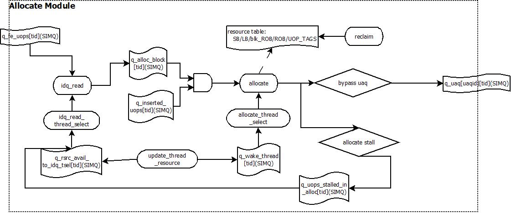

[TOC]

## Allocate特性

- 每周期支持最多setting_width(4)个uop的renaming和allocate的处理
- memory renaming和register renaming机制
- partial eFLAG和 partial register的处理
- 支持branch的checkpoint的机制(setting_br_checkpoint || setting_periodic_checkpoint)
- 多种分配rob/load buffer/store buffer的算法支持(static-partition / dynamic sharing)
- src operand的rob read port的分配算法
- 支持lock predictor

## Allocate的仿真流程结构



对于allocate stage来说，主要的工作在于完成backend各种硬件资源的分配，根据数据流分析的依据，将指令按照true-dependency的方式进行依赖分析，这里的分析主要包括两个部分：寄存器依赖和内存依赖(memory renaming)。同时，完成指令集架构上的特定优化策略。而在硬件时序上，allocate stage并不复杂，只完成了两件主要的事情：

- 读取idq中的解码后的Uop
- 完成uop的资源分配和重命名工作

在模拟器中，allocate阶段主要实现了如下的功能：

- 各种backend资源的分配，包括(ROB/branch color/LB/SB)
- lock指令的预测——针对lock load
- 寄存器的重命名——包括src / dst operands
- partial eflag / register的处理——对于X86指令集，某些通用寄存器允许局部读、写
- 内存重命名——memory renaming——包括load / std, load / sta之间的依赖关系处理
- 针对X86指令集语义的特定优化

针对于SMT的处理器来说，allocate stage是一个共享的stage，所以有大部分的功能集中于如何选择一个phythread用于当前周期执行allocate的逻辑。

所以，对于allocate stage主要集中于功能实现，和 SMT的线程切换、管理功能，而不重点分析时序逻辑结构

## Allocate的Pipeline结构

TBD

## Allocate Pipeline在模拟器中实现

对于allocate stage来说，功能的实现大于对于性能和时序的实现，这里主要总结下模拟器中使用的一些SIMQ，这些SIMQ的大小和latency反映了allocate stage内部的一些时序情况

| SIMQ name                             | Size                         | Latency          | Type | Location   |
| ------------------------------------- | ---------------------------- | ---------------- | ---- | ---------- |
| q_bigflush_reclaim[tid]               | bigflush_latency+1           | bigflush_latency | Uop  | ROB->alloc |
| q_alloc_to_idq[tid]<br />\<not used\> | setting_width(4)             |                  | N.A  | N.A        |
| q_inserted_uops[tid]                  | UOP_NSRC(10)*2               | 0                | Uop  | internal   |
| q_alloc_block[tid]                    | setting_width\*max_fused_uop | 0                | Uop  | internal   |
| q_wake_thread[tid]                    | 1                            | wake_latency     | bool | internal   |
| q_rsrc_avail_to_idq_tsel[tid]         | rsrc_idq_size                | rsrc_idq_latency | bool | internal   |
| q_uops_stalled_in_alloc[tid]          | alstall_size                 | alstall_latency  | bool | internal   |

**<u>表中size / latency的说明</u>**

- bigflush_latency = setting_bpmiss_latency(30) - setting_fetch_to_alloc_latency(16) - setting_alloc_to_exec_latency(8) = 6
- wake_latency = setting_alloc_rsrc_avail_compute_latency(2) - setting_alloc_clock(2) = 0
- rsrc_idq_size = (setting_alloc_rsrc_avail_to_idq_tsel_latency(4) / setting_alloc_clock(2))+2 = 4
- rsrc_idq_latency = setting_alloc_rsrc_avail_to_idq_tsel_latency = 4
- alstall_size = (setting_allocate_tsel_alstall_latency(4) / setting_alloc_clock(2))+2 = 4
- alstall_latency = setting_allocate_tsel_alstall_latency = 4

## Allocate的SMT管理

allocate stage对于SMT的系统来说是一个共享的stage，这个stage的phythread管理主要完成两方面的工作

- idq_read的phythread选择

  每周期选择一个phythread用于读取最多setting_width(4)个uop到allocate stage进行处理

- allocate的phythread选择

  每周期选择一个phythread用于进行最多setting_width(4)个uop的allocate

### idq_read的phythread处理

#### Phythread的仲裁策略

在选择哪个phythread可以读取IDQ时，模拟器使用的策略如下：

- phythread priority parking机制 (local_thread_priority)

  当allocate遇到阻塞idq read的情况时，将下一次首先进行仲裁的phythread设置为阻塞idq read的phythread；否则按照下面的round-robin策略，将当前T选择出来的phythread+1作为下一次的仲裁开始phythread

- round-robin仲裁策略

  从local_thread_priority的phythread开始轮询所有的phythread，直到找到一个符合条件的phythread

  - 对于setting_periodic_checkpoint(1)的配置，查看当前T是否处于checkpoint的recovery周期，如果是，当前T直接选择对应的phythread
  - 当前phythread的IDQ有新的uop解码出来
  - 当前phythread的allocate stage存在没有allocate的uop——已经从IDQ读取，但是没有allocate完成
  - 当前phythread有可分配的resource——从allocate stage传递过来的信号

  当上面的条件无法同时满足时，则按如下策略选择phythread(条件只要满足其中之一即可)

  - 当前phythread的IDQ有新的uop解码出来
  - 当前phythread的allocate stage存在没有allocate的uop——已经从IDQ读取，但是没有allocate完成

  当找到一个符合条件的phythread后，更新phythread priority parking机制

#### idq_read的工作条件

当模拟器冲裁出一个idq_read的phythread后，要检查当前phythread的条件是否可以继续进行idq_read

- idq_read_active——当前是否处于allocate的mis-predict的flush周期内

  当backend发现一个branch出现预测错误的时候，会立刻flush frontend和allocate stage。但是flush信号从backend传递到frontend需要一定的delay，所以在这个过程中，allocate不能读取IDQ中的uop——属于obsolete的uop

- 之前读入allocate阶段的uop已经全部被allocate(can_read_new_uops)

- 读入到allocate阶段的uop(num_uops_in_alloc_block) == setting_width(4)，这里不计算fused uop——实际就是会占用ROB单元的uop

- 如果fxch_alloc_restriction(1)，那么fxch指令必须当前allocate的最后一条uop

- 如果当前周期内含有branch uop，那么处理的branch uop个数必须小于setting_restrict_branch_alloc_per_clock(0)

### allocate的phythread处理

原则上，allocate阶段的phythread会选择上一个周期进行IDQ读取的phythread，但是，有两个特殊的情况需要考虑：

- 当前的allocate stage被某一个phythread独占——这个独占主要在于allocate对于某些特殊情况可能要动态插入uop，这时会stall idq_read
- 某个phythread的硬件资源(rsrc_avail)刚刚可用(上一个T不可用，本T可用)

## Allocate Stage分配的资源

在Allocate阶段会进行所有backend的硬件资源分配，这些资源主要包括

| resource                                                 | size                                                         |
| -------------------------------------------------------- | ------------------------------------------------------------ |
| store buffer                                             | setting_rob_partitioned(1)<br />       setting_num_sb(32) / num_active_phythreads<br />else<br />       setting_num_sb(32) |
| load buffer                                              | setting_rob_partitioned(1)<br />       setting_num_lb(48) / num_active_phythreads<br />else<br />       setting_num_lb(48) |
| rob                                                      | setting_rob_partitioned(1)<br />       setting_rob_size(128) / num_active_phythreads<br />else<br />       setting_rob_size(128) |
| rob_block                                                | rob_size / setting_width(4)                                  |
| uaq(uop allocation queue)                                | 由pb文件指定其大小，在目前的配置中为24                       |
| uoptags                                                  | setting_uoptags_partitioned(0)<br />       setting_rob_partitioned(1)<br />             setting_num_uoptags(setting_rob_size(128)-nthread(2)*23) / num_active_phythreads<br />       else<br />             setting_num_uoptags<br />else<br />       phytid[0] = setting_num_uoptags<br />       phytid[!0] = 0 |
| br_checkpoints<br />\<setting_br_checkpoint\>            | setting_br_checkpoint(0) / nthread                           |
| periodic_checkpoint<br />\<setting_periodic_checkpoint\> | setting_periodic_checkpoint(4) / nthread                     |

- **<u>ROB</u>**

- **<u>load buffer</u>**

- **<u>store buffer</u>**

  store buffer的分配包括3个部分：store buffer(sb, 顺序保存store uop)； store disambiguation buffer (sab)，用于处理load/store memory rename的关系，sab与sb之间一一对应；store data buffer，用于保存std的写入的data，sdb个数在模拟器中为512个单元。在模拟器中，store buffer/ sdb仅仅是一个资源计数，而sab有相应的管理结构，只有sta或portout分配sab单元和sb单元，std分配sdb单元。

  - store buffer

    为资源计数器，通过num_sb管理，store_head/store_tail用于管理已经retire后的store

  - sdb

    通过stdid_head的结构进行管理，为资源计数器

  - sab

    sab单元结构

    ```c++
    typedef struct {
        PipeLine_RecordId	plr;
        CpuframeworkUop		*s;					// sta uop
        int					rid;				// sta allocated rob
        int					tid;				// related phytid
        int64				uop_num;			// uop seqnum
        Virt_Address		vaddr;				// VA
        Phys_Address		paddr;				// PA
        uint32				byte_mask_both;
        uint32				byte_mask_hi;
        uint32				byte_mask_lo;
        int					opcode;				// uop opcode
        uint64				incremented_sta;
        uint32				lo_half_data_size;
        uint32				hi_half_data_size;
        bool				entry_valid;		// entry valid flag
        Cycle				vaddr_valid;		// VA ready cycle
        Cycle				paddr_valid;		// PA ready cycle
        uint32				cache_line_mask;	
        bool				cache_line_split;
        bool				silent;				// ??
        bool				disp_at_ret;
        bool				bogus;				// mispredict path uop
        bool				mob_line_split;
        bool				retirable;
    } sta_buffer;
    ```

  - 分配方法

    - portout/storeaddr

      分配sab和sb，同时记录分配的sab的id到sbid

    - storedata

      分配sdb和uaq，记录刚刚分配的sab的id，建立sdb和rob entry间的mapping关系(stdid_to_robid)

- **<u>uoptags</u>**

- **<u>branch color</u>**

## uISA的Uop指令格式


## 功能实现

**<u>IDQ read</u>**

当allocate阶段冲裁出来一个phythread进行IDQ的读取后，这个stage完成的功能相对非常简单

- 从IDQ中读出uop，将其放入到allocate stage的q_alloc_block中，这个SIMQ可以认为是内部的一个stage buffer
- 如果当前配置setting_allocate_tsel_perfect(1)仲裁策略，那么当前T轮询所有符合idq_read条件的phythread

**<u>Resource Update</u>**

更新allocate阶段所有处于stall状态的phythread(alloc_sleep_reason)，如果等待的硬件资源已经可用，那么将对应的phythread唤醒，将其加入到后续的allocate stage的arbitration。并将当前的phythread的资源可用状态(rsrc_avail)通知到idq_read阶段。这里，存在3中可能情况：

- phythread有资源可用，直接跳过

- phythread因为某种资源而stall

  统计当前T等待的唤醒资源状态，如果资源已经变得可用，那么加入唤醒逻辑，并表示当前phythread处于唤醒过程中；如果依然不可用，那么继续等待

  - ROB

    - ! setting_rob_shared(0), static_partition,   当前phythread对应的logic thread处于active，且有rob空间

    - setting_rob_limits(0), 静态设置每个phythread的rob大小， 同上

    - setting_rob_dynamic(0), 根据IPC情况动态分配，同上

    - setting_rob_shared(1), shared，不区分彼此容量

      这种情况下是否可分配的方法：

      每个phythread有一个reserved的rob容量(min_rob_alloc)，统计其他phythread的rob使用情况——只统计超过min_rob_alloc的部分，如果shared的总量 - 超出的总量 - (min_rob_alloc*phythread-1)还有容量，那么可以分配

  - LB

    - ! setting_rob_shared(0), static_partition,   当前phythread对应的logic thread处于active，且有lb空间

    - shared，不区分彼此容量

      这种情况下是否可分配的方法：

      每个phythread有一个reserved的lb容量(min_rob_alloc)，统计其他phythread的lb使用情况——只统计超过min_rob_alloc的部分，如果shared的总量 - 超出的总量 - (min_rob_alloc*phythread-1)还有容量，那么可以分配

  - SB

    - ! setting_rob_shared(0), static_partition,   当前phythread对应的logic thread处于active，且有sb空间

    - shared，不区分彼此容量

      这种情况下是否可分配的方法：

      每个phythread有一个reserved的sb容量(min_rob_alloc)，统计其他phythread的sb使用情况——只统计超过min_rob_alloc的部分，如果shared的总量 - 超出的总量 - (min_rob_alloc*phythread-1)还有容量，那么可以分配

  - RS

    - ! block_alloc_rs(0), allocate rs in block mode——同一个T的需要allocate的uop都可以进入RS(这里只考虑当前allocate有多少个uop，而不考虑是否是否占用RS entry)，只考虑单个uop的情况
    - block_alloc_rs_only_remaining(0), 只考虑当前剩下的未分配的allocate uop(num_uops_in_alloc_block)
    - block_alloc_rs(1), 考虑当T需要allocate的所有uop(orig_num_uops_in_alloc_block)

    判断的方法：

    - ! setting_rob_shared(0)

      - setting_sched_thread_partition(0), scheduler shared， 根据当前的scheduler arbitration策略(setting_schedule_policy{POLICY_THREAD_UNAWARE})，对于，thread_unware，则直接查找所有的scheduler的占用情况，查看是否还有容量可以分配
      - ! setting_sched_thread_partition, static partition, TBD，在看scheduler的时候需要注意以下

    - shared，不区分彼此容量

      每个phythread有reserved的rs容量(min_rob_alloc)，统计reserved的容量和当前已经动态分配的容量，如果还有容量，可以分配

  - IDQ_EMPTY

    当前有新的uop在IDQ中

  - SCOREBOARD

    MSROM中的标有SETSCORE的uop已经从pipeline中retire了

  - BR_COLOR(br_checkpoint)

    - 当前T没有处于mis-predict的flush周期中
    - 如果处于mis-predict的flush周期中，需要查看下一个branch_color是否valid

    mis-predict的flush周期只影响当前T的allocate，意味着flush周期为1T

- phythread等待的资源已经可用，正在处于唤醒的过程中

  - 唤醒逻辑已经唤醒了phythread(q_wake_thread ready)，那么清除stall状态
  - 唤醒逻辑还没有ready，那么继续等待

**<u>Allocate-stall Check</u>**

allocate stall的检查，这里主要是检查allocate stage对于各种backend的硬件资源的分配是否可以满足当前T中需要进行allocate的uops的个数。具体的操作如下：

- 对于使能block stall check的情况

  - block_alloc_sb(1) | block_alloc_lb(1) | block_alloc_uaq(1)

    判断当前周期的空余entries个数是否<setting_width(4)

  - block_alloc_rs(0) && setting_bypass_uaq(1)

    判断当前rs中的空余entries个数是否<当前T需要allocate的uop个数(block_alloc_rs_only_remaining)，将状态直接置为BLOCK_RS

- 对于每一个uop而言(包括fused uop)，检查stall

  - 当前的allocate stage有stall或是不处于active状态
  - 处理的uop个数>setting_width(4)，这种case不会发生？
  - 存在block stall的情况(基于上面介绍的block stall check)或是某个uop终止了allocate stage(last_uop_ended_allocation_block)
  - 当前thread没有可用的uop用于allocate且没有需要动态插入的uop，对于perfect的策略，那么设置当前phythread为IDQ_EMPTY
  - 对于! dead_at_rat的uop
    - 对于MSROM中的uop，如果带有READSCORE的属性，且串行的uop还没有retire，设置为STALL_SCOREBOARD，当前phythread进入sleep状态
    
    - 设置enable_fp_partial_flag_stall(0)，如果当前uop是merge_fc320_fc1，且fc1和fc320的writer(至少有1个valid)不同，设置stall_fp_partial_flag
    
    - 设置allocate_restrict_num_fcw_writes(1)，如果当前的dst_reg == FCW0，且fcw_writer_num == num_fcw_writes_allowed(7)，设置stall_fcw
    
    - 设置allocate_block_rob(0)，对于按照block方式(rob_size/setting_width)进行分配的ROB，如果当前rob entry不够，设置为stall_brob，当前phythread进入sleep状态
    
    - 对于非micro/macro-fusion的指令，rob的空闲数量 < mrn_mov_generated的动态uop + rob_req(1)的uop个数，设置为stall_rob，对于perfect的策略，当前phythread进入sleep状态
    
    - 设置为stall_beuflushing的情况
    
      - 设置enable_beuflush_alloc_stall(0)，当backend发现mispredict并发起flush后，allocate一直等到当前引起flush的uop成为"最安全"的branch uop——不一定是rob head上的指令，只要指令完成，且确定结果已经是“安全”的(不会replay)
      - alstall_until_mispred_retire(0)，当引起retire的branch uop从backend retire之后才可以继续allocate
    
    - checkpoint
    
      对于mispredict的情况，模拟器实现了一种被称为checkpoint的功能——快照功能。这个功能又细分为如下两种类型：
    
      - br_checkpoint，setting_br_checkpoint(0)
      - periodic_checkpoint，setting_periodic_checkpoint(1)
    
    - Guaq，设置为stall_guaq
    
      - 设置setting_uaq_empty_alloc_stall(1)，当uaq中有uop时，stall
    
      - ! setting_bypass_uaq(1)，使用uaq，如果uaq没有空间，stall
    
      - 不使用uaq，直接从rs中进行分配
    
        按照uop可以执行的scheduler的优先级，扫描每个scheduler的空余entry个数，找到一个即可；如果没有找到，设置stall_rs_full，对于perfect的策略，设置为stall_RS，当前phythread sleep
    
    - 对于采用br_checkpoint的模拟器，如果当前发生了mispredict，不能立即回收bogus分配的资源且下一个branch_color不是valid，对于perfect的策略，设置为stall_branch_color，当前phythread sleep
    
    - 设置setting_seriesold_partial_register_updates(1)，partial register情况，设置stall_parital_reg
    
      - 如果当前已经有了partial register update stall的情况，那么等待stall结束(partial_stall_cycle)
    
      - 目前没有stall，那么检查是否需要插入parital stall(seriesold_insert_partial_stalls)
    
        partial stall的检查
    
        - 只针对整型寄存器
    
        - 对于src operand
    
          读取的reg width > rename reg width，需要插入merge sync uop，分为2种case
    
          1. 插入1条sync uop
    
             mov al, 0x5a / mov ax, 0x55aa
    
             mov rbx, rax 	<- insert merge uop
    
          2. 插入2条sync uop, 只针对(RAX/RBX/RCX/RDX)
    
             mov ah, 0x5a
    
             mov rbx, rax 	<- insert merge uop
    
        - 对于dst operand，这在src没有引入num_stall，且寄存器不是RAX/RBX/RCX/RDX，如果已经存在了partial，那么第二个partial的引入需要进行merge——对于寄存器不是RAX/RBX/RCX/RDX的情况，只能存在一个partial的情况
    
          mov spl, 0x5a / mov sp, 0x55aa
    
          mov esp, 0xbb 		<- insert merge uop
    
      - 如果当T没有插入任何的merge uop，那么设置当前phythread独占allocate stage(block_thread_select_tid)，独占时间设置增加 += setting_partial_block_thread_latency(4) + setting_alloc_clock(2) = 6
    
      - 插入后的latency，如果插入了sync uop，那么将sync uop放到q_inserted_uops SIMQ中，设置partial_stall_cycle = thread_cycle + setting_partial_stall_latency(4)——4T后stall解除
    
    - setting_enable_partial_flag_renaming(1)，uop必须读取eflags， 设置stall_partial_flags
    
      - 如果当前已经有了partial eflags stall的情况，那么等待stall结束(partial_flag_stall_cycle)
    
      - 如果当前没有stall情况，检查eflags stall的情况(insert_partial_flags_stall)
    
        partial stall的检查——模拟器将eflags中的标志位分为若干组，当有stall时，设置stall_cycle = thread_cycle + setting_partial_flag_stall_latency(4)
    
        - setting_serialize_flag_stalls(0)，当出现eflags stall的情况下，只有等backend完全清空后才可以继续allocate
    
        - 按照标志位的分组，逐组检查与uop读取的eflags是否有交集，如果有，且writer uop还没有retire，且writer的改写bit不能完全覆盖uop读取的eflags的bit，那么需要stall
    
        - 上一步中没有stall，但是不同的标志位分组由不同的uop设置，同样需要stall
    
          - setting_enable_partial_flag_merge_uops(0)，插入merge eflags的sync uop
    
            有多少个writer就需要插入多少个uop——mov eflags, writer_cumulative_flags，插入会引入setting_partial_stall_latency(4)T stall时间
    
    - 对于store来说，只考虑sta
    
      - 如果store buffer空间不够，设置stall_sb，对于perfect的策略，设置为stall_sb
    
      - 对于sab buffer，如果空间不够，设置stall_sab
    
        sab空间的判断方法，sab是store用于保存store address的空间，用于与load进行disambigous处理的 ，sab的空间在多个phythread间均分，总大小与store buffer相同
    
        - setting_disamb_disable(1)，如果关闭disambigous，那么没有sab buffer
        - 剩余的空间大于预留的空间大小，预留1个空间
    
    - 对于load来说
    
      - 如果load buffer空间不够，设置stall_lb，对于perfect的策略，设置为stall_lb，切换thread为sleep
    
    - uoptags
    
      - setting_alloc_stall_for_uoptags(0)，且当前没有出现其他硬件资源的stall(LB/SB/SAB)，检查uoptag资源是否够用(setting_uoptags_partitioned(0))，默认预留1个空余位置；如果不够，那么设置stall_uoptag
    
    - setting_max_alive_logical(0)，限制有多少architecture reg可以in-flight
    
      统计当前rat已经rename的architecture reg，如果大于setting_max_alive_logical，那么stall_log
    
    - 如果没有allocate stall，那么检查rob read的资源，模拟器中使用rob-based的rename机制
    
      - 

**<u>Lock Predict</u>**

**<u>Resource Allocation</u>**

**<u>Memory Dependency Check</u>**

**<u>Memory Renaming</u>**

**<u>Register Renaming</u>**

**<u>branch handling</u>**


