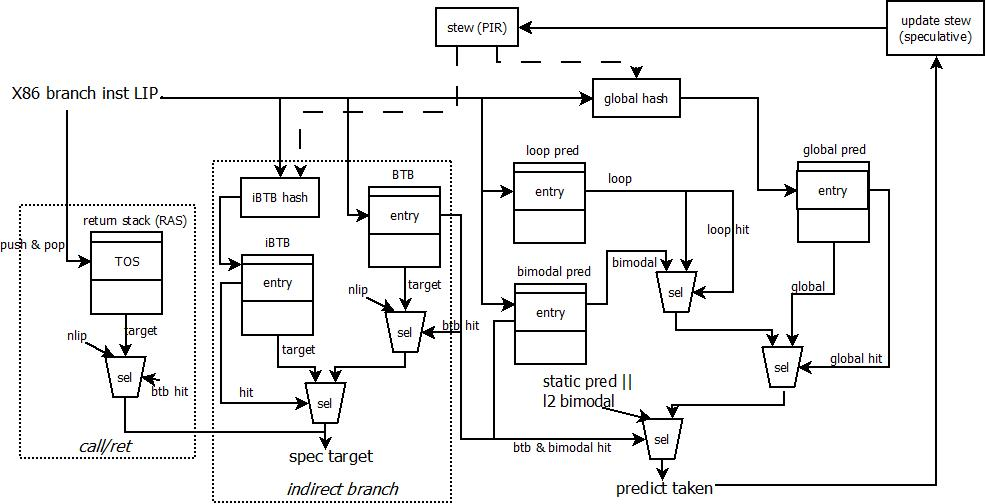
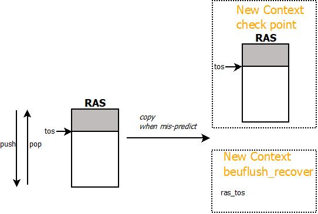
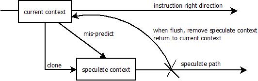

[TOC]

## Branch Predictor的结构

模拟器中的Branch Predictor结构采用了BG(bimodal+global history)或是BGG(bimodal + big global history)的结构，其branch predictor的具体结构和相互关系如下：

模拟器中各部分预测结构的基本信息（以cpu-demo.cfg为例）

| module                                      | parameters                                                   | entry structure                                              |
| ------------------------------------------- | ------------------------------------------------------------ | ------------------------------------------------------------ |
| RAS                                         | setting_ras_depth(16) entries                                | {lip_VA}                                                     |
| iBTB                                        | setting_fe_indirect_size(256) entries setting_fe_indirect_assoc(1) ways | {target_VA}                                                  |
| global iBTB exclusive with iBTB        | setting_fe_indirect_size(256) entries direct map        | tag target_VA tid                                  |
| BTB                                         | setting_fe_bpu_btb_size(2048) entries setting_fe_bpu_btb_assoc(4) ways tag setting_btb_tag_size(9) bits | tag target_VA uop_OPCODE counter last_stew last_bigstew mru_bit miss disagree_static_pred  表示不置信static pred的结果，只针对jcc |
| global predictor                            | setting_fe_bpu_global_size(2048) entries setting_fe_bpu_global_assoc(4) way | tag satuar counter counter_bl_0   not tk satuar counter counter_bl_1   tk satuar counter |
| bimodal predictor                           | setting_fe_bpu_bimodal_size(4096) entries setting_fe_bpu_bimodal_assoc(1) ways | tag(maybe) satuar counter                               |
| loop predictor                              | setting_fe_bpu_loop_size(128)entries setting_fe_bpu_loop_assoc(2) ways setting_loop_tag_size(6) | tag learn_mode predict_mode relearn_mode validate_mode spec prediction max_counter real_counter spec_counter |
| l2 bimodal predictor setting_l2_bpu(1) | setting_l2_bimodal_size(8192) entries setting_l2_bimodal_assoc(4) ways setting_l2_tag_size(8) | tag satuar counter                                      |
| big global predictor                        | setting_fe_bpu_bigglobal_size(2048) entries setting_fe_bpu_bigglobal_assoc(4) ways setting_bigg_tag_size(26) | tag satuar counter counter_bl_0   not tk satuar counter counter_bl_1   tk satuar counter |
| stew length                                 | setting_fe_stew_length(15)-bit                               |                                                              |
| bigstew length                              | setting_fe_bgg_history(37)-bit                               |                                                              |
| static predictor                            | absolutely branch       always-taken conditional branch       backward, taken       forward, not-taken |                                                              |

**<u>index的生成</u>**

对于不同的BPU预测表结构，需要采用不同的function产生表结构的index索引

- **RAS**

  index = tos

- **iBTB**

  lip = setting_use_last_byte(1)? (nlip-1): lip

  setting_shift_lip_offset_ind(1)

  ​	index = {lip[3:0], iBTB_hash}

  else

  ​	index = {iBTB_hash}

- **BTB**

  当BTB使用全地址时，全地址宽度为59-bit

  lip = setting_use_last_byte(1)? (nlip-1): lip

  setting_shift_lip_offset_btb(1)

  ​	index = {lip[3:0], lip[(tag+set)_bits+4:4]}

  else

  ​	index = lip[(tag+set)_bits:0]

- **global iBTB**

  旧的iBTB的实现，thread-aware，并且含有tag信息

  setting_CPU1_indirect_predictor(0)

  ​	index = iBTB_hash[stew_len+1:stew_len+1-set_bits]

  ​	tag = iBTB_hash[stew_len+1-set_bits:0]

  else

  ​	index = iBTB_hash[set_bits:0]

  ​	tag = iBTB_hash[stew_len+1:index_size]

- **global predictor**

  setting_shift_lip_offset_g(1)

  ​	index = {lip[3:0], global_hash}

  else

  ​	index = {global_hash}

- **bimodal predictor**

  lip = setting_use_last_byte(1)? (nlip-1): lip

  ! setting_bimodal_have_tag(0)

  ​	index = lip[set_bits:0]

  setting_bimodal_msb_tid(1)

  ​	index = {lip[:set_bits+1] (tag), tid, lip[set_bits-1:0]}

- **loop predictor**

  lip = setting_use_last_byte(1)? (nlip-1): lip

  setting_shift_lip_offset_loop(1)

  ​	index = {lip[3:0], lip[(tag+set)_bits+4:4]}

  else

  ​	index = lip[(tag+set)_bits:0]

  setting_loop_msb_tid(1)

  ​	index = {lip[(tag+set)\_bits:set\_bits+1] , tid, lip[set\_bits-1:0]}

- **L2 bimodal predictor**

  lip = setting_use_last_byte(1)? (nlip-1): lip

  setting_l2_have_tag(1)

  ​	index = lip[(tag+set)_bits:0]

  else

  ​	index = lip[set_bits:0]

- **big global predictor**

  lip = setting_use_last_byte(1)? (nlip-1): lip

  setting_shift_lip_offset_bigg(1)

  ​	index = {lip[3:0], global_hash[(tag+set)_bits:0]}

  else

  ​	index = {global_hash[(tag+set)_bits:0]}

**<u>hash函数的设计</u>**

针对indirect branch和conditional branch来说，为了提高预测准确度，在生成相关表结构的index索引前，需要对index值进行hash函数处理

**<u>1. indirect branch hash (iBTB_hash)</u>**

- **index**      <===   iBTB_hash

  add_ind_to_stew(1)

  ​	! add_target_to_ind_index(1)

  ​		index = stew[stew_len:0] ^ lip[stew_len:0]

  ​	else	// add target address to stew

  ​		index = stew[5:0]<<(stew_len-6) ^ stew[stew_len:6] ^ lip[stew_len+5:5]

  else

  ​	index = stew[stew_len:0]

- **bigindex**

  add_ind_to_stew(1)

  ​	! add_target_to_ind_index(1)

  ​		bigindex = bigstew[bigstew_len:0] ^ lip[bigstew_len:0]

  ​	else

  ​		bigindex = stew[5:0]<<(bigstew_len-6) ^ bigstew[bigstew_len:6] ^ lip[bigstew_len+5:5]

  else

  ​	bigindex = bigstew[bigstew_len:0]

**<u>2. conditional branch hash (global_hash)</u>**

只针对jcc有效，absolute branch永远使用entry 0

- index

  ! setting_shift_lip_offset_g(1)

  ​	index = stew[stew_len:0] ^ lip[stew_len:0]

  else

  ​	index = stew[stew_len:0] ^ lip[stew_len+4:4]

- bigindex

  ! setting_shift_lip_offset_g(1)

  ​	index = bigstew[bigstew_len:0] ^ lip[bigstew_len:0]

  else

  ​	index = bigstew[bigstew_len:0] ^ lip[bigstew_len+4:4]

### 饱和计数器的设计

模拟器中实现了3中不同的饱和计数器实现，分别为2-bit饱和计数器，3-bit饱和计数器，4-bit饱和计数器

模拟器中默认使用setting_fe_bpu_scheme(1), 3-bit饱和计数器

其状态转换如下表

| 当前状态                                                     | taken的下一个状态 | nottaken的下一个状态 | 预测结果 | 信心值 |
| ------------------------------------------------------------ | ----------------- | -------------------- | -------- | ------ |
| 2-bit饱和计数器 not-taken初始分配状态1 taken初始分配状态2 |                   |                      |          |        |
| 0                                                            | 1                 | 0                    | nt       | 1      |
| 1                                                            | 2                 | 0                    | nt       | 0      |
| 2                                                            | 3                 | 1                    | t        | 0      |
| 3                                                            | 3                 | 2                    | t        | 1      |
| 3-bit饱和计数器 not-taken初始分配状态3 taken初始分配状态4 |                   |                      |          |        |
| 0                                                            | 3                 | 0                    | nt       | 1      |
| 1                                                            | 3                 | 0                    | nt       | 0      |
| 2                                                            | 3                 | 1                    | nt       | 0      |
| 3                                                            | 4                 | 2                    | nt       | 0      |
| 4                                                            | 5                 | 3                    | t        | 0      |
| 5                                                            | 6                 | 4                    | t        | 0      |
| 6                                                            | 7                 | 4                    | t        | 0      |
| 7                                                            | 7                 | 4                    | t        | 1      |
| 4-bit饱和计数器 not-taken初始分配状态7 taken初始分配状态8 |                   |                      |          |        |
| 0                                                            | 7                 | 0                    | nt       | 1      |
| 1                                                            | 7                 | 0                    | nt       | 0      |
| 2                                                            | 7                 | 1                    | nt       | 0      |
| 3                                                            | 7                 | 2                    | nt       | 0      |
| 4                                                            | 7                 | 3                    | nt       | 0      |
| 5                                                            | 7                 | 4                    | nt       | 0      |
| 6                                                            | 7                 | 5                    | nt       | 0      |
| 7                                                            | 8                 | 6                    | nt       | 0      |
| 8                                                            | 9                 | 7                    | t        | 0      |
| 9                                                            | 10                | 8                    | t        | 0      |
| 10                                                           | 11                | 8                    | t        | 0      |
| 11                                                           | 12                | 8                    | t        | 0      |
| 12                                                           | 13                | 8                    | t        | 0      |
| 13                                                           | 14                | 8                    | t        | 0      |
| 14                                                           | 15                | 8                    | t        | 0      |
| 15                                                           | 15                | 8                    | t        | 1      |

### 全局历史跳转信息(stew/bigstew)的更新

在branch指令进行预测后，需要投机的更新当前的全局历史跳转信息(stew/bigstew)。在当前模拟器的实现中，有如下类型的branch可以更新stew/bigstew

- indirect branch

  add_ind_to_stew(1)，表示indirect branch的跳转信息会更新到stew/bigstew中。indirect branch更新到stew/bigstew的结果一定是taken

- jcc branch

  jcc更新到stew/bigstew的结果为golden跳转结果

**<u>stew的更新</u>**

~~stew = old_stew~~

- **<u>indirect branch更新</u>**

  add_ind_to_stew(1)

  ​	! setting_stew_taken_only(1)

  ​		stew = iBTB_hash << setting_fe_stew_shift(2) ^ taken

  ​	taken

  ​		! setting_new_update_stew(1)

  ​			stew = iBTB_hash << setting_fe_stew_shift(2) ^ taken

  ​		else

  ​			stew = (stew << setting_fe_stew_shift(2) ^ taken)  ^ lip[setting_fe_stew_length+4:10, 10'b0] ^ target[5:0]			<=== current configuration

- **<u>conditional branch更新</u>**

  ! setting_stew_taken_only(1)

  ​	stew = global_hash << setting_fe_stew_shift(2) ^ taken

  taken

  ​	! setting_new_update_stew

  ​		stew = global_hash << setting_fe_stew_shift(2) ^ taken

  ​	else

  ​		stew =  (stew << setting_fe_stew_shift(2) ^ taken)  ^ lip[setting_fe_stew_length+4:4] 

**<u>bigstew的更新</u>**

- **<u>indirect branch更新</u>**

  add_ind_to_stew(1)

  ​	! setting_stew_taken_only(1)

  ​		bigstew = iBTB_hash << setting_fe_bgg_shift(2) ^ taken

  ​	taken

  ​		! setting_new_update_stew(1)

  ​			bigstew = iBTB_hash << setting_fe_bgg_shift(2) ^ taken

  ​		else

  ​			bigstew = (bigstew << setting_fe_bgg_shift(2) ^ taken)  ^ lip[setting_fe_bgg_history+4:10, 10'b0] ^ target[5:0]			<=== current configuration

- **<u>conditional branch更新</u>**

  ! setting_stew_taken_only(1)

  ​	bigstew = big_global_hash << setting_fe_bgg_shift(2) ^ taken

  taken

  ​	! setting_new_update_stew

  ​		bigstew = big_global_hash << setting_fe_bgg_shift(2) ^ taken

  ​	else

  ​		bigstew =  (bigstew << setting_fe_bgg_shift(2) ^ taken)  ^ lip[setting_fe_bgg_history+4:4]  <=== current configuration

### 投机执行的处理

模拟器支持投机执行，在投机路径上执行的指令是预测错误的指令，最终当模拟器发现预测错误的时候，会将投机路径上的指令全部清除掉。但是在flush之前，BPU依然会对投机路径上的指令进行预测。flush之后，需要将BPU的预测表状态恢复到投机前的状态，从而使得投机路径上的预测不会影响正常路径上的指令预测。为此，对于BPU预测表的投机预测会对某些数据结构进行修改，这些修改会随着uop传递到模拟器的backend，最终在执行完毕后，决定是进行BPU的update，还是进行BPU的flush动作。

BPU在SMT的情况下，被多个phythread进行共享，但是预测表中的某些数据结构被投机更新了，这需要保存到每个phythread的执行context中，包括：

| Field                        | Description                                                  |
| ---------------------------- | ------------------------------------------------------------ |
| stew                         | 全局历史跳转信息， 15bit                                     |
| bigstew                      | 更长的历史跳转信息，37bit                                    |
| ras_stack[MAX_RAS_SIZE(513)] | call/ret的return stack预测器                                 |
| ras_tos                      | 当前ras中的栈指针                                            |
| call_depth                   | call的递归深度，当递归深度为0时，表示当前ras为空             |
| global_history               | 全局的golden的历史跳转信息，这个结构在模拟器中没有看到用法   |
| target                       | 跳转目标， VA                                                |
| last_br                      | 导致mis-predict的branch uop，会创建新的投机执行上下文 (Context)，没有看到具体的用法 |

### BPU的预测

在frontend进行指令fetch的时候，需要对LIP进行next_lip的预测，这个部分由BPU完成，在预测时，只有少量的预测表结构进行投机更新——被投机更新的结构都在Context中进行保存(见“投机执行的处理”)，其他的结构仅仅进行读取处理

**<u>注：模拟器中的预测是在fetch之后，并且已经知道指令类型后进行的，这是模拟器的一种优化模拟，与实际硬件实现有一定的出入</u>**

在预测时，不同的branch类型会使用不同的预测表结构，下面针对不同的预测表结构在进行预测时进行说明，预测时，表结构仅仅进行读取，而不进行任何更新(除了btb和bimodal，更新的内容与下次预测内容无关)

- **RAS**

  

  - 对于call，将当前target压入ras，tos+1
  - 对于return, tos-1，将当前target弹出ras

  当ras在投机路径上，如果遇到mis-predict的情况，那么分为几种类型处理

  - setting_ras_checkpointed_stack(1)，copy当前ras的所有内容到phythread的context中，恢复时直接copy恢复
  - setting_ras_recover_tos_beuflush(0)，仅仅copy当前的tos指针，而ras中的内容不恢复
  - 或者不恢复

  RAS是每个thread-aware

- **iBTB**

  目前实现的iBTB为direct-map的表，使用相应的index索引后，输出对应的target VA地址。iBTB不是thread-aware的。iBTB不能投机更新

- **global iBTB**

  如果使用旧式的iBTB，那么这个iBTB是thread-aware且含有tag信息的。如果都匹配，输出对应的target VA。global iBTB不能投机更新

- **BTB**

  对于direct branch(包括jcc和jmp、call等)，必须是btb hit，否则当前的branch算作mis-prediction(相当于fallthrough)。BTB是thread-aware，不能投机更新

- **bimodal predictor**

  所有的branch首先需要bimodal hit，如果bimodal不hit，那么直接使用L2 bimodal的预测或是静态预测器结果。bimodal输出的是饱和计数器结果。bimodal的预测器是thread-aware{setting_fix_mt_bimodal(1)}，不能投机更新

- **global predictor**

  global预测器在global预测表hit的前提下，有两种工作模式：

  - setting_mtf_blgg(1) && setting_mtf_blgg_global(1)，loop predictor和bimodal的prediector的预测结果是当前hit的global预测表项中的counter选择器，优先级为loop predictor > bimodal predictor

    - 如果预测taken，使用counter_bl_1
    - 如果预测not-taken，使用counter_bl_0

    这两个counter都是饱和计数器

  - else，使用预测表项中的counter计数器

  global predictor也是thread-aware{setting_use_global_tid(1)}，不能投机更新

- **loop predictor**

  loop predictor只能针对XLAT路径上的branch指令进行预测，thread-aware，并且可以投机更新

  当hit相关的loop predictor表项后，当前的loop entry必须处于预测模式(predictor mode)

  - 设置entry.spec = true，表明当前branch处于投机模式
  - entry.spec_counter投机更新，表明遇到了一次loop，如果上次spec_counter == max_counter，spec_counter清零
  - 比较entry.spec_counter和entry.max_counter
    - spec_counter < max_counter，根据保存的饱和计数器预测taken
    - spec_counter = max_counter，根据保存的饱和计数器预测not-taken 
  - 更新loop表项

- **L2 bimodal predictor**

  当bimodal预测conditional branch miss或是btb miss的时候，使用L2 bimodal的预测结果。L2 bimodal工作在两种模式下

  - setting_l2_predict_opposite(1)，bimodal的hit是对static predictor结果的修正——如果L2 bimodal hit，那么预测结果为static predictor取反
  - L2 bimodal预测结果为饱和计数器

  L2 bimodal predictor是thread-aware的，不能投机更新

- **big global predictor**

  big global predictor与global predictor的不同在于使用更长的全局跳转历史信息，用于预测历史信息更长的跳转指令，big global predictor基于global predictor进行预测。模拟器中的实现方式在实际的硬件中应该无法实现——使用了当前branch的golden跳转结果。

  - 先使用global predictor进行预测，给出预测结果blg_pred

  当big global predictor hit时，big global predictor工作在两种模式下

  - setting_mtf_blgg_global(1)
    - blg_pred == taken，pred = !oracle_taken，采用与golden结果相反的结果
    - blg_pred != taken， pred = oracle_taken，采用与golden结果一致的结果
    - 如果pred == taken，使用counter_bl_1饱和计数器
    - 如果pred == taken，使用counter_bl_0饱和计数器
  - else, 使用表项中保存的counter饱和计数器进行预测

  big global predictor miss，使用global predictor的预测结果

下面，针对不同的branch类型的预测进行详细说明

- call_indirect {X86指令}

  更新stew/bigstew

  **<u>ras的压栈处理</u>**

  - setting_call_to_ras_opt(1)，如果target != next_lip，进行ras压栈
  - 直接进行ras压栈
  
  **<u>跳转地址(target)的预测</u>**
  
  - 使用iBTB部分进行预测
  
  **<u>跳转方向(taken)的预测</u>**
  
  - 使用BG模式或是BGG模式进行预测
  
- jmp_indirect / jmpnear_indirect {X86指令}

  更新stew/bigstew

  **<u>跳转地址(target)的预测</u>**

  - 使用iBTB进行预测

  **<u>跳转方向(taken)的预测</u>**

  - 使用BG模式或是BGG模式进行预测

- ujcc / ujmp_onedesc {uop 指令}

  不更新stew/bigstew

  利用branch_hint进行预测，带有TAKEN标记的uop预测taken，否则预测为not-taken

- ujcc_indirect / ujmp_indirect {uop 指令}

  不更新stew/bigstew

  不预测，按照fallthrough处理

- call_direct {X86指令}

  不更新stew/bigstew

  **<u>ras的压栈处理</u>**

  - setting_call_to_ras_opt(1)，如果target != next_lip，进行ras压栈
  - 直接进行ras压栈

  **<u>跳转地址(target)的预测</u>**

  - 使用BTB进行预测

  **<u>跳转方向(taken)的预测</u>**

  - 使用BG模式或是BGG模式进行预测

- jmp_direct {X86指令}

  不更新stew/bigstew

  **<u>跳转地址(target)的预测</u>**

  - 使用BTB进行预测

  **<u>跳转方向(taken)的预测</u>**

  - 使用BG模式或是BGG模式进行预测

- return_indirect {X86指令}

  更新stew/bigstew

  **<u>ras的出栈处理</u>**

  - 从ras中弹出tos对应的target地址

  **<u>跳转地址(target)的预测</u>**

  - 使用RAS进行预测

  **<u>跳转方向(taken)的预测</u>**

  - 使用BG模式或是BGG模式进行预测

- jcc {X86指令}

  更新stew/bigstew

  **<u>跳转地址(target)的预测</u>**

  - 使用BTB进行预测

  **<u>跳转方向(taken)的预测</u>**

  - ！force_prediction(false) || access_bpu_on_force_prediction(0) 使用BG模式或是BGG模式进行预测
  - setting_better_predictor(0%)，小于setting_better_predictor，则认为不会出现mis-predict
  - setting_perfect_bpu(0)，当仿真时间小于setting_perfect_bpu，那么认为bpu不会出现mis-predict
  - force_prediction，仅仅使用static_predictor进行预测

**预测结果的保存**

预测完成后，相对应的预测结果会保存到每个uop的bpred_info的结构体上，这个结构体主要包括如下的预测信息

| 成员              | 含义                                                         |
| ----------------- | ------------------------------------------------------------ |
| index             | 跳转历史相关，包括 pre_stew/pre_bigstew                     本次之前的全局跳转历史信息 post_stew/post_bigstew                 添加本次跳转结果后的全局跳转历史信息 index/bigindex                                 hash结果 |
| wrong_target      | 对于indirect target而言，预测错误的跳转地址                  |
| predicted_taken   | 预测跳转的结果，只针对jcc而言，其他的都是无效值              |
| confident         | 对于本次预测结果的信心值                                     |
| bpu_mispredicted  | 本次预测是否是mis_predicted                                  |
| core_mispredicted | 表明当前core处于错误的指令路径上，与bpu_mispredicted同义；当模拟器的错误路径执行个数达到上限num_speculative_mispredicted_branches(80)，本次的mis-predict clear |
| \*\_hit/\*\_taken | 记录各类预测表结构的hit和预测结果信息                        |

### BPU的更新

在frontend的fetch阶段，BPU的预测表大部分只进行读取处理，当在backend执行完毕后，会进行预测表的更新。目前的模拟器实现中，包括两个更新时机：

- exec执行后的更新

  还处于乱序阶段，这时的更新会对预测表的后续预测结果产生影响

- retire后的更新 setting_update_bp_at_retire(1)

  已经是按照指令执行流的顺序进行更新

在模拟器中，bpu的更新时通过q_bp_update SIMQ结构从backend传递到frontend需要进行更新的预测信息。q_bp_update SIMQ的延时设置

​	setting_update_bp_at_retire(1)

​		setting_update_bp_latency(14)

​	else

​		qbeuflush_latency + setting_update_bp_latency(14)

下面，针对不同的表结构的更新策略进行介绍

- **RAS**

  不需要

- **iBTB**

  在mis-predict或是hit的情况下，将golden target更新进表项

- **global iBTB**

  在mis-predict或是hit的情况下，将golden target/tag/tid信息更新进表项

- **BTB**

  进行MRU_bit的更新，没有看懂，其他地方没有用到

  - btb miss时， 写分配(1)或是mispredicted

    将opcode/target/disagree_static的信息写入btb entry，如果有replace，则进行replace

  - btb hit时

    将opcode/target/disagree_static的信息写入对应的btb entry

- **bimodal predictor**

  - miss时，根据golden的taken结果分配初始的饱和计数器初值
  - hit时，根据golden的taken结果更新饱和计数器

- **L2 bimodal predictor**

  L2 bimodal的表项更新有如下策略

  - setting_alloc_l2_evicted(1)，只在btb evict时进行l2 alloc，且必须是disagree_static

    直接写入，这里的设计考虑的是L2 bimodal作为static_pred的一个选择器(如果L2 hit，那么static_pred取反预测)

  - setting_alloc_l2_opposite_static(1) || setting_alloc_l2_on_taken(0){这个taken指的是预测taken} || others

    - hit, 更新饱和计数器结果
    - miss，分配初始饱和计数器值

- **loop predictor**

  setting_mtf_blgg(1)

  loop predictor的更新前提必须是bimodal hit

  - miss时

    当bimodal的结果是STRONG的饱和计数器，且预测错误(mispredict && bimodal错误)，分配一个loop entry，设置为learn mode，将当前的loop entry的饱和计数器prediction按照bimodal的taken预测结果更新为初始值

  - hit时

    - 处于learn mode时

      - 更新最大的循环次数max_counter

        - 如果预测错误(mispredict && bimodal错误)

          - max_counter in (2, 64)，且bimodal是STRONG的饱和计数器

            转换到predict mode，更新loop entry

          - invalidate当前loop entry

        - 更新loop entry

    - 处于predict mode时

      - 更新非投机路径上的loop次数real counter

      - 在非投机路径上再次进行loop预测

      - 如果没有出现mispredict

        说明投机路径上预测正确，更新real counter的值，更新loop entry

      - 出现mispredict

        - 非投机路径上预测正确，更新real counter的值，更新loop entry
        - 非投机路径上预测错误，invalidate当前loop entry

  当本次是一次mis-predict的情况时，对于出现mis-predict的当前phythread的所有loop entry使用real counter改写spec counter，并设置为非spec模式

- **global predictor**

  - miss时，根据golen的taken结果分配counter/couter_bl_1/counter_bl_0的初始饱和计数器初值

  - hit && (! setting_bgg_partial_update(1) || ! setting_mtf_bgg(1) || ! hit_bigglobal)

    - setting_mtf_blgg(1) && setting_mtf_blgg_global(1)， loop和bimodal的预测结果用于选择global中的饱和计数器，优先级为loop > bimodal

      - loop或是bimodal hit，且预测正确时{这里的预测对于bimodal指的是更新前的预测，对于loop是更新后的预测}

        - 预测taken，使用counter_bl_1按照golden结果进行饱和计数器更新
        - 预测not-taken，使用counter_bl_0按照golden结果进行饱和计数器更新

      - 都预测错误

        同时使用counter_bl_1, counter_bl_0按照golden结果进行饱和计数器更新

    - else, 使用counter进行饱和计数器更新

- **big global predictor**

  big global predictor更新的前提是btb hit
  
  - hit时
  
    - setting_mtf_blgg_global(1)
  
      - bg预测器预测正确
  
        根据bg预测的结果进行更新
  
        - 预测taken，按照golden结果更新counter_bl_1饱和计数器
        - 预测not-taken，按照golden结果更新counter_bl_0饱和计数器
  
      - 预测错误
  
        根据golden结果更新counter_bl_1, counter_bl_0两个饱和计数器
  
    - else
  
      根据golden结果更新counter饱和计数器
  
  - miss时
  
    根据golden结果同时更新counter、counter_bl_1、counter_bl_0的饱和计数器

## 模拟器的投机执行机制

当指令预测后，发现是预测错误的指令时，需要进行投机执行，设置投机执行上下文，这个上下文在phythread的Context结构体中保存，投机上下文实际上设置了一条新的指令执行路径。这条路径依据错误的target设置架构寄存器，并在当前路径上执行代码，所有的寄存器更新和memory更新都在当前错误路径上下文执行，当模拟器发现预测错误，执行flush动作时，直接去掉当前的投机上下文路径即可

