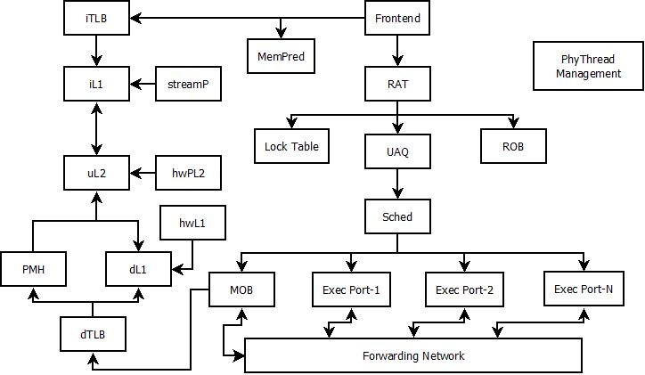

[TOC]

## 仿真的系统架构

### 系统 (System) 架构

- 最多支持2个物理封装(Procs)
- 最多支持4个物理核心(Cores)
- 每个Core最多支持2个逻辑核心(Threads)
- 系统最多支持16个处理器核心(phythreads)
- 对于FSB Bus之上的Core模型进行了详细建模
- 包含一个NB Chip模型，主要用于中断信号产生、memory image加载、仿真环境初始化和建立(包括页表伪造)

### 核心 (Core) 架构

- 基于Nehalem架构进行仿真
- ISA支持到SSE指令集

Core包括

- Frone-end

  完成bpu、fetch、decoder的前端功能。主要包括：

  - bpu的结构
  - fetch的处理
  - fusing的处理
    - macro-fusing
    - micro-fusing
    - unlimination (un-fusing)

- Register-Alias-Table

  - src/dest寄存器的重命名 (采用rob的方式)
  - 寄存器重命名中的优化
  - eflags的处理
  - fxch等处理
  - rob/rs/register file/lsq等单元的分配处理
  - 导致rat stall的各种条件的处理

- Scheduler

  - 指令依赖关系的处理
  - 各种replay条件的处理方法
  - 指令的分发和执行

- Execution-Unit

  - 指令的执行，实际的执行动作在function model中已经完成
  - forwarding网络的处理

- Memory-Order-Bbuffer

- Cache System

- Prefetch Part

- Page-Miss-Handler

- PhyThread Management

### 核心接口 (Uncore)  架构

Uncore包括

- Shared L3 Cache
- SnoopQ
- FillQ
- TBD

## 基本的仿真结构

### 硬件架构设计的特点

### 仿真器的仿真结构支持