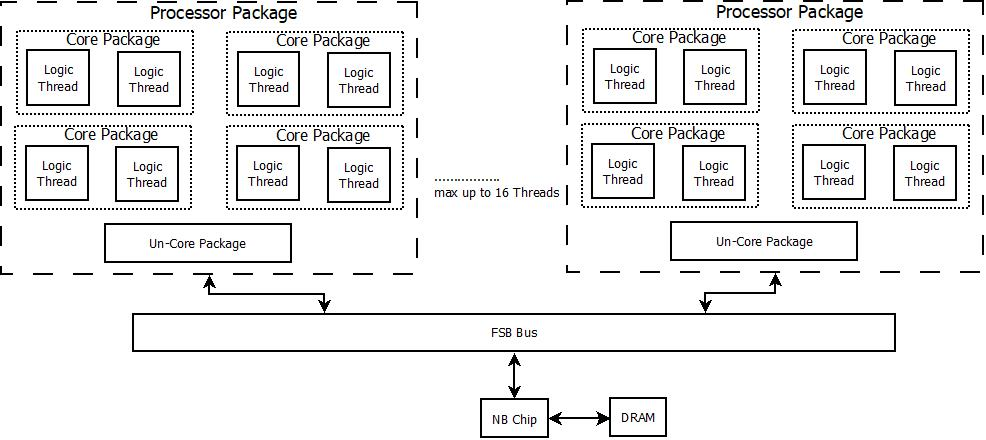
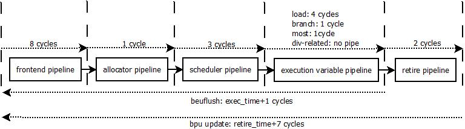
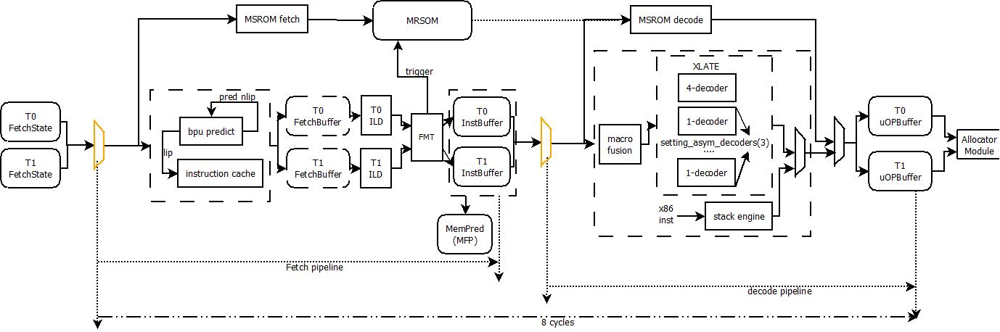

[TOC]

# 仿真系统架构

## System架构

- 系统最大支持2个Package
- 每个Package最大支持4个Core
- 每个Core支持最多2个Physical Thread
- 针对FSB总线之上的Core模型进行了详细建模
- 包含一个功能性的NB模型，用于中断信号的产生、memory image加载、仿真环境初始化和建立(包括页表的伪造)
- 没有针对DRAM进行建模

## Core架构

Core与Uncore在private L2 cache处进行切分，private L2 cache以上属于Core的架构逻辑，L2连接Uncore部分(模型中主要包括Unified L3 Cache)，Uncore负责连接片外的FSB总线，进而与北桥进行连接。

对于Core架构来说，主要分为如下4大部分：

- 前端(Frontend)

  前端主要按序(in-order)进行指令的抓取和翻译，并将x86的宏指令翻译为内部的微码表示(micro-OPeration)放入到uOP Buffer中，后续通过RAT(Register-Alias-Table)处理级将uOP发送给Backend，用于乱序(Out-Of-Order)处理。架构上，Frontend主要包括如下Stages：

  - Fetch

    处理器首先进行取值地址的预测(BPU)，根据预测的取值指针(LIP)，投机地访问iCache，进行指令的获取；在此过程中，需要访问i-TLB进行va->pa地址的转换，如果iCache出现miss，则需要进一步访问Private L2甚至Uncore以及Memory

  - Instruction-Length-Decoder(ILD)

    指令从iCache取回后，因为x86指令的变长(variable-length)属性，需要进行指令切分，识别出x86指令的指令边界，为Decoder解码做准备

  - Decoder

    针对放入到Instruction Buffer中的指令，进行x86指令解码，翻译为机器内部的uOP指令格式，并将翻译结果放入到uOP Buffer中

- 后端(Backend)

  从后端开始，处理器执行的指令已经没有x86指令，只有uOP的指令概念。后端从RAT(Register-Alias-Table)处理开始，一直到uOP指令执行完成，按序退休(In-Order Retire)之后为止。处理器的后端部分是处理器主流水线中乱序执行的核心部分，和处理器性能的主要贡献者。架构上，Backend主要包括如下Stages:

  - Allocator

    Allocator作为Frontend/Backend之间的桥梁，主要完成uOP指令从按序过程到乱序执行的过程；这个过程中，最为重要的步骤就是寄存器重命名(Register Renaming)和内存别名(Memory Aliasing)的处理。通过register renaming和memory aliasing的uOP发送到Scheduler，准备进行乱序执行，发送到ROB，等待执行完成后的顺序提交处理

  - Scheduler

    Scheduler是处理器内部乱序执行的发起者。Scheduler依据Allocator阶段标记的uOP之间的依赖关系(Dependency)，不再按序(In-Order)进行指令的调度执行，而是按照uOP依赖的数据流关系(Data-Flow)动态的进行uOP的调度执行；这种方式极大的增强了处理器后端的处理带宽。

  - Execution-Unit

    Execution-Unit是处理器中定义的各类指令功能的执行单元，是对处理器性能的直接贡献者——越多的执行单元——意味着处理器同周期可以执行的uOP越多。在目前的处理器设计中，Execution-Unit按照Port进行聚合——方便Scheduler更好的进行调度。在目前的模拟器中，模拟了Nehalem的后端执行单元，一共有6个可调度的执行端口(Execution-Port)，每个端口聚合的执行单元功能不同。

  - Retirement

    指令乱序执行完成后，需要按照原有的程序顺序进行提交(Commitment)，用于更新处理器的程序可见部分(软件可见寄存器、内存等)；同时，Retirement还进行处理器的异常和执行错误的处理，必要时，进行处理器流水线的刷新和机器状态的恢复 

- 内存系统(Memory-Ordering-Buffer)

  MOB实际属于Backend的一个执行端口(Execution-Port)，但是不同于处理器中的其他执行端口操作的是处理器内部的寄存器，MOB是处理器与外界唯一的数据交换接口。MOB是目前处理器中设计最为复杂的单元。好的MOB设计可以掩盖处理器访存的长延迟，提供良好的内存并行性(Memory-Level-Parallism)，且需要配合底层的Cache系统提供Cache一致性的管理(Cache-Coherence)和内存一致性(Memory-Consistency)的处理。目前的设计中，MOB部分包含了TLB/dCache/Prefetcher等主要模块

- Private L2系统(Private L2 Cache)

  Private L2作为Core与Uncore间的接口，主要用于提供程序执行时的时间局部性(Temporal-Locality)和空间局部性(Spatial-Locality)，并代理Core完成与Uncore部分的数据交换、一致性管理等功能。

## Core流水线综述

上图展示了模型中的Core流水线时序结构，因为模型模拟的机制原因，无法准确区分每一级流水线的功能，只能针对大的pipeline结构进行粗略的流水线划分：

- frontend pipeline

  占用6cycles，从处理器开始取值算起，直到x86指令译码后，存入uOP buffer中

- allocator pipeline

  占用1cycles，主要完成register-renaming/memory-aliasing的功能，并根据uOP的类型分配不同的backend资源，并将uOP发送到scheduler中

- scheduler pipeline

  占用3cycles，完成uOP的data-flow的乱序调度功能。当uOP从scheduler调度出去后，会根据执行端口进入不同的execution unit中进行执行

- execution variable pipeline

  执行latency不定，由uOP完成的操作类型决定。典型的：load-hit(4cycles)、most-uOP(1cycle)、branch uOP(1cycle)、div-uOP(depipe)

- retire pipeline

  占用2cycles，完成uOP的顺序退休、异常处理以及必要情况下的流水线刷新

在后面的spec中会一一介绍上述 pipeline完成的功能描述

## 特性列表

- 指令集支持到SSE指令集
- 宏指令融合(macro-fusion)/微指令融合(micro-fusion)
- 堆栈引擎(stack engine)
- 发射宽度为4，每周期可以发射4条uOP
- 寄存器部分重命名(partial-renaming)
- move elimination/zero-idiom elimination机制
- branch periodic checkpoint机制——用于减少beuflush的stall时延
- 128层ROB，48层load buffer，32层store buffer
- 36层统一的scheduler
- 内存依赖预测(memory-forwarding-predict)
- 内存消歧(memory-disambigous)
- 每周期支持2-loads或是1-load + 1-store，std有单独的port
- 执行消除机制(cancel-exec)或是P4架构的重执行机制(replay-loop)
- fast-lock机制，用于加快lock指令的执行
- 支持同步多线程(Simultaneous-MultiThreading)，物理核心最多支持2个逻辑核心
- 支持粗粒度多线程(Coarse-MultiThreading)，仅当物理核心只有一个活跃逻辑核心

# 前端(Frontend)架构

## Frontend流水线结构

从上图可以看出，frontend的流水线由两条代码路径组成：MSROM和传统x86指令译码路径(MTF)，两条路径在流水线上对齐；从功能上则可以分为fetch和decode两条流水线。由此：

- MSROM路径

  在fetch流水线上完成微码指令的读取；在decode流水线上按照dispatch_width宽度完成微指令译码，并发送到uOP Buffer中

- MTF路径

  在fetch流水线上完成指令数据的读取、切分，并根据指令功能确定是否要trigger MSROM路径的解码，并将切分好的x86指令存入inst Buffer；在decode流水线上从instBuffer中进行x86指令译码，并按照dispatch_width的宽度发送到uOP Buffer中

MTF路径上，每次从iCACHE读取16B的指令数据；无论是MTF路径还是MSROM路径，最终解码后，每周期最多向allocator模块发送4个uOP

### 流水线资源划分

对于SMT系统而言，一个物理核心需要支持多个逻辑核心，所以在处理器内部，有些资源为每个逻辑核独有，有些则为多个逻辑核心共享。下面，是frontend流水线阶段各个资源的分配情况

| 资源名字     | 说明                                                         | 资源总大小                                                   | SMT-2的分配策略                                              |
| ------------ | ------------------------------------------------------------ | ------------------------------------------------------------ | ------------------------------------------------------------ |
| FetchState   | 程序可见的处理器架构状态和MSROM的状态                        | N.A.                                                         | duplicated                                                   |
| iTLB         | 指令TLB                                                      | setting_itlb_entries(128), setting_itlb_assoc(4)             | static partition each 64                                |
| iCache       | 指令Cache                                                    | setting_il1_size(32K), setting_il1_assoc(4), setting_il1_linesize(64) | shared, no tid                                               |
| StreamBuffer | iCache miss后，request缓存buffer                             | setting_fe_sb(2)                                             | shared, no tid                                               |
| FetchBuffer  | 数据从iCache读回后的缓存buffer                               | setting_fe_fetch_buffers(0)                                  | duplicated                                                   |
| InstBuffer   | 识别出的x86指令缓存buffer                                    | setting_fe_iq_size(18)                                       | duplicated                                                   |
| uOPBuffer    | x86指令译码后的uOP缓存buffer                                 | setting_fe_uq_size(28)                                       | 1. static partition(setting)：each 14 2. dyanamic shared |
| decoder      | 用于进行x86指令的解码逻辑                                    | 配置为4-1-1-1模式 setting_fe_asym_decoders(3)           | shared, multiplex                                            |
| stack engine | 用于push/pop的esp的预测                                      | 目前的esp_offset_max(8bit)，可以trace +/-128                 | duplicated                                                   |
| MSROM status | 用于控制从MSROM译码uOP                                       | N.A.                                                         | duplicated MSROM shared                                 |
| mfp table    | 根据lip进行memory指令间的forwarding预测，预测结果在Allocator阶段使用 | mtf_mrn_sets(4096) mtf_mrn_ways(1)                      | shared, no tid                                               |

### 流水线仲裁

Fetch流水线和Decode流水线对于两个逻辑核心来说是共享的，所以每个cycle需要进行两个phythread的仲裁处理决定哪个phythread可以占用对应的流水线。在目前实现中，Fetch和Decode的phythread仲裁都采用PHYTHREAD_INTERLEAVE方式。

#### Fetch仲裁

对于phythread来说，能否进行Fetch流水线的仲裁，需要首先满足一些先决条件：

- phythread没有fetch的stall条件
  - iTLB/iCACHE miss
  - MSROM scoreboard stall (serialization机制)
  - LCP || many prefixes
  - BACFlush (decoder flush)
- phythread处于active状态
- phythread没有处于mwait状态
- fetch流水线没有被某个phythread独占

#### Decode仲裁

phythread参与Decode流水线的仲裁，需要满足的先决条件：

- phythread没有decode的stall条件
  - uOP queue已满
- phythread处于active状态

### 流水线停顿(Stall)

当Fetch/Decode流水线出现一些导致流水线停顿的原因时，导致相应的phythread不能进行后续的Fetch/Decode流水线竞争，需要等待一定的时间，这里对于可能出现的流水线停顿原因进行总结：

| Stall name                 | Reason                                                       | Stall cycle                                                  |
| -------------------------- | ------------------------------------------------------------ | ------------------------------------------------------------ |
| FE_STALL_REASON_BACFLUSH   | decode阶段进行的flush (BTB miss)                             | default: mtf_latency(8) setting: 14+1                   |
| FE_STALL_REASON_SCOREBOARD | MSROM进行fetch时，遇到的serialization指令 （SET_SCORE/READ_SCORE) | fe_ms_scoreboard_stall(3)                                    |
| FE_STALL_REASON_CACHE      | 访问iTLB/iCACHE出现miss                                      | wait until data done                                         |
| FE_STALL_REASON_LCP        | ILD进行指令切分时发现了0x66, 0x67 prefix                     | mtf_num_bubbles_prefixes_lcp(3) mtf_num_bubbles_prefixes_lcp*2 if setting_mtf_lcp_cross_double(0) |
| FE_STALL_REASON_PREFIXES   | ILD进行指令切分时发现了太多的prefix                          | mtf_num_bubbles_prefixes_toomany(0) * (num_prefixes-1)/2     |

# 后端(Backend)架构

## Backend流水线结构

Backend的起点从allocate流水线算起，直到最后的retire流水线完成为止。中间会经历如下的流水线：allocate->schedule->dispatch->execution->complete->retire。其中，allocate/retire流水线是按序(in-order)执行的，schedule/dispatch/execution/complete构成了乱序处理器的乱序执行部分。对于支持SMT的处理器来说，allocate/retire需要进行phythread的仲裁，而核心的乱序处理部分则于是否为SMT无关。

乱序执行部分的 核心是非依据程序流(program-flow)执行uOP，而是按照实际数据流(data-flow)顺序执行uOP。数据流的构造构成由allocate阶段的register-rename/memory-alias两部分完成。allocate阶段作为整个backend的起点，除了构造数据流依赖关系，同时负责分配每条uOP在后端执行时的必要资源，并依据uOP的执行语义，对于需要串行化执行的情况，进行串行化处理(In-Order的最后阶段，所有串行处理都需要在这里完成)。

uOP的schedule/dispatch负责完成uOP的依赖关系解除和乱序执行，其执行是投机的，当某个uOP的操作数(source)无法在指定时间获得有效数据时，模拟器中实现了两种处理方式：

- replay-loop

  使用错误的数据进行执行，但是执行后的uOP不能complete，需要重新进入执行流水线重执行

- cancel-exec

  当发现uOP无法产生正确执行结果时，取消(cancel) schedule/dispatch流水线中与uOP有依赖关系的uOP

execution阶段则根据不同的uOP类型送入不同的执行流水线完成具体的操作，在此过程中，分属于不同执行端口(exec-port)的uOP之间会通过exec-port之间的Forwarding-Network进行操作数的快速传递，而不需要再从ROB/RRF(Register-File)读取操作数。

当uOP执行完毕后，需要将结果回写到ROB中，并比较uOP处于完成状态

对于已经完成的uOP，执行retire流水线。retire负责检查uOP执行过程中的异常情况，如果不存在异常情况，则进行程序可见的处理器状态更新，并移除执行完的uOP；如果存在异常情况，则进行处理器前/后端(Frontend/Backend)流水线的刷新，并从正确的位置重新开始进行执行。

### 流水线资源划分

对于SMT系统而言，一个物理核心需要支持多个逻辑核心，所以在处理器内部，有些资源为每个逻辑核独有，有些则为多个逻辑核心共享。下面，是backend流水线阶段各个资源的分配情况

| 资源名字                                                | 说明                                                         | 资源总大小                              | SMT-2的分配策略  |
| ------------------------------------------------------- | ------------------------------------------------------------ | --------------------------------------- | ---------------- |
| ROB                                                     | 重排序缓冲器，用于in-order退休uOP                            | setting_max_rob_size(128)               | static partition |
| Load Buffer                                             | 对于load uOP，需要分配load buffer                            | setting_num_lb(48)                      | static partition |
| Store Buffer                                            | 对于store uOP，需要分配store buffer, store buffer包括sab/sdb，两者一一对应 | setting_num_sb(32)                      | static partition |
| Scheduler Buffer                                        | 用于动态乱序进行uOP的调度的buffer                            | num_sched(1) * 1 * setting_max_rob_size | D.C.(not care)   |
| Br_Checkpoint setting_br_checkpoint(0)             | 在使用branch checkpoint机制下，处理器用来备份处理状态的buffer | setting_br_checkpoint(0)                | static partition |
| Periodic_Checkpoint setting_periodic_checkpoint(1) | 在使用periodic checkpoint机制下，处理器用来备份处理状态的buffer | setting_periodic_checkpoint(4)          | static partition |

### 流水线仲裁

对于Backend的乱序执行部分(Schedule/Dispatch/Execution/Complete)与SMT无关，这部分的执行与uOP来自于哪个SMT无关；但是，Backend的两个按序(In-Order)执行的流水线部分(Allocate/Retire)部分，则与SMT有关，对于这两部分的流水线执行，需要多个phythread进行流水线的仲裁，仲裁成功的phythread可以执行对应的流水线逻辑。目前，模拟器的实现中，这两部分的流水线仲裁全部采用PYTHREAD_INTERLEAVE方式。

#### allocate流水线

phythread竞争allocate流水线前，需要满足如下先决条件：

- 有"待处理"的uOP，各条件为"|"关系
  - 当前phythread处于periodic_checkpoint的recovery周期内(逐条执行uOP恢复到确定的处理器状态)
  - 之前从IDQ读入的uOP缓存还没有allocate处理完
  - IDQ中有新的uOP等待进行处理
- 当前phythread在allocate流水阶段没有停顿(stall)

当满足上述条件时，phythread可以进行allocate流水线的冲裁；当没有任何一个phythread满足仲裁条件时，默认选择项不变。

在进行allocate流水线仲裁时，遵循如下算法进行处理(优先级从高到低，假设当前默认选择T0)：

1. 如果当前存在allocate流水线独占的情况——只针对插入partial register的merge uop情况，则选择独占phythread
2. 如果T1刚刚被wakeup——从allocate流水线停顿唤醒，则选择T1
3. 选择当前默认选择项T0
4. 更新下一次默认选择项为T1

#### retire流水线

phythread竞争retire流水线前，需要满足如下先决条件：

- phythread有完成，并可以retire的uOP存在

当满足上述条件时，phythread可以进行retire流水线的仲裁；当没有任意一个phythread满足仲裁条件时，则默认选择项不变。

在进行retire流水线仲裁时，遵循如下软法进行处理(假设当前默认选择T0)：

1. 从默认选择项进行轮询，直到找到符合条件的phythread

### 流水线功能

#### allocate流水线

执行时延1cycles

allocate流水线是Backend执行的第1级流水，按序执行，完成后续的乱序执行部分的准备工作，主要包括如下的步骤：

- 从IDQ中读入待allocate的uOP，形成allocation chunk
- 检查当前待allocate的uOP需要的各种后端资源是否满足。目前，需要在allocate阶段分配的后端资源包括：
  - ROB单元
  - Load Buffer，load uOP
  - Store Buffer(sab/sdb)，store uOP
  - branch checkpoint，用于beuflush的处理
  - Scheduler Buffer
  - Rob-Read port，处理器支持的RRF/ROB的最大读端口数
- 进行寄存器重命名(Register-Renaming)处理，构建uOP间的数据流依赖关系
- 进行Partial-register/Eflags的特殊处理
- 进行内存别名(Memory-Aliasing)处理，构建load/store uOP间的数据流依赖关系
- 实际为uOP分配各种后端资源，并标记依赖关系
- 针对需要串行化处理的指令，进行串行化处理
- 为uOP分配初始的执行端口(exec-port)，该端口在schedule调度时可能会更改
- 根据需要读取的操作数个数(rob-read)，进行操作数读取；同时将uOP发送到scheduler buffer中

#### schedule流水线

schedule+dispatch 流水线执行时延3cycles

schedule流水线用于判断已经进入scheduler buffer中的uOP的操作数是否已经ready，这里的ready包括两方面含义：

- 操作数来自于依赖的uOP，则当前操作数是否已被依赖的uOP投机“唤醒”
- 操作数来自于ROB/RRF——来自于寄存器文件，则当前操作数的值是否已经读取并存入scheduler

当一个uOP已经ready后，检查当前uOP是否可以进行调度：

- 计算当前uOP的完成时间(complete-time)，并根据该完成时间判断该uOP是否和之前已经schedule的uOP在complete流水线存在回写端口冲突(writeback port conflict)
- 对于不可pipe(depipe)的div类型指令，判断当前div执行单元是否空闲

当上述条件全部满足时，则当前uOP处于调度状态，并尝试发射(dispatch)到相应的执行端口(exec-port)进行执行；当上述条件不满足时，则会尝试进行uOP的执行端口重绑定(exec-port rebinding)

同一个周期内，schedule最多可以为每一个执行端口(exec-port)调度一条uOP进行执行

#### dispatch流水线

当schedule流水线判断一条uOP可以调度执行时，则将uOP发送到对应的执行端口(exec-port)，同时执行如下动作：

- 设置exec_port busy位，表明当前周期该exec_port已经调度uOP进行执行
- 在schedule中记录当前uOP会占用的执行端口(exec-port)的回写端口(writeback port)的占用周期点
- 对于div uOP，则标记div执行单元的占用
- 对于sta/std uOP，如果MOB中存在等待唤醒的load uOP，则唤醒MOB中对应的load uOP——这部分需要查看***memory.md***文档

对于处于dispatch流水线的uOP，如果没有遇到cancel-exec信号，则一定可以在执行单元上正确执行

#### execution流水线

execution流水线执行时延视uOP类型而定

当uOP发送到执行单元执行时，则按照uOP类型设置不同执行延迟在不同执行单元上进行执行。并在执行完成后，将相应执行结果回写到ROB中。

在执行过程中，执行的uOP会投机唤醒schedule中依赖的uOP——便于后续的uOP操作数可以直接从执行单元间(exec-stack)的bypass网络获得(forwarding-network)。这里的投机唤醒时间为uOP最快获得执行结果的时延。比如，对于load操作，最快执行时延为DL1 cache hit时延，如果出现了miss，则在最快时延下无法得到正确结果。

如果当前执行uOP无法在指定时间提供正确的执行结果(比如load uOP，预设4cycles会得到执行结果，但是cache miss后则不行)，那么该uOP会采用两种不同的恢复处理机制：

- cancel-exec机制

  uOP在执行流水线上判断出无法得出正确结果时，会往schedule/dispatch流水线发送cancel信号，该信号带有当前uOP的tag信息，schedule/dispatch流水线根据该信号，可以将流水线上以及schedule buffer中被投机唤醒的uOP cancel掉，使其重新回到wait状态，直到引起cancel的uOP下一次得到执行。

- replay-loop机制

  uOP在执行流水线中不进行任何处理，在complete流水线中使用计分板(scoreboard)进行错误结果标记，并进入重执行循环(replay-loop)等待重新执行；后续与其有依赖关系的uOP执行完毕后，在complete流水线进行通过计分板进行结果检查，如果计分板有标记错误，则同样进入重执行循环执行，并更新计分板标记自身结果也是错误的。

对于branch uOP，当uOP正确执行完成后，需要检查BPU的预测结果与实际跳转结果是否一致——这里只针对jcc/indirect branch指令。如果结果不一致，则需要进行beuflush刷新后端和前端流水线。

#### retire流水线

retire流水线执行时延2cycles

retire流水线负责处理已经完成的uOP的按序退休(in-order retirement)。所谓的退休指的是将uOP执行结果在程序可见的硬件架构层次反映出来——比如更新通用寄存器，修改控制寄存器，响应中断、异常等。

在这个阶段，处理器除了正常的retire执行完的uOP，还需要对uOP的执行结果进行检查，发现执行错误的情况。如果存在执行错误，则retire必须负责刷新处理器的整个流水线，并控制frontend从正确的位置开始执行代码，这在处理器中被称为"machine-clear"。在machine-clear下，处理器内所有正在"路上"(in-flight)的uOP都会被刷出处理器。

对于x86处理器来说，所有的异常和中断响应只能在x86的指令边界上进行响应。但是当x86指令经过decode流水线后已经被转译为uOP，所以在处理器retire uOP的时候，需要一种机制标识出哪些uOP对应到一条x86指令，在当前的模拟器中通过BOM(begin-of-macro)/EOM(end-of-macro)标识进行控制。当retire流水线退休一条EOM的uOP后，如果当前存在未被处理(pending)的异常(exception)或是中断(interrupt)，则处理器进行异常/中断响应，并刷新流水线，跳转到MSROM的特定位置开始执行中断路径代码。

对于完成的branch uOP来说，mis-predict的情况已经在execution流水线的complete阶段完成了beuflush的处理；这retire阶段，需要按照正确的跳转结果进行BPU表结构的更新。在目前的模拟器实现中，设置了7cycles用于完成BPU表的更新(==这个时延明显太长了，应该是配置错误==)。

对于store指令来说，如果store对应的两个uOP(sta、std)全部都正确完成，并且retire了，则store指令对应的store buffer entry进入"senior"状态——表明当前的store entry可以排队进行DL1 cache的写入操作。对于x86处理器来说，store是按序(in-order)写入memory系统。

### 流水线停顿(Stall)

对于Backend的各级流水线来说，只有allocate流水线会因为后端资源的限制，会导致相应的phythread出现流水线停顿的问题，从而在某些原因下使得对应的phythread暂时无法竞争allocate流水线资源，处于睡眠状态(sleep)

#### Allocation停顿

allocation流水线停顿主要由后端的各种物理资源限制导致，下表是各类allocation流水线停顿的原因

| 停顿原因(stall reason) | 说明                                                         | 停顿解除(de-stall)                          | phythread影响                        |
| ---------------------- | ------------------------------------------------------------ | ------------------------------------------- | ------------------------------------ |
| REASON_SCOREBOARD      | 对于MSROM包含SETSCORE/READSCORE的指令，当READSCORE uOP执行时，必须等待SETSCORE uOP retire才可以继续处理 | SETSCORE uOP retire                         | phythread进入sleep，不参与后续的仲裁 |
| REASON_FCW             | in-flight写入FCW0的uOP个数>=num_fcw_writes_allowed(7)        | num_fcw_writers < num_fcw_writes_allowed(7) | 无                                   |
| REASON_ROB             | !fused的uOP请求的ROB数量(1) > 空闲的ROB数量                  | ROB有空闲entry                              | 无                                   |
| REASON_PARTIAL_REG     | 对于类似的情况插入同步的uOP   mov al, 0x55   mov ebx, eax <-- merge uop | 等待有限的stall时间，目前为3cycles          | 设置phythread为独占allocate流水线    |
| REASON_PARTIAL_FLAGS   | 同上，这次处理的是eflags                                     | 等待有限的stall时间，目前为2cycles          | 无                                   |
| REASON_SB              | store uOP需要分配store buffer，分配原则为block分配，即当前一组allocate的uOP中要不全部分配成功，要不都不成功 | 分配成功为止                                | 无                                   |
| REASON_LB              | load uOP分配load buffer，分配原则与store buffer相同          | 分配成功为止                                | 无                                   |
| REASON_RS              | 查看支持uOP的执行端口所属的scheduler是否有空余空间           | 分配成功为止                                | 无                                   |
| REASON_ROB_READ        | 处理器只提供有限的ROB读端口，目前为3     1. 如果同一组allocate的uOP需要读取的source超过3个     2. 如果没有超过3个，但是同一个读口出现冲突 | 下一个cycle                                 | 无                                   |

# 内存子系统(Memory)

## Memory系统架构

## 缓存层次结构(Cache Hierarchy)

### Cache Coherence

## TLB和PMH

## MOB流水线

### MOB重执行(MOB re-schedule)

## UL2 Cache流水线
