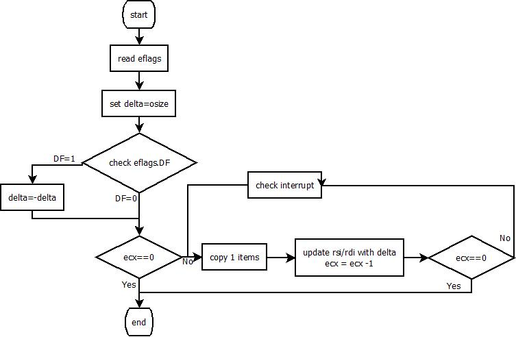
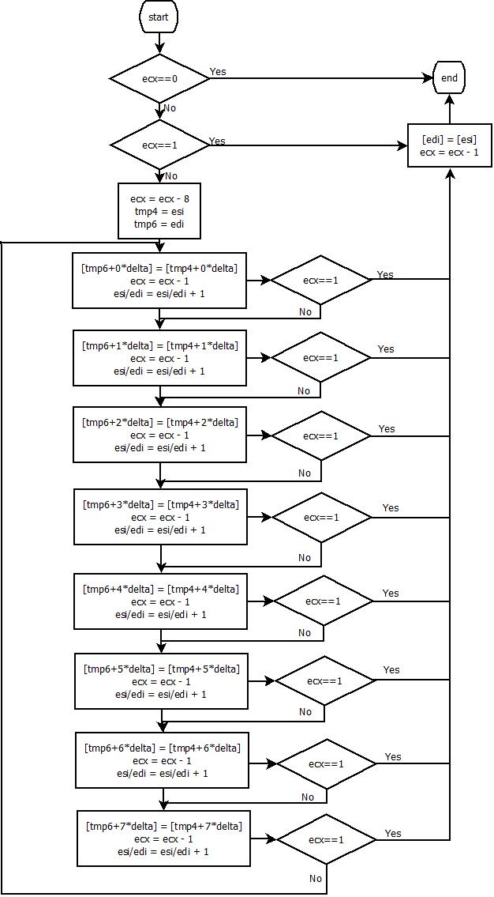

## Repeat string类指令的实现

如下为当前模拟器中关于repeat string类指令的实现，这里以"rep movsb"为例，实现分为64bit longmode和其他模式下的实现

#### longmode, 64bit

```assembly
rep movs: entry(0x64b), size(17)
; {x87_Index} is (e)cx
; {x86_Dst} is (e)di
; {x86_Src} is (e)si
; need trigger MSROM
0x64b:	TMP0 = xmove.{32} UcodeFlags {BOM }		; 将eflags移入到tmp0
0x64c:	TMP1 = lea.{32} SS: Zero(Zero+imm_0x1*{x86_OSize}.{32} ; 设置每次的delta=osize*1; tmp1=delta
0x64d:	TMP0 = xand.{32} TMP0, imm_0x400 			; 检查DF bit
0x64e:	Zero = uj{E}.{32} TMP0, imm_0x650 {TAKEN } ; DF=0，跳转到0x650执行，大概率为递增方向，指示BPU为跳转
0x64f:	TMP1 = xneg.{64} TMP1 									; DF=1，表示增长方向递减，设置delta=-delta, tmp1=delta
0x650:	TMP0 = xsub{x86_ASize} {x86_Index}, imm_0x0 ;检查ecx是否为0
0x651:	Zero = uj{E}.{32} TMP0, imm_0x65b ;为0, 则直接结束
0x652:	Zero = ujmp_direct.{32} imm_0x654 ;跳转到0x654进行执行
0x653:	Zero = xmove.{32} Zero {INTR }	;进行一次有效拷贝后，检查是否有中断Pending；如果有中断pending，则进行中断处理
0x654:	TMP0 = load{x86_OSize} {x86_Seg}: Zero({x86_Src}+Zero*0){x86_ASize}  ;从源地址读取{asize}大小的数据到tmp0, tmp0 = [esi]
0x655:	Zero = ista{x86_OSize} ES: Zero({x86_Dst}+Zero*0){x86_ASize} ;计算目的地址的地址
0x656:	Zero = std{x86_OSize} TMP0 {FUSE_OPT_8 }	;将tmp0数据写入到目的地址对应的地址上，std/ista为micro-fusion
0x657:	{x86_Src} = xadd{x86_ASize} {x86_Src}, TMP1 ;esi = esi + delta
0x658:	{x86_Dst} = xadd{x86_ASize} {x86_Dst}, TMP1 ;edi = edi + delta
0x659:	{x86_Index} = xsub{x86_ASize} {x86_Index}, imm_0x1 ;ecx = ecx - 1
0x65a:	Zero = uj{NE}.{32} {x86_Index}, imm_0x653 {TAKEN } ;如果ecx!=0，跳转到0x653继续执行；大概率不结束，指示BPU为跳转
0x65b:	Zero = xmove.{32} Zero {EOM } ;执行结束
```



#### other mode

通过分析下面的uOP序列，感觉实现不完整，应该是有删减，里面的很多跳转不是很有必要，后面的流程图针对主体部分描述

```assembly
repz movs: entry(0x65c), size(83)
; {x87_Index} is (e)cx
; {x86_Dst} is (e)di
; {x86_Src} is (e)si
; need trigger MSROM
0x65c:	TMP9 = or.{32} {x86_Index}, {x86_Index} {BOM } ; tmp9 = ecx
0x65d:	TMP3 = xsub.{32} TMP9, imm_0x1 	;tmp3 = tmp9-1
0x65e:	TMP0 = xshrzx.{32} imm_0x1, TMP3 ; tmp0 = shr_zeroext(tmp3, 0x1)
0x65f:	TMP4 = flag_concat.{32} TMP3, TMP0 ;tmp4.data = tmp3, tmp4.eflags = tmp0.eflags
0x660:	TMP1 = xsub.{32} TMP9, imm_0x40 ; tmp1 = tmp9(ecx) - 0x40
0x661:	TMP1 = xselect{B}.{32} TMP1, Zero 	;如果tmp9 < 0x40, tmp1 = tmp1, 否则，tmp1 = 0 
0x662:	TMP0 = xand{x86_ASize} {x86_Dst}, imm_0x7 ; tmp0 = edi & 0x7
0x663:	TMP0 = or.{32} TMP1, TMP0 		; tmp0 = tmp1 | tmp0
;----------------上面的部分感觉做了无用的处理-----------------
0x664:	TMP9 = or.{32} {x86_Index}, {x86_Index} ; tmp9 = ecx
0x665:	Zero = uj{E}.{32} TMP9, imm_0x6af {MS_NO_PRED } ; 如果tmp9 == 0，则跳转0x6af执行
;----------------上面部分为针对ecx=0的特殊处理-----------------
0x666:	TMP8 = xsub.{32} TMP9, imm_0x8 ; tmp8 = tmp9 - 0x8
0x667:	TMP1 = lea.{32} SS: Zero(Zero+imm_0x1*{x86_OSize}).{32}  ; delta = osize
0x668:	TMP0 = xand.{32} UcodeFlags, imm_0x400 {READSCORE }	; 检查eflags的DF标志是否为1
0x669:	TMP0 = flag_concat.{32} TMP1, TMP0 ; tmp0.value = tmp1, tmp0.eflags = tmp0.eflags
0x66a:	TMP1 = xneg.{32} TMP1 ; delta = 0 - delta
0x66b:	TMP1 = xselect{E}.{32} TMP0, TMP1 ; 根据DF标志选择delta值，tmp0 = delta, tmp1 = -delta， 如果DF=0，选择tmp0, 否则选择tmp1。tmp1为最终的delta值
0x66c:	TMP2 = xadd.{32} TMP1, TMP1 	; tmp2 = 2*tmp1
0x66d:	TMP3 = xadd.{32} TMP2, TMP1 	; tmp3 = 3*tmp1
0x66e:	TMP5 = xadd.{32} TMP3, TMP2 	; tmp5 = 5*tmp1
0x66f:	TMP7 = xadd.{32} TMP5, TMP2 	; tmp7 = 7*tmp1
;--------上面部分计算delta，分别获得delta, 2*delta, 3*delta, 5*delta, 7*delta-----------
0x670:	TMP0 = xselect{B}.{32} TMP8, Zero ; 如果tmp9(ecx) < 0x8, tmp0 = tmp8，否则, tmp0 = 0
0x671:	TMP8 = xadd.{32} imm_0x8, TMP0 ; tmp8 = 0x8 + tmp0 = tmp9(ecx)或者tmp8 = 0x8 
0x672:	Zero = uj{E}.{32} TMP9, imm_0x71c {MS_NO_PRED } ; 如果tmp9 == 0, 则跳转0x71c执行
0x673:	TMP0 = xsub.{32} TMP9, imm_0x1 ; tmp0 = tmp9 - 0x1
0x674:	Zero = uj{E}.{32} TMP0, imm_0x6a9 {MS_NO_PRED } ; 如果tmp0为0，则跳转0x6a9执行
;----------------上面部分针对ecx=0或是1的特殊处理--------------------
0x675:	TMP9 = xsub.{32} TMP9, TMP8 {ENDMSCHUNK } ; tmp9 = tmp9 - tmp8
;----------------上面部分计算从ecx中减去8次循环，下面的循环以8次mov为一组----------------
0x676:	TMP4 = xmove.{32} {x86_Src} ; tmp4 = esi
0x677:	TMP6 = xmove.{32} {x86_Dst} ; tmp6 = edi
0x678:	TMP0 = load{x86_OSize} {x86_Seg}: Zero(TMP4+Zero){x86_ASize}; tmp0 = [tmp4] 
0x679:	Zero = ista{x86_OSize} ES: Zero(TMP6+Zero){x86_ASize} ; [tmp6] = tmp0
0x67a:	Zero = std{x86_OSize} TMP0 
0x67b:	{x86_Src} = xadd{x86_ASize} {x86_Src}, TMP1 ; esi = esi + delta
0x67c:	{x86_Dst} = xadd{x86_ASize} {x86_Dst}, TMP1 ; edi = edi + delta
0x67d:	{x86_Index} = ujmp_onedec.{32} {x86_Index}, imm_0x6a9 {MS_NO_PRED INTR }; 如果ecx > 1, 则ecx = ecx-1，如果之后的ecx <= 1，则跳转到0x6a9执行 
0x67e:	TMP0 = load{x86_OSize} {x86_Seg}: Zero(TMP4+TMP1){x86_ASize}  ; tmp0 = [tmp4+tmp1]
0x67f:	Zero = ista{x86_OSize} ES: Zero(TMP6+TMP1){x86_ASize} ; [tmp6+tmp1] = tmp0 
0x680:	Zero = std{x86_OSize} TMP0 
0x681:	{x86_Src} = xadd{x86_ASize} {x86_Src}, TMP1 	; esi = esi+delta
0x682:	{x86_Dst} = xadd{x86_ASize} {x86_Dst}, TMP1 	; edi = edi+delta
0x683:	{x86_Index} = ujmp_onedec.{32} {x86_Index}, imm_0x6a9 {MS_NO_PRED INTR } ;如果ecx>1， 则ecx-1，如果ecx<=1,则跳转0x6a9执行
0x684:	TMP0 = load{x86_OSize} {x86_Seg}: Zero(TMP4+TMP2){x86_ASize} ; tmp0 = [tmp4+tmp2]
0x685:	Zero = ista{x86_OSize} ES: Zero(TMP6+TMP2){x86_ASize} ; [tmp6+tmp2] = tmp0 
0x686:	Zero = std{x86_OSize} TMP0 
0x687:	{x86_Src} = xadd{x86_ASize} {x86_Src}, TMP1 ; esi = esi + delta
0x688:	{x86_Dst} = xadd{x86_ASize} {x86_Dst}, TMP1 ; edi = edi + delta
0x689:	{x86_Index} = ujmp_onedec.{32} {x86_Index}, imm_0x6a9 {MS_NO_PRED INTR };如果ecx>1， 则ecx-1，如果ecx<=1，则跳转到0x6a9执行
0x68a:	TMP0 = load{x86_OSize} {x86_Seg}: Zero(TMP4+TMP3){x86_ASize}; tmp0 = [tmp4+tmp3] 
0x68b:	Zero = ista{x86_OSize} ES: Zero(TMP6+TMP3){x86_ASize} ; [tmp6+tmp3] = tmp0
0x68c:	Zero = std{x86_OSize} TMP0 
0x68d:	{x86_Src} = xadd{x86_ASize} {x86_Src}, TMP1  ; esi = esi + delta
0x68e:	{x86_Dst} = xadd{x86_ASize} {x86_Dst}, TMP1  ; edi = edi + delta
0x68f:	{x86_Index} = ujmp_onedec.{32} {x86_Index}, imm_0x6a9 {MS_NO_PRED INTR } ;如果ecx>1, 则ecx-1，如果ecx<=1，则跳转到0x6a9
0x690:	TMP0 = load{x86_OSize} {x86_Seg}: Zero(TMP4+TMP2*2){x86_ASize} ;tmp0 = [tmp4+2*tmp2]
0x691:	Zero = ista{x86_OSize} ES: Zero(TMP6+TMP2*2){x86_ASize} ; [tmp6+2*tmp2] = tmp0 
0x692:	Zero = std{x86_OSize} TMP0 
0x693:	{x86_Src} = xadd{x86_ASize} {x86_Src}, TMP1 ; esi = esi + delta
0x694:	{x86_Dst} = xadd{x86_ASize} {x86_Dst}, TMP1 ; edi = edi + delta
0x695:	{x86_Index} = ujmp_onedec.{32} {x86_Index}, imm_0x6a9 {MS_NO_PRED INTR };如果ecx>1, 则ecx-1，如果ecx<=1，则跳转到0x6a9
0x696:	TMP0 = load{x86_OSize} {x86_Seg}: Zero(TMP4+TMP5){x86_ASize} ;tmp0 = [tmp4+tmp5]
0x697:	Zero = ista{x86_OSize} ES: Zero(TMP6+TMP5){x86_ASize} ; [tmp6+tmp5] = tmp0 
0x698:	Zero = std{x86_OSize} TMP0 
0x699:	{x86_Src} = xadd{x86_ASize} {x86_Src}, TMP1 ; esi = esi + delta
0x69a:	{x86_Dst} = xadd{x86_ASize} {x86_Dst}, TMP1 ; edi = edi + delta
0x69b:	{x86_Index} = ujmp_onedec.{32} {x86_Index}, imm_0x6a9 {MS_NO_PRED INTR };如果ecx>1, 则ecx-1，如果ecx<=1，则跳转到0x6a9
0x69c:	TMP0 = load{x86_OSize} {x86_Seg}: Zero(TMP4+TMP3*2){x86_ASize} ;tmp0 = [tmp4+2*tmp3]
0x69d:	Zero = ista{x86_OSize} ES: Zero(TMP6+TMP3*2){x86_ASize} ; [tmp6+2*tmp3] = tmp0 
0x69e:	Zero = std{x86_OSize} TMP0 
0x69f:	{x86_Src} = xadd{x86_ASize} {x86_Src}, TMP1 ; esi = esi + delta
0x6a0:	{x86_Dst} = xadd{x86_ASize} {x86_Dst}, TMP1 ; edi = edi + delta
0x6a1:	{x86_Index} = ujmp_onedec.{32} {x86_Index}, imm_0x6a9 {MS_NO_PRED INTR };如果ecx>1, 则ecx-1，如果ecx<=1，则跳转到0x6a9
0x6a2:	TMP0 = load{x86_OSize} {x86_Seg}: Zero(TMP4+TMP7){x86_ASize} ;tmp0 = [tmp4+tmp7]
0x6a3:	Zero = ista{x86_OSize} ES: Zero(TMP6+TMP7){x86_ASize} ; [tmp6+tmp7] = tmp0
0x6a4:	Zero = std{x86_OSize} TMP0 
0x6a5:	{x86_Src} = xadd{x86_ASize} {x86_Src}, TMP1 ; esi = esi + delta
0x6a6:	{x86_Dst} = xadd{x86_ASize} {x86_Dst}, TMP1 ; edi = edi + delta
0x6a7:	{x86_Index} = ujmp_onedec.{32} {x86_Index}, imm_0x6a9 {MS_NO_PRED INTR };如果ecx>1, 则ecx-1，如果ecx<=1，则跳转到0x6a9
;-----------------------上面部分将mov展开8次，每次都会判断是否要跳出循环，跳出循环的标准为还剩下1次mov---------
0x6a8:	Zero = ujmp_direct.{32} imm_0x676 ;直接跳转0x676
;-----------------------上面重复上述的8次展开-------------
0x6a9:	TMP0 = load{x86_OSize} {x86_Seg}: Zero({x86_Src}+Zero){x86_ASize} ;tmp0 = [esi]
0x6aa:	Zero = ista{x86_OSize} ES: Zero(TMP6+Zero){x86_ASize} ;[tmp6] = tmp0
0x6ab:	Zero = std{x86_OSize} TMP0 
0x6ac:	{x86_Src} = xadd{x86_ASize} {x86_Src}, TMP1 ; esi = esi + delta
0x6ad:	{x86_Dst} = xadd{x86_ASize} {x86_Dst}, TMP1 ; edi = edi + delta
0x6ae:	{x86_Index} = xsub{x86_OSize} {x86_Index}, imm_0x1 {EOM } ; ecx = ecx-1
;-----------------------完成最后一次mov，结束-------------------
0x6af:  TMP0 = xneg.{32} TMP9 		; tmp0 = 0-tmp9
0x6b0:  TMP0 = xand.{32} TMP0, imm_0x7 ; tmp0 = tmp0 & 0x7
0x6b1:  TMP0 = xmul.{32} TMP0, TMP1 ; tmp0 = tmp0 * tmp1
0x6b2:  {x86_Src} = xsub{x86_ASize} {x86_Src}, TMP0 	; esi = esi - tmp0
0x6b3:  {x86_Dst} = xsub{x86_ASize} {x86_Dst}, TMP0 	; edi = edi - tmp0
0x6b4:  {x86_Index} = xmove{x86_OSize} Zero {EOM }	; ecx = 0
;-----------------------针对ecx=0的特殊处理----------------
....
0x71c:  {x86_Index} = xmove{x86_OSize} Zero {EOM }	; ecx = 0
;-----------------------上面针对ecx的特殊处理---------------
```

