[TOC]

# 后端(Backend)架构

## Backend流水线结构

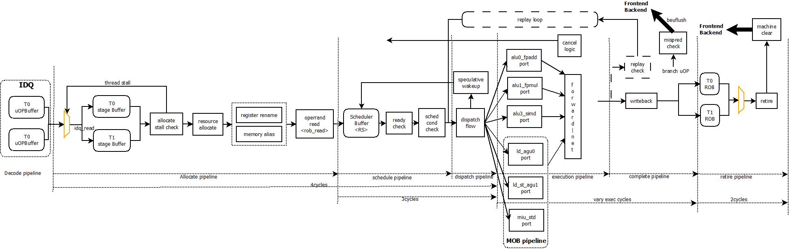

Backend的起点从allocate流水线算起，直到最后的retire流水线完成为止。中间会经历如下的流水线：allocate->schedule->dispatch->execution->complete->retire。其中，allocate/retire流水线是按序(in-order)执行的，schedule/dispatch/execution/complete构成了乱序处理器的乱序执行部分。对于支持SMT的处理器来说，allocate/retire需要进行phythread的仲裁，而核心的乱序处理部分则于是否为SMT无关。

乱序执行部分的 核心是非依据程序流(program-flow)执行uOP，而是按照实际数据流(data-flow)顺序执行uOP。数据流的构造构成由allocate阶段的register-rename/memory-alias两部分完成。allocate阶段作为整个backend的起点，除了构造数据流依赖关系，同时负责分配每条uOP在后端执行时的必要资源，并依据uOP的执行语义，对于需要串行化执行的情况，进行串行化处理(In-Order的最后阶段，所有串行处理都需要在这里完成)。

uOP的schedule/dispatch负责完成uOP的依赖关系解除和乱序执行，其执行是投机的，当某个uOP的操作数(source)无法在指定时间获得有效数据时，模拟器中实现了两种处理方式：

- replay-loop

  使用错误的数据进行执行，但是执行后的uOP不能complete，需要重新进入执行流水线重执行

- cancel-exec

  当发现uOP无法产生正确执行结果时，取消(cancel) schedule/dispatch流水线中与uOP有依赖关系的uOP

execution阶段则根据不同的uOP类型送入不同的执行流水线完成具体的操作，在此过程中，分属于不同执行端口(exec-port)的uOP之间会通过exec-port之间的Forwarding-Network进行操作数的快速传递，而不需要再从ROB/RRF(Register-File)读取操作数。

当uOP执行完毕后，需要将结果回写到ROB中，并比较uOP处于完成状态

对于已经完成的uOP，执行retire流水线。retire负责检查uOP执行过程中的异常情况，如果不存在异常情况，则进行程序可见的处理器状态更新，并移除执行完的uOP；如果存在异常情况，则进行处理器前/后端(Frontend/Backend)流水线的刷新，并从正确的位置重新开始进行执行。

### 流水线资源划分

对于SMT系统而言，一个物理核心需要支持多个逻辑核心，所以在处理器内部，有些资源为每个逻辑核独有，有些则为多个逻辑核心共享。下面，是backend流水线阶段各个资源的分配情况

| 资源名字                                                | 说明                                                         | 资源总大小                     | SMT-2的分配策略  |
| ------------------------------------------------------- | ------------------------------------------------------------ | ------------------------------ | ---------------- |
| ROB                                                     | 重排序缓冲器，用于in-order退休uOP                            | setting_max_rob_size(128)      | static partition |
| Load Buffer                                             | 对于load uOP，需要分配load buffer                            | setting_num_lb(48)             | static partition |
| Store Buffer                                            | 对于store uOP，需要分配store buffer, store buffer包括sab/sdb，两者一一对应 | setting_num_sb(32)             | static partition |
| Scheduler Buffer                                        | 用于动态乱序进行uOP的调度的buffer                            | 36                             | share            |
| Br_Checkpoint<br />setting_br_checkpoint(0)             | 在使用branch checkpoint机制下，处理器用来备份处理状态的buffer | setting_br_checkpoint(0)       | static partition |
| Periodic_Checkpoint<br />setting_periodic_checkpoint(1) | 在使用periodic checkpoint机制下，处理器用来备份处理状态的buffer | setting_periodic_checkpoint(4) | static partition |

### 流水线仲裁

对于Backend的乱序执行部分(Schedule/Dispatch/Execution/Complete)与SMT无关，这部分的执行与uOP来自于哪个SMT无关；但是，Backend的两个按序(In-Order)执行的流水线部分(Allocate/Retire)部分，则与SMT有关，对于这两部分的流水线执行，需要多个phythread进行流水线的仲裁，仲裁成功的phythread可以执行对应的流水线逻辑。目前，模拟器的实现中，这两部分的流水线仲裁全部采用PYTHREAD_INTERLEAVE方式。

#### allocate流水线

phythread竞争allocate流水线前，需要满足如下先决条件：

- 有"待处理"的uOP，各条件为"|"关系
  - 当前phythread处于periodic_checkpoint的recovery周期内(逐条执行uOP恢复到确定的处理器状态)
  - 之前从IDQ读入的uOP缓存还没有allocate处理完
  - IDQ中有新的uOP等待进行处理
- 当前phythread在allocate流水阶段没有停顿(stall)

当满足上述条件时，phythread可以进行allocate流水线的冲裁；当没有任何一个phythread满足仲裁条件时，默认选择项不变。

在进行allocate流水线仲裁时，遵循如下算法进行处理(优先级从高到低，假设当前默认选择T0)：

1. 如果当前存在allocate流水线独占的情况——只针对插入partial register的merge uop情况，则选择独占phythread
2. 如果T1刚刚被wakeup——从allocate流水线停顿唤醒，则选择T1
3. 选择当前默认选择项T0
4. 更新下一次默认选择项为T1

#### retire流水线

phythread竞争retire流水线前，需要满足如下先决条件：

- phythread有完成，并可以retire的uOP存在

当满足上述条件时，phythread可以进行retire流水线的仲裁；当没有任意一个phythread满足仲裁条件时，则默认选择项不变。

在进行retire流水线仲裁时，遵循如下软法进行处理(假设当前默认选择T0)：

1. 从默认选择项进行轮询，直到找到符合条件的phythread

### 流水线功能

#### allocate流水线

执行时延1cycles

allocate流水线是Backend执行的第1级流水，按序执行，完成后续的乱序执行部分的准备工作，主要包括如下的步骤：

- 从IDQ中读入待allocate的uOP，形成allocation chunk

- 检查当前待allocate的uOP需要的各种后端资源是否满足。目前，需要在allocate阶段分配的后端资源包括：
  - ROB单元
  - Load Buffer，load uOP
  - Store Buffer(sab/sdb)，store uOP
  - branch checkpoint，用于beuflush的处理
  - Scheduler Buffer
  - Rob-Read port，处理器支持的RRF/ROB的最大读端口数
- 进行寄存器重命名(Register-Renaming)处理，构建uOP间的数据流依赖关系
- 进行Partial-register/Eflags的特殊处理
- 进行内存别名(Memory-Aliasing)处理，构建load/store uOP间的数据流依赖关系
- 实际为uOP分配各种后端资源，并标记依赖关系
- 针对需要串行化处理的指令，进行串行化处理
- 为uOP分配初始的执行端口(exec-port)，该端口在schedule调度时可能会更改
- 根据需要读取的操作数个数(rob-read)，进行操作数读取；同时将uOP发送到scheduler buffer中

#### schedule流水线

schedule+dispatch 流水线执行时延3cycles

schedule流水线用于判断已经进入scheduler buffer中的uOP的操作数是否已经ready，这里的ready包括两方面含义：

- 操作数来自于依赖的uOP，则当前操作数是否已被依赖的uOP投机“唤醒”
- 操作数来自于ROB/RRF——来自于寄存器文件，则当前操作数的值是否已经读取并存入scheduler

当一个uOP已经ready后，检查当前uOP是否可以进行调度：

- 计算当前uOP的完成时间(complete-time)，并根据该完成时间判断该uOP是否和之前已经schedule的uOP在complete流水线存在回写端口冲突(writeback port conflict)
- 对于不可pipe(depipe)的div类型指令，判断当前div执行单元是否空闲

当上述条件全部满足时，则当前uOP处于调度状态，并尝试发射(dispatch)到相应的执行端口(exec-port)进行执行；当上述条件不满足时，则会尝试进行uOP的执行端口重绑定(exec-port rebinding)

同一个周期内，schedule最多可以为每一个执行端口(exec-port)调度一条uOP进行执行

#### dispatch流水线

当schedule流水线判断一条uOP可以调度执行时，则将uOP发送到对应的执行端口(exec-port)，同时执行如下动作：

- 准备操作数，判断操作数来自于network forwarding还是从scheduler中获得
- 设置exec_port busy位，表明当前周期该exec_port已经调度uOP进行执行
- 在schedule中记录当前uOP会占用的执行端口(exec-port)的回写端口(writeback port)的占用周期点
- 对于div uOP，则标记div执行单元的占用
- 对于sta/std uOP，如果MOB中存在等待唤醒的load uOP，则唤醒MOB中对应的load uOP——这部分需要查看***memory.md***文档

对于处于dispatch流水线的uOP，如果没有遇到cancel-exec信号，则一定可以在执行单元上正确执行

#### execution流水线

execution流水线执行时延视uOP类型而定

当uOP发送到执行单元执行时，则按照uOP类型设置不同执行延迟在不同执行单元上进行执行。并在执行完成后，将相应执行结果回写到ROB中。

在执行过程中，执行的uOP会投机唤醒schedule中依赖的uOP——便于后续的uOP操作数可以直接从执行单元间(exec-stack)的bypass网络获得(forwarding-network)。这里的投机唤醒时间为uOP最快获得执行结果的时延。比如，对于load操作，最快执行时延为DL1 cache hit时延，如果出现了miss，则在最快时延下无法得到正确结果。

如果当前执行uOP无法在指定时间提供正确的执行结果(比如load uOP，预设4cycles会得到执行结果，但是cache miss后则不行)，那么该uOP会采用两种不同的恢复处理机制：

- cancel-exec机制

  uOP在执行流水线上判断出无法得出正确结果时，会往schedule/dispatch流水线发送cancel信号，该信号带有当前uOP的tag信息，schedule/dispatch流水线根据该信号，可以将流水线上以及schedule buffer中被投机唤醒的uOP cancel掉，使其重新回到wait状态，直到引起cancel的uOP下一次得到执行。

- replay-loop机制

  uOP在执行流水线中不进行任何处理，在complete流水线中使用计分板(scoreboard)进行错误结果标记，并进入重执行循环(replay-loop)等待重新执行；后续与其有依赖关系的uOP执行完毕后，在complete流水线进行通过计分板进行结果检查，如果计分板有标记错误，则同样进入重执行循环执行，并更新计分板标记自身结果也是错误的。

对于branch uOP，当uOP正确执行完成后，需要检查BPU的预测结果与实际跳转结果是否一致——这里只针对jcc/indirect branch指令。如果结果不一致，则需要进行beuflush刷新后端和前端流水线。

#### retire流水线

retire流水线执行时延2cycles

retire流水线负责处理已经完成的uOP的按序退休(in-order retirement)。所谓的退休指的是将uOP执行结果在程序可见的硬件架构层次反映出来——比如更新通用寄存器，修改控制寄存器，响应中断、异常等。

在这个阶段，处理器除了正常的retire执行完的uOP，还需要对uOP的执行结果进行检查，发现执行错误的情况。如果存在执行错误，则retire必须负责刷新处理器的整个流水线，并控制frontend从正确的位置开始执行代码，这在处理器中被称为"machine-clear"。在machine-clear下，处理器内所有正在"路上"(in-flight)的uOP都会被刷出处理器。

对于x86处理器来说，所有的异常和中断响应只能在x86的指令边界上进行响应。但是当x86指令经过decode流水线后已经被转译为uOP，所以在处理器retire uOP的时候，需要一种机制标识出哪些uOP对应到一条x86指令，在当前的模拟器中通过BOM(begin-of-macro)/EOM(end-of-macro)标识进行控制。当retire流水线退休一条EOM的uOP后，如果当前存在未被处理(pending)的异常(exception)或是中断(interrupt)，则处理器进行异常/中断响应，并刷新流水线，跳转到MSROM的特定位置开始执行中断路径代码。

对于完成的branch uOP来说，mis-predict的情况已经在execution流水线的complete阶段完成了beuflush的处理；这retire阶段，需要按照正确的跳转结果进行BPU表结构的更新。在目前的模拟器实现中，设置了7cycles用于完成BPU表的更新(==这个时延明显太长了，应该是配置错误==)。

对于store指令来说，如果store对应的两个uOP(sta、std)全部都正确完成，并且retire了，则store指令对应的store buffer entry进入"senior"状态——表明当前的store entry可以排队进行DL1 cache的写入操作。对于x86处理器来说，store是按序(in-order)写入memory系统的，具体的store流水线的处理请参考"***memory.md***"文档。

### 流水线停顿(Stall)

对于Backend的各级流水线来说，只有allocate流水线会因为后端资源的限制，会导致相应的phythread出现流水线停顿的问题，从而在某些原因下使得对应的phythread暂时无法竞争allocate流水线资源，处于睡眠状态(sleep)

#### Allocation停顿

allocation流水线停顿主要由后端的各种物理资源限制导致，下表是各类allocation流水线停顿的原因

| 停顿原因(stall reason)                                       | 说明                                                         | 停顿解除(de-stall)                          | phythread影响                        |
| ------------------------------------------------------------ | ------------------------------------------------------------ | ------------------------------------------- | ------------------------------------ |
| REASON_SCOREBOARD                                            | 对于MSROM包含SETSCORE/READSCORE的指令，当READSCORE uOP执行时，必须等待SETSCORE uOP retire才可以继续处理 | SETSCORE uOP retire                         | phythread进入sleep，不参与后续的仲裁 |
| REASON_FCW                                                   | in-flight写入FCW0的uOP个数>=num_fcw_writes_allowed(7)        | num_fcw_writers < num_fcw_writes_allowed(7) | 无                                   |
| REASON_ROB                                                   | !fused的uOP请求的ROB数量(1) > 空闲的ROB数量                  | ROB有空闲entry                              | 无                                   |
| REASON_PARTIAL_REG<br />具体参考***partial register处理***   | 对于类似的情况插入同步的uOP<br />  mov al, 0x55<br />  mov ebx, eax <-- merge uop | 等待有限的stall时间，目前为3cycles          | 设置phythread为独占allocate流水线    |
| REASON_PARTIAL_FLAGS                                         | 同上，这次处理的是eflags                                     | 等待有限的stall时间，目前为2cycles          | 无                                   |
| REASON_SB                                                    | store uOP需要分配store buffer，分配原则为block分配，即当前一组allocate的uOP中要不全部分配成功，要不都不成功 | 分配成功为止                                | 无                                   |
| REASON_LB                                                    | load uOP分配load buffer，分配原则与store buffer相同          | 分配成功为止                                | 无                                   |
| REASON_RS                                                    | 查看支持uOP的执行端口所属的scheduler是否有空余空间           | 分配成功为止                                | 无                                   |
| REASON_ROB_READ                                              | 处理器只提供有限的ROB读端口，目前为3<br />    1. 如果同一组allocate的uOP需要读取的source超过3个<br />    2. 如果没有超过3个，但是同一个读口出现冲突 | 下一个cycle                                 | 无                                   |
| REASON_PERIODIC_RESET<br />参考mispredict branch恢复<br />模拟器中不是stall reason | 处理器正在进行RAT的fix                                       | fix_distance / setting_width                | 无                                   |

## 功能介绍

### Allocation Chunk

在目前处理器的实现中，前端完成x86指令解码后，会将uOP放入到IDQ(uOP Buffer)中，后端通过读取IDQ中的uOP完成后续的乱序处理和按序退休的执行流程。按照目前的设计，处理器每周期最多可以处理4条uOP，这个被称为处理器的**dispatch-width**，该数值决定了处理器的IPC(instruction-per-cycle)上限。

对于处理器来说，在同一周期进行allocation的uOP被称为allocation chunk，并不是IDQ中任意连续的<=4个uOP都可以形成一个allocation chunk。对于allocation chunk，处理器有自己的形成逻辑：

- allocation uOP的个数必须小于dispatch-width(setting_width(4))
- fxchg uOP必须是当前allocation chunk的最后一个uOP(fxch_alloc_restriction(1))
- allocation chunk中的branch uOP个数 <= setting_restrict_branch_alloc_per_clock(0)

### 寄存器重命名(Register Renaming)

处理器中采用的重命名机制采用ROB-based的重命名，即将uOP对应的名义目的寄存器(dst)重命名到uOP分配的ROB entry上。如下是一个ROB-based的重命名示例

```c
     ROB             orig uOP                rename uOP
     1               xmov rax, 0x1           xmov rax, 0x1
     2               xmov rbx, 0x2           xmov rbx, 0x2
     3               xadd rbx, rax           xadd robid#2, robid#1
     4               mov rcx, rbx            xmov rcx, robid#3
```

处理器内部在allocate阶段维护一个重命名表(register alias table)——rat[name_reg] = rob_idx，使用名义寄存器(程序可见的寄存器(RAX/RBX/.../R15, XMM0/.../XMM15等))进行索引，保存的是以名义寄存器为目的寄存器的uOP所分配的ROB idx。对于控制寄存器、段寄存器等则不进行重命名，只有INT/FP类型的寄存器进行重命名处理

以下是对于uOP的重命名流程

```c
void rename(uop_t uop)
{
    // build uOP dependency according to RAT table
    for (int i = 0; i < uop.src_num(); i++) {
        int src = uop.get_src(i);
        if (in_rob_range(RAT[src]))         // source already renaming?
            uop.set_depend(rat[src]);       // build dependency
        else
            uop.set_reg_source(src);        // corresponding source is rob/rrf
    }
    uop.set_robidx(allocate_rob(uop));      // uOP allocate ROB
    RAT[uop.get_dst()] = uop.get_robidx();  // rename nominal dst to robidx
}
```

#### uOP依赖关系构建

当处理器在allocate阶段通过RAT表查找到uOP的寄存器依赖关系后，需要在uOP本身的结构进行依赖关系的标记。处理器目前利用nsrcs[i]进行依赖关系的管理，当经过重命名后，nsrcs[i]记录的就是uOP间的依赖关系或是寄存器操作数(rrf/rob source)，与实际的名义寄存器无关了。

|                                     | nsrcs[]                                                      |
| ----------------------------------- | ------------------------------------------------------------ |
| 0..NSRCS<br />(最多3个寄存器操作数) | 1. 通过RAT表重命名后的寄存器间依赖关系<br />2. 没有重命名的寄存器标记为从ROB/RRF读取 |
| DEP_STA_IDX<br />(NSRCS)            | 针对memory aliasing情况，load/store之间paddr存在overlap情况<br />load需要记录sta uOP对应的rob_idx<br />实际HW中，该域不存在 |
| DEP_PARTREG_IDX                     | 当enable_seriesold_partial_reg_update(0)时，所有对于partial reg的访问转换为full reg的访问，所以对于同一个reg的partial/full访问建立依赖关系，该域针对特殊情况进行处理<br />     mov rax, 0xa5a5         (1)<br />     mov al, 0x5a                (2)   <-- 操作了rax的一部分，rax会重命名到当前uOP，但是高位有效部分在(1)中，(2)依赖于(1)用于同步正确的寄存器结果<br />目前配置下，该域不存在 |
| DEP_PARTFLAG_IDX                    | 与DEP_PARTREG_IDX情况类似；当setting_enable_partial_flag_renaming(0)时，且当前uOP不是更新当前eflags的所有bit(ALLFLAGS(0x8d5))，则需要建立依赖关系<br />目前配置下，该域不存在 |
| DEP_STD_IDX                         | 针对memory aliasing情况，load完全依赖于某个store指令，load可以从store进行store-forwarding，load需要记录std uOP的rob_idx<br />实际HW中，该域不存在 |
| DEP_RET_IDX                         | 针对memory aliasing情况，load部分依赖(overlap)于某个store指令，load必须等待store完成，才可以执行，load需要记录std uOP的rob_idx<br />实际HW中，该域不存在 |

#### Partial Register处理

对于x86处理器来说，有些通用寄存器可以进行部分访问(parital read/write)，比如常用的RAX/RBX/RCX/RDX等寄存器。比如：

```assembly
mov rax, 0x5a5aa5a5 ; (1)
mov ah, 0x5         ; (2)
mov al, 0xf         ; (3)
mov bh, ah          ; (4)
```

这对于寄存器重命名来说，带来一个明显的问题，比如上面的例子，对于指令4来说，仅仅依赖指令2，但是因为AL/AH/RAX都是寄存器RAX的别名(alias name)，仅仅是访问宽度不同，从而可能造成4条指令无法进行有效重命名。这里，可以考虑为不同宽度的别名寄存器单独进行重命名。

又比如，对于x86处理器来说，EFLAGS寄存器的条件码域(PF/OF/ZF/CF/SF/AF)用于x86的Jcc跳转指令，但是并不是所有的条件码组合在实际程序中出现的概率都是相同的；大多数情况下，CF/OF两个标志单独更新和读取的情况更多，所以将这两个标志抽取出来每个单独形成一个寄存器，其他的标志形成另外的寄存器，可以有效的加速不相关指令的执行速度，比如：

```assembly
bt rax, 40      ; (1) only change CF
bsf rax, rbx    ; (2) only change ZF
jc XXX          ; (3) only reference CF
```

这样，指令3仅仅依赖指令1即可。但是，这也带来一个问题，对于某条指令如果需要多个EFLAGS标志时，需要依赖于两条指令，导致额外的延迟。例如：

```assembly
cmp eax, ebx    ; (1) change CF/ZF/...
inc ecx         ; (2) only change ZF
jbe xxx         ; (3) reference CF/ZF
```

##### 通用寄存器处理(Partial Register)

对于目前的x86处理器来说，其只支持到SSE(1-4)的指令集，所以可以支持partial访问的寄存器主要是通用整型寄存器组(INT_REG)

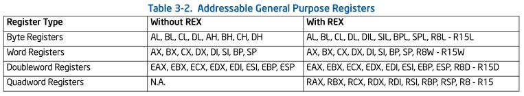

同时，对于32bit寄存器访问和64bit寄存器访问，遵循如下规则：访问32bit寄存器，64bit寄存器高32bit自动清零

对于此类的partial访问，处理器支持如下两种处理方式

- setting_seriesold_partial_register_updates(1) policy

  目前，处理器使用该策略进行partial register的处理，即针对不同宽度的寄存器别名单独进行重命名，在有需要进行寄存器合并时，进行合并，并引入额外延迟。

  每个支持partial访问的寄存器RAT表项的结构如下：

  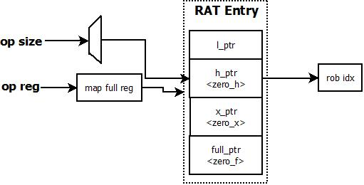

  **更新规则**：

  ```c
  switch (op_size) {
  case l_ptr:
      if (zero_mask && zero_h)
          zero_x = 1
          h_ptr = -1
      if (zero_f)
          set full_ptr
          x_ptr = h_ptr = l_ptr = -1
      elif (zero_x)
          set x_ptr
          h_ptr = l_ptr = -1
      else
          set l_ptr
          if (x_ptr != -1)		// 是否必要，读取的时候可以保证
              h_ptr = x_ptr
              x_ptr = -1
          if (!zero_mask)
              zero_f = zero_x = 0
  case h_ptr:
      set h_ptr
      if (x_ptr != -1)			// 是否必要，读取的时候可以保证
          l_ptr = x_ptr
          x_ptr = -1
      if (zero_mask)
          zero_h = 1
      else
          zero_* = 0
  case x_ptr:
      clear l_ptr/h_ptr
      if (zero_f)
          set full_ptr
      else
          set x_ptr
      if (zero_mask)
          zero_x = 1
      else
          zero_* = 0
  case full_ptr:
      clear l_ptr/h_ptr/x_ptr
      set full_ptr
      if (zero_mask)
          zero_f = 1
      else
          zero_* = 0
  }
  ```

  **读取规则**：

  对于进行source重命名的情况，处理器需要根据当前source的op size获得对应的重命名后的rob idx。算法采用如下方式：

  ```c
  for (width = read_width; width < max_width; width++) {
      if (rat[width] != -1)
          return rat[width];
  }
  ```

  **合并停顿(merge stall)**：

  对于采用这种方式进行重命名的情况，有两种情况需要进行合并处理，并引入allocation停顿：

  1. 如果出现parital write后，进行更大width读取的情况，那么读取的指令需要从至少2个位置才能获得正确的寄存器数据，比如：

     ```assembly
     mov al, 0x1
     mov ah, 0x5
     mov ebx, eax		; 指令需要从上面两条指令获得最新的al/ah的值
     ```

  2. 对于非RAX/RBX/RCX/RDX的通用寄存器，如果source没有产生合并处理，如果当前已经产生了partial write，对于这次的第二个partial write，需要先进行merge操作——对于寄存器不是RAX/RBX/RCX/RDX的q情况，只存在一种partial write的情况。==NOTE：这里的处理不是很合理，前面的机制已经可以保证==

  针对partial write/full read的情况，处理器采用动态插入merge uOP的方式，进行多个位置值的融合：

  - 修改了h_ptr，需要加入2条merge uOP(merge low_byte/merge high_byte)
  - 其他的情况，加入1条merge uOP

  merge uOP格式：mergeOP#width dst_full, merge_full, merge_src2

  插入的merge uOP会结束当前的allocate过程，并设置allocate流水线为当前phythread为独占；当前的phythread从下一个cycle会重新执行allocation流水线，尤其引入的流水线bubble为3cycles(setting_partial_block_thread_latency(2)+1)

  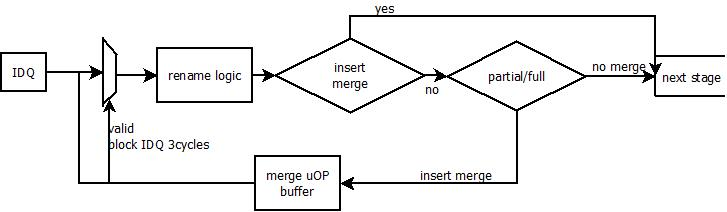

- simple policy

  使用此种方式进行重命名的处理器，所有的partial访问都会转换为对full register的映射；这样，所有的partial访问之间都有依赖关系。

  一种需要特殊考虑的情况为，当前的register write是partial write，此时需要将register的现有映射作为当前uOP的依赖，并标记在uOP的***DEP_PARTREG_IDX***域上。比如：

  ```assembly
  mov eax, ebx
  mov al, 0x5		; 当前指令必须依赖上一条指令，并在执行时进行寄存器值merge
  ```

  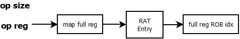

##### 标志寄存器处理(Eflags Register)

对于Eflags Register的重命名处理与通用寄存器的partial处理算法一致，这里针对一些Eflags Register的特殊情况进行说明

**Eflags分组**

处理器中，有些标志位会被指令进行频繁设置，而有些标志只会被部分指令进行设置，为了更好的为不同指令设置标志位时不产生false dependency，Eflags的标志位进行如下分组：CF, OF, SF/PF/AF/ZF；每一组可以单独进行重命名处理

**Eflags停顿(merge stall)情况**

当Eflags的重命名采用setting_enable_partial_flag_renaming(1)的机制时(类似于setting_seriesold_partial_register_updates)，如果出现了partial write/full read的情况，则需要进行停顿。在目前的处理器中实现了如下的停顿策略：

- setting_serialize_flag_stalls(0)，等待ROB空，从arch register读取
- uOP命中的某个partial flag寄存器需要读取的bit多于当前partial flag有效修改的bit，需要等待partial flag writer退休后才能读取
- 上述情况没有出现，但是不同的标志位分组由不同的uOP设置
  - !setting_enable_partial_flag_merge_uops(0)，等待N-1个partial writer退休后读取
  - setting_enable_partial_flag_merge_uops(0)，插入N-1个merge uOP，形式为*mov eflags, writer_cumulative_flags*

每产生一次停顿，停顿周期为2cycles——phythread可以参与仲裁，但是流水线不做事情

##### 特殊情况(Special Cases)

为了进一步加速指令执行，去除指令间的无关依赖，处理器针对一些特殊的情况进行了特别优化：

- zero-idiom(setting_bypass_zero_marks(0))

  针对*XOR/SUB/PXOR/XORPD/XORPS/PXOR/PSUB/PSUBQ/VPSUB/VPSUBQ same_reg, same_reg*的形式——这里的same_reg必须是32bit以上的整型或是向量型寄存器(==代码中没有说明，实际机器测试符合上述情况==)，处理器将same_reg映射为特殊值(zero-reg)，表明当前same_reg的值为0，这个zero-reg永远是ready状态，且不会从ROB/RRF中实际读取。软件可以使用此类指令进行dependency break，同时该类指令也不进入执行单元

- move-elimination(setting_bypass_moves(0))

  针对*MOV/FMOV reg1, reg2*类型的指令，处理器直接在RAT表上进行重命名处理——即rat[reg1] = rat[reg2]，而不再进入执行单元执行该指令。此类优化针对GP/XMM/ST类寄存器

**不进入执行单元的uOP总结**

- push/pop中计算esp offset的uOP(FUSE_OPT_1/2)，此类指令不进入执行单元，且不进入ROB
- setting_bypass_fxchg(1) && fxchg指令，不进入执行单元，但是进入ROB
- setting_bypass_zero_marks(0) && zero-idiom指令，不进入执行单元，但是进入ROB
- setting_bypass_moves(0) && move-elimination指令
  - setting_bypass_moves == 2，x86指令层面(翻译为单一uOP)，不进入执行单元，进入ROB
  - setting_bypass_moves == 1，uOP指令层面，不进入执行单元，进入ROB

### 操作数读分配(Rob-Read)

对于支持OoO机制的处理器，uOP的执行时的操作数可以有多个来源：

- 来自于依赖的正在执行的uOP，操作数来自于forwarding network
- 来自于依赖的已经回写的uOP，操作数来自于依赖的ROB单元
- 来自于架构寄存器(RRF)，操作数来自于相应的架构寄存器单元
- uOP本身自带的操作数，例如立即数(Immed)、偏移量(Displacement)

对于情况2/3，uOP在执行前必须将操作数数值读入到对应的scheduler单元中表明操作数ready，当其他操作数ready后，uOP会被scheduler发送到执行单元进行执行。

目前的处理器设计中，allocate流水线每周期可以处理4条uOP，每个uOP可以包含3个寄存器操作数(不考虑segment寄存器)，所以每周期内最多可能有12个操作数需要读取；但是因为程序中指令间存在的天然依赖关系，12个操作数的大多数可能来自于forwarding network，而仅仅只有少量的操作数来自于ROB/RRF。所以，在目前的处理器实现中，每周期最多可以支持3个ROB/RRF的读取

#### arf_bit机制

当uOP的操作数通过重命名后，发现存在一个有效的映射——ROB单元有效，则需要判断该操作数来源于forwarding network还是ROB单元。为了进行区分上述两种情况，在ROB单元中引入了arf_bit机制进行区分

- 当ROB中的arf_bit置位时，表明相应uOP已经完成，值已经写回ROB单元，操作数需要从ROB单元读取
- 当ROB中的arf_bit未置位时，表明相应uOP还没有完成，操作数需要从forwarding network中读取

**arf_bit的置位和清除**

- 置位

  在执行流水线阶段，当uOP执行完毕后，在数据回写时进行置位，时延为1cycle

- 清除

  当ROB被新的uOP占用时，表明数据由新的uOP进行提供

#### Rob-Read停顿(Rob-Read Stall)

当完成同周期内4个uOP的操作数分析后，对需要进行ROB/RRF读取的操作数进行排序，以查看是否会出现ROB读端口的冲突问题

- 同周期内，只能有<=3个不同操作数的读取；不同的uOP如果可以读取相同的操作数，那么算作一次读取，读取的数据可以folding到不同的uOP
- 同周期内，同一个ROB读端口不会出现操作数冲突——不同操作数在同一个端口读取

如果出现上述情况，则本周期流水线停顿

**3个ROB端口的区别**

对于处理器中的设计，在较早的处理器设计中，不同的ROB端口读取能力略有区别

- PORT 0/1，具有完整的128bit读取能力
- PORT2，通常用于index寄存器读取，早期设计只有32bit能力

所以，对于uOP的不同操作数寄存器，需要占用的ROB读端口不同，对于index寄存器占用端口2，其他的操作数寄存器可以分配端口0/1。

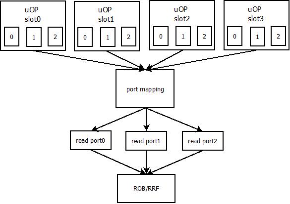

在同周期的4个uOP进行操作数的初步绑定后，需要针对这些操作数进行重排序，映射到真正的ROB读端口上，可选择映射关系如下

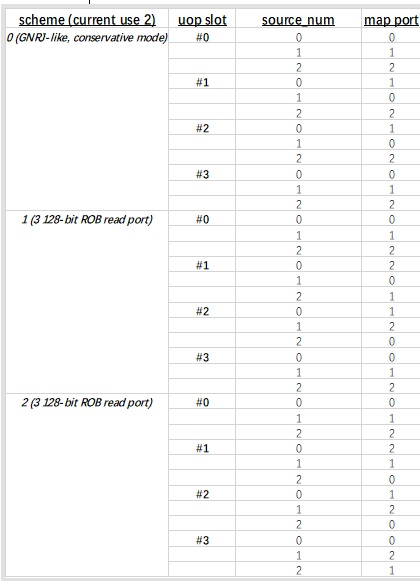

### 内存别名(Memory Aliasing)

在allocate流水线阶段，寄存器重命名解决指令间寄存器依赖冲突，对于memory类型指令，存在load/store之间的地址上的读写间的依赖关系。但是，由于x86处理器的支持的复杂寻址模式，处理器无法在没有计算出有效地址的情况下，判断出load/store之间是否存在依赖，比如

```assembly
mov [0x1000], 0x5
mov eax, [ebx+0x800]		;ebx=0x800，则当前指令的load与前面的store之间存在依赖，在allocation阶段无法发现
```

上述情况被称为内存别名(Memory Aliasing)

为了有效解决内存别名问题，处理器采用投机猜测机制进行内存别名的处理——内存转发预测器(Memory-Forwarding-Predictor/MFP)。

该预测器在fech流水线阶段，当load/store x86指令的lip地址确定后，就会开始进行预测，预测的结果随着解码后的uOP传递到后端流水线

#### 内存转发预测器(MFP)

预测器用于预测某个load指令是否与前面的store指令间存在forwarding关系，预测发生在fetch流水线阶段，使用load的lip地址进行预测。预测器结构如下

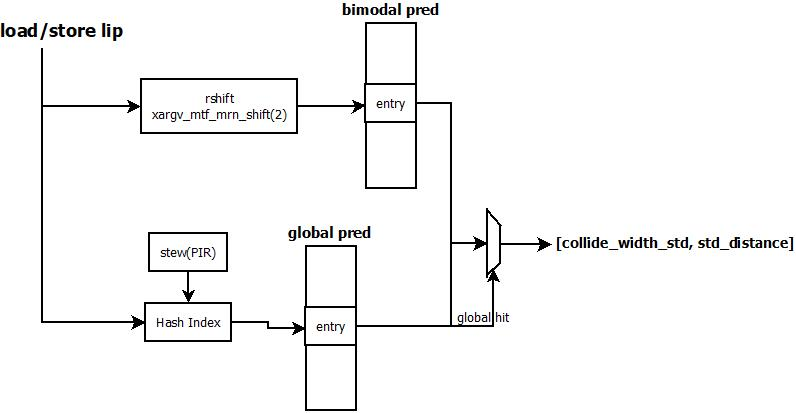

预测表结构

| Predictor                                         | Parameter                              | Index Function                                               |
| ------------------------------------------------- | -------------------------------------- | ------------------------------------------------------------ |
| bimodal pred<br />phythread share, no tid         | set(4096), way(1), alias(1)            | rshift, 表示load在多大的Byte范围内与std进行预测，目前为2^2 = 4Byte |
| global pred(disable)<br />phythread share, no tid | set(1), way(0), alias(1)，tag with lip | Hash Function<br />lip ^ lip>>(global_pred.way_log2) ^ stew ^ uip |

entry结构

| field                                                | descritpion                                                  |
| ---------------------------------------------------- | ------------------------------------------------------------ |
| distance                                             | load与std预测为forwarding的情况下，load与forwarding的std的距离 |
| confidence                                           | 饱和计数器，表明当前的预测结果置信度，最大为3                |
| cycle                                                | entry的更新时间，用于进行替换                                |
| collide_with_std                                     | load与std是否存在forwarding                                  |
| violation[MAX_ALIAS]<br />最大支持同一个entry8个单元 | 当前entry中load是否与store之间存在冲突(load与store存在overlap，但是没有发现)，alias的索引使用index的高位(index >> set_log) |
| mrn_from_store<br />not used                         | 当前entry曾经是否hit过一次load/store forwarding              |

MFP的预测

- load，如下情况预测load/store之间存在forwarding，标记load(load.ld_mrnable)
  - !lock_load
  - pred.collide_with_std && pred.confidence > 2，预测为load/store存在forwarding，记录pred.distance
  - !pred.collide_with_std && pred.confidence > 2 && !pred.violation[alias]，预测为load与前面store不存在overlap，load.depend_on_older_stas = 0

MFP的更新 (==实现不完整==)

- load，在retire流水线根据实际运行的结果对MFP表进行更新(mrn_mispred或是load正常retire时)

  根据是否存在load/sta间冲突，更新violation域

  - MFP的表预测为forwarding
    - load存在memory forwarding，检查forwarding是否预测正确；正确，confidence+1，否则confidence=0
    - load不存在memory forwarding，confidence=0
  - MFP的表预测为!forwarding
    - load不存在memory forwarding，confidence+1
    - load存在memory forwarding，confidence=0

##### 预测为memory forwarding的含义

MFP预测的结果不仅仅表示load/store之间可以forwarding，而且表示load/store之间可以进行memory renaming。在现在的设计中，满足memory renaming的条件为：

- !lock_load
- load的dst为!NULL寄存器(Immed/Zero)
- xargv_oracle_ms_uops(1) || !from_msrom
- setting_mrn_on_fp(1) || !fp uOP
- 以下条件2选1
  - setting_mrn_sfb_rules(1), fast_fwd(pa相同，且load.size<=std.size)
  - !setting_mrn_sfb_rules(0), std完全覆盖load 

#### Memory Renaming

当load指令通过MFP预测为ld_mrnable时，在allocation阶段进行memory renaming。过程如下：

```assembly
mov eax, 0x1
mov [0x1000], eax
mov ebx, [0x1000]			; load预测与指令2之间存在memory renaming
add ecx, ebx
```

load的dst寄存器更新RAT表时，使用store的source进行重命名。针对上面的例子，RAT[ebx] = rax[EAX]，即指令4直接依赖于指令1。

因为这种标记依赖的方式过于激进，如果MFP预测错误，无法进行恢复，所以处理器只能从load指令进行machine clear重新执行

### Mispredict Branch恢复

当处理器中针对branch uOP执行发生mis-predict的情况时，处理器必须刷新流水线，并且从正确的跳转位置开始执行。但是因为处理器乱序执行的原因，当branch uOP发生mis-predict时，branch uOP程序序上前面的指令可能还没有开始执行，所以此时处理器只能进行前端的刷新，而不能冒然进行后端刷新——可能将更老的指令刷掉，从而导致错误。为了减少处理器前端刷新后，新指令因为等待后端刷新而引入的等待延迟，处理器在mispredict branch恢复时设置了若干种机制

- Sequential Update (disable)

  Allocate流水线等待引起beuflush的branch uOP退休，根据不同的RAT机制采用不同的策略

  - 重命名到ROB，只需要branch uOP退休后，将RAT表清空即可
  - 对于采用重命名到PRF(Physical-Register-File)的方式，将retire阶段的RAT表拷贝到allocate阶段

- Checkpoint
  - Branch Checkpoint (disable)
  
    针对每个branch进行RAT的备份(checkpoint)，当出现mis-predict的branch uOP，不需要等待branch retire，直接从branch对应的备份恢复RAT，可以马上开始新的allocate
  
    - initialize阶段
  
      checkpoint属于core的资源，在phythread之间进行均分
  
    - allocate阶段
  
      对于branch uOP尝试分配checkpiont
  
      - checkpoint有空余空间，直接分配
      - 没有空余空间，进行替换(这里的confidence由BPU输出)
        - 如果checkpoint中存在confidence强的branch，则退换程序序上最老的
        - 如果checkpoint中都是confidence弱的branch
          - 当前尝试分配的branch是confidence强的branch，则不分配
          - 否则，替换程序序最老的checkpoint
  
    - complete阶段，只针对!bogus的branch uOP(不是false path上的uOP)
  
      - 当前branch没有mispred，直接回收对应的checkpoint
      - branch有mispred，clean branch uOP对应ROB之后的所有checkpoint
        - 如果当前branch有分配checkpoint，直接更新RAT，流水线继续
        - 没有对应的checkpoint，退化为sequential Update机制
  
    - retire阶段
  
      - 对于正常retire的uOP，不需要特殊处理
      - 对于需要进行machine clear的情况，清除引起machine clear的uOP之后所有的checkpoint
  
  - Periodic Checkpoint
  
    周期性进行RAT的备份，当发现mispredict的branch之后，不等待branch退休，直接从最近的checkpoint恢复RAT，并逐条恢复最近的checkpoint到branch之间的uOP的RAT状态
  
    - initialize阶段
  
      checkpoint属于core的资源，在phythread之间进行均分
  
      threshold = core_ROB_size(128) / nthread
  
    - allocate阶段
  
      每个allocate chunk只check一次(为allocate chunk的第一个uOP)，如果当前uOP与上次分配checkpoint的距离 >= threshold，则进行checkpoint分配
  
      - 存在空余的checkpoint，直接分配
      - 不存在空余的checkpoint，不分配
  
    - complete阶段
  
      不需要等待mispred的branch retire，但是需要等待checkpoint到mispred branch之间的RAT恢复时间，这段时间allocate流水线只能用于fix RAT，不能用于allocate新的uOP，需要等待的时间 wait_time = (mispred_br - checkpoint) / setting_width(4)
  
      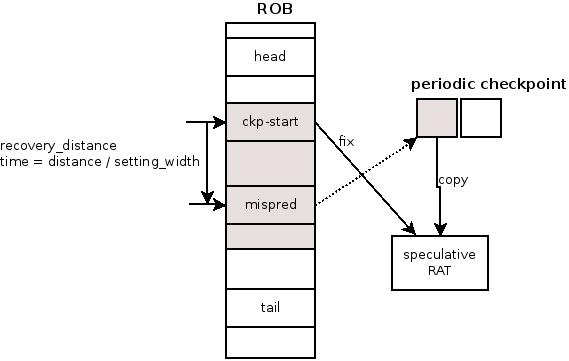
  
    - retire阶段
  
      - 对于分配了checkpoint的branc，如果正常retire，则将对应的checkpoint 清除
      - 对于machine clear的情况，清除引起machine clear的uOP之后的所有checkpoints

### 执行端口(exec-port)分配算法

在allocate流水线阶段需要根据uOP的类型决定uOP可以在哪个执行端口执行。此次分配是初始分配，在scheduler进行调度时，如果出现无法调度的情况，scheduler会对uOP进行重新分配

在执行uOP端口分配时，遵循如下端口分配算法

- 如果uOP只能在唯一端口执行，则分配到该端口

- 如果uOP可以分配到多个端口执行，则处理器可以采用如下的分配算法(目前使用PB_LEAST_LOADED)

  - PB_LEAST_LOADED

    统计每个possible port上的loading，选择最小的那个；如果有多个相同的，则采用随机算法：选择所有最小port中的((thread_cycle / 2) % num_tied) + 1

  - PB_LEAST_LOADED_LATENCY

    统计每个possible port上的待执行的loading，对于当前待分配的执行时延为1的uOP，还需要再累加上当前port上待执行时延大于1的uOP个数，选出loading最小的port；如果有多个port，则按照PB_LEAST_LOADED中的随机算法进行选择

  - PB_LEAST_LOADED_CLASS

    统计每个port上的loading(包含多少待执行的uOP)，算法：根据execlass扫描所有端口上待执行的loading，然后均分到execlass支持的possible port上，选择loading最小的port；如果有多个port的loading相同，则按照PB_LEAST_LOADED的方式进行选择

  - PB_LEAST_LOADED_DECAYING

    统计每个port上的decaying_counter，选择其中最小的；如果有多个相同的，使用PB_LEAST_LOADED中的随机算法。decaying_counter在port上周期没有使用时，进行减操作(settig_pb_decay_dec_count(1))，当port上周期忙时，进行加操作(setting_pb_decay_inc_count(2))，区间为[0, setting_pb_decay_max_count(20)]

  - PB_PSEUDO_RANDOM

    使用随机数(thread_cycle / 2) % possible_ports作为选择的port

  - PB_FLAT_PRIORITY
  
    选择当前cycle - 上一个cycle loading最小的那个port
  
  - PB_ROUND_ROBIN
  
    execlass分配了port，那么所有与它可分配相同port的execlass，设置可分配port为下一个允许的port，跳过当前port
  
  - PB_APPROX_INLINE
  
    将uOP的possible port按照当前待执行的uOP从小到大进行排列；如果second-first >= setting_pb_approx_threshold(2)，那么选择first；如果没有大于阈值，则按照当前周期该execlass可分配的possible_port对应的port_mask的counter % 2后，选择first或second

#### 执行端口重分配(exec-port rebinding)

当uOP在allocate流水线分配完执行端口后，在scheduler中进行调度时，可能会出现无法调度执行的情况。scheduler会根据情况选择以下时机点进行uOP执行端口的重分配

- UOP_NOT_READY

  uOP操作数不ready。重新分配条件(条件为& 关系)

  - setting_pb_not_ready_rebinding(0)
  - 当前port上已经ready的uOP >= 2

- PORT_CONFLICT

  同周期已经有uOP在当前port上调度。重新分配条件(条件为 & 关系)

  - setting_pb_rebind_multiple_times(0) || rebind_count == 0
  - setting_pb_rebind_threshold(0) || setting_pb_hunger_rebind(0)
  - setting_pb_hunger_rebind(0) && 当前port上已经ready的uOP >= 3
  - setting_pb_rebind_threshold(0) && uOP重分配失败的次数 >= setting_pb_rebind_threshold

- WB_PORT_CONFLICT

  uOP如果在当前port调度，则会与之前调度的uOP出现回写端口冲突(writeback port conflict)。重新分配条件

  - !setting_pb_dont_rebind_on_wb_conflict(0)

### Scheduler流水线

scheduler流水线从uOP进入scheduler之后，直到uOP进入执行部件执行为止，总共有3cycles。在这3cycles中，scheduler流水线依据uOP之间在allocate阶段建立的数据流依赖关系，动态调度uOP执行。其主要包括如下两部分功能：

- uOP自身操作数的ready情况——ready check

  每个cycle，scheduler都会遵循程序序的顺序，按照在allocate阶段通过重命名建立的指令间数据流依赖关系，检查uOP的各个操作数的ready情况，动态决定uOP的调度执行时间。对于操作数而言，其可能有3个来源情况：

  - 依赖于未完成的uOP

    scheduler调度时尽量考虑使用network forwarding来在线完成操作数的传递；如果因为资源调度的限制，无法使用network forwarding完成操作数传递，则相应ROB单元会监控writeback总线，将相应回写数据填入自身的操作数槽中

  - 已经回写ROB单元/RRF单元

    allocate阶段判断需要从ROB/RRF读取的操作数，则在分发进入scheduler的时候，同时会通过ROB read port进行操作数的读取，该过程可能会引入额外延迟

    - 对于!ld/st指令，ready_time = alloc_time + setting_rob_read_dispatch_delay(1)
    - 对于ld/st
      - 操作数在ROB中，ready_time = alloc_time + setting_rob_read_dispatch_delay(1) + setting_rob_read_src_f_dispatch_delay(1)
      - 操作数在RRF中，ready_time = alloc_time + setting_rob_read_src_f_dispatch_delay(1)

- uOP需要的硬件资源的available情况——资源调度

  对于目前处理器的设计，uOP需要的资源主要包括如下3类：

  - 对于div指令，div unit
  - 指令执行后的回写端口(writeback port)
  - 指令执行时的执行端口(exec-port)

#### 资源调度

- exec-port调度

  当有uOP被发射到相应的执行端口后，则当前执行端口变为不可用，表明当前cycle不能调度新的uOP到该端口；特别地，对于支持从MOB进行调度的处理器，如果uOP已经从MOB调度，则scheduler也不能调度

- div unit调度

  目前处理器中，只有1个div unit，idiv/fdiv共享。调度策略如下：

  - 扫描所有的idiv单元，根据最后情况进行分析
    - 如果某个idiv_owner\[type\]\[unit\]为当前uOP，说明uOP之前被调度执行过，且该unit被uOP调度后，一直没有别人使用
      - 存在idiv_reservation\[type\]\[unit\]的uOP，且older than当前uOP，在别的idiv单元上idiv_owner\[type\]\[unit\]没有younger than当前uOP的uOP调度过，stall
        - 当前idiv unit立即可用，并清除当前idiv_owner\[type\]\[unit\]
    - 选择最为可能占用的idiv单元
      - uOP本身已经处于reservation状态，或者某个idiv单元的reservation为空，且是ready时间最近的unit
      - 选择reservation中最younger的那个单元作为replace单元
    - 如果该单元已经存在reserveation的uOP，且older than当前uOP，stall
    - 如果该单元目前正在使用idiv_next_time\[type\]\[unit\] >= cur_time, stall，并且设置uOP为该单元的reservation
    - 其他情况，no stall

- writeback port调度

  - 预估uOP的完成时间complete_time = cur_time + uop_latency + rs_to_execstack_latency[port]
  - 根据完成时间计算uOP回写的time slot = complete_time % (max_uop_latency + setting_replay_latency(6))
  - 查看对应的time slot是否已经被占用，且不是自己，stall；否则，no stall

#### 投机唤醒(Speculative-Wakeup)与恢复机制

==TODO: 补充硬件实现==

scheduler为了尽量利用执行单元间的network forwarding机制，所以会提前唤醒与当前执行指令有依赖关系的uOP；但是对于load指令来说，其执行时间不确定，所以scheduler都会按照load hit的情况进行处理，但是如果发生了load miss的情况，则已经被唤醒的uOP需要某种机制重新执行或者取消执行。这被成为"投机唤醒"。由此，可以推断出depent uOP的等待调度时间为wait_time = exec_time + fwd_latency

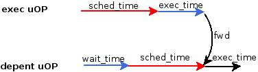

##### 取消机制(Cancel-Exec)

当uOP无法在scheduler预估时间点返回的时候，因为depent uOP已经被wakeup，所以需要将被错误唤醒的uOP在还没有出scheduler流水线时取消掉。对于目前的scheduler 3级流水线来说，最多需要取消3级依赖链的uOP。在这种实现中，uOP从scheduler的移除必须确定当前uOP不会被cancel时才会移除。在模拟器实现中，取消机制有两部分逻辑来保证

- 流水线部分

  recent_ld_dep_vector，表明可能有问题的load在pipeline window的位置，后面所有与它有依赖关系的uop会将这个依赖slot标记到自己的vector上；当load确定完成，没有replay，会从依赖的uop上移除对应的slot，否则，如果有存在slot标记的uop都会进行cancel

- scheduler queue内部

  cycle_exec_known_bad，当该值不为0时，说明uOP已经调度执行，且存在replay情况，则scheduler queue中任何与该uOP存在直接依赖关系的uOP都不能调度执行，必须等待该uOP再次调度执行后才能调度

##### 重执行机制(Replay-Loop)

重执行机制是P4架构引入的机制，目前已经废弃不用。不同于取消机制，重执行不会尝试将已经wakeup的uOP设法取消掉，而是让其错误执行，但是执行后，通过replay的路径让错误执行的指令再次执行。如下图

==TODO: safe情况下为什么也会因如额外3cycle==

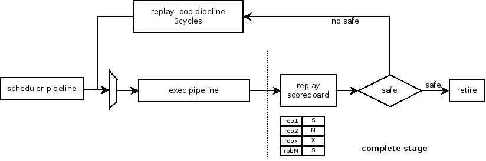

### 执行部件划分与延迟

#### 执行端口(exec-port)与执行堆栈(exec-stack)

处理器中会支持不同的运算操作，这些运算操作由不同的计算硬件实现，按照计算的数据类型不同，处理器将内部的不同计算硬件电路大致分为如下4类：

- INT

  整型数据的操作，包括+/-/*//, 移位，跳转等，所有的数据为整型类型

- FP

  浮点类型数据的操作

- SIMD

  向量类型数据的操作

- Memory

  专门用于数据的读取和写入，属于整型数据的部分

不同类型的计算硬件电路组合成为执行堆栈(exec-stack)，不同的执行堆栈之间进行操作数的forwarding可能会引入延迟。

处理器为了更好的支持scheduler对于uOP的调度，对于执行单元进行了分组、聚合，不同功能的执行单元组织成一个执行端口，减少scheduler端的调度复杂度(看到的可执行单元为可执行端口数量)。在该处理器中，执行端口主要分为如下几类

| execport   | func-unit(exec-stack)                                        |
| ---------- | ------------------------------------------------------------ |
| alu0_fpadd | simple_alu(int), fp_add(fp), slow(int), shift(int), logical(int), vi(simd), v_all(simd), simd_shuf5(simd), simd_shift(simd), lea(int), port0_1(int), vsse(fp), fp_rom(fp), fp_shuf(simd), ishuf(simd), stat_index_shuf(simd) |
| alu1_fpmul | simple_alu(int), fp_mul(fp), logical(int), imul(int), idiv(fp), fdiv(fp), v_all(simd), simd_imul(simd), port0_1(int), fp_wu(fp) |
| ld_agu0    | load(memory), fp_load(memory)                                |
| ld_st_agu1 | load(memory), sta(int), fp_load(memory)                      |
| miu_std    | fp_std(memory), std(memory)                                  |
| alu3_simd  | simple_alu(int), br(int), shift(int), logical(int), vi(simd), v_all(simd), simd_shuf5(simd), simd_shift(simd), vsse(fp), fp_shuf(simd), ishuf(simd), stat_index_shuf(simd) |

#### uOP执行延迟

==TODO：添加所有uOP的执行端口和执行类型(exec-class)==

#### Forwarding network延迟

当不同的uOP在不同的执行堆栈(exec-stack)执行时，如果之间需要进行操作数的传递，则通过相应的forwarding network进行传递，forwarding network在不同的exec-stack之间进行操作数传递需要不同的延迟，且从scheduler调度到不同的exec-stack执行时需要相应的延迟。下表对于不同的exec-stack之间的forwarding延迟进行了总结 [***竖列为sender，横列为receiver***]

|        | RS   | INT  | FP   | SIMD | Memory |
| ------ | ---- | ---- | ---- | ---- | ------ |
| RS     | N.A. | 0    | 0    | 0    | 0      |
| INT    | N.A. | 0    | 2    | 1    | 0      |
| FP     | N.A. | 2    | 0    | 1    | 2      |
| SIMD   | N.A. | 1    | 1    | 0    | 1      |
| Memory | N.A. | 0    | 2    | 1    | 0      |

### 流水线刷新

#### beuflush

当branch uOP在execution流水线的complete阶段判断出mispredict的时候，直接flush前端流水线，并从正确的lip位置进行取指；当前端新解析的uOP达到allocation阶段时，如果此时backend已经完成"mispredict branch恢复"(参考**mispredict branch恢复**)，则直接进入后端执行，否则等待

#### machine-clear

在处理器retire流水线阶段，如果uOP的执行导致了处理器状态改变、预测错误等问题，处理器只能采用刷新处理器的各级流水线，并从引起错误的uOP所在的lip重新抓取指令进行执行。以下的情况会导致处理器触发machine-clear

- MFP预测错误，load从错误的std进行forwarding，load指令开始重执行
- load/store间出现了address conflict——内存消歧(memory disambigeous)预测错误，load指令开始重执行
- FSW寄存器因为uOP执行值改变(mask = 0x7F)，FSW下一条指令重执行
- MXCSR寄存器因为SSE uOP执行值改变(mask = uOP.write_mask)， MXCSR下一条指令重执行
- 处理器工作于CMT模式时，引起logical thread进行切换的uOP(参见**phythread_mgr.md**)，logical thread切换后的新LIP开始执行
- 带有lock标志的指令(fast-lock)投机执行失败(参见**memory.md**)，lock指令开始重执行
- 流水线中存在未被处理的异常

#### 流水线刷新

当发生mispredict或是machine clear时，处理器会进行allocate和ooo部分的资源回收和流水线状态清理

需要进行回收的资源

- allocate阶段分配的资源

  ROB / LB / SB / port-binding / rsp_cache_valid[tid], flag_stall[tid], alloc_sleep_reason[tid]

- scheduler阶段分配的资源

  split register / div unit / pmh / fillbuffer / lock / sleep MOB / scheduler queue

### Retire功能

retire逻辑主要功能在于完成uOP指令的退休和异常处理，这里主要强调几点特殊情况：

- branch retire的slot限制(setting_taken_branches_retire_in_slot_0(1))
  - 对于branch uOP && !bpu_mispredict
    - ujcc，可以在任意slot retire
    - jcc，预测为taken的，只能在slot0 retire
    - uncondition branch，只能在slot0 retire
- fxchg指令的retire slot限制(setting_fxch_retire_in_slot_0(1))，fxchg指令只能在slot0 retire
- fusing的指令，需要全部完成后才能retire(setting_alloc_retire_together(1))
- 异常的实现，当模拟器执行到retire阶段不存在时序模型上的异常情况时(比如machine clear的触发条件)，则模型会retire阶段会再执行一个retire的function model，如果当前funtion model存在执行异常，则按照machine clear的过程进行处理