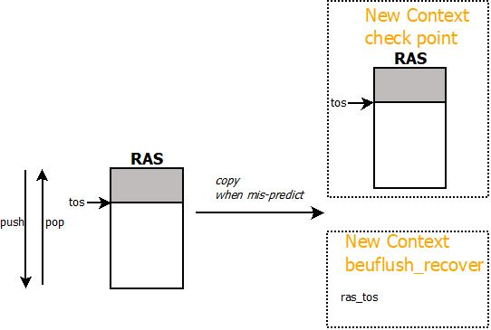

[TOC]


# 前端(Frontend)架构

## Frontend流水线结构


从上图可以看出，frontend的流水线由两条代码路径组成：MSROM和传统x86指令译码路径(MTF)，两条路径在流水线上对齐；从功能上则可以分为fetch和decode两条流水线。由此：

- MSROM路径

  在fetch流水线上完成微码指令的读取；在decode流水线上按照dispatch_width宽度完成微指令译码，并发送到uOP Buffer中

- MTF路径

  在fetch流水线上完成指令数据的读取、切分，并根据指令功能确定是否要trigger MSROM路径的解码，并将切分好的x86指令存入inst Buffer；在decode流水线上从instBuffer中进行x86指令译码，并按照dispatch_width的宽度发送到uOP Buffer中

MTF路径上，每次从iCACHE读取16B的指令数据；无论是MTF路径还是MSROM路径，最终解码后，每周期最多向allocator模块发送4个uOP

### 流水线资源划分

对于SMT系统而言，一个物理核心需要支持多个逻辑核心，所以在处理器内部，有些资源为每个逻辑核独有，有些则为多个逻辑核心共享。下面，是frontend流水线阶段各个资源的分配情况

| 资源名字     | 说明                                                         | 资源总大小                                                   | SMT-2的分配策略                                              |
| ------------ | ------------------------------------------------------------ | ------------------------------------------------------------ | ------------------------------------------------------------ |
| FetchState   | 程序可见的处理器架构状态和MSROM的状态                        | N.A.                                                         | duplicated                                                   |
| iTLB         | 指令TLB                                                      | setting_itlb_entries(128), setting_itlb_assoc(4)             | static partition<br />each 64                                |
| iCache       | 指令Cache                                                    | setting_il1_size(32K), setting_il1_assoc(4), setting_il1_linesize(64) | shared, no tid                                               |
| StreamBuffer | iCache miss后，request缓存buffer                             | setting_fe_sb(2)                                             | shared, no tid                                               |
| FetchBuffer  | 数据从iCache读回后的缓存buffer                               | setting_fe_fetch_buffers(0)                                  | duplicated                                                   |
| InstBuffer   | 识别出的x86指令缓存buffer                                    | setting_fe_iq_size(18)                                       | duplicated                                                   |
| uOPBuffer    | x86指令译码后的uOP缓存buffer                                 | setting_fe_uq_size(28)                                       | 1. static partition(setting)：each 14<br />2. dyanamic shared |
| decoder      | 用于进行x86指令的解码逻辑                                    | 配置为4-1-1-1模式<br />setting_fe_asym_decoders(3)           | shared, multiplex                                            |
| stack engine | 用于push/pop的esp的预测                                      | 目前的esp_offset_max(8bit)，可以trace +/-128                 | duplicated                                                   |
| MSROM status | 用于控制从MSROM译码uOP                                       | N.A.                                                         | duplicated<br />MSROM shared                                 |
| mfp table    | 根据lip进行memory指令间的forwarding预测，预测结果在Allocator阶段使用 | mtf_mrn_sets(4096)<br />mtf_mrn_ways(1)                      | shared, no tid                                               |

### 流水线仲裁

Fetch流水线和Decode流水线对于两个逻辑核心来说是共享的，所以每个cycle需要进行两个phythread的仲裁处理决定哪个phythread可以占用对应的流水线。在目前实现中，Fetch和Decode的phythread仲裁都采用PHYTHREAD_INTERLEAVE方式。

#### Fetch仲裁

对于phythread来说，能否进行Fetch流水线的仲裁，需要首先满足一些先决条件：

- phythread没有fetch的stall条件
  - iTLB/iCACHE miss
  - MSROM scoreboard stall (serialization机制)
  - LCP || many prefixes
  - BACFlush (decoder flush)
- phythread处于active状态
- phythread没有处于mwait状态
- fetch流水线没有被某个phythread独占

#### Decode仲裁

phythread参与Decode流水线的仲裁，需要满足的先决条件：

- phythread没有decode的stall条件
  - uOP queue已满
- phythread处于active状态

### 流水线停顿(Stall)

当Fetch/Decode流水线出现一些导致流水线停顿的原因时，导致相应的phythread不能进行后续的Fetch/Decode流水线竞争，需要等待一定的时间，这里对于可能出现的流水线停顿原因进行总结：

| Stall name                 | Reason                                                       | Stall cycle                                                  |
| -------------------------- | ------------------------------------------------------------ | ------------------------------------------------------------ |
| FE_STALL_REASON_BACFLUSH   | decode阶段进行的flush (BTB miss)                             | default: mtf_latency(8)<br />setting: 14+1                   |
| FE_STALL_REASON_SCOREBOARD | MSROM进行fetch时，遇到的serialization指令<br />（SET_SCORE/READ_SCORE) | fe_ms_scoreboard_stall(3)                                    |
| FE_STALL_REASON_CACHE      | 访问iTLB/iCACHE出现miss                                      | wait until data done                                         |
| FE_STALL_REASON_LCP        | ILD进行指令切分时发现了0x66, 0x67 prefix                     | mtf_num_bubbles_prefixes_lcp(3)<br />mtf_num_bubbles_prefixes_lcp*2 if setting_mtf_lcp_cross_double(0) |
| FE_STALL_REASON_PREFIXES   | ILD进行指令切分时发现了太多的prefix                          | mtf_num_bubbles_prefixes_toomany(0) * (num_prefixes-1)/2     |

## 功能介绍

### Branch Predictor

Branch Predictor针对取指地址进行预测，不会对MSROM路径上的uOP进行跳转预测，在模拟器中采用BG(bimodal+global history)或BGG(bimodal + big global history)结构。其中，BG的结构如下图所示：


BGG的结构如下图——在当前配置下，没有被enable(setting_mtf_bgg(0))：


模拟器中各部分预测结构的基本信息(以当前模拟器配置为例)

| module                                       | parameters                                                   | entry structure                                              | SMT-2 policy                              |
| -------------------------------------------- | ------------------------------------------------------------ | ------------------------------------------------------------ | ----------------------------------------- |
| RAS                                          | setting_ras_depth(16) entries                                | {lip_VA}                                                     | duplicated                                |
| iBTB<br />setting_new_indirect(1)            | setting_fe_indirect_size(256) entries<br />setting_fe_indirect_assoc(1) ways | {target_VA}                                                  | shared, no tid                            |
| global iBTB<br />setting_new_indirect(0)     | setting_fe_indirect_size(256) entries<br />direct map        | tag<br />target_VA<br />tid                                  | shared, tid                               |
| BTB                                          | setting_fe_bpu_btb_size(2048) entries<br />setting_fe_bpu_btb_assoc(4) ways<br />tag setting_btb_tag_size(9) bits | tag<br />target_VA<br />uop_OPCODE<br />counter<br />last_stew<br />last_bigstew<br />mru_bit<br />miss<br />disagree_static_pred<br />    not agree with static pred, only for jcc | shared, tid                               |
| global predictor                             | setting_fe_bpu_global_size(2048) entries<br />setting_fe_bpu_global_assoc(4) way | tag<br />satuar counter<br />counter_bl_0   not tk satuar counter<br />counter_bl_1   tk satuar counter | shared, setting_use_global_tid(1), tid    |
| bimodal predictor                            | setting_fe_bpu_bimodal_size(4096) entries<br />setting_fe_bpu_bimodal_assoc(1) ways | tag<br />   setting_bimodal_have_tag(0)<br />satuar counter  | shared, setting_fix_mt_bimodal(1), no tid |
| loop predictor                               | setting_fe_bpu_loop_size(128)entries<br />setting_fe_bpu_loop_assoc(2) ways<br />setting_loop_tag_size(6) | tag<br />learn_mode<br />predict_mode<br />relearn_mode<br />validate_mode<br />spec<br />prediction<br />max_counter<br />real_counter<br />spec_counter | shared, tid                               |
| l2 bimodal predictor<br />setting_l2_bpu(1)  | setting_l2_bimodal_size(8192) entries<br />setting_l2_bimodal_assoc(4) ways<br />setting_l2_tag_size(8) | tag<br />satuar counter                                      | shared, tid                               |
| big global predictor<br />setting_mtf_bgg(0) | setting_fe_bpu_bigglobal_size(2048) entries<br />setting_fe_bpu_bigglobal_assoc(4) ways<br />setting_bigg_tag_size(26) | tag<br />satuar counter<br />counter_bl_0   not tk satuar counter<br />counter_bl_1   tk satuar counter | shared, setting_use_bigglobal_tid(1), tid |
| stew length                                  | setting_fe_stew_length(15)-bit                               |                                                              | duplicated                                |
| bigstew length                               | setting_fe_bgg_history(37)-bit                               |                                                              | duplicated                                |
| static predictor                             | absolutely branch<br />      always-taken<br />conditional branch<br />      backward, taken<br />      forward, not-taken |                                                              | shared<br />located in decode stage       |

#### Satuar Counter(饱和计数器)

BPU中的预测器通常使用饱和计数器进行预测，模拟器中实现3种不同的饱和计数器，分别为2-bit饱和计数器，3-bit饱和计数器，4-bit饱和计数器，默认使用setting_fe_bpu_scheme(1)——3-bit饱和计数器。其状态转换如下

| 当前状态                                                     | taken的下一个状态 | nottaken的下一个状态 | 预测结果 | 信心值 |
| ------------------------------------------------------------ | ----------------- | -------------------- | -------- | ------ |
| 2-bit饱和计数器<br />not-taken初始分配状态1<br />taken初始分配状态2 |                   |                      |          |        |
| 0                                                            | 1                 | 0                    | nt       | 1      |
| 1                                                            | 2                 | 0                    | nt       | 0      |
| 2                                                            | 3                 | 1                    | t        | 0      |
| 3                                                            | 3                 | 2                    | t        | 1      |
| 3-bit饱和计数器<br />not-taken初始分配状态3<br />taken初始分配状态4 |                   |                      |          |        |
| 0                                                            | 3                 | 0                    | nt       | 1      |
| 1                                                            | 3                 | 0                    | nt       | 0      |
| 2                                                            | 3                 | 1                    | nt       | 0      |
| 3                                                            | 4                 | 2                    | nt       | 0      |
| 4                                                            | 5                 | 3                    | t        | 0      |
| 5                                                            | 6                 | 4                    | t        | 0      |
| 6                                                            | 7                 | 4                    | t        | 0      |
| 7                                                            | 7                 | 4                    | t        | 1      |
| 4-bit饱和计数器<br />not-taken初始分配状态7<br />taken初始分配状态8 |                   |                      |          |        |
| 0                                                            | 7                 | 0                    | nt       | 1      |
| 1                                                            | 7                 | 0                    | nt       | 0      |
| 2                                                            | 7                 | 1                    | nt       | 0      |
| 3                                                            | 7                 | 2                    | nt       | 0      |
| 4                                                            | 7                 | 3                    | nt       | 0      |
| 5                                                            | 7                 | 4                    | nt       | 0      |
| 6                                                            | 7                 | 5                    | nt       | 0      |
| 7                                                            | 8                 | 6                    | nt       | 0      |
| 8                                                            | 9                 | 7                    | t        | 0      |
| 9                                                            | 10                | 8                    | t        | 0      |
| 10                                                           | 11                | 8                    | t        | 0      |
| 11                                                           | 12                | 8                    | t        | 0      |
| 12                                                           | 13                | 8                    | t        | 0      |
| 13                                                           | 14                | 8                    | t        | 0      |
| 14                                                           | 15                | 8                    | t        | 0      |
| 15                                                           | 15                | 8                    | t        | 1      |

#### 全局历史跳转信息(Stew/Bigstew)

在当前的跳转预测器设计中，为了兼顾不同跳转指令之间的相互作用关系(Correlation)，在进行相应的预测表索引时，都会参考历史跳转信息。在当前模拟器中，则使用了全局历史跳转信息——记录最近若干次跳转指令的实际跳转方向。不同类型的跳转指令会对当前历史跳转信息进行更新。在目前的模拟器实现中，如下类型的跳转指令会更新Stew

- indirect branch

  add_ind_to_stew(1)，表示indirect branch的跳转信息会更新到stew/bigstew中。indirect branch更新到stew/bigstew的结果一定是taken

- jcc branch

  jcc更新到stew/bigstew的结果为golden跳转结果

**<u>stew的更新</u>**

- **<u>indirect branch更新</u>**

  add_ind_to_stew(1)

  ​	! setting_stew_taken_only(1)

  ​		stew = iBTB_hash << setting_fe_stew_shift(2) ^ taken

  ​	taken

  ​		! setting_new_update_stew(1)

  ​			stew = iBTB_hash << setting_fe_stew_shift(2) ^ taken

  ​		else

  ​			stew = (stew << setting_fe_stew_shift(2) ^ taken)  ^ lip[setting_fe_stew_length+4:10, 10'b0] ^ target[5:0]			<=== current configuration

- **<u>conditional branch更新</u>**

  ! setting_stew_taken_only(1)

  ​	stew = global_hash << setting_fe_stew_shift(2) ^ taken

  taken

  ​	! setting_new_update_stew(1)

  ​		stew = global_hash << setting_fe_stew_shift(2) ^ taken

  ​	else

  ​		stew =  (stew << setting_fe_stew_shift(2) ^ taken)  ^ lip[setting_fe_stew_length+4:4] 

**<u>bigstew的更新</u>**

- **<u>indirect branch更新</u>**

  add_ind_to_stew(1)

  ​	! setting_stew_taken_only(1)

  ​		bigstew = iBTB_hash << setting_fe_bgg_shift(2) ^ taken

  ​	taken

  ​		! setting_new_update_stew(1)

  ​			bigstew = iBTB_hash << setting_fe_bgg_shift(2) ^ taken

  ​		else

  ​			bigstew = (bigstew << setting_fe_bgg_shift(2) ^ taken)  ^ lip[setting_fe_bgg_history+4:10, 10'b0] ^ target[5:0]			<=== current configuration

- **<u>conditional branch更新</u>**

  ! setting_stew_taken_only(1)

  ​	bigstew = big_global_hash << setting_fe_bgg_shift(2) ^ taken

  taken

  ​	! setting_new_update_stew

  ​		bigstew = big_global_hash << setting_fe_bgg_shift(2) ^ taken

  ​	else

  ​		bigstew =  (bigstew << setting_fe_bgg_shift(2) ^ taken)  ^ lip[setting_fe_bgg_history+4:4]  <=== current configuration

#### Hash函数的设计

针对indirect branch和conditional branch来说，为了提高预测准确度，在生成相关表结构的index索引前，需要对index值进行hash函数处理

**<u>1. indirect branch hash (iBTB_hash)</u>**

- **index**      <===   iBTB_hash

  add_ind_to_stew(1)

  ​	! add_target_to_ind_index(1)

  ​		index = stew[stew_len:0] ^ lip[stew_len:0]

  ​	else	// add target address to stew

  ​		index = stew[5:0]<<(stew_len-6) ^ stew[stew_len:6] ^ lip[stew_len+5:5]

  else

  ​	index = stew[stew_len:0]

- **bigindex**

  add_ind_to_stew(1)

  ​	! add_target_to_ind_index(1)

  ​		bigindex = bigstew[bigstew_len:0] ^ lip[bigstew_len:0]

  ​	else

  ​		bigindex = stew[5:0]<<(bigstew_len-6) ^ bigstew[bigstew_len:6] ^ lip[bigstew_len+5:5]

  else

  ​	bigindex = bigstew[bigstew_len:0]

**<u>2. conditional branch hash (global_hash)</u>**

只针对jcc有效，absolute branch永远使用entry 0

- index

  ! setting_shift_lip_offset_g(1)

  ​	index = stew[stew_len:0] ^ lip[stew_len:0]

  else

  ​	index = stew[stew_len:0] ^ lip[stew_len+4:4]

- bigindex

  ! setting_shift_lip_offset_g(1)

  ​	index = bigstew[bigstew_len:0] ^ lip[bigstew_len:0]

  else

  ​	index = bigstew[bigstew_len:0] ^ lip[bigstew_len+4:4]

#### 投机执行处理(Speculation-Execution Handling)

BPU的预测位于处理器的最前端，在没有相关的指令信息的情况下，依据历史经验进行取值地址的预测，所以有可能导致预测错误——但是有些错误只有等到执行才会发现(indirect_branch/conditional_branch)。这样，前端的预测取值是在完全投机的情况下进行。在处理器发现预测错误之前，BPU仍然会对投机路径上的指令进行预测。一旦处理器发现预测错误，会flush流水线，并恢复BPU的预测表状态到正常路径上的状态。为此，对于BPU预测表的投机预测会对某些数据进行修改，这些修改会随着uOP传递到处理器的backend，最终在执行完毕后，决定进行BPU的update，还是BPU的flush。

BPU在SMT的情况下，被多个phythread共享。在处理器投机执行时，预测表中的某些数据被投机更新了，这需要将投机更新前的表信息保存到每个phythread的执行环境中，这些信息包括：

| Field                        | Description                                                  |
| ---------------------------- | ------------------------------------------------------------ |
| stew                         | 全局历史跳转信息， 15bit                                     |
| bigstew                      | 更长的历史跳转信息，37bit                                    |
| ras_stack[MAX_RAS_SIZE(513)] | call/ret的return stack预测器                                 |
| ras_tos                      | 当前ras中的栈指针                                            |
| call_depth                   | call的递归深度，当递归深度为0时，表示当前ras为空             |
| global_history               | 全局的golden的历史跳转信息，这个结构在模拟器中没有看到用法   |
| target                       | 跳转目标， VA                                                |
| last_br                      | 导致mis-predict的branch uop，会创建新的投机执行上下文 (Context)，没有看到具体的用法 |

#### BPU预测和更新

##### 预测和更新时机

前端取指时，使用BPU进行取指地址的预测。在预测时，只有少量的预测表结构进行投机更新，其他的结构仅仅进行读取处理。当指令执行完成后，需要对BPU的预测结果进行判断，查看是否出现mis-predict，如果有mis-predict，则进行流水线刷新(Flush)；不管是否存在mis-predict，都会根据正确的跳转结果对预测表进行更新。在目前的模拟器中，包括两个更新时机：

- exec执行后的更新

  还处于乱序阶段，这时的更新会对预测表的后续预测结果产生影响。更新延迟为：exec_time + 1 + setting_update_bp_latency(7)

- retire后的更新 setting_update_bp_at_retire(1)

  已经是按照指令执行流的顺序进行更新。更新延迟为：retire_cycle + setting_update_bp_latency(7)

##### 不同分支指令的预测

不同的跳转类型指令使用不同的预测表进行预测，如下：

- call_indirect {X86指令}

  更新stew/bigstew

  **<u>ras的压栈处理</u>**

  - setting_call_to_ras_opt(1)，如果target != next_lip，进行ras压栈
  - 直接进行ras压栈

  **<u>跳转地址(target)的预测</u>**

  - 使用iBTB部分进行预测

  **<u>跳转方向(taken)的预测</u>**

  - always taken

- jmp_indirect / jmpnear_indirect {X86指令}

  更新stew/bigstew

  **<u>跳转地址(target)的预测</u>**

  - 使用iBTB进行预测

  **<u>跳转方向(taken)的预测</u>**

  - always taken

- ujcc / ujmp_onedesc {uop 指令}

  不更新stew/bigstew

  利用branch_hint进行预测，带有TAKEN标记的uop预测taken，否则预测为not-taken

- ujcc_indirect / ujmp_indirect {uop 指令}

  不更新stew/bigstew

  不预测，按照fallthrough处理

- call_direct {X86指令}

  不更新stew/bigstew

  **<u>ras的压栈处理</u>**

  - setting_call_to_ras_opt(1)，如果target != next_lip，进行ras压栈
  - 直接进行ras压栈

  **<u>跳转地址(target)的预测</u>**

  - 使用BTB进行预测

  **<u>跳转方向(taken)的预测</u>**

  - always taken

- jmp_direct {X86指令}

  不更新stew/bigstew

  **<u>跳转地址(target)的预测</u>**

  - 使用BTB进行预测

  **<u>跳转方向(taken)的预测</u>**

  - always taken

- return_indirect {X86指令}

  更新stew/bigstew

  **<u>ras的出栈处理</u>**

  - 从ras中弹出tos对应的target地址

  **<u>跳转地址(target)的预测</u>**

  - 使用RAS进行预测

  **<u>跳转方向(taken)的预测</u>**

  - always taken

- jcc {X86指令}

  更新stew/bigstew

  **<u>跳转地址(target)的预测</u>**

  - 使用BTB进行预测

  **<u>跳转方向(taken)的预测</u>**

  - !force_prediction(false) || access_bpu_on_force_prediction(0) 使用BG模式或是BGG模式进行预测
  - setting_better_predictor(0%)，小于setting_better_predictor，则认为不会出现mis-predict
  - setting_perfect_bpu(0)，当仿真时间小于setting_perfect_bpu，那么认为bpu不会出现mis-predict
  - force_prediction，仅仅使用static_predictor进行预测

##### 预测结果的保存

预测完成后，相对应的预测结果会保存到每个uop的bpred_info的结构体上，这个结构体主要包括如下的预测信息

| 成员              | 含义                                                         |
| ----------------- | ------------------------------------------------------------ |
| index             | 跳转历史相关，包括<br />pre_stew/pre_bigstew                     本次之前的全局跳转历史信息<br />post_stew/post_bigstew                 添加本次跳转结果后的全局跳转历史信息<br />index/bigindex                                 hash结果 |
| wrong_target      | 对于indirect target而言，预测错误的跳转地址                  |
| predicted_taken   | 预测跳转的结果，只针对jcc而言，其他的都是无效值              |
| confident         | 对于本次预测结果的信心值                                     |
| bpu_mispredicted  | 本次预测是否是mis_predicted                                  |
| core_mispredicted | 表明当前core处于错误的指令路径上，与bpu_mispredicted同义；当模拟器的错误路径执行个数达到上限num_speculative_mispredicted_branches(80)，本次的mis-predict clear |
| \*\_hit/\*\_taken | 记录各类预测表结构的hit和预测结果信息                        |

##### 各类预测器的预测和更新

各类预测器使用不同的预测结构进行不同内容的预测，如下：

- **RAS**

  RAS是处理器中用于进行call/return返回地址预测的一类特殊的预测器。此类预测器用硬件的方式模拟了软件中call/return的执行过程，从而获得比较高的预测结果

  **Index生成**

  tos(栈顶指针)

  **预测阶段**

  

  - 对于call，将当前target压入ras，tos+1
  - 对于return, tos-1，将当前target弹出ras

  当ras在投机路径上，如果遇到mis-predict的情况，那么分为几种类型处理

  - setting_ras_checkpointed_stack(1)，copy当前ras的所有内容到phythread的context中，恢复时直接copy恢复
  - setting_ras_recover_tos_beuflush(0)，仅仅copy当前的tos指针，而ras中的内容不恢复
  - 或者不恢复

  **更新阶段**

  RAS的更新是投机进行的，并不会在指令执行后执行额外的更新动作。如果mis-predict，则按照之前备份的堆栈信息进行还原

- **Loop Predictor**

  用于预测指令流中循环代码处的Jcc循环判断

  **Index生成**

  lip = setting_use_last_byte(1)? (nlip-1): lip

  setting_shift_lip_offset_loop(1)

  ​	index = {lip[3:0], lip[(tag+set)_bits+4:4]}

  else

  ​	index = lip[(tag+set)_bits:0]

  setting_loop_msb_tid(1)

  ​	index = {lip[(tag+set)\_bits:set\_bits+1] , tid, lip[set\_bits-1:0]}

  **预测阶段**

  当hit相关的loop predictor表项后，当前的loop entry必须处于预测模式(predictor mode)

  - 设置entry.spec = true，表明当前branch处于投机模式
  - entry.spec_counter投机更新，表明遇到了一次loop，如果上次spec_counter == max_counter，spec_counter清零
  - 比较entry.spec_counter和entry.max_counter
    - spec_counter < max_counter，根据保存的饱和计数器预测taken
    - spec_counter = max_counter，根据保存的饱和计数器预测not-taken 
  - 更新loop表项

  可以投机更新

  **更新阶段**

  loop predictor的更新前提必须是bimodal hit 

  - miss时

    当bimodal的结果是STRONG的饱和计数器，且预测错误(mispredict && bimodal错误)，分配一个loop entry，设置为learn mode，将当前的loop entry的饱和计数器prediction按照bimodal的taken预测结果更新为初始值

  - hit时

    - 处于learn mode时

      - 更新最大的循环次数max_counter

        - 如果预测错误(mispredict && bimodal错误)

          - max_counter in (2, 64)，且bimodal是STRONG的饱和计数器

            转换到predict mode，更新loop entry

          - invalidate当前loop entry

        - 更新loop entry

    - 处于predict mode时

      - 更新非投机路径上的loop次数real counter

      - 在非投机路径上再次进行loop预测

      - 如果没有出现mispredict

        说明投机路径上预测正确，更新real counter的值，更新loop entry

      - 出现mispredict

        - 非投机路径上预测正确，更新real counter的值，更新loop entry
        - 非投机路径上预测错误，invalidate当前loop entry

  当本次是一次mis-predict的情况时，对于出现mis-predict的当前phythread的所有loop entry使用real counter改写spec counter，并设置为非spec模式

- **Bimodel Predictor**

  用于预测jcc指令的跳转方向，是方向预测器的基本预测器。所有的jcc分支指令首先需要bimodal hit，如果bimodal不hit，那么直接使用L2 bimodal的预测或是静态预测器结果。bimodal输出的是饱和计数器结果。

  **Index生成**

  lip = setting_use_last_byte(1)? (nlip-1): lip

  ! setting_bimodal_have_tag(0)

  ​	index = lip[set_bits:0]

  setting_bimodal_msb_tid(1)

  ​	index = {lip[:set_bits+1] (tag), tid, lip[set_bits-1:0]}

  **预测阶段**

  bimodal采用饱和计数器进行预测，饱和计数器的预测结果参考*饱和计数器设计*。不投机更新

  **更新阶段**

  - miss时，根据golden的taken结果分配初始的饱和计数器初值
  - hit时，根据golden的taken结果更新饱和计数器

- **L2 bimodal Predictor**

  2nd level的bimodal predictor。当bimodal miss或btb miss的情况下，L2 bimodal predictor提供最终的预测结果

  **Index生成**

  lip = setting_use_last_byte(1)? (nlip-1): lip

  setting_l2_have_tag(1)

  ​	index = lip[(tag+set)_bits:0]

  else

  ​	index = lip[set_bits:0]

  **预测阶段**

  当bimodal预测conditional branch miss或是btb miss的时候，使用L2 bimodal的预测结果。L2 bimodal工作在两种模式下

  - setting_l2_predict_opposite(1)，bimodal的hit是对static predictor结果的修正——如果L2 bimodal hit，那么预测结果为static predictor取反
  - L2 bimodal预测结果为饱和计数器

  不投机更新

  **更新阶段**

  L2 bimodal的表项更新有如下策略

  - setting_alloc_l2_evicted(1)，只在btb evict时进行l2 alloc，且必须是disagree_static

    直接写入，这里的设计考虑的是L2 bimodal作为static_pred的一个选择器(如果L2 hit，那么static_pred取反预测)

  - setting_alloc_l2_opposite_static(1) || setting_alloc_l2_on_taken(0){这个taken指的是预测taken} || others

    - hit, 更新饱和计数器结果
    - miss，分配初始饱和计数器值

- **Global Predictor**

  基于全局跳转历史信息的jcc指令的跳转方向预测器。如果当前预测器hit，则其预测结果为最终的预测结果

  **Index生成**

  setting_shift_lip_offset_g(1)

  ​	index = {lip[3:0], global_hash}

  else

  ​	index = {global_hash}

  **预测阶段**

  global预测器在global预测表hit的前提下，有两种工作模式：

  - setting_mtf_blgg(1) && setting_mtf_blgg_global(1)，loop predictor和bimodal的prediector的预测结果是当前hit的global预测表项中的counter选择器，优先级为loop predictor > bimodal predictor

    - 如果预测taken，使用counter_bl_1
    - 如果预测not-taken，使用counter_bl_0

    这两个counter都是饱和计数器

  - else，使用预测表项中的counter计数器

  不投机更新

  **更新阶段**

  - miss时，根据golen的taken结果分配counter/couter_bl_1/counter_bl_0的初始饱和计数器初值

  - hit && (! setting_bgg_partial_update(1) || ! setting_mtf_bgg(1) || ! hit_bigglobal)

    - setting_mtf_blgg(1) && setting_mtf_blgg_global(1)， loop和bimodal的预测结果用于选择global中的饱和计数器，优先级为loop > bimodal

      - loop或是bimodal hit，且预测正确时{这里的预测对于bimodal指的是更新前的预测，对于loop是更新后的预测}

        - 预测taken，使用counter_bl_1按照golden结果进行饱和计数器更新
        - 预测not-taken，使用counter_bl_0按照golden结果进行饱和计数器更新

      - 都预测错误

        同时使用counter_bl_1, counter_bl_0按照golden结果进行饱和计数器更新

    - else, 使用counter进行饱和计数器更新

- **Big Global Predictor**

  big global predictor与global predictor的不同在于使用更长的全局跳转历史信息，用于预测历史信息更长的跳转指令。

  **Index生成**

  lip = setting_use_last_byte(1)? (nlip-1): lip

  setting_shift_lip_offset_bigg(1)

  ​	index = {lip[3:0], global_hash[(tag+set)_bits:0]}

  else

  ​	index = {global_hash[(tag+set)_bits:0]}

  **预测阶段**

  先使用global predictor进行预测，给出预测结果blg_pred

  当big global predictor hit时，big global predictor工作在两种模式下

  - setting_mtf_blgg_global(1)
    - blg_pred == taken，pred = !oracle_taken，采用与golden结果相反的结果
    - blg_pred != taken， pred = oracle_taken，采用与golden结果一致的结果
    - 如果pred == taken，使用counter_bl_1饱和计数器
    - 如果pred == taken，使用counter_bl_0饱和计数器
  - else, 使用表项中保存的counter饱和计数器进行预测

  big global predictor miss，使用global predictor的预测结果

  不投机更新

  **更新阶段**

  big global predictor更新的前提是btb hit

  - hit时

    - setting_mtf_blgg_global(1)

      - bg预测器预测正确

        根据bg预测的结果进行更新

        - 预测taken，按照golden结果更新counter_bl_1饱和计数器
        - 预测not-taken，按照golden结果更新counter_bl_0饱和计数器

      - 预测错误

        根据golden结果更新counter_bl_1, counter_bl_0两个饱和计数器

    - else

      根据golden结果更新counter饱和计数器

  - miss时

    根据golden结果同时更新counter、counter_bl_1、counter_bl_0的饱和计数器

- **iBTB**

  **Index生成**

  lip = setting_use_last_byte(1)? (nlip-1): lip

  setting_shift_lip_offset_ind(1)

  ​	index = {lip[3:0], iBTB_hash}

  else

  ​	index = {iBTB_hash}

  **预测阶段**

  直接映射(direct-map)，使用相应的index索引后，输出对应的target

  不能投机更新

  **更新阶段**

  在mis-predict或是hit的情况下，将golden target更新进表项

- **global iBTB**

  旧的iBTB的实现，并且含有tag信息

  **Index生成**

  setting_CPU1_indirect_predictor(0)

  ​	index = iBTB_hash[stew_len+1:stew_len+1-set_bits]

  ​	tag = iBTB_hash[stew_len+1-set_bits:0]

  else

  ​	index = iBTB_hash[set_bits:0]

  ​	tag = iBTB_hash[stew_len+1:index_size]

  **预测阶段**

  如果tag匹配，且是相同的phythread，则输出target

  不能投机更新

  **更新阶段**

  在mis-predict或是hit的情况下，将golden target/tag/tid信息更新进表项

- **BTB**

  **Index生成**

  当BTB使用全地址时，全地址宽度为59-bit

  lip = setting_use_last_byte(1)? (nlip-1): lip

  setting_shift_lip_offset_btb(1)

  ​	index = {lip[3:0], lip[(tag+set)_bits+4:4]}

  else

  ​	index = lip[(tag+set)_bits:0]

  **预测阶段**

  对于direct branch(包括jcc和jmp、call等)，必须是btb hit，否则当前的branch算作mis-prediction(相当于fallthrough)。

  部分统计域投机更新，但是最重要的目标地址域(target)不会投机更新

  **更新阶段**

  进行MRU_bit的更新，没有看懂，其他地方没有用到。==TODO：需要搞明白==

  - btb miss时， 写分配(1)或是mispredicted

    将opcode/target/disagree_static的信息写入btb entry，如果有replace，则进行replace

  - btb hit时

    将opcode/target/disagree_static的信息写入对应的btb entry

### Prefix Penalty

prefix的处理集中在Instruction-Length-Decoder(ILD)的处理逻辑中，对于Fetch流水线而言，通常的ILD处理不会引入额外的流水线停顿，但是如下两种特殊情况，会导致目前的模拟器在ILD流水线阶段引起停顿：

- prefix stall

  遇到一次，计算一次penalty；当指令数据中当前指令的prefixes个数>2，则引起Fetch流水线停顿mtf_num_bubbles_prefixes_toomany(0) * (num_prefixes-1)/2

- LCP(length-change-prefix) stall

  每个fetch line遇到一次，计算一次penalty，对于setting_mtf_sild_shared(0)，ILD流水线进入Slow-ILD模式，表明当前Fetch流水线因为LCP stall要被当前phythread独占，从而另外的phythread不能访问Fetch流水线，直到当前LCP stall被释放。如果没有设置setting_mtf_sild_shared(0)，则说明ILD为每个phythread独享的，这时不存在Slow-ILD模式

#### LCP的处理

LCP主要包括两部分：

- 0x66 (operand-prefix)     改变operand size，修改operand size为 !default operand size，default operand size由当前处理器运行模式决定：16bit：16位， 32bit：32位，64bit：32位
- 0x67 (address-prefix)     改变address size，修改address size为 !default address size，default address size由当前处理器运行模式决定：16bit：16位，32bit：32位，64bit：64位，在64bit模式下，不能进行16bit的address模式

LCP对于处理器运行时的影响，主要体现在识别代码边界上。因为x86指令属于变长编码指令，所以需要在给定量的指令数据上确定每条x86代码的边界，而LCP主要会影响x86编码中的displacement (address-prefix)和immediate (operand-prefix)这两部分的解析，从而影响后续x86指令的识别

当前的模拟器只支持SSE(1234)指令集的64位x86处理器。下图为该指令集的编码格式


这个编码格式对于LCP有如下特点：

- legacy prefixes group包括0x67, 0x66两个prefix，引入的REX prefix会用于处理SSE相关和64位等特定情况
- 存在一类特殊的编码类型：对于某些SSE指令，0x66不属于legacy prefix，而是属于opcode中的mandatory prefix，可以作为mandatory prefix的legacy prefix还包括0xF2, 0xF3。对于采用mandatory prefix进行编码的指令，REX prefix必须位于mandatory prefix和opcode (opcode包括escape byte和opcode byte)之间

所以，LCP对于指令切分的影响在于要确定当前遇到的0x66是属于legacy prefix还是mandatory prefix，而这必须在处理器完全看到一条x86指令的opcode后才能确定。所以，在处理LCP的问题时，会遇到如下情况：

==TODO: 为什么会影响现在的fetch line，同时更新下case 5: others==


### Fusion

#### micro-fusion

多个uop占用同相同的物理资源，这样在decode/rat/rob/retire阶段都占用减少的资源，到了backend执行时会被split成多个uop，送到多个执行单元进行执行；这部分的处理是编码在uop的属性中，为静态信息，哪些micro-fusion会被开启，由模拟器中的 fused_opt的开关决定

| fusing bit (start from 0)  [enable by config] | description                                                  |
| --------------------------------------------- | ------------------------------------------------------------ |
| FUSE_OPT_1    [1]                             | esp_folding push, just flag, but no micro-fusion<br />push：<br />        zero = ista ss: 0(rsp + (-1)\*op_size)  BOM, ESP_FOLD<br />        zero = std op_src<br />        rsp = lea ss: 0(rsp + (-1)\*op_size)   EOM, FUSE_OPT_1 |
| FUSE_OPT_2    [1]                             | esp_folding pop, just flag, but no micro-fusion<br />pop：<br />        dst  = load ss: 0(rsp + 0)    BOM, ESP_FOLD<br />        rsp = lea ss: 0(rsp  + 1\*op_size)   EOM, FUSE_OPT_2 |
| FUSE_OPT_13  [0]                              | 当前model中没有使用                                          |
| FUSE_OPT_8    [1]                             | store_address和store_data间融合，针对int类型store-data<br />mov %reg, (mem)：<br />       zero = ista seg: disp (base + index*scale)   BOM<br />       zero = std src_reg   EOM, FUSE_OPT_8 |
| FUSE_OPT_14  [1]                              | 类似于FUSE_OPT_8，但是针对于float类型store-data<br />movss %reg, (mem)：<br />       zero = ista seg: disp (base + index*scale)   BOM<br />       zero = fstd src_reg, 0  EOM, FUSE_OPT_14 |
| FUSE_OPT_3    [0]                             |                                                              |
| FUSE_OPT_4    [1]                             | int类型的load-op                                             |
| FUSE_OPT_5    [1]                             | 只用于对于@{grp} %dst此类型的X86指令，该指令翻译为两条uop，分别有标识BOTOP, EOTOP |
| FUSE_OPT_6    [1]                             | SIMD与FP的load-op的fusion                                    |
| FUSE_OPT_17  [1]                              | 对于形如 opcode (mem), %reg, $imm形式的X86指令，翻译为load-op。例如：cmpps |
| FUSE_OPT_20  [1]                              | 对于load-op的fusion，其中的op的srcs操作数只能只有1个         |
| FUSE_OPT_19  [1]                              | int类型的load-mul                                            |
| FUSE_OPT_11  [1]                              | 于FUSE_OPT_14的使用位置基本相同，都是ista / fstd  FUSE_FLAG的序列，没有看出更细微的差别 |
| FUSE_OPT_12  [1]                              | mem-op_imm的fusion，mem可以是load或是sta, op_imm可以是std或者alu运算 |
| FUSE_OPT_15  [1]                              | op-tickle_execute fusion, 用于indirect branch指令；tickle_execute用于检查当前的跳转地址是否符合当前segment的属性 |
| FUSE_OPT_16 [1]                               | esp_calc-indirect call/ret fusion                            |
| FUSE_OPT_7    [0]                             | load-stAD的fusion                                            |
| FUSE_OPT_9    [0]                             | eflags_op-op的fusion                                         |
| FUSE_OPT_18  [0]                              | rsp_calc-[in]direct_call的fusion                             |
| FUSE_OPT_10  [0]                              | 猜测为寄存器high/low的两个部分的fusion，例如：rsqrtps, rcpps |
| FUSE_OPT_21  [0]                              | 没有使用                                                     |

#### macro-fusion

多个x86指令在解码时被翻译为一条uop，这样在decode/rat/rob/retire阶段都占用较少的资源，即使到了backend执行时，也不会被重新split成多个uop；这部分的处理在模拟器的decode阶段完成。模拟器目前只支持2条x86指令之间的macro-fusion。支持种类如下：

| fusing option                        | fusing type        |
| ------------------------------------ | ------------------ |
| fusing_GNRJ (1)                      | FUSING_OP_JCC      |
| fusing_CPU1 (1) based on fusing_GNRJ | FUSING_OP_JCC      |
| fusing_opjcc (0)                     | FUSING_OP_JCC      |
| fusing_loadjmp (0)                   | FUSING_LOAD_JMP    |
| fusing_moveop_int (0)                | FUSING_MOVE_OP_INT |
| fusing_moveop_fp (0)                 | FUSING_MOVE_OP_FP  |
| fusing_negadd (0)                    | FUSING_NEG_ADD     |
| fusing_loadop_int (0)                | FUSING_LOAD_OP_INT |
| fusing_loadop_fp (0)                 | FUSING_LOAD_OP_FP  |
| fusing_opop_int (0)                  | FUSING_OP_OP_INT   |
| fusing_opop_fp (0)                   | FUSING_OP_OP_FP    |

##### macro-fusion前置条件

对于macro-fusion来说，两个被fusion的x86需要满足如下的前置条件，才有可能进行macro-fusion——实际实现的时候使用uop进行判断

- 两个x86必须来自于同一个phythread

  两个uop来自于同一个phythread

- 两个x86从XLAT解码

  - 两个uop来自于同一个fe source
  - 两个uop必须是X86解码出来的uop，不能是人工创造的(esp_sync或是MSROM)

- 第一个x86不能已经macro-fusion，意味着目前只检查两条x86之间的fusion

- 第二个x86指令不能是micro-fusion的X86

- 两个x86指令必须在exec进行执行，不能在RAT端执行完成(比如zero-idiom, esp-folding等)

- 两个x86不能是fxchg指令

- 第一条x86指令不能是跳转指令

- 第二条x86指令不能是带有访存的x86指令

- 如果不是intra-fusing(0)(两条x86指令的uop个数都>1，两条x86指令可以做局部fuse)，则两条x86指令都只能是翻译为1条uop的指令(这里的1条uop指micro-fusion之后的uop)；如果第一条x86是micro-fusion的，那么第二条x86必须是Jcc指令(翻译为单一uop)；否则两条x86都必须是翻译为单一uop的指令

如下是针对不同fusing option进行的检查

- FUSING_OP_JCC

  first is op; second is jcc

  不能fuse的条件

  - first 是shift_or_rotate指令 (shr, shl, sar, sal, rcl, rcr, rol, ror)

  - first 不是simple alu指令 (整形运算单元add/sub/and/or/xor)

  - first是一条带有mem操作的指令，且含有立即数 (cmp immed, (mem))

  - 除了fusing_opjcc和fusing_GNRJ选项判断情况的其他情况

    - fusing_opjcc

      - 采用fusing_opjcc_not_dest  (0)， 则first有dest register (除了tmp register或是null register [immed or sink])
      - 对于second的jcc指令，根据跳转的cc和相应的选项进行判断

      | Jcc type             | fuse option             |
      | -------------------- | ----------------------- |
      | ja/jae/jb/jbe        | fusing_opjcc_not_C (0)  |
      | jo/jno/jl/jge/jle/jg | fusing_opjcc_not_O (0)  |
      | js/jns/jl/jge/jle/jg | fusing_opjcc_not_S (0)  |
      | jp/jnp               | fusing_opjcc_not_PA (0) |
      | je/jne/jbe/ja/jle/jg | fusing_opjcc_not_Z (0)  |

    - fusing_GNRJ 可以fuse的条件

      | first op                                          | second op                                                    |
      | ------------------------------------------------- | ------------------------------------------------------------ |
      | cmp reg, reg<br />cmp *AX, Iz<br />cmp reg, Iz    | fusing_CPU1 (1)<br />   4: LE/NG, NLE/G<br />   3: P/PE, NP/PO<br />   2: L/NGE, NL/GE<br />   1: O, NO, S, NS<br />   0: B/NAE/C, NB/AE/NC, Z/E, NZ/NE, BE/NA, NBE/A |
      | test reg, reg<br />test *AX, Iz<br />test reg, Iz | jcc                                                          |

- FUSING_LOAD_JMP

  load的x86 + [in]direct branch (not jcc), fuse

- FUSING_LOAD_OP_INT / FUSING_LOAD_OP_FP

  load + op, LOAD_OP_FP的情况对应load的dest reg是fp reg, fuse

- FUSING_MOVE_OP_INT / FUSING_MOVE_OP_FP

  mov + op, fuse

- FUSING_NEG_ADD

  neg+add, fuse

- FUSING_OP_OP_INT / FUSING_OP_OP_FP

  op+op，两个x86的操作数类型必须是相同的类型

##### macro-fusion实现

模拟器中的uOP有10个source操作数，1个dest操作数，sink_reg和immhacked_reg也算作操作数，但是算作NULL_REG类型，在进行macro-fusion的分析时不进行考虑。当模拟器已经检查了两个x86可以fuse后，进一步对两个x86的uop的src, dst操作数进行进一步分析

- 指令1的dst reg不能是FpSp类型 (Fp Control reg，例如：FPCW, FPSW, FC0-3等)，如果是，不能fuse
- 指令1的src reg不能包含control类型 (例如：cr3, cr0等)，如果是，不能fuse
- 针对指令1中的FP/INT类型的src， dst，immed操作数进行统计；如果没有FP/INT类型的操作数，不能fuse
- 针对指令2中的FP/INT类型的src，dst，immed操作数进行统计

按照HW fused的硬件约束条件，查看是否满足fuse条件：

- fused指令的总INT/FP src操作数 <= fusing_src_int(3)/fusing_src_fp(3)
- fused指令的总dst操作数 <= fusing_dst (1), 总src操作数 <= fusing_src(3)
- fused指令写INT/FP寄存器  <= fusing_dst_int(3)/fusing_dst_fp(3)
- 如果fusing_dep_only(1)，那么指令2必须依赖于指令1；这个依赖包括两个：
  - 指令2的rflags完全被指令1的wflags覆盖
  - 指令2的src里面有指令1的dst
- 对于FUSING_LOAD_OP_FP/INT或是FUSING_OP_OP_FP/INT类型的fuse，如果fusing_src1_only(0)，那么指令2的第1个src必须是指令1的dst
- 对于immed的特殊讨论
  - fusing_allow_2_immediates (0)，则可以有两个immed操作数
  - 否则，immed操作数只能有1个
    - 对于fusing_allow_op_immediate_op_jcc(0)，且指令2是jcc的情况，指令1的immed操作数不统计
    - 对于指令1是带有load的操作，且immed value = 0，immed不统计
      - fusing_allow_zero_immediate_load_op_fp， 指令1的操作类型为fp
      - fusing_allow_zero_immediate_load_op_int，指令1的操作类型为int
    - 对于指令2，如果fuse是load-shuffle (对应FUSING_LOAD_OP_FP/INT)的fuse，如果fusing_allow_op_immediate_load_shuffle(0)，那么指令2的immed操作数不统计

如果通过了上面的规则，则按照指令1和指令2的类型，在指令2上设置对应的fuse类型。在目前的实现中FUSING_LOAD_JMP没有实现

### Stack Engine

#### 实现原理

对于PUSH/POP类的X86指令，翻译后的uop序列中会包括一条mem uop会一条调整rsp的alu uop，当有多个PUSH/POP的X86指令连续执行的时候，rsp的alu uop会造成一个比较长的串行依赖链结构。所以，模拟器中实现了一个针对rsp的alu uop的特定优化——stack engine (ESP Folding)——通过特定的硬件直接在解码阶段计算rsp的alu uop，这条alu uop实际可以在RAT阶段直接retire，而不用进入执行单元进行计算。

```assembly
pop %dst: entry(0x3af), size(2)
   {x86_Dst} = load{x86_OSize} SS: Zero({x86_Src}+Zero*0){x86_SSize} {BOM ESP_FOLD }  ;<--- ESP FOLD flag indicates no need sync esp
   {x86_Src} = lea{x86_SSize} SS: Zero({x86_Src}+imm_0x1*{x86_OSize}{x86_SSize} {EOM FUSE_OPT_2 } ; <--- stack engine

push %src: entry(0x3d9), size(3)
   Zero = ista{x86_OSize} SS: Zero({x86_Dst}+Ones*{x86_OSize}{x86_SSize} {BOM ESP_FOLD } ;<--- ESP FOLD flag indicates no need sync esp
   Zero = std{x86_OSize} {x86_Src}
   {x86_Dst} = lea{x86_SSize} SS: Zero({x86_Dst}+Ones*{x86_OSize}{x86_SSize} {EOM IMMNONE FUSE_OPT_1 } ; <--- stack engine
```


#### 硬件资源

phythread->esp_offset，这个counter的大小为esp_offset_max(256 [8bit])

#### Sync策略

通过offset counter的计算，HW将多个连续的堆栈操作X86指令间的依赖去掉，使得指令可以并行执行，但是同时带来一个问题是，执行的RSP与架构的RSP之间存在值的偏差，两者的偏差在模拟器中会随着当前的堆栈调整uop一直传递到最后的retire阶段。

但是，在frontend抓取和解码的指令过程中，有些X86指令将rsp作为src、dst的操作数，并且可能某些X86需要trigger MSROM进行执行，所以在这些情况发生的情况下，需要将执行的RSP与架构的RSP进行同步，使得指令可以获得正确的RSP值。模拟器中支持如下的sync策略：

- ESP_SYNC_NONE (0)

  - 当前offset counter = 0，说明完全同步，不需要同步
  - x86指令本身不使用ESP寄存器

- ESP_SYNC_OVERFLOW(1)

  offset counter溢出的情况(上溢、下溢)

- ESP_SYNC_MS(2)

  当前的解码路径需要切换到MSROM

- ESP_SYNC_SRC(3)

  当前的RSP作为X86指令的src operand

  - 对于带有ESP_FOLD标志的uop，不需要sync
  - 对于memory操作，rsp作为base寄存器
    - esp_sync_on_base=0，不进行sync
    - esp_sync_on_base(1)=1，总是sync
    - esp_sync_on_base=2，disp != 0进行sync
  - 其他情况，需要进行sync

- ESP_SYNC_DST(4)

  当前的RSP作为X86指令的dst operand

  - 对于带有ESP_FOLD标志的uop && uop.opcode==xadd(只用于ret $imm x86指令)，不需要sync
  - esp_sync_on_dst(1) && dst reg == rsp

##### ESP FOLD标志

对于标记有*ESP FOLD*标志的uOP，即使ESP作为dst或是src的寄存器，也可以不进行sync处理，ESP的插值会同步更新到uOP指令的displacement域中(通过patch的方式)。在目前的uISA系统中，此标记主要用于load/sta等memory uOP，此时ESP作为src寄存器。一类特殊的x86指令译码序列为*ret $immed*指令。其指令翻译格式如下：

```assembly
ret $imm: entry(0x607), size(4)
   TMP0 = load{x86_OSize} SS: Zero(RSP+Zero*0){x86_SSize} {BOM ESP_FOLD BOTOP }
   TMP1 = tickle_execute.{32} CS, TMP0 {FUSE_OPT_20 FUSE_OPT_15 EOTOP }
   RSP = xadd{x86_SSize} RSP, {x86_Immed} {ESP_FOLD } ; <-- (1), no sync
   Zero = reture_indirect{x86_OSize} CS, TMP1 {EOM }
```

#### Sync操作

当判读需要插入一个esp sync的uop的时候，stack engine会在X86指令解码前，插入一条sync的uop，其格式如下：

```c++
xadd/xsub rsp, immed(offset_counter value)
```

并将offset counter清零

这条插入的uop可能设置unlaminated属性(laminate_esp_sync(0))

### Laminate RMW

==TODO: 需要更精确一些==

如果模拟器中打开了laminate_rmw(0)的开关，则当前处理器支持unlaminate RMW的操作。对于uop标有RMW_LAM的属性的uop，需要进行Laminate RMW的处理，laminate_RMW的支持需要FUSE_OPT_4和FUSE_OPT_12的支持。

Laminate RMW的uop的特点如下：

- 在decoder阶段多个uop作为一个uop进行解码
- 在rat阶段，因为ROB的srcs的个数限制，uop无法作为单一uop进行依赖追踪，所以需要重新分解为多个uop，被标记为RMW_LAM的uop需要被split为一个新的uop

```assembly
; 典型的laminate rmw
TMP0 = iload_intent{x86_OSize} {x86_Seg}: {x86_Disp}({x86_Base}+{x86_Index}*{x86_Scale}{x86_ASize} {BOTOP }
TMP2 [ALLFLAGS]  = {x86_Opcode}{x86_OSize}  {FUSE_OPT_4 }
Zero = ista{x86_OSize} {x86_Seg}: {x86_Disp}({x86_Base}+{x86_Index}*{x86_Scale}{x86_ASize} 
Zero = std{x86_OSize} TMP2 {EOM RMW_LAM EOTOP }
```

### Decoder & MSROM

#### uISA format

当前的处理器的uISA设计如下：

- 源操作数(srcs)：最多4个，这4个源操作数的类型可以为
  - 段寄存器(内存uOP)
  - 寄存器(包括通用、浮点、以eflags或控制寄存器作为操作数)
  - Base寄存器(内存uOP)
  - Index寄存器(内存uOP)
- 目的操作数(dsts)：最多1个
- wflags/rflags：eflags单独编码
- Displacement
- Immediated

#### Decoder

目前采用4-1-1-1的解码结构，即：

- slot0对应可以一次性翻译4条uOP的translator，如果slot0的x86翻译多于1条uOP，则后续的3个decoder本cycle都不能进行翻译
- slot1-3每cycle只能翻译1条uOP，当slot0只能翻译1条uop时，则可以4个decoder同时进行译码处理
- 4个decoder都具有macro-fusion的能力
- 当硬件需要动态产生新的uOP时，则decoder不能解码。例如：stack engine产生sync uOP或是切换MSROM

#### MSROM

##### 进入逻辑

*<u>此处逻辑仅仅是模拟器的逻辑，实际硬件可能只包含前2种情况</u>*

当处理器在Fetch阶段发现如下情况时，会判断当前x86指令需要trigger MSROM:

- uop带有Flowmark_INS_XLAT_TEMPLATE标志，且uop是当前X86翻译出来的第一条uop
- X86翻译出来的uop个数大于XLAT译码的最大值
- uop为ujmp指令，表明跳入MSROM执行
- uop带有READSCORE和SETCORE标志

当处理器准备转入MSROM时，会动态插入一些"特定"的uop(nop) (num_uops_ms_template (1))：

- uop本身的功能为nop
- uop会被传送到allocator模块

##### 解码逻辑

MSROM的解码逻辑相对简单：

- 每次可以发送到uOP buffer中的uOP最多为4条；如果多余4条，则进入下一次的fetch周期
- 如果已经取到了当前x86的指令边界(EOM)，则转换回MTF路径
- 如果当前uOP含有串行等待标志，则结束当前fetch周期，直到串行条件消失

###### 串行处理标志

uop的属性中有两个属性与MSROM的串行处理有关：READSCORE、SETSCORE

- READSCORE：串行点等待标志；当带有此标志的uop需要等待设置fe_scoreboard的uop退休之后，才能继续进行fetch 
- SETSCORE：串行点设置标志；当带有此标志的uop被MSROM fetch后，会设置fe_scoreboard为当前fetch uop的uop_num (模拟器中为每个uop分配一个全局号)

上面两个feature的使能由如下开关控制：

- setting_wait_on_scoreboard_fetch (0) && (!flag_renaming (1) [rename if/vif/df标志] || uop没有设置NOSCORE_FLAGRENAMING)

典型应用

```assembly
pause: entry(0x1817), size(2)
   Zero = xmove.{32} Zero {BOM SETSCORE INS_XLAT_TEMPLATE } ; <-- set barrier
   Zero = xmove.{32} Zero {EOM READSCORE } ;<-- wait barrier, will stall coming fetch
```

### I-Cache

#### I-Cache流程

iCACHE的访问是完全串行化的，如果出现了iCACHE miss，那么前端必须等待iCACHE数据的返回。iCACHE的流程如下图


当出现iTLB/iCACHE miss时，fetch流水线暂停，相应的phythread等待数据，不参与后续的流水线竞争

#### Stream-Prefetcher机制

处理器会预取下次可能需要读取的指令数据，用于减少处理器流水线的停顿。目前的模拟器中，stream-prefetcher作为指令预取器的实现。

**training时机**

- l1i hit
- l1i miss && setting_stream_fetch_on_miss(1)

**training流程**

指令预取非常简单，每次只会预取1个16B数据。按照功能，目前有两种prefetch的预取算法：

- bpu guide prefetch, setting_fe_stream_pred(0)

  根据当前fetch addr查找bpu，确定相应的target，获取对应target的cache line； 如果相应fetch addr bpu miss，则fetch addr递增查找bpu直到当前cache line边界

- next-line prefetch

  获取当前fetch addr的下一个cache line

**request发送**

每周期，检查是否有需要发送的prefetch请求，流程如下：


**Issue**

对于目前的模拟器的stream buffer的配置(2)，在SMT-2的情况下会出现如下问题：

​	当phythread#0竞争上了Fetch流水线后，如果出现iCACHE miss，则会占用一个stream buffer entry，同时产生一个stream prefether，会占用另外一个stream buffer entry。所以，对于phythread#1出现iCACHE miss后，则因为不能分配stream buffer而不断的进行重试。在实际硬件设计中，可能会有相同的问题，这时需要增大stream buffer避免出现另外phythread不能分配stream buffer而"饿死"的情况

### Flush

#### BTFlush

针对BTB不miss的情况，目前还没有和具体HW实现对应。==TODO： 搞明白这部分实现==

#### BACFlush

在decode阶段，x86指令信息已经完全被解码出来，针对直接绝对跳转指令(abosolute direct jmp)，已经完全可以进行BPU预测结果的检查。对于BTB miss的direct branch(包括jcc/jmp/call，jcc特殊，需要为预测taken)，直接flush fetch stage，并从预测指令的x86指令的直接跳转地址(已知)进行指令fetch

#### BEUFlush

对于无法在decode阶段判断的BPU预测结果，则在exec阶段对mis-predict的branch uop发起branch miss flush


