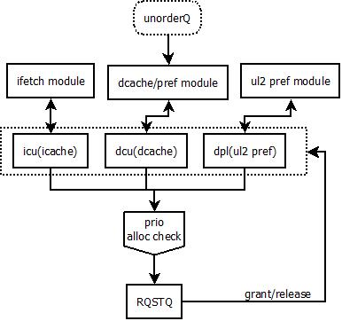

[TOC]

# 内存子系统(Memory)

## Memory系统架构


==TODO:检查下l1_hwp的路径是否正确==

Memory系统从处理器的主流水线看来，是一个用来访问内存的执行单元。在其内部，按照不同的存储层次划分为不同的memory实现层次。对于处理器来说，L1/L2 Cache属于处理器部分，外围通过Uncore接口与Uncore部分进行连接。

- L1d Part

  该部分也被称为MOB部分，实现处理器中Load/Store的指令语义，并且实现处理器中的内存一致性功能，是处理器中功能最为复杂的部分。对于SMT系统来说，此处的执行与SMT无关，MOB不关心当前执行的load/store来自于哪个phythread，但是对于MOB流水线中需要访问的若干存储单元，可能是SMT-aware的。从功能上看，MOB部分可以进一步分为如下几个部分：

  - LSU

    用于保存处理器执行的load/store的uOP。对于store来说，相对比较特殊，进一步分解为sta/std两条uOP，分别用于向整个内存子系统进行RFO(request-for-ownership)请求的sta和向store buffer写入数据的std。属于同一个store的sta/std指令在store buffer中占用相同index的buffer，对于sta分配sab，对于std分配sdb，sab/sdb组成完整的store buffer。load/store的分配在allocate流水线完成，如果load/store指令不能在allocate阶段完成分配，则相应的allocation chunk不能完成allocate逻辑。

    load buffer的释放在load uOP退休后进行释放；store buffer的释放较为复杂，即使sta/std已经退休，store buffer也不能释放，必须等到store已经"写出"才可以释放，所以，store buffer的占用时间远远大于处理器中其他buffer的占用时间。但是，对于处理器性能来说，因为load必须将数据load回来后，处理器才能继续进行计算，所以长延迟的load对于处理器的影响更大，更好的优化LTU(load-to-use)的时间更为关键

  - Load流水线

    Load流水线执行延迟为4cycles

    当某个load uOP在scheduler已经ready后，会通过load_agu0/ld_st_agu1两个执行端口(exec-port)发送到MOB中，并且在MOB的Load流水线中进行执行。Load流水线主要完成load读取指令的功能。

    因为无法预计load uOP的实际执行时延——因为load miss的存在，所以处理器在load上采用了投机策略——总是假设load在4T后返回数据，当load无法在指定的时间返回数据时，scheduler的主流水线需要某种机制进行投机的恢复——在***backend.md***的***投机唤醒***部分进行了介绍。

    对于load的读取，首先需要确定数据的来源，对于处理器来说，load的数据至少可以从3个方面获得：

    - 来自于程序序之前的某个store指令——对应store forwarding，在**backend.md**中有 MFP相关的memory renaming机制
    - 来自于Memory系统中的各级Cache或是DRAM
    - 来自于FillBuffer(由之前相同地址的load miss进行占用)

    当load在load流水线执行时，可能会遇到各种打断当前load执行的情况；此时，load会回到load buffer，等待load相应的stall原因解除，再由MOB重新调度执行

  - Sta/Std流水线

    Sta/Std流水线执行延迟为1cycles

    store指令在解码时会分解为sta/std两条uOP，但通常这两条uOP是micro-fusion的。当store的地址部分在scheduler中已经ready后，则对应的sta指令会通过ld_sta_agu1的执行端口发送到sta流水线。sta的流水线主要进行load/store之间的violation检查，并将自身放入staprefetch的queue中，等待进行sta的prefetch。当sta在sta流水线执行时，可能会遇到各种打断当前sta执行的情况；此时，sta会回到sab buffer，等待sta相应的stall原因解除，再由MOB重新调度执行

    当store中数据部分在scheduler中ready后，则std会通过miu_std的执行端口发送到std流水线。std流水线非常简单，直接把对应的数据写入std对应的sdb中。由此可以看出，store buffer承担了一部分的cache功能，在store完成到store写入内存子系统这段时间，store buffer中的数据可以forwarding给相同地址的load指令

  - Store流水线

    Store流水线执行延迟为4cycles

    当store指令的sta/std指令已经从ROB中退休后，当前store进入"senior"状态——表明当前store可以进行memory的回写了。对于x86处理器来说，store的回写必须按序回写，且回写的对外可见(global observe)也必须是按序可见的。所以，对于store流水线来说，store buffer会从当前最老的store开始进入store流水线执行，如果进入流水线的store可以正常完成，则后续所有的store回写可以pipe写入；否则，后续的store会replay，重新进入store流水线进行尝试。对于store来说，正常完成表示：

    - store在L1D cache hit，则data直接写入L1D cache
- store在L1D cache miss，但是可以push进入fill buffer
  
  - MOB重执行逻辑

    对于load/sta指令来说，当其在load/sta流水线遇到各种打断当前load/sta执行的情况时，会回到load/sab buffer中等待stall原因解除。当stall原因解除后，load/sta会被唤醒，并重新进入主流水线中的schedule流水线开始新的执行过程。当有多个load/sta被唤醒的时候，这些load/sta可能来自于不同的phythread。所以在决定load/sta访问主流水线的schedule阶段时，需要一次phythread的仲裁

  - FillBuffer控制逻辑

    当store/load出现L1D cache访问miss的情况，则会push进入fill buffer，由fill buffer代理访问下层的内存子系统——这里为UL2 Cache。对于load来说，fill buffer的作用比较单纯，仅仅是把data load回L1D Cache即可，但是对于store来说，需要在fill buffer中考虑memory consistency的问题——即store的顺序问题，对于支持OoO RFO(Out-Of-Order RFO)的处理器，在store分配fill buffer的同时，需要分配GoB(Global-Observe-Buffer)单元，用于控制store的回写顺序

  - TLB/PMH逻辑

    对于load/sta流水线来说，因为目前软件的load/store指令使用的地址全部是VA(virtual-address)地址，所以需要进行页转换(Page-translation)到PA(physical-address)，这一部分的工作由TLB(translation-lookaside-buffer)/PMH(page-miss-handler)部分完成。对于TLB来说，其有2级TLB组成，只有2级TLB全部miss的时候，会使用PMH单元进行页表的访问；在页表访问的过程中，处理器提供了4K页的页目录缓存(PDECache)，如果PDECache命中，则PMH只需要在进行一次页表访问拿到正确的物理页映射即可；否则 ，PMH需要根据多级页表结构逐级从内存子系统中获取页表信息。对于PMH来说，其需要访问的页表数据只会存在于UL2以下的内存子系统中。

  - L1D Hardware Prefetcher逻辑

    ==TODO：待补充==

- UL2 Part

  为处理器提供了更大的二级缓存，每个处理器核心私有。对于目前的大部分应用而言，大部分时间的处理是UL2 hit的(对于最新的benchmark，可能UL2的大小也要相应增大)。UL2的部分主要包括3个部分的内容：

  - RQSTQ

    UL2的核心缓存，用于缓存来自于MOB的load/store miss请求，以及本地ul2 hardware prefetcher产生的prefetcher请求。RQSTQ不仅仅用于缓存各种请求信息，同时用于发起对于ul2流水线的访问，如果ul2 miss，还要负责发起对于Uncore流水线的访问。所以，对于UL2 Cache，其整体设计为RQSTQ的entry状态机驱动的设计，所有的访问全部由RQSTQ进行发起

  - UL2流水线

    用于访问UL2 Cache的流水线。处理器中，UL2 Cache被设计为sequential结构——先访问tag，tag hit的情况下再访问data，不同于L1D Cache的parallel结构——tag/data同时进行访问。在此种结构下，一次UL2 Cache hit的延迟为8cycles。当UL2 Cache tag访问miss时，会通知对应的RQSTQ entry表明相应的请求需要访问Uncore部分。每周期可能存在多个RQSTQ entry需要访问UL2 Cache，这些请求可能来自于不同的phythread，所以在UL2的流水线仲裁阶段，需要进行phythread间的仲裁

  - Uncore流水线

    当RQSTQ中的请求访问了UL2 Cache，但是为miss或是本身就是需要上Uncore进行访问的请求，则通过Uncore流水线请求Uncore模块的服务。在请求Uncore模块服务时，同样需要多个RQSTQ请求见的仲裁，这些请求也可能来自于不同的phythread，同样需要进行phythread间的仲裁。

- Uncore Interface Part

  处理器Core部分与Uncore部分根据不同的事务类型，使用不同的通道进行传输。在目前的设计中，主要包括5个传输通道。这些传输通道的功能在后续的"**Uncore接口**"部分进一步介绍

## Memory系统资源划分

对于SMT系统而言，一个物理核心需要支持多个逻辑核心，所以在处理器内部，有些资源为每个逻辑核独有，有些则为多个逻辑核心共享。下面，是memory系统各个资源的分配情况

| 资源名称          | 说明                                          | 资源总大小                                                   | SMT-2的分配策略  |
| ----------------- | --------------------------------------------- | ------------------------------------------------------------ | ---------------- |
| **<u>MOB</u>**    |                                               |                                                              |                  |
| LoadQ             | 可以同时处理的Load uOP数量                    | setting_num_lb(48)                                           | static partition |
| StoreQ            | 可以同时处理的Store uOP数量                   | setting_num_sb(32)                                           | static partition |
| StaPrefetchQ      | store中sta uOP的stapref 数量                  | setting_sta_pref_queue_size(32)                              | shared, no tid   |
| L1D Cache         | L1D Cache，包括Evict buffer                   | setting_dl1_size(32K), setting_dl1_assoc(8)，evict_buffer(16) | shared, no tid   |
| FillBuffer        | 当L1D出现miss时，可以同时进行的memory访问数量 | setting_rb_entries(10)                                       | shared, tid      |
| GoB buffer        | store OoO的RFO处理管理结构                    | setting_rb_entries(10)                                       | duplicated       |
| iTLB              | instruction TLB的VA->PA翻译                   | setting_itlb_entries(128), setting_itlb_assoc(4)             | static partition |
| dTLB              | data TLB的VA->PA翻译                          | setting_dtlb_entries(64), setting_dtlb_assoc(4)              | shared, tid      |
| sTLB              | seconde level TLB                             | setting_stlb_entries(512), setting_stlb_assoc(4)             | shared, tid      |
| PDECache          | page cache，缓存4K页目录信息                  | setting_pde_entries(32), setting_pde_assoc(4)                | shared, tid      |
| MDisambTable      | 用于内存消歧的预测表                          | setting_mdisamb_entries(64)                                  | shared, no tid   |
| **<u>UL2</u>**    |                                               |                                                              |                  |
| RqStq             | UL2的request buffer                           | setting_rqstq_size(16)                                       | shared, tid      |
| SnoopQ            | 缓存来自于Uncore的Snoop请求buffer             | setting_fsq_size(128) + 1                                    | N.A.             |
| UL2 Cache         | UL2 Cache，包括Evict buffer                   | setting_ul2_size(256K), setting_ul2_assoc(8), evict_buffer(16) | shared, no tid   |
| **<u>Uncore</u>** |                                               |                                                              |                  |
| UL3 Cache         | UL3 Cache, 包括Evict buffer                   | setting_l3_size(8M), setting_l3_assoc(8), evict_buffer(16)   | shared, no tid   |
| MTI Buffer        | 用于缓存来自于不同Core的不同类型的请求        | mti_size(64)                                                 | shared, no tid   |

## 缓存层次结构(Cache Hierarchy)

在当前处理器中，缓存层次一共分为3层——L1(I/D)/UL2/UL3；L1(I/D)/UL2属于Core内，UL3属于Uncore部分。L1(I/D)与UL2之间的关系为非包含非排他(Non-Exclusive-Non-Inclusive, NENI)，UL3则为Inclusive Cache，所有在L1(I/D)和UL2出现的cacheline，都会在UL3中进行分配和记录。

L1(I/D)和UL2之间的NENI关系主要体现在UL2在进行cacheline的evict时，不会向上嗅探(snoop)L1(I/D)。在这种情况下，某些L1(I/D)的cache line不会出现在UL2中；但是如果某些cacheline在L1(I/D)本身就没有，则需要先通过UL2进行读取，然后传递到L1(I/D)中；对于L1(I/D) evict的cacheline，不采用"写分配(write-alloc)"的策略，即如果evict cacheline在UL2 miss，则直接写入到Uncore部分，不会将cacheline写入UL2。在这样的设计下，当下层有snoop请求时，snoop请求必须同时发送到L1(I/D)和UL2同时进行snoop。

UL3作为Inclusive Cache，包含所有Core的L1(I/D)、UL2的所有cacheline，其主要的作用除了提高处理器访问内存的速度，更主要的作用为作为Snoop-Filter——UL3缓存了cacheline的所有状态，知道cacheline被哪些L1(I/D)/UL2拥有。这样，当来自于FSB的snoop请求发送到当前的Package时，UL3可以较少Package内部的snoop请求。但是对于当前的模拟器设计，没有采用这种方式，当UL3收到一个snoop请求时，会给所有的Core的L1(I/D)/UL2发送snoop请求。

对于模拟器来说，snoop请求只会snoop dl1/il1/ul2 cache，不包含FSB发送到uncore的snoop，所以当前的模拟器无法实现多package的SMP系统。

==NOTE: 对于当前的snoop实现策略，不snoop fillbuffer，可能会存在内存一致性问题，参见"***内存一致性***"讨论

### Cache Coherence

处理器中的Cache Coherence采用MESI协议进行Cache状态间的同步，但是对于目前的模拟器来说，其实现的MESI协议并不正确，如下图所示(属于错误的实现)——所以对于目前的模拟器，其只能模拟SMT的单核结构


## TLB和PMH

TLB和PMH用于进行虚拟地址到物理地址的转换过程。在当前的处理器设计中，TLB和PMH的结构和关系如下


为了加快VA->PA的转换速度，TLB/PMH提供了多级缓存结构，其流程如下

1. request首先访问dTLB，如果dTLB hit，则VA->PA的转换由dTLB翻译，不引入额外的penalty
2. 如果dTLB miss，则request请求PMH的服务
   1. 首先请求crb buffer(setting_crb_entries(1))。目前的设置，PMH可以同时最多为1个request服务
   2. 如果请求crb失败，则根据request的phythread id分配prb buffer
3. 当请求分配了crb entry后，访问sTLB(seconde TLB)，如果hit，则将对应的data填入dTLB，请求再次访问dTLB
4. 如果sTLB miss，则访问PDE Cache
5. 如果PDE Cache(只缓存4K page) hit，则页目录项hit，Page Walker只需要访问一次PTE页表即可完成转换，更新sTLB
6. 如果PDE Cache miss，则Page Walker需要根据CR3的值遍历各级页表，当页表遍历完成后，更新PDE Cache和sTLB。==NOTE: 当前实现，对于页表目录的访问只有一次访存，可以认为对于当前实现，只有2级页表访问，如果有多级页表访问，这里实现不正确==
7. Page Walker不访问DL1，而是直接访问UL2 Cache
8. 当crb的访问结束后，phythread间的prb进行仲裁决定由哪个pending的request开始进行PMH的访问

### PMH的冲裁

#### prb->crb

当crb释放后，如果当前的phythread的prb有等待的request，则多个phythread间需要进行冲裁决定哪个phythread可以进行PMH的访问。仲裁的策略

```c
int thread_arb()
{
    // initial: prb_thread_sel = (last_crb_thread + 1) % num_thread
    for (prb_thread_sel != last_crb_thread) {
        if (prb[prb_thread_sel] != INVALID)
            break;
        prb_thread_sel = (prb_thread_sel + 1) % num_thread;
    }
    
    update_crb(prb[prb_thread_sel]);
    release(prb[prb_thread_sel]);
    last_crb_thread = prb_thread_sel;
    prb_thread_sel = (prb_thread_sel + 1) % num_thread;
}
```

#### request->prb

当phythread无法分配crb buffer时，需要分配prb单元，如果当前prb单元已经被其他的request占用，则判断

- 当前请求在程序序上老于prb的占用单元，则进行抢占
- 当前请求在程序序上新于prb的占用单元，则分配失败

### CRB状态机

当request分配了crb buffer后，则按照一定的状态机进行request的处理，如下图


当crb的状态处于WK_PTE/WK_PDE时，则crb需要请求page walker进行页表的读取，页表的读取直接发送到UL2 Cache，不经过DL1 Cache。在page walker进行页表读取时，当前处理器实现了两种策略

- 多个request的访问可以并行处理——多个request页表的访问可以穿插，!pmh_does_not_block_stlb_hit(0)
- 某个request的访问独占page walker，直到所有的页表已经读取完成，pmh_does_not_block_stlb_hit(0)

对于目前的crb的设置，这里的策略实际上不起作用

### VA2PA时序

这里实现的VA2PA时序是一种模拟，并不完全精确反映硬件的VA2PA的翻译时序。对于模型来说，只有VA2PA的翻译需要使用page walker时，才会引入额外的时序，否则可以认为为0T完成——从另外一个侧面来说，只有使用page walker时，这部分延迟是无法被MOB流水线进行隐藏的


## MOB流水线

MOB流水线主要完成如下几方面的工作：

- load/store的pipeline处理
- load/store间的转发处理
- cache一致性和memory一致性的处理

MOB的复杂性主要在于load/store的乱序执行和为了维护cache/memory一致性而引入的复杂处理

### Load流程处理

load在现代处理器中，是重点优化的对象——大多数后续的指令都会等待load的数据进行后续处理，所以load-to-use的延迟是衡量现代处理器性能的一个指标，针对load-to-use在处理器中主要集中于如下几方面优化：

- 各级缓存的延迟优化
- prefetch策略设计

对于MOB中的load流程，则更多的为了保证功能的正确性——load的数据是正确的；并为了减少一些load的投机处理引入的额外流水线开销。在当前的模拟器中，load的执行延迟为4cycles——在现代处理器中，MOB的load延迟基本没有更多的优化空间(可能coner-case还存在优化空间)，Intel的各代处理器的Load的执行延迟为4-5cycles。这里的执行延迟特指load hit DL1 cache的情况。下图为当前模拟器Load流程时序图


load的流水线处理流程如下

- scheduler pipeline

  - 当scheduler调度一条load uOP通过exec-port执行时，MOB unit开始内部的load的流水线处理流程
  - 在scheduler调度load uOP执行时，会假定load在4cycles后返回，所以按照假定的延迟开始后续依赖指令的调度
  - 如果load没有在scheduler假定的时间返回有效数据，MOB会发送cancel信号到scheduler流水线，由scheduler负责将已经投机唤醒的依赖于load的uOP全部cancel掉，重新等待调度执行(==NOTE: 这里描述的只是实现逻辑概念，不对应具体的硬件实现==)

- MOB unit

  - AGU

    load指令进入MOB的load流水线开始执行后，首先需要完成VA地址的计算，这个过程由AGU(address-generator-unit)完成。对于x86处理器来说，有众多的寻址模式，其中比较复杂的寻址模式为SIB中的scale/index——[base+scale*index]，当寻址中包括index寄存器时，AGU需要额外的scale\*index的操作。对于某些Intel处理器 ，这类复杂的AGU操作只能在某些特定的exec-port上完成。例如Haswell，sta可以在p237执行，但是包含index寄存器的sta只能在p23执行

  - Pipeline visit

    当AGU计算完成后，load开始进行pipeline的访问。从上图可以看出，这里的pipeline访问主要分为两条主要的分支

    - store-check
  
      为了保证load读取数据的正确性，load需要检查程序序上比其老的store指令与其地址有冲突，如果存在此种情况，则load必须从store获取数据，而不能直接从cache或是memory读取数据。load在allocate阶段进行loadQ分配的时候，会在相应的uOP上标记当前storeQ的分配位置(此位置到store head之间的store为比当前分配load uOP老的store uOP，在模型中被称为store-set)。在当前store-check的pipeline访问中，load仅仅查看store-set中的store的情况，这里进一步分为两种情况：
  
      - unkown-address check
  
        store-set中如果存在store uOP还没有计算出有效的VA地址的情况，则当前load存在violation，需要回到loadQ，等待合适的时机再次执行。
  
        Intel处理器之所以采用这样的策略，在于当store的地址没有计算出有效的VA地址前，load/store之间的地址依赖关系无法进行计算，此时load无法判断出unknown-address的store是否可能与load存在冲突；如果load忽略可能冲突，进行访问，如果后续store计算出VA发现存在冲突，按照目前的Intel处理器处理store/load memory-order的机制——"machine clear"(参见***backend.md***)，会造成很大的流水线代价；所以，遇到此种情况，处理器选择了一种保守策略，等待所有store-set中的store都计算出有效VA。此过程被称为”***内存消歧***“过程。
  
        后续的小节中，会介绍Intel处理器中引入的一种投机技术，用于加快内存消歧的延迟。
  
      - store violation/store forwarding
  
        store-set中所有的store已经全部计算出有效的VA后，则需要判断其中是否存在与当前load之间存在地址冲突的情况，并且判断在存在冲突的情况下，是否可以进行forwarding——对于已经在allocate阶段通过memory renaming技术(参见***backend.md***)解决的store-forwarding不在此考虑范围。
  
        整个store-set的搜索过程从较新的store向较老的store方向进行搜索(==NOTE: 模拟器的实现策略，真实HW会同时进行比较，并通过age进行优先选择==)。当找到与当前load存在地址冲突的store时，则停止搜索。
  
        如果找到了与load存在地址冲突的store，进一步判断load和store之间是否存在forwarding的可能性——即load能否不通过cache，直接从store buffer中将data传递给load；这被称为”***写转发***“。写转发的各种情况会在后续小节中详细说明。这里重点强调两点：
  
        - store/load地址冲突的检查使用VA进行比较，但是会用PA进行验证
        - 当出现地址冲突的情况时，表示当前load存在violation，除了store可以forwarding数据给load，且store的数据是ready的——数据经过std已经写入sdb。
  
    - DL1 cache
  
      load在访问store-check的pipeline的同时，会进行DL1 cache的访问。因为cache访问端口结构设计上的限制，并不是每次load都可以顺利进行cache访问，此部分称为"cache violation check"，会在”***DL1 Cache结构***"小节进行详细说明。
  
      当load通过检查可以访问DL1 cache后，使用VA[11:6]同时访问tag-array和data-array(parallel-cache)，并在TLB返回对应的PA后，使用PA进行进行tag-array的match比较，如果存在hit且满足MESI协议要求(参见"***Cache Coherence小节***")，则将data-array对应数据返回；否则继续检查fillQ，查看fillQ中是否包含load需要的数据(smb|lmb)，当fillQ中包含load需要的数据时，load从fillQ forwarding数据，并完成；否则如果load与fill queue为partial hit或是miss，则load为miss，在action handler中决定是否放入fillQ中进行后续的miss处理
      
      ==TODO: 补充fillbuffer partial hit的情况说明==
  
  - Action handler
  
    经过上面pipeline visit的处理后，所有的处理结果会在action handler中进行决断，判断当前load是否存在violation，在存在violation的情况下，是否可以开始进行miss流程的处理——即放入fillQ中，访问下一级的memory子系统。
  
    当action handler判断当前load存在violation时——不能按照scheduler的要求在确定时间送出正确数据，则load的状态会被更新到load对应的loadQ entry，当前load进入sleep状态，并且snoop相应的wake信号从而进行重新执行；同时，MOB会给scheduler流水线发送cancel信号，用于cancel掉已经被投机唤醒的依赖于load的uOP，使得它们重新回到"wait"状态，等待重新调度执行。
  
    在存在violation的情况下，需要判断load是否存在miss的情况——可能DL1 cache是miss，但是store/load可以forwarding或是fillQ forwarding——此种情况实际上不算做miss，当存在miss时，则查看fillQ中是否已经包含相同的request，如果没有包含则放入fillQ中，包含了则等待该fillQ entry读取数据
  
    如果不存在violation情况，则当前load"正确"完成，可以在scheduler确定的时间送出正确的数据，并顺利完成(complete)，等待退休(retirement)。
  
    整个action handler的处理在”***violation分类和唤醒***“小节进行描述

从上面的描述中，可以看到load的数据来源有3个

| 来源            | 说明                                                         |
| --------------- | ------------------------------------------------------------ |
| older store     | 优先级最高，只要可以forwarding，最新的数据一定来自于这里     |
| DL1 cache       | cache hit的情况下，最新的数据从cache读取                     |
| fillQ(lmb\|smb) | cache miss的情况下，最新的数据已经存在，但是还没有填充到DL1 cache中 |

#### 内存消歧(Memory Disambigeous)

因为backend乱序处理的特征，有很大的概率会导致load的store-set中存在unknown-address的store存在，从而导致load必须进行等待。但是，大多数情况下 ，unknown-address store的VA与load的VA并不一致，所以这种等待是无必要的。为了解决此问题，处理器设计了一种投机策略，用于投机预测load与其store-set中的unknown-address的store间是否存在地址冲突

- 如果预测不存在冲突，则投机的执行load，而不考虑unknown-address store
- 如果预测存在冲突，则退回到unkown-address check的路径

下图是一个关于memory disambigeous的例子


处理器中的mem_disamb表，用于投机预测memory disambigeous

**表结构**

| size                        | index                                                        | entry              |
| --------------------------- | ------------------------------------------------------------ | ------------------ |
| setting_mdisamb_entries(64) | index = {msb_xor_bit, lip_directly_bits}<br />    msb_xor_bit =^ lip[high:low], 缩位为1位<br />    lip_directly_bits = lip[low:0]<br />setting_mdisamb_num_lip_bits_to_xor(4)<br />setting_mdisamb_num_lip_bits_to_use_directly(5)<br />high = 4+5 = 9, low=5 | saturation counter |

**mdisamb表的处理流程(总结不同流水阶段的流程)**


- uOP与mdisamb相关的扩展字段

  | 添加的域         | 含义                                                         |
  | ---------------- | ------------------------------------------------------------ |
  | mdisamb_allow    | 表明当前load为mdisamb_load，即遇到unknown-address store，也不需要violate，而是投机继续MOB load流水线执行；当前只有counter > 15才允许设置为mdisamb_load |
  | mdisamb_reset    | 表明当前load对应的mdisamb表中entry的counter清零              |
  | mdisamb_update   | 表明当前load hit了一次unknown-address store，可以对mdisamb表中的counter+1；是否可以+1，需要看是否设置了mdisamb_reset标志 |
  | mdisamb_done     | 表明当前mdisamb_load已经投机完成执行；此标志用于old store进行mdisamb violation检查使用 |
  | mdisamb_bigflush | 表明当前mdisamb_load投机完成，但是与old store有冲突(old store比mdisamb_load后执行)，所以mdisamb_load读取了错误的结果，需要进行machine clear；此标志在retire阶段进行检查，并触发相应的machine clear |

- schedule phase

  当load uOP调度执行时，通过lip查看mdisamb表中的counter。如果当前counter>15则设置mdisamb_allow标志表明为mdisamb_load，否则为normal_load

- MOB load exec phase

  load在MOB的load流水线执行时，需要进行unkown-address store检查，如果当前为mdisamb_load，则即使发现unknown-address violation，也可以继续执行；否则，设置mdisamb_update标志，并触发load的violation流程(参见"***violation分类和唤醒小节***")

- MOB store exec phase

  store的流水线流程是对投机执行的mdisamb_load执行结果的一次检查。当store与load之间存在mdisamb violation的情况时，相应的load的mdisamb表对应的counter需要清零；如果存在mdisamb_load已经完成的情况(mdisamb_done设置)，则需要设置mdisamb_bigflush表示需要触发machine clear。==TODO：看起来配置VA[11:3]进行store/load的检查是有些问题的，因为mobline\=16B，是否应该使用VA[11:4]==

- retire phase

  根据load uOP上的mdisamb相应的扩展位进行相关处理。具体流程参考上面流程图

#### 写转发(Store-Forwarding)

当load和store之间的VA都已经计算出来后，会进行store-forwarding的检查，判断load与store之间是否存在地址冲突，如果存在冲突，是否可以进行写转发(store-forwarding)。store/load的地址冲突只能发生在相同phythread的硬件线程中，因为存在多个VA映射到相同PA的情况，必须使用PA进行检查；对于store-forwarding的情况，则进一步必须使用PA全地址进行检查。

在介绍store-forwarding和地址冲突检查之前，需要先介绍fast-forwarding和unaligned forwarding概念，这在Intel处理器中也被称为SFB(store-forwarding buffer)规则——SFB是用于store-load forwarding的硬件逻辑。[==NOTE：实际的硬件实现比这里列举的要复杂==]

- fast-forwarding(SFB rule)

  此种情况下，store.PA == load.PA && store.size >= load.size。即这种store-forwarding只能发生在store的地址与load的地址为相同的情况下

- unaligned forwarding

  不属于fast-forwarding的情况，都属于unaligned forwarding的处理范畴。目前的处理器中支持的unaligned forwarding的条件(”&“关系)
  
  - setting_handle_unaligned_fwds(1)，unaligned forwarding的总开关
  - load.PA < store.PA && load.PA_END <= store.PA_END
  - setting_handle_unaligned_32_fwds(1) || store.size != 4，4B store forwarding
  - setting_handle_unaligned_128_fwds(1) || store.size != 16，16B store forwarding
  - setting_forwarding_smaller_unaligned(1) || ((setting_unaligned_fwd_naturally_aligned(1) && (store.PA % store.size\==0)) || (!setting_unaligned_fwd_naturally_aligned && (store.PA % 4\==0)))，!4B/16B store forwarding，必须是nature aligned或是4B aligned

当不属于上述两种store forwarding情况时，但是store/load地址有冲突，则load不能从store进行forwarding，必须一直等待该store commit——数据已经写入DL1 cache或是fillQ，然后load才可以继续执行，从cache或fillQ中读取最新数据。

目前模拟器中实现了两种store/load地址冲突的检测方式，==NOTE: 无论是哪种方式，都不能是跨page的==；目前处理器中指令最大的内存访问宽度为16B，所以一次store-forwarding的最大宽度为16B(mobline)

##### 方式1(目前使用中)

1. 根据load计算出的VA地址与store_set中的store地址进行冲突检查

   1. store.VA[15:4] \= load.VA[15:4]
   2. store与load的地址存在overlap
   3. 对于setting_mob_partial_fwd_check(0)的情况，进一步检查load/store跨mobline的情况

   当符合上述2个条件时，则标记store/load为seriesold_mob_hit_partial

2. 根据load转换后的PA地址，与store的PA地址进行检查，是否可以forwarding则按照上面介绍的2种写转发机制检查(==NOTE: 这里的实现有问题，没有考虑跨page的情况==)；如果可以进行store-forwarding，则查看可以forwarding的store是否与seriesold_mob_hit_partial的相同，如果是，则当前load进行store-forwarding，否则load需要等待store commit才能执行

##### 方式2

此种方式考虑了跨page、跨cacheline、跨mobline的各种情况，所有的比较都基于VA(==NOTE: 这里实现的有问题，应该基于PA==)


**<u>Nehalem的写转发机制</u>**


#### Violation分类和唤醒

在action handler阶段，相关逻辑会根据pipeline visit阶段的临时结果对于最终的load的执行结果进行判断，如果存在violation的情况，则相应的load进入loadQ，等待重新执行，否则load进入complete状态。在action handler阶段，有如下violation的条件及相关的唤醒 条件
| cause(priority)<br />condition | wakeup condition                                             |
| --------------------------- | ------------------------------------------------------------ |
| DTLB_MISS(4)<br />load访问dtlb进行va->pa转换，但是dtlb miss | PMH填充dtlb之后<br />{req, DTLB_MISS}                        |
| STA_GURAD_WINDOW(5)<br />load执行时与store_set的store进行check，有任意一个store存在!va_valid | sta dispatch后，延迟setting_delay_sta_wakeup_of_loads(1) cycle，唤醒相应的load<br />{rid, STA_GUARD_WINDOW} |
| FORWARD_INCOMPLETE_ST(5)<br />对于可以进行store-forwarding的store，其std还没有完成，load必须等待data | std dispatch后，延迟setting_delay_std_wakeup_of_loads(1)cycle，唤醒相应的load<br />{rid, ST_FORWARD_INCOMPLETE_ST} |
| NO_SPLIT_REG_AVAIL(2)<br />split load需要占用split register，但是无法分配split register | release split register的时候<br />{NULL， NO_SPLIT_REG_AVAIL} |
| DL1_MISS(6)<br />load出现dl1/fillbuffer miss或是fillbuffer bypass miss<br />   1. smb collide<br />   2. lmb collide<br />   3. fb bypass fill | 1. smb dealloc(wc)<br />2. smb/lmb complete<br />3. lmb do replace(uc) ?? <br />4. l2 pipeline grant(swp)<br />5. ul2 miss, stapref queue scheme, wakeup collide load<br />6. rqstq prefetch promote(swp)<br />{req, DL1_MISS} |
| CANNOT_FORWARD(5)<br />load存在overlap的store，且不能进行forwarding | 1. store_retire, store写入dl1或是smb<br />2. sta/std执行出现了fault ??<br />{rid, CANNOT_FORWARD} |
| AT_RETIRE_PAGE_SPLIT(2)<br />!bogus的split_page_load<br />1. !oldest &&存在outstanding的store<br />2. 跨page访问 | 1. oldest<br />2. 没有outstanding的store<br />3. 所有的smb全部evict(invalid)<br />{NULL, AT_RETIRE_PLAGE_SPLIT} |
| SPLIT_LOAD(2)<br />1. !mem_renamed && no_std_forwarding && !bogus<br />     replay_count < 1(==NOTE: 模拟器实现有问题，已经使用split reg，这里的replay penalty应该不需要==)<br />2. 获得了split reg<br />     1. 仅获得split reg，还没有SPLITLOW<br />     2. !replay，处理SPLITLOW，还没有开始SPLITHIGH | 直接唤醒，下一个cycle参与mob schedule |
| ATRET(3)<br />uncachable load<br />     1. !oldest<br />     2. 存在outstanding的store<br />     3. smb存在没有evict的entry | 1. oldest<br />2. 不存在outstanding的store<br />3. smb不存在没有evict的entry |
| DTLB_MISS_NO_PRB(4)<br />pmh没有grant | release pmh.crb && release前crb是满的<br />{NULL, DTLB_MISS_NO_PRB} |
| DL1_MISS_NO_FB(6)<br />load/swp, lmb full | lmb dealloc<br />{NULL, DL1_MISS_NO_FB} |
| DL1_BANK_CONFLICT(6)<br />1. fb当前cycle正在replace<br />2. setting_dl1_bank_conflicts_loads(1), load上的dl1 bank read port的冲突(参见"***DL1 Cache结构小节***") | 每个cycle重试 |
| CHUNK_WAKEUP<br />不是violation，是一种wakeup的条件 | 对于dl1 miss的load<br />ul2的rqstq通过fill_dcu的datapath发送data<br />   1. req的地址与DL1_MISS等待的request相同，且返回的data覆盖request需要的data<br />{req, CHUNK_WAKEUP} |

### Store流程处理

处理器对于store的处理分为两个阶段：

- exec阶段

  store被分为2个uOP(sta/std)，其中sta用于计算store的address，并与loadQ中store之后的load进行比较，检查 load/store的order violation；std用于将store的数据写入store buffer中。这两个uOP的执行是乱序的。对于sta而言，处理器中实现了2种sta的prefetch机制

- retire阶段

  当sta/std执行完成，并且已经从ROB中commit后，store buffer还不能释放，此时的store buffer进入"sensior"状态，等待按序写入memory子系统。当store buffer中的数据写入了memory子系统后，store buffer才会释放

#### sta流程

sta uOP用于store的VA地址的计算，PA地址的转换，并根据相应的VA/PA地址进行store/load order violation的检查——因为unknown-address sta check的存在，这里的sta的地址检查实际上只需要针对投机预测的内存消歧的load进行检查即可；当sta计算出有效的地址后，处理器进行sta prefetch的处理——sta prefetch目的在于提前将store需要写入的cacheline读取到DL1 cache，并invalidate其他core中相同cacheline。在模拟器中，主要实现了两种stapref的方法

- stapref queue scheme(目前模拟器中实现的配置)

  

  在此种实现方案中，stapref需要等到sta uOP得到正确的PA地址后，才能分配进入stapref queue。该queue将stapref作为一种"load"进行处理(==NOTE: 这种实现下，stapref无法实现invalidate其他core中的相同cacheline的功能，不清楚为什么会有这样的实现方式==)。

  stapref queue类似于一种FIFO结构，queue.head代表当前最老分配的还没有处理的request，如下图所示

  

  | filed    | description                                                  |
  | -------- | ------------------------------------------------------------ |
  | valid    | 表明当前entry是否为valid                                     |
  | issue    | 表明当前entry是否已经经过stapref queue访问memory子系统       |
  | accept   | 表明当前entry的request已经被dl1/ul2处理，此时该entry已经处于完成状态——stapref并不需要真正的数据；如果request是miss，已经被ul2发送了uncore进行处理 |
  | req_type | 设置request type为STA_PREF                                   |
  | priority | 设置request的priority为prio_stapref，在ul2的仲裁策略中可能会用到 |

  每个entry处理状态机如下图(==NOTE: 模拟器实现中有bug，在entry complete时，没有设置issue\=1==)

  

  每个周期，stapref queue尝试从queue.head发送一个stapref到memory子系统进行处理其处理流程如下(==NOTE: 硬件不太关心stapref的性能==)

  

  需要说明的几点：

  - lmb alloc失败的条件：
    - 存在相同地址的request
    - lmb buffer已经满 

  ==TODO: ul2 miss的时候dealloc lmb后，数据如何写回dl1，还是不写回？==

- stapref pipeline scheme

  ==TODO：待补充==

#### std流程

std uOP的处理非常简单，通过miu_simd3的的执行端口(exec-port)进行发射执行，将相应的store的数据写入store buffer中，并等待retire。

#### retire流程

==TODO: 对于load如果hit了senior store，目前看来模拟器中没有实现这部分的forwarding或是check，因为模拟器只比较rob中in-flight的store，看起来实现不正确==

当sta/std uOP全部从ROB中退休后，则当前store处于"senior"状态——非bogus的store，等待进行顺序写出。此时，storeQ会根据当前的storeQ.head的指针顺序尝试进行store的commit处理，在此处理过程中，需要进行phythread之间仲裁，目前配置中，phythread之间仲裁采用INTERLEAVE_PHYTHREAD

store的流程相对于load的流程要简化很多，但是如果出现store miss的情况，在考虑memory ordering的情况下，store的处理流程会比较复杂。更多的store miss的情况的讨论请参考"***Fill Buffer流程***"。如下是store的处理流程


在处理器中，store的retire处理流程采用了pipeline的形式，所以当前发送到pipeline上的store请求不一定是storeQ中的head。当phythread的storeQ获得store pipeline的访问权后，从时序上看，整个store的pipeline处理主要分为如下两个部分：

- initial overhead

  arb_time < retire_time + overhead，更新store buffer到"senior"状态的额外开销。目前对于initial overhead的设置如下：

  - no split store， penalty=2cycles
  - split store, penalty=6cycles (==TODO: 不确定模拟器实现在这里的策略是否正确，这里可能是cache line split / page split，通常做法是split store需要上store pipeline两次，但是这里没有看到==)

- store pipeline

  对于store流水线来说，需要考虑store的memory order的问题，所以流水线上大部分的判断都是查看当前的store在什么情况下可以真正的完成写动作；当store可以正常完成时，则store可以每个cycle都commit一个store到内存子系统中。目前，在x86处理器中，有如下的情况当前在流水线上执行的store必须abort

  - issue != head；不符合store必须按序写出的要求

  - 当前的dl1 cache在同周期执行snoop/replace操作；cache port冲突(参考***DL1 Cache结构***)

  - dl1 cache hit，但是存在unobserved的store；不符合store按序写出的要求

    ```assembly
    mov [X], 0x1		; X miss & no seen by other cores(no snoop response)
    ............
    mov [Y], 0x5		; Y hit, but can't really commit; 
    					; otherwise, other cores will see
    					;		st Y
    					;		st X
    					;		violate memory order
    ```

  - dl1 cache miss，lmb中存在相同地址，来自于相同phythread的request；简化fillbuffer的设计逻辑，同一个地址只在fillbuffer存在一份

    - 特别地，如果lmb已经完成 && 有evict buffer可以使用，则进行cacheline替换

  - dl1 cache miss，smb中存在相同地址的request，出现如下两种情况；不符合store按序写出要求
  
    - hit wc store；wc store不会进行snoop，store完成的条件为出现在bus上，所以必须等待wc store完成
  
    - 不满足如下两种情况；不符合store按序写出要求
  
      - 相同phythread，match的为最后一次分配的smb(这里match的smb是store分配的) || 当前phythread没有unobserved store存在 || smb.is_stapref(只在stapref pipeline scheme成立)
  
        ==TODO: 不考虑smb.is_stapref的情况，另外两种情况判断看起来是有问题的，不一定符合memory consistency的要求，如何保证memory consistency，参见"***内存一致性***讨论"==
  
      - 不同phythread，smb.is_stapref(只在stapref pipeline scheme成立) || smb.observed
  
        ==TODO: 需要更多考虑==
  
  - dl1 cache miss，fillbuffer中不存在相同地址的request，需要push smb，smb full；fillbuffer资源限制
  
  当上述条件都不满足时，则store可以commit到内存子系统，依据dl1 cache/smb的hit/miss状态，进行不同的处理方式：
  
  - dl1 cache hit
  
    当dl1 cache hit，说明当前的cache line处于M/E的状态(==NOTE: 模拟器中实现不对，对于S状态也算作hit==)，则直接进行cache的更新
  
  - smb hit
  
    当smb hit时，说明当前store可以"安全"(不违反memory ordering的规则)的写入smb中。此时，对于WB/WC类型的store，新写入的数据与smb中原有的数据进行merge；特别地，针对WC类型，如果smb已经写满(64B都是有效数据)，则直接请求UL2 pipeline进行写出(WC类型的写操作不会写入cache中，而是直接通过FSB写入DRAM)。对于UC类型的store，则不会出现smb hit的情况，每个UC类型的store，都会单独占有一个新的smb(==NOTE: UC语义要求，不cacheable意味着每一笔store在bus中都可见==)
  
    ==TODO: 补充关于stapref pipeline scheme的情况==
  
  - allocate smb
  
    当上述两种情况都不满足时，则store会分配一个新的smb，并将数据写入到smb中。同时，相应的WB/UC类型的store会在GOB(global observable buffer)中分配新的单元用于追踪store的序状态(保证store的"memory ordering")；对于stapref pipeline scheme，只分配smb，但是不占用GOB单元。对于WB类型的store，完成上述操作后，可以请求UL2进行UL2的后续访问；而对于UC类型的store，则必须等待GOB中前面的所有store已经observable后，才能请求UL2进行后续访问——直接通过UL2的通道请求FSB。关于GOB的更多描述参见"***内存一致性***"讨论
  
  store commit后，需要进行如下一些收尾的处理：
  
  - 更新storeQ.head
  - 对于CANNOT_FORWARD的load，进行唤醒
  - 回收对应的storeQ entry，回收本身(需要1cycle)

#### 内存一致性(memory consistency)

在共享内存的SMP系统中，有一个问题是在"外部观察者"来看，多个核心对于共享内存的 操作顺序是如何的？哪些顺序是被允许的？对于这个问题的回答直接影响上层多核程序的设计——如何保证线程间同步的正确性


多核心对于内存的影响顺序，不同的处理器给出了不同的允许顺序定义，这些构成了内存一致性要求。

目前，内存一致性中最简单的协议为"顺序一致性"(sequential consistency)，其含义为：

- 核心内部顺序执行
- 核心间的内存顺序为interleave，但是属于同一核心的内存顺序等同于核心顺序执行

对于x86处理器来说，内存一致性模型不如SC模型严格，被称为"TSO(全局写一致性)"模型，其相对于SC模型，仅仅弱化了以下一点：

- 同一个核心中，LOAD可以超前于不同地址的STORE执行，但是属于同一个地址的STORE则不能超前

例如以下例子不符合SC模型，但是符合TSO模型

```assembly
;		Processor0						Processor1
		mov [X], 1						mov [Y], 1
		mov r1, [Y]						mov r2, [X]
; suppose [X]/[Y] initial 0, then r1=r2=0 TSO allowed, SC disallowed
```

为了实现上述TSO模型，模拟器中进行了如下实现：

- "全局可见性(obsered)"定义

  "observed"定义了单一核心中的load/store执行的结果(或者对于内存发生的影响)何时会被系统中的其他"参与者"观察到(即无论从cache或是内存中观察到的值都是该操作发生后的结果)

  - 对于load，observed被定义为load被commit后，即load指令从ROB retire

  - 对于store，情况较为复杂

    - dl1 cache hit E/M， 则直接observed，其效果由cache coherency保证

    - dl1 cache miss/hit S，则由GOB来确定，其实现如下

      GOB在retire store时当store miss时进行分配，所以GOB的分配为顺序分配方式，之所以使用GOB来管理store的"observed"，原因在于store的RFO请求的返回顺序有可能时乱序的，例如下面的例子

      ```assembly
      MOV [X], 1		; [X] miss in cache hiearchy
      MOV [Y], 2		; [Y] hit in dl1, then [Y] rfo return fast, but can't observed, should wait [X], then observed 
      ```

      GOB的结构如下：

      

      GOB结构中有2个指针，go_ptr和allocate_ptr，且每个entry中会有一个go信号的记录，只有当go_ptr所指向的entry.go=1时，才会变为observed，allocate_ptr用于在GOB中顺序分配GOB单元

      GOB单元中go信号的设置根据处理器中的"go"信号来进行设置，处理器中的"go"信号设置有如下几个位置：

      - ul2 hit
      - ul3 hit(同地址只会有一个entry为active entry)
        - no snoop
        - all snoop recv
      - ul2 rqstq/ul3 mti promotion entry match, already go
      - ul3 miss, FSB grant(FSB为总线结构，其中包含snoop phase，所以上了FSB总线，相当于已经发出了snoop请求)

- 同地址间的store/load冲突检查和forwarding，如果存在冲突，则load等待store完成

- store的按序commit，必须是退休后，store才能写入内存子系统

- snoop的范围(==NOTE: 个人认为，当前实现中snoop范围较小，下面是个人认为的一种可能实现==)。当前模拟器实现中，snoop仅仅包括dl1/il1/ul2等cache，但是这应该是远远不够的，考虑下面的情况

  ```assembly
  ;			Processor0					Processor1
  			(1)mov [X], 1				(3)mov r1, [Y]
  			(2)mov [Y], 1				(4)mov r2, [X]
  ; r1=1, r2=0 disallowed
  ; suppose [X]=0 in processor1 cached, so (4) will done fast and wait retire, due to (3)r1=1, means (1)/(2) all observed before (3)/(4), so when (1) executing, should invalidate complete/not retire (4), otherwise, is not TSO model
  ```

  ==NOTE: 下面的实现为个人推测==

  由上面可以看到，对于目前的模拟器实现，当进行snoop时，还需要snoop loadQ / fillQ

  - for load, 如果当前load已经完成，但是没有retire，如果遇到snoop2I的请求，需要进行replay；如果对应的lmb还没有写回，则被invalidate
  - for store
    - 对于!observed，smb需要replay
    - 对于已经observed的smb，如果数据已经refill，则直接返回相应数据；否则，等待数据refill后再响应

### DL1 Cache结构

DL1 Cache为了实现快速获取数据，被设计为VIPT(virtual-index/physical tag)，并行访问的结构(tag/data array同时访问)，目前模拟器中实现的DL1 Cache结构如下所示


从上面两幅图中可以看出当前处理器中DL1 Cache的设计特点：

- load/store之间可以并行访问；store/snoop需要进行arbitration，目前的设计是snoop的优先级高于store
- 当DL1 Cache存在replace的情况时，load/store都不能进行访问
- data array采用分bank的方式进行数据的存储，每个bank存储8B的数据，共分为8个bank；每个bank提供单独的读/写通道，不存在读/写冲突。但是因为每个bank只存在一个read port，但是处理器中有2条load流水线，所以当2条流水线访问相同的bank的时候会存在冲突，具体冲突条件由下面条件判断(&)：
  - load存在bank访问冲突
  - !load访问的地址完全相同，setting_dl1_bank_cnfl_excl_same_addr_ld(0)
  - !load访问相同的cache line，setting_dl1_bank_cnfl_excl_same_line_ld(1)
  - !load访问相同的set，setting_dl1_notld_bbc_same_set(0)
- DL1 Cache数据按照chunk进行管理，每个chunk为8B，对应一个data bank；DL1与UL2的数据接口宽度为32B，一次可以传输4个chunk
- DL1 Cache的访问，不仅包括对于tag/data array的访问，也包括对于fill buffer的访问。当fill buffer hit的情况下，数据可以从fill buffer直接返回或是数据直接写入到fill buffer中

### Fill Buffer流程

Fill Buffer作为DL1 Cache与UL2 Cache间的接口，用于并行处理Cache miss，增加处理器的MLP(Memory-Level Parallism)，可以为load/store服务，load对应的entry为lmb，store对应的entry为smb。在当前的处理器设计中，Fill Buffer被设计为全相联的存储结构，可以认为Fill Buffer是Cache的延申，每个Fill Buffer也包括MESI状态的转换和cache line的数据管理


对于FillBuffer来说，从上面图中可以看出FillBuffer的设计包含如下特征：

- 对于load/store，如果当前FB已经满了，则会占用reserved[tid]的预留寄存器，作为访问预留，预留的寄存器的占用完全遵循程序序，当有更老的load需要分配FB时，会直接抢占reserved[tid]预留寄存器；当FB有空余空间时，首先要先检查当前request与reserved寄存器中的请求关系，决定分配情况

  - tid_sel != req_tid, reserved[tid_sel] == -1 && reserved[req_tid] > uOP_seq
  - tid_sel == req_tid, reserved[req_tid] > uOP_seq

  对于tid_sel的更新在当reserved[tid_sel]释放的时候进行更新，如果另外一个phythread存在reserved[tid]，则tid_sel进行切换

- 同一个PA在FillBuffer中每个phythread只会存在唯一的entry

- 对于load来说，如果FB hit，且data可以从FB进行forwarding，则hit的entry不考虑phythread

- 对于store来说，如果FB hit，只要满足memory ordering的要求，则hit的entry不考虑phythread

- 对于load如果hit了FB中的store，store hit了FB中的load，则hit的entry必须是相同phythread

- EXT Bus(这里为UL2 Cache)与FillBuffer的数据总线宽度为32B，所以一次FB读取，需要连续2次数据总线操作才可以完成填充

对于Fill Buffer来说，load的操作相对简单，只需要处理uc/wb load即可；而store的处理相对复杂，需要处理uc/wc/wb store。这对于每一个smb来说，都是一个状态机转换，状态转换关系如下：


### MOB重执行(MOB re-schedule)

当MOB中等待的load/sta的block原因解除后，则相应的load/sta可以由MOB重新调度后进行执行。因为存在多个entry处于唤醒的状态，则需要进行多个entry间、phythread间的多级仲裁处理，整个MOB重执行的仲裁处理如下图所示


从上图可以看出，MOB重执行的仲裁主要分为4个阶段：

- LSU中ready的request之间的arbiter，load/sta分别arbiter， 按照程序序的优先级调度

- phythread间的arbiter，按照当前cycle的thread优先级针对每个执行端口(exec-port)进行调度，load/sta分别arbiter

  thread间采用time_interleave方式，每cycle更换优先级，如果当前cycle高优先级没有request，那么切换低优先级为高优先级

-  exec port上的request的优先级仲裁

  exec port有的可以同时支持load/sta操作，当有多个操作存在时，按照port的默认优先级进行调度，ld_agu0的load优先级高；ld_st_agu1的sta优先级高

- fb_bypass的request与exec port上的request优先级仲裁，参见"***fillbuffer bypass机制***"

  当存在fb_bypass的request时，总是优先选择fb_bypass的request

当相应的MOB中的load/sta获得了执行的机会后，该请求会重新执行scheduler流水线上如下的操作

- 计算当前uOP的执行latency，作为投机唤醒的条件
- 占用执行端口(exec-port)，则同cycle如果有新的uOP分配相同的端口则不能执行

## UL2 Cache

UL2 Cache是Core内的最底层模块，用于连接Uncore部分。其结构如下图所示：


UL2 Cache主要包含如下结构：

- UL2 Cache上层接口

  上层两个phythread通过该接口访问UL2 Cache。在目前的设计中，采用按时间序排序的方式进行访问的方式。参见"***UL2接口与仲裁***"

- RQSTQ

  所有从Core上层过来的访问都会进入RQSTQ进行缓存，整个UL2 Cache的控制流核心为每个RQSTQ entry的状态机流程，这部分是UL2设计的核心。对于UL2 Cache和Uncore的访问都是通过RQSTQ进行处理

- UL2 Cache流水线

  UL2 Cache采用serailize cache的设计结构，先访问tag array，在访问data array。对于UL2 Cache的访问主要包括有两个来源

  - 来自上层的到Cache的访问
  - 来自下层的snoop访问和refill访问

- SNOOPQ

  来自于Uncore的snoop请求，用于snoop上层的DL1/UL2 Cache

- External Interface——Uncore接口

  按照不同的功能组织的多个与Uncore的接口，参见"***Uncore接口***"

### UL2接口与仲裁



UL2与上层的接口主要分为3个部分(icu/dcu/dpl)，每个部分有一个request buffer，当buffer中的request没有grant的时候，则不能释放，新的request无法发送到UL2；3个部分通过优先级仲裁的方式分配RQSTQ。优先级关系见后面的"***UL2请求***"。这里需要重点说明的是：icu包括icache miss和icache prefetcher的请求；dcu包括fillbuffer、PMH、DL1 prefetcher的请求；dpl只包括UL2 prefether产生的请求；

#### UL2请求

下表详细罗列了各个请求的含义和对应优先级，需要特别说明的是 ，对于dcu的请求，请求没有进一步按照进行更详细的类型分类，完全按照时间序(PRIORITY_undisturb_ld)进行排序(如上图所示)

在进行RQSTQ分配的时候，会按照下表中的优先级进行RQSTQ的分配，其中的"**<u>dispatch-rate</u>**"表示当alloc check完成相应类型的request仲裁后，下次仲裁开始需要等待的时间，目前无论对于write/read，该延迟都是2cycles(==NOTE: 为什么不是下一个cycle就可以仲裁？==)

|                           | uop num                         | reqeust type   | priority(small is high)                | dispatch-rate               | ul2 req type |
| ------------------------- | ------------------------------- | -------------- | -------------------------------------- | --------------------------- | ------------ |
| **<u>MOB request</u>**    |                                 |                |                                        |                             |              |
| stapref queue scheme      | REQ_STA_PREF                    | REQ_TYPE_LOAD  | PRIORITY_stap<br />0x1ffffffffffffff9  | ul2_throughput(2cycles)     | READ         |
| stapref pipeline scheme   |                                 |                |                                        |                             |              |
| load                      | uop_num                         | REQ_TYPE_LOAD  | PRIORITY_undisturb_ld<br/>0x6          | ul2_throughput(2cycles)     | READ         |
| swp                       | swp=1, uop_num                  | REQ_TYPE_LOAD  | PRIORITY_undisturb_ld<br/>0x6          | ul2_throughput(2cycles)     | READ         |
| wb evict                  | REQ_EVICT, simuop=-1            | REQ_TYPE_EVICT | PRIORITY_dl1_evict<br/>0x3             | ul2_rfo_throughput(2cycles) | WRITE        |
| wc store                  | REQ_EVICT, simuop!=-1, mtype=WC | REQ_TYPE_EVICT | PRIORITY_dl1_evict<br/>0x3             | ul2_rfo_throughput(2cycles) | WRITE        |
| uc store                  | REQ_EVICT, simuop!=-1           | REQ_TYPE_STORE | PRIORITY_undisturb_ld<br/>0x6          | ul2_rfo_throughput(2cycles) | WRITE        |
| wb store                  | REQ_STORE                       | REQ_TYPE_STORE | PRIORITY_undisturb_ld<br/>0x6          | ul2_rfo_throughput(2cycles) | READ         |
| fetch/icache  pref        | REQ_FRONTEND                    | REQ_TYPE_FETCH | PRIORITY_fetch<br/>0x7                 | ul2_throughput(2cycles)     | READ         |
| l1_hwp_st                 | REQ_hwp_l1_st                   | REQ_TYPE_LOAD  | PRIORITY_hwp_l1<br/>0x1ffffffffffffffb | ul2_throughput(2cycles)     | READ         |
| l1_hwp_ld                 | REQ_hwp_l1_ld                   | REQ_TYPE_LOAD  | PRIORITY_hwp_l1<br/>0x1ffffffffffffffb | ul2_throughput(2cycles)     | READ         |
| **<u>UL2 request</u>**    |                                 |                |                                        |                             |              |
| l2_hwp_st                 | REQ_HWP_ST                      | REQ_TYPE_LOAD  | PRIORITY_hwp<br/>0x1ffffffffffffffa    | ul2_throughput(2cycles)     | READ         |
| l2_hwp_ld                 | REQ_HWP_LD                      | REQ_TYPE_LOAD  | PRIORITY_hwp<br/>0x1ffffffffffffffa    | ul2_throughput(2cycles)     | READ         |
| l2_wb_evict               | REQ_EVICT, simuop=-1            | REQ_TYPE_EVICT | PRIORITY_ul2_evict<br/>2               | ul2_rfo_throughput(2cycles) | WRITE        |
| **<u>Uncore request</u>** |                                 |                |                                        |                             |              |
| invalid snoop             | REQ_SNOOP2I                     | REQ_TYPE_SNOOP | N.A.                                   | N.A.                        | SNOOP        |
| share snoop               | REQ_SNOOP2S                     | REQ_TYPE_SNOOP | N.A.                                   | N.A.                        | SNOOP        |

### RQSTQ

RQSTQ为UL2 Cache的流程转换核心。UL2的设计以RQSTQ entry的状态机设计为基准。其状态转换过程如下


其主要包括如下状态

- INVALID

  当前entry为空entry，等待进行分配

- DONE

  当前entry已经完成数据的发送和接收、或者是hwp的entry，但是被新的请求实现了功能跃升(promotion)，参见"***RQSTQ promotion***"

- L3_ACCESS_PEND

  请求已经分配了RQSTQ，等待进行UL2 Cache的访问。在进行UL2 Cache访问时，需要进行phythread间的仲裁处理

- L3_ACCESS_INPROG

  请求已经被授权访问UL2 Cache，并在UL2 Cache中进行执行。随着Cache的访问结果，切换当前请求的状态机

  - UL2 hit，则请求转换到DONE，相关的data直接通过UL2和MOB的32B数据接口返回
  - UL2 miss，则请求转换到EXT_PEND状态，等待仲裁后，进行uncore访问

- EXT_PEND

  请求等待进行Uncore访问。在访问Uncore时，需要进行phtyread间和core间的仲裁处理

- EXT_INPROG

  请求已经被授权访问Uncore，通过不同的Uncore的request通道进行请求的发送，并将请求放入Uncore的MTI Buffer，进行后续内存子系统访问

- FILL_PEND

  请求收到了来自于Uncore的全部数据，等待进行UL2 Cache的填充处理

#### RQSTQ Promotion

当RQSTQ中已经存在了与当前请求地址相同的请求(不考虑phtyread)，则根据两个请求间的类型关系，由其中一个请求"吸收"掉另一个请求，这被称为"RQSTQ promotion"

| request                              | match entry                      | promotion                                     |
| ------------------------------------ | -------------------------------- | --------------------------------------------- |
| cachable load/sta queue scheme/fetch | swp/l1, l2 hwp                   | yes                                           |
| cachable store                       | !l2 hwp                          | yes,  if match.go=1, then request.go=1        |
| l1 hwp                               | l2 hwp                           | yes                                           |
| l1, l2 hwp/swp, !pmh request         | *(no include above 3 conditions) | yes, request deallocate                       |
| 上述条件都不满足，但是地址match      |                                  | no，request等待match entry释放后，再分配RQSTQ |

#### RQSTQ的phythread仲裁机制

对于UL2而言，有2个地方与phythread的仲裁有关，这两处的phythread的仲裁均采用PHYTHREAD_INTERLEAVE方式

- Tag pipeline arbitration

  RQSTQ内部，多个请求上tag pipeline的request按照push进入RQSTQ的时间序进行仲裁

- Uncore bus aribtriation

  RQSTQ内部，多个请求上uncore bus的仲裁参考下面"***Uncore仲裁***"小节

##### Uncore仲裁

对于Uncore的仲裁，在RQSTQ中采用如下的仲裁方式


Uncore的RQSTQ仲裁算法采用snapshot机制——当snapshot调度器中某一类的请求为空时，则针对该类型的请求对RQSTQ中设置"快照(snapshot)"，直到当前快照中的所有请求处理完成。

从上面的调度可以看出，snapshot调度器将请求分为WRITE/DEMAND/PRF三类，这3类分别对应的请求如下

- WRITE

  uc/wc store, evict

- DEMAND

  load, wb store

- PRF

  l1/l2 hwp, software prefetch

3类调度器间的仲裁策略

- DEMAND优先级最高，当优先级=DEMAND没有请求发送时，查看WRITE
- 优先级=WRITE没有请求发送时，如果DEMAND有请求，则改为DEMAND，否则为PRF
- PRF优先级最低，优先级=PRF没有请求发送时，改为DEMAND

### UL2流水线

ul2流水线的冲裁为固定优先级仲裁，来自于uncore的请求和数据具有较高的优先级，来自于core的对于ul2的cache请求则为低优先级。无论是哪种优先级，rqstq/snoopq中的请求都按照进入queue的时间序进行排队仲裁


#### fillbuffer bypass机制

在UL2流水线中，有一个投机机制被称为"fillbuffer bypass"，在uncore的UL3中同样存在相同的机制(==TODO: UL3中的实现和实际时序有点对应不起来，模拟器实现错误？==)。该机制的设计目的为当请求被UL2的授权访问UL2的tag array后，会立即给MOB发送bypass_ul2的wakeup信号，用于唤醒在MOB中等待该请求的load操作；如果当前UL2的访问为hit，则当load操作重新被调度上执行流水线时，等到最后一个cycle取数据时，UL2的数据刚好通过数据总线接口(32B)发送到MOB中，则load可以直接完成，减少了load的等待时间，该机制可以使用如下时序图进行表示


## Hardware Prefetcher


## 特殊情况

### Split Load/Store处理

### Lock处理

## Uncore接口

当前处理器中，Core与Uncore之间根据不同的请求和数据类型，实现了若干数据和请求通道

| 通道名称        | 数据类型                         | 管理方式                                                     | 方向         |
| --------------- | -------------------------------- | ------------------------------------------------------------ | ------------ |
| request         | prefetch/demand ld-st            | 多个core share，需要竞争uncore mti buffer；<br />采用credit管理，对于每个core，可以在uncore中分配的最大buffer<br />     1. demand 16<br />     2. prefetch，共享demand<br />     3. write 8 | core->uncore |
| core misc       | snoop msg /fill done msg         | duplicated，每个core单独拥有，无需仲裁                       | core->uncore |
| fill data       | data path ,32B                   | duplicated，每个core单独拥有，无需仲裁                       | uncore->core |
| uncore request  | snoop request                    | duplicated，每个core单独拥有，无需仲裁                       | uncore->core |
| uncore response | uc write done/ ul3 bypass wakeup | duplicated，每个core单独拥有，无需仲裁                       | uncore->core |

