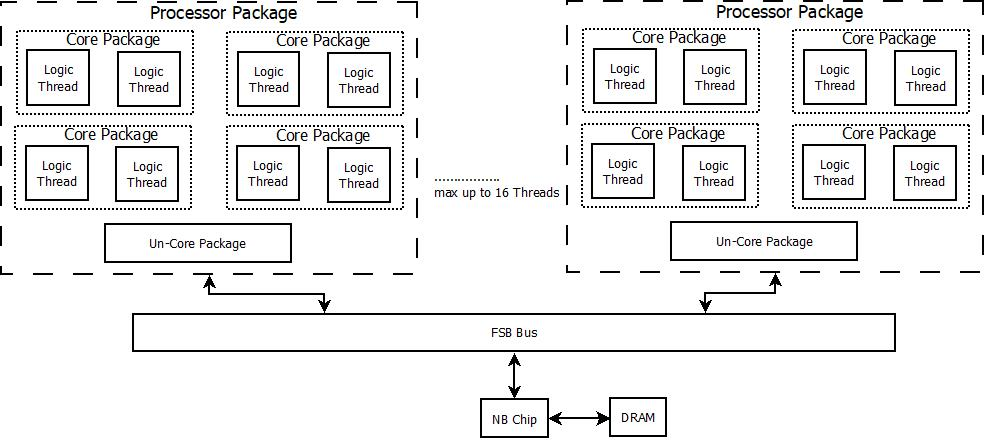
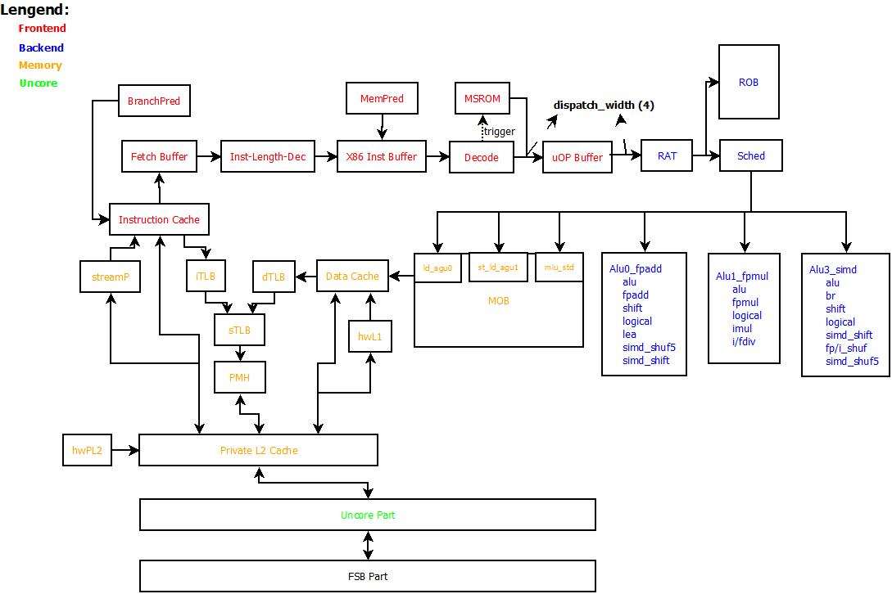
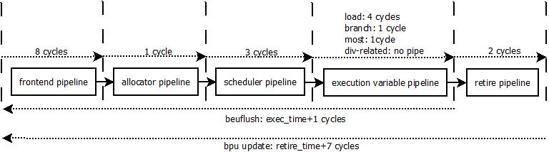

[TOC]

# 仿真系统架构

## System架构

- 系统最大支持2个Package
- 每个Package最大支持4个Core
- 每个Core支持最多2个Physical Thread
- 针对FSB总线之上的Core模型进行了详细建模
- 包含一个功能性的NB模型，用于中断信号的产生、memory image加载、仿真环境初始化和建立(包括页表的伪造)
- 没有针对DRAM进行建模

## Core架构

Core与Uncore在private L2 cache处进行切分，private L2 cache以上属于Core的架构逻辑，L2连接Uncore部分(模型中主要包括Unified L3 Cache)，Uncore负责连接片外的FSB总线，进而与北桥进行连接。

对于Core架构来说，主要分为如下4大部分：

- 前端(Frontend)

  前端主要按序(in-order)进行指令的抓取和翻译，并将x86的宏指令翻译为内部的微码表示(micro-OPeration)放入到uOP Buffer中，后续通过RAT(Register-Alias-Table)处理级将uOP发送给Backend，用于乱序(Out-Of-Order)处理。架构上，Frontend主要包括如下Stages：

  - Fetch

    处理器首先进行取值地址的预测(BPU)，根据预测的取值指针(LIP)，投机地访问iCache，进行指令的获取；在此过程中，需要访问i-TLB进行va->pa地址的转换，如果iCache出现miss，则需要进一步访问Private L2甚至Uncore以及Memory

  - Instruction-Length-Decoder(ILD)

    指令从iCache取回后，因为x86指令的变长(variable-length)属性，需要进行指令切分，识别出x86指令的指令边界，为Decoder解码做准备

  - Decoder

    针对放入到Instruction Buffer中的指令，进行x86指令解码，翻译为机器内部的uOP指令格式，并将翻译结果放入到uOP Buffer中

- 后端(Backend)

  从后端开始，处理器执行的指令已经没有x86指令，只有uOP的指令概念。后端从RAT(Register-Alias-Table)处理开始，一直到uOP指令执行完成，按序退休(In-Order Retire)之后为止。处理器的后端部分是处理器主流水线中乱序执行的核心部分，和处理器性能的主要贡献者。架构上，Backend主要包括如下Stages:

  - Allocator

    Allocator作为Frontend/Backend之间的桥梁，主要完成uOP指令从按序过程到乱序执行的过程；这个过程中，最为重要的步骤就是寄存器重命名(Register Renaming)和内存别名(Memory Aliasing)的处理。通过register renaming和memory aliasing的uOP发送到Scheduler，准备进行乱序执行，发送到ROB，等待执行完成后的顺序提交处理

  - Scheduler

    Scheduler是处理器内部乱序执行的发起者。Scheduler依据Allocator阶段标记的uOP之间的依赖关系(Dependency)，不再按序(In-Order)进行指令的调度执行，而是按照uOP依赖的数据流关系(Data-Flow)动态的进行uOP的调度执行；这种方式极大的增强了处理器后端的处理带宽。

  - Execution-Unit

    Execution-Unit是处理器中定义的各类指令功能的执行单元，是对处理器性能的直接贡献者——越多的执行单元——意味着处理器同周期可以执行的uOP越多。在目前的处理器设计中，Execution-Unit按照Port进行聚合——方便Scheduler更好的进行调度。在目前的模拟器中，模拟了Nehalem的后端执行单元，一共有6个可调度的执行端口(Execution-Port)，每个端口聚合的执行单元功能不同。

  - Retirement

    指令乱序执行完成后，需要按照原有的程序顺序进行提交(Commitment)，用于更新处理器的程序可见部分(软件可见寄存器、内存等)；同时，Retirement还进行处理器的异常和执行错误的处理，必要时，进行处理器流水线的刷新和机器状态的恢复 

- 内存系统(Memory-Ordering-Buffer)

  MOB实际属于Backend的一个执行端口(Execution-Port)，但是不同于处理器中的其他执行端口操作的是处理器内部的寄存器，MOB是处理器与外界唯一的数据交换接口。MOB是目前处理器中设计最为复杂的单元。好的MOB设计可以掩盖处理器访存的长延迟，提供良好的内存并行性(Memory-Level-Parallism)，且需要配合底层的Cache系统提供Cache一致性的管理(Cache-Coherence)和内存一致性(Memory-Consistency)的处理。目前的设计中，MOB部分包含了TLB/dCache/Prefetcher等主要模块

  Private L2作为Core与Uncore间的接口，主要用于提供程序执行时的时间局部性(Temporal-Locality)和空间局部性(Spatial-Locality)，并代理Core完成与Uncore部分的数据交换、一致性管理等功能。

## Core流水线综述

上图展示了模型中的Core流水线时序结构，因为模型模拟的机制原因，无法准确区分每一级流水线的功能，只能针对大的pipeline结构进行粗略的流水线划分：

- frontend pipeline

  占用8cycles，从处理器开始取值算起，直到x86指令译码后，存入uOP buffer中

- allocator pipeline

  占用1cycles，主要完成register-renaming/memory-aliasing的功能，并根据uOP的类型分配不同的backend资源，并将uOP发送到scheduler中

- scheduler pipeline

  占用3cycles，完成uOP的data-flow的乱序调度功能。当uOP从scheduler调度出去后，会根据执行端口进入不同的execution unit中进行执行

- execution variable pipeline

  执行latency不定，由uOP完成的操作类型决定。典型的：load-hit(4cycles)、most-uOP(1cycle)、branch uOP(1cycle)、div-uOP(depipe)

- retire pipeline

  占用2cycles，完成uOP的顺序退休、异常处理以及必要情况下的流水线刷新

在后面的spec中会一一介绍上述 pipeline完成的功能描述

## 特性列表

- 指令集支持到SSE2指令集
- 宏指令融合(macro-fusion)/微指令融合(micro-fusion)
- 堆栈引擎(stack engine)
- 发射宽度为4，每周期可以发射4条uOP
- 寄存器部分重命名(partial-renaming)
- move elimination/zero-idiom elimination机制
- branch periodic checkpoint机制——用于减少beuflush的stall时延
- 128层ROB，48层load buffer，32层store buffer
- 36层统一的scheduler
- 内存依赖预测(memory-forwarding-predict)
- 内存消歧(memory-disambiguous)
- 每周期支持2-loads或是1-load + 1-store，std有单独的port
- 执行消除机制(cancel-exec)或是P4架构的重执行机制(replay-loop)
- fast-lock机制，用于加快lock指令的执行
- 支持同步多线程(Simultaneous-MultiThreading)，物理核心最多支持2个逻辑核心
- 支持粗粒度多线程(Coarse-MultiThreading)，仅当物理核心只有一个活跃逻辑核心