# 龙芯sim-godson模拟器分析

------

## 概述

本文基于gitee上sim-godson的龙芯处理器开放源码模拟器进行分析。该模拟器具有如下几个特点 (所有特点均来自于计算所论文 "SimGodson_processor_simulator_based_on_SimpleScalar.pdf")：

- 按照龙芯的Loongson-2A处理器进行建模
- 基于simplescalar模拟器框架搭建，cycle-accurate，不能运行OS，不支持异常处理
- 与计算所内部的 信号级处理器模拟器进行精度校准，误差在5% (运行SPEC2000)
- 运行速度在~500KIPS

经过初步分析，目前放出的这版模拟器的状态为：

- 基于Loongson-2A处理器建模
- 包含NoC部分(Mesh架构)的建模
- 搭建的是一个16Cores的运行平台

鉴于Loongson-2A搭载的平台都是桌面级系统，3A开始有互联结构，所以该处理器应该是一个2A->3A之间的过渡作品，从源代码的注释中也可以看出，该模拟器由计算所多人进行修改，应该是从单核模拟在向多核、众核模拟过度。

------

## 龙芯 Loongson-2A处理器参数指标

- 龙芯2A处理器参数

  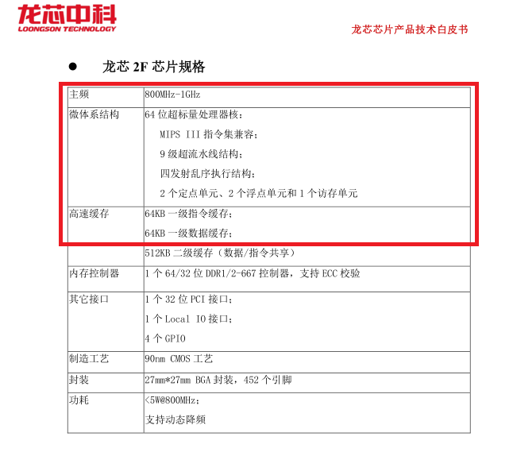

- sim-godson处理器配置参数

  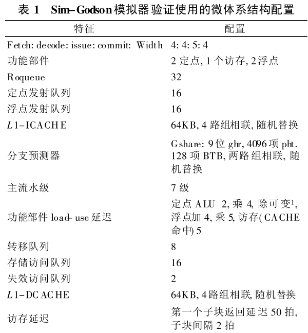

从上面两张龙芯实际芯片和模拟器的配置参数来看，两者在配置上几乎一致，除了一些非常细节的微架构参数(这些参数在介绍处理器微架构时会更多说明)；最大的不同在***主流水线的级数***：实际芯片-9级，模拟器-7级，实际代码中看到实际只有6级，这里的差别会在介绍处理器微架构时进行重点说明。

- 模拟器与龙芯内部的信号集仿真器校准，采用SPEC2000 test测试集，运行10亿条指令，误差在5%，如下

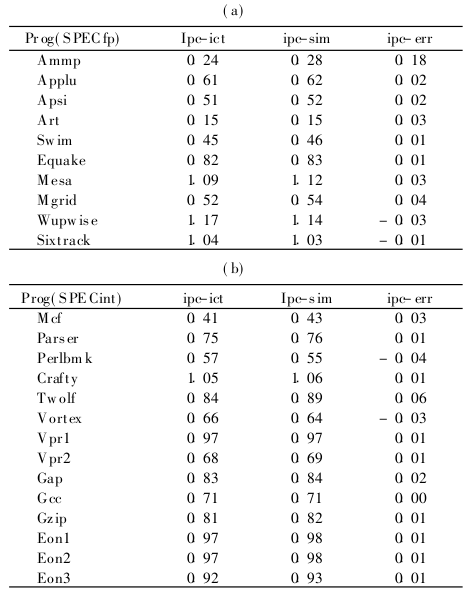

------

## 龙芯Loongson-2A处理器微架构

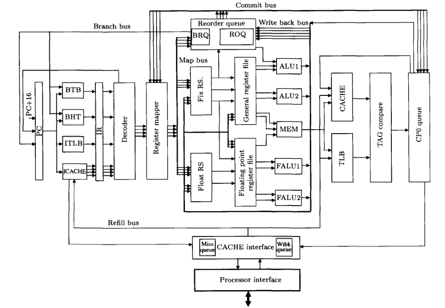

龙芯Loongson-2A处理器主流水线由9级流水组成：

### Fetch Stage

按照nextPC访问ITLB和I-CACHE，每次抓取4条MIPS指令(4B/inst)，如果出现ITLB或是ICACHE miss，则fetch stall；抓取的指令放入到Intruction Register(IR)中，IR实际是一个4层的buffer。

### Pre-Decode Stage

识别出4条MIPS指令中的branch指令，并预测其跳转方向和跳转地址。这里仅仅进行预测，但是并不改变nextPC

### 模拟器实现

在sim-godson中，fetch与pre-decoder合并为1级，完成从指令读取，指令切分和地址预测等3个部分工作。IR在模拟器中通过fetch_data和decode_data联合进行模拟，fetch_data和decode_data分别代表了在fetch_stage和decode_stage上正在流水的指令。

#### 指令读取

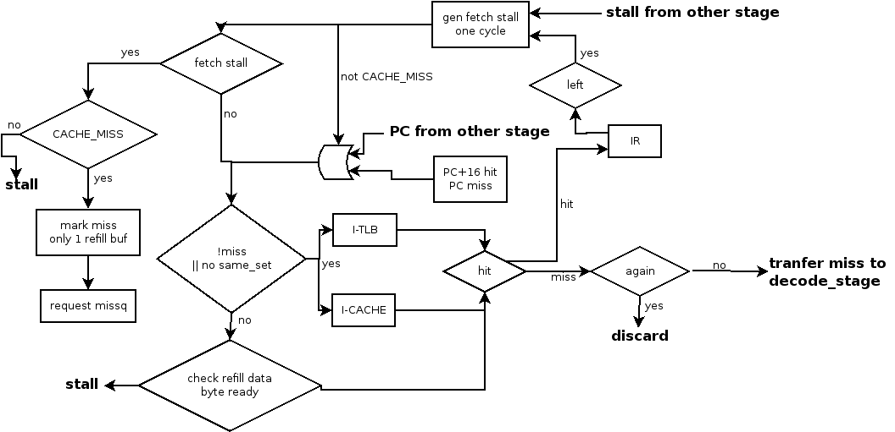

fetch阶段的特征：

- 每次fetch的data是16B，即4条指令，每条MIPS指令占用4B

- 每次fetch只fetch到cache line的边界

- fetch stall信号维持一个周期，导致fetch stall的几种情况：

  - IR not empty

    当前Instruction-Register中(目前设计容纳4条指令)还有指令没有decode，则当前fetch stall，直到IR为空

  - i-CACHE miss

    i-CACHE miss的信息会传递到decode_stage，decode_stage检测后，stall fetch；fetch填充refill buffer，并请求Un-Core中的miss buffer

  - i-TLB miss

    模拟器中，i-TLB永远hit，这部分没有模拟

  - branch stall

    在pipeline的各个阶段，需要对于预测错误的指令进行纠正。可以引起branch stall的stage包括如下几个stage

    - decode

      对于absolute branch和类似call/return的branch，如果出现target预测错误，则直接在decode阶段对fetch PC进行修正

    - writeback

      对于conditional branch，如果方向预测错误，则当指令执行完成后，刷新流水线，并对fetch PC进行修正

    - commit

      当出现exception的指令进行commit的时候，会刷新流水线，并对fetch PC进行修正

  - refill stall

    当low-level cache已经完成reload，并用data填充L1 i-CACHE的时候，当T reload的时候，不能进行read

- icache miss后只有一个miss buffer；miss之后的code fech可以hit，则fetch继续，如果出现新的miss，则新的miss信息丢弃，等待当前的miss结束

- 当前需要read的16B instruction已经被refill到cache中，即使当前cache line没有被完全refill (Cacheline为32B)，则这种情况算partial-hit，当前fetch返回16B数据 [模拟器实现中这里有错误]

#### 指令切分

对于龙芯的指令来说，通常一条MIPS指令会生成一条指令的内部表示信息。但是对于整形和定点乘法、除法指令，因为会产生两个结果( 商和余数)，所以一条指令在内部被翻译为两个指令内部表示，但是龙芯的前端设计宽度为4，所以一次最多只能传递4个内部指令信息。模拟器中的处理只在整形和定点乘法、除法出现在当前fetch指令的最后一条的时候，该指令无法decode；实际上，我们认为当有此类出现的情况时，IR中总会留下没有被解码的指令

#### 地址预测

地址预测主要通过跳转预测器(Branch predictor)完成。在龙芯模拟器中主要设计了如下几类预测器

- 方向预测器(GShare)，用于条件分支

  两级预测器。第一级预测器由一个单元组成，保存了全局的分支历史信息，被称为全局历史信息预测器，全局历史信息一共9bit；第二级一共4096个单元，由2bit饱和计数器构成；第二级索引由如下方式构成：

  ​	index[11:0] = { (fetch_PC>>5) ^ global_history)[8:0],  fetch_PC[4:2] }

  饱和计数器的高1位为方向预测位，1位跳转，0位不跳转。当预测正确时，+1， 预测错误时，-1

- 跳转目标预测器（BTB），用于条件分支和间接跳转指令(JR/JALR)

  BTB为128个entry的1way结构，索引和tag构成如下：

  ​	index = fetch_PC[11:5]

  ​	tag = fetch_PC[max : 12]

  对于BTB不保留全地址的情况，tag仅有6bit，即tag = fetch_PC[17:12]，保留的target为target[23:0]

- RAS，用于return指令

  不用于预测，仅在decode完成后，根据确定的call和return指令进行压栈和出栈处理，层数为4层；位于decode_stage

地址预测在流水线上的处理情况：

- fetch阶段

  利用取值地址访问GShare和BTB，得到预测方向和目标，但是不更新全局历史信息，而是将所有信息随着fetch到的指令存入IR中。此时也不更新fetch_PC

- decode阶段

  - 根据译码得到的指令类型，完成目标地址和方向的判断：
    - return指令，访问RAS，跳转方向一定taken
    - JR或是JALR指令，目标地址来自于BTB，跳转方向一定taken
    - 条件分支，目标来自于BTB，跳转方向来自于两级预测器

  - 如果指令是条件跳转指令，则更新全局分支历史信息，实际take effect在一个T之后

  - 如果当前预测为taken，则stall fetch并设置新的fetch_PC

- writeback阶段

  如果分支指令以及延迟槽都完成，则更新分支预测器；如果分支指令预测错误，则回复流水线的状态(全局历史信息和RAS栈顶指针)，这部分见后面write_stage阶段

------

### Decode Stage

将4条MIPS指令进行解码；对于定点的乘除指令，会被分解为2条内部指令表示，同时解码阶段只能解码一条branch指令。并且对于fetch_stage发生的cache miss和分支预测结果进行处理，对根据需要stall fetch并设置新的fetch_PC

### 模拟器实现

在模拟器中，decode阶段的模拟主要完成指令的译码，以及对于fetch传递来的分支信息和miss信息的处理。除此之外，模拟器在这里完成了指令的执行，所以龙芯模拟器是function-first的模拟机制。

#### 指令译码

龙芯模拟器实现的指令译码的特征：

- 每个T只能处理一条branch指令，这是因为MIPS特有的延迟槽(delay slot)特征造成的结果

延迟槽介绍(delay slot)

​	delay slot是MIPS在最初5级in-order流水线设计中引入的一个概念：假设delay slot的个数是N，意味着每个branch指令后面有N个指令不管branch是否taken，都会被执行，且架构可见。delay slot的设计本质上是HW设计中为了简化branch taken与否对于pipeline设计的难度，将相应的HW微架构状态暴露给SW的一种架构设计折衷。通常，MIPS CPU的典型delay slot的个数为1或者2，对于龙芯处理器来说delay slot = 1

​	delay slot对于ISA来说有几个限制：

1. delay slot指令本身不能是分支指令
2. delay slot指令发生异常时，异常返回时必须返回到delay slot前面的branch指令

因为这两个限制，导致了MIPS的微架构必须考虑好对于delay slot的处理。

- 分析fetch的分支预测结果和miss信息，相关的介绍见fetch stage。这里需要强调的是：

  - 对于cache miss，stall fetch为设置原因为CACHE_MISS，不更改fetch_PC
  - 对于branch predict taken的情况，因为fetch阶段没有更新fetch_PC，所以这里需要stall fetch，设置原因为BRANCH_MISS，并更改fetch_PC；需要强调的一点是（这里站在delay_slot指令角度)：
    - 对于delay_slot指令与branch指令在同一个IR中的情况，需要stall当T的fetch，并flush delay_slot后的IR所有指令，但是并不重置i-CACHE miss的状态，fetch从下一个T使用新的fetch_PC进行取指
    - 对于delay_slot指令与branch指令不在同一个IR中的情况，则立即设置fetch_PC，并在本T内fetch使用新的fetch_PC进行取值

- 执行MIPS指令

  这个是模拟器独有的特性，相当于将处理器的execute_stage的事情提前到decode_stage完成。由此，可以判断出龙芯模拟器采用的是function-first的模拟机制。这样做的好处是：可以根据function执行的golden结果判断分支预测的结果；可以快速得到内存指令的逻辑和物理地址；可以计算某些指令基于值的延时(如DIV指令)；不好的是：无法在处理器后端做值预测。在这部分模拟中，龙芯模拟器主要有如下两个特征：

  - 建立投机执行环境，模拟错误分支上的指令执行效果。这是通过建立投机层(包括内存+寄存器)实现
  - 通过SW方式建立指令与指令间的依赖关系，为后续乱序执行做准备。这里，龙芯模拟器直接在指令间直接建立好依赖链，而不是像HW一样通过rename阶段去构造依赖链，简化了map_stage的模拟工作量

------

### Map Stage

龙芯处理器在map_stage阶段进行寄存器重命名。龙芯的重命名机制采用physical register file的重命名方式，没有实际的架构寄存器。并完成指令间依赖关系的建立

### Dispatch Stage

Dispatch stage依据指令类型分配必要的后端的执行资源，包括：ROB entry，Integer/Float scheduler entry，Function-Unit，Integer/Float register file，BRQ（branch recordoer queue），LSQ entry等。在这个stage，每个T可以处理4个指令内部表示

### 模拟器实现

模拟器在map_stage这一级实现了HW的map_stage和dispatch_stage的所有功能。因为前面的decode_stage已经完成了指令间依赖关系的建立，所以模拟器在map_stage这一级模拟中主要是对一些资源情况进行dispatch。在龙芯模拟器中，各类资源的大小情况如下：

| 资源名称 | 作用                          | 大小 |
| -------- | ----------------------------- | ---- |
| roq      | ROB，用于指令间的保序         | 64   |
| brq      | 用于保存分支指令的预测结果    | 8    |
| lsq      | 用于处理ld/st的order buffer   | 32   |
| intq     | 进行整型指令调度的queue       | 16   |
| fpq      | 进行浮点指令调度的queue       | 16   |
| grmt     | 整型寄存器的register file大小 | 29   |
| frmt     | 浮点寄存器的register file大小 | 32   |

------

### Issue Stage

所有经过dispatch之后的指令都会在对应的scheduler中等待发射执行，如果指令的所有操作数已经ready，那么直接发送给分配的Function-Unit进行执行(需要在FU不busy的情况下)；如果操作数还没有ready，则通过监听result bus查看操作数何时ready(rename_stage和dispatch_stage也会监听)，不太清楚龙芯处理器是否存在forward bus。对于龙芯处理器来说，一个T内最多可以issue5条ready的指令(有5个执行单元)。在同一T内，如果有多个指令ready并需要发送到相同的port上，那么选择program order上面最老的那个进行发射

### Reg-Read Stage

在指令被scheduler发射到Function Unit之前，需要通过register file读取指令的 操作数。对于整型register file来说，一共有6个读口，3个写口，2个整型执行单元每个需要2读1写，LSU通过整型sheculer进行issue，同样需要2读1写；对于浮点register file来说，一共有5个读口，3个写口，2个浮点执行单元每个需要2读1写，对于浮点/整型的转换指令，需要通过LSU通道进行处理，所以需要1读1写。从这里可以看到，龙芯处理器的register读写port是按照最大的需求量进行设计的，所以不存在读写port的竞争

### 模拟器实现

模拟器的issue_stage实现了龙芯处理器的issue_stage和reg-read_stage的功能。在issue_stage模拟器使用了一个在硬件中不存在的结构ready queue，表示有哪些指令已经ready，可以发射到fu中进行执行，每个function unit一个ready queue。ready queue中ready的指令按照program order进行排序。当function unit空闲的时候，模拟器从function unit中调度一个ready的指令发送到ready queue进行”模拟执行“。模拟执行的含义：

- 设置function unit为busy
- 根据预设或是计算的指令执行delay，加入一个延时队列模拟指令的执行过程
- 对于可以pipeline的function unit和指令，在下一个T清除function unit的busy标志
- 对于LSU来说，模拟执行意味着当前发射出来的lsq entry可以开始访问L1 d-CACHE的pipeline，开始LSU pipeline的模拟

不同指令的执行delay会在execution_stage进行介绍

------

### Execution Stage

龙芯处理器一共有5个Function Unit，分别为：

- ALU1

  执行定点和整型的add, sub, logical, shift, comparison, trap and branch instruction，在这里执行的指令1T后回写结果

- ALU2

  执行定点和整型的add, sub, logical shift, comparison, multiplication, division。对于定点和整型的multiplication，执行时延4T，可以pipeline；定点和整型的division使用SRT算法，不能pipeline，执行时延从4T-37T不等(依赖于相关的操作数)；其他的指令1T后回写结果

- LSU

  ALU通过整型scheduler进行调度执行，执行的ld/st指令上L1 d-CACHE pipeline并进行地址计算，见后面”LSQ及Un-Core Interface的模拟“的一节介绍

- FPU1

  执行浮点的add, sub, abs, neg, conversion, comparison, and branch instruction。所有指令均可以pipeline。其中，add, sub, conversion执行时延4T; abs, neg, comparision and branch执行时延2T

- FPU2

  执行浮点的multiplication, division and square root。浮点multiplication执行时延5T，可以pipeline；division and square root使用SRT算法，不能pipeline，其中，division对于single/double的时延从4T->10T/17T，square root对于single/double的时延从4T->16T/31T

对于可以同时发送到多个端口的指令，龙芯采用"最少使用"原则进行端口绑定，模拟器中的实现策略是记录从仿真开始以来每个端口的分配情况，当有多个端口可分配的时候，优先分配到分配次数较少的那个端口上

龙芯处理器通过MIPS浮点指令扩展域*fmt*实现了部分的SIMD指令，可以支持2个single float的add/sub/mulplication，或者32bit/64bit的arithmetic, logic, shift, compare and branch， 或者8bit/16bit的整型操作

当指令执行完毕后，处理器通过result bus将resut写入到register file中。如果是mis-predict的指令，则处理器在指令回写后的**下一个T**进一步进行分支指令的预测结果的处理和更新，必要时进行recovery处理。分支指令执行完成后的更新条件：

- 分支指令没有mis-predict 或
- mis-predict但是delay slot也执行完毕

目前龙芯处理器的mis-predict recovery处理机制是：

- 找出所有后端上的bogus的指令，将其kill掉
- flush掉前端，回复rename的映射机制到确定点，重置fetch_PC，stall当前fetch，设置原因为BRANCH_STALL
- roll back BPU的状态(全局历史信息和RAS的栈顶)
- delay slot指令不能release

#### 龙芯处理器如何做到可以精确找出哪些指令需要被flush掉

龙芯处理器会给每一条指令设置一个*brqid*的变量，这个变量表明了当前指令与哪个分支指令属于相同的BasicBlock，所以进行revoery的时候，只要比较当前指令的brqid与mis-predict的分支指令的brqid的大小关系即可，<不用flush，>=需要flush。

### 模拟器实现

对于Function Unit的执行没有额外的代码需要编写，这部分的信息直接编码在了simplescalar的MIPS指令集定义中。目前模拟器仅仅实现了定点和整型的division依据操作数不同使用不同的执行时延的特征

对于执行完成后的回写以及branch recovery的处理在模拟器中使用writeback_stage进行模拟。这里主要完成两个部分工作：

- 将上述的branch mis-prediction的恢复机制进行了模拟
- 将decode阶段通过SW方式建立的指令间依赖关系恢复

------

### Commit Stage

龙芯处理器的commit stage完成指令的retirement，每T可以完成4个指令retirement。当指令retire的时候：

- 更新register rename table标记当前架构寄存器所在的physical register
- 如果指令发生了异常，那么当指令retire的时候，刷新流水线，并跳转到异常入口进行执行

### 模拟器实现

龙芯模拟器中对于commit_stage进行了简单的模拟，仅仅是进行了资源的回收，被回收的资源包括：

- ROB
- BRQ
- rename table entries

其次，目前的龙芯模拟器并不支持ISA层面的异常处理。目前，在模拟器中可以看到如下几类异常(有些不是ISA层面的异常，仅仅是借用了异常的处理通道)：

- TLB MISS
- 指令越界                                               ISA 层面
- load/store violation
- memory consistency violation

其中，只有后2个异常会被模拟，而前2个不会在现在的模拟器中发生。当异常发生时，处理的方式非常简单：直接把整个流水线清空，设置fetch stall，设置原因为BRANCH_STALL，并将fetch_PC更新为发生异常的那条指令的PC。

------

### LSQ及Un-Core Interface的模拟

龙芯模拟器中，对于LSU进行了周期精确的模拟，基于模拟器，我们绘制了其整体的LSU的结构及Un-Core Interace的结构，如下图所示：

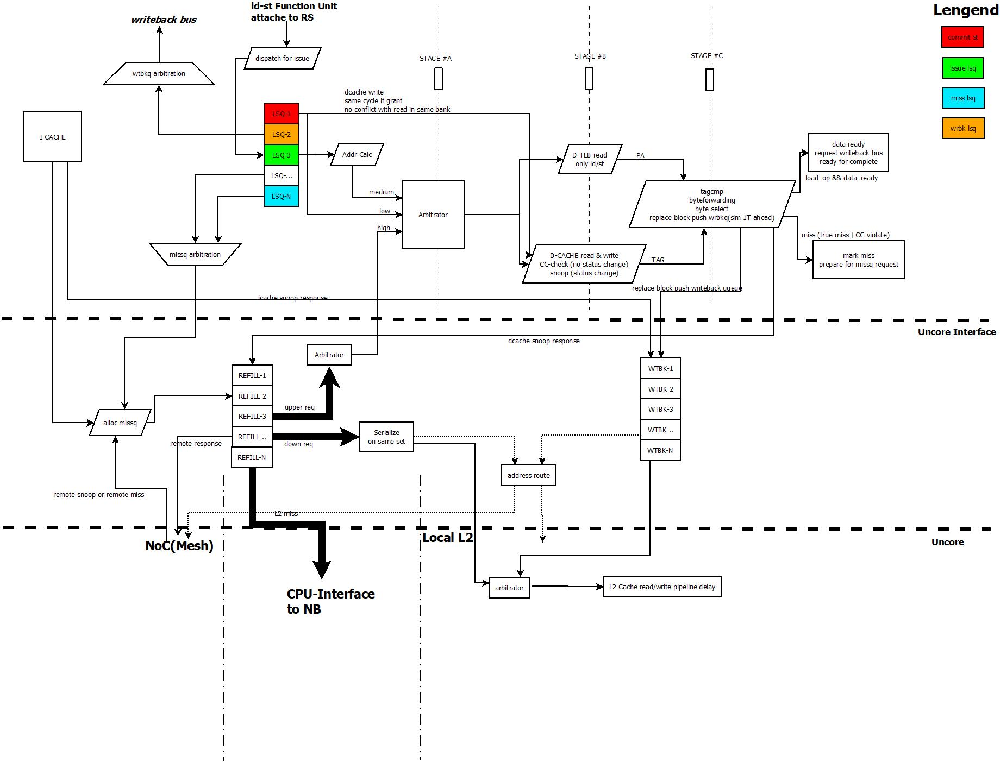

#### L1 i-CACHE & d-CACHE的基本结构

- L1/L2采用inclusive，directory方式管理
- L1 cache大小为64KB，采用4-way的结构，采用virtual address index, physical address tag的方式
- L2 cache采用slice化，每个slice大小为1MB，采用4-way的结构，采用physical address index, physical address tag的方式
- L1 Cache和下层的数据接口以及与SystemBus的数据接口均为64bit(8B)
- data array 的cache line size为32B，每8B组成一个bank，所以一个cache line由4个bank组成，每个bank有一个单独的读写端口
- tag array也是单读写端口
- 使用随机替换策略，在模拟器中，随机种子为当前的模拟时间
- cache coherence采用MSI或是MESI的方式(实际龙芯实现中，大概率应该使用MSI方式，MESI方式在模拟器中可以看出是一个option)

#### L1 i-CACHE的流程

非常简单，因为只能有一笔miss pending，所以当发生miss后，只需等待refill data done即可，更多的处理说明已经在fetch_stage进行了描述

#### LSQ的状态转换

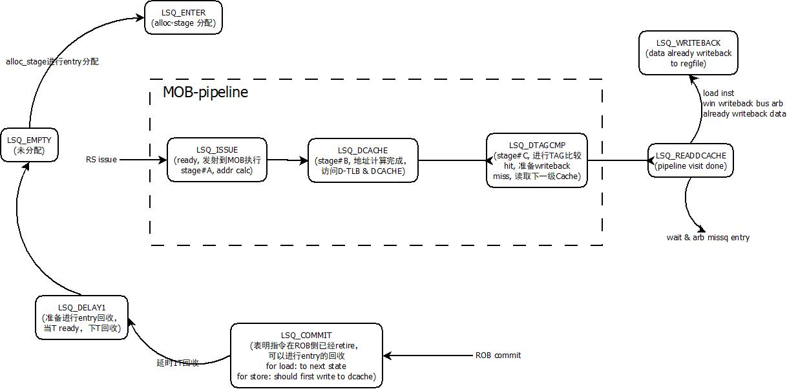

#### L1 d-CACHE的pipeline流程

从实现中看，LSU可以同时进行3个事情的处理：

- ISSUE: 当LSU entry中的指令ready的时候，由scheduler调度到LSU port上进行执行，准备上LSU的pipeline
- WRBK: ld指令已经data done或是st指令已经上过了pipeline，等待上result bus，进行writeback
- MISS: 当出现cache miss或是cc-violation的时候，等待push miss queue

对于2、3来说，可以有若干LSQ entry等待处理，采用oldest-first的方式进行仲裁

对于1，介绍一下3级流水线的处理流程：

- stage #1

  - 进行地址计算

  - 申请上LSU pipeline，因为tag array只有一个port，所以必须进行仲裁处理，这里的优先级处理顺序为：

    REFILL(包括snoop/replace/refill) > ISSUE(新的请求上pipeline) > STORE_BACK(commit store准备写L1 d-CACHE)

- stage #2

  读取L1 d-CACHE的内容，对于：

  - ISSUE

    读取L1 d-CACHE的内容，并判断是否miss或是cc-violation，不更新cache status，并将结果传递到下一级stage

  - SNOOP

    直接更新cache status，并设置好需要返回的response

  - REPLACE

    利用随机替换策略找出需要被替换的block，如果选出的是刚刚refill的block，那么进行简单变换后，选择另外一个block，并进行replace block的writeback(比实际HW提前了一个T)

  - REFILL

    更改cache status，并标记当前哪个bank的数据是有效的。当当前block处于refill状态时，refill request要连续4T上L1 pipeline进行数据refill，中间不会被打断

- stage #3

  进行tag compare，byte forwarding，byte select

  - ISSUE

    - load/store之间的forwarding和violation check
      - load
        - 扫描所有老的store指令，如果之间有address overlap，那么标注overlap(8B之内)的部分为store forwarding的部分
        - 扫描之前的所有的load指令，如果之前的load还没有回写，则标注其为speculation load，后续当speculation load因为replacement导致miss，那么speculation load标注为exception，进行pipeline flush，这个应该是为了满足Loongson的memory consistency要求(Sequential Consistency)
      - store
        - 扫描所有新的load指令，如果之间有address  overlap，且当前load已经writeback或是将要writeback，那么标注load为exception，发生了load-store violation，会进行pipeline flush
    - 根据cache status的读取结果生成相应的hit/miss信息

  - REPLACE

    - 对于match的store

      store已经上了pipeline，但是没有release，直接kill掉当前entry，并标记重做

    - 对于match的speculation load

      指令数据已经写回，但是没有retire，触发exception，进行pipeline flush

  - SNOOP

    - 扫描所有LSQ中的load/store，对于已经访问过pipeline，但是没有完成的load/store，标记重做；对于speculation load，如果已经写回，那么标记exception
    - 如果当前的snoop是remote snoop，则直接将结果返回给底层的missq entry
    - 如果当前的snoop是remote L1 miss或是L2 miss引起，则将相应的reponse返回给对应的missq entry

  - REFILL

    - 对于已经完成pipeline访问的load/store指令，将当前refill的data直接forwarding给对应的LSQ entry(和当前refill data的地址match)
    - 对于store，如果当前的cache status是READ_SHR，依然当作miss处理，发送UPGRADE请求
    - 如果本T需要push missq的request正好被refill data forwarding，那么当前请求被kill掉，missq仲裁空拍

#### MissQ的状态转换

missQ表示当L1 Cache出现miss的时候，都需要进入missQ去访问shared L2或是上SystemBus。每个missQ中的entry都是一个单独的状态机控制，**当有多个entry处于同一个状态时，采用round-robin的仲裁算法**，如下图：

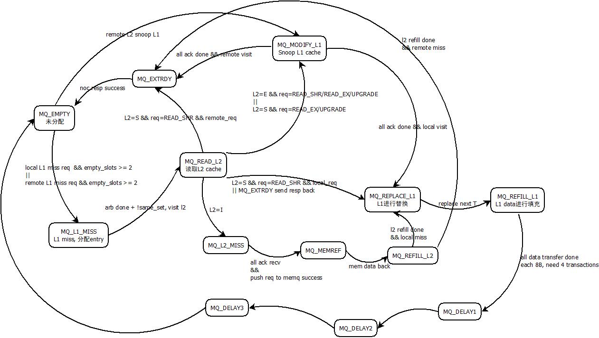

- EMPTY

  当前missQ entry为空，可以为新的miss request占用。当前的miss request如果已经在miss queue中有相同地址的request，如果当前request还没有发出，那么merge成一个request，如果当前request已经发出，那么新分配一个entry保存新的request

- L1_MISS

  missQ已经接收了L1 Cache的request，根据physical address的owner执行不同的动作：

  - 发送给本地L2进行访问(延时4T)
  - 通过NoC网络发送remote miss给对应的节点(REQ channel)

- READ_L2

  - 本地访问，读取shared L2 Cache，当读取L2 Cache的时候，不能进行writeback的处理。根据当前L2 cache status的结果进行后续的处理

  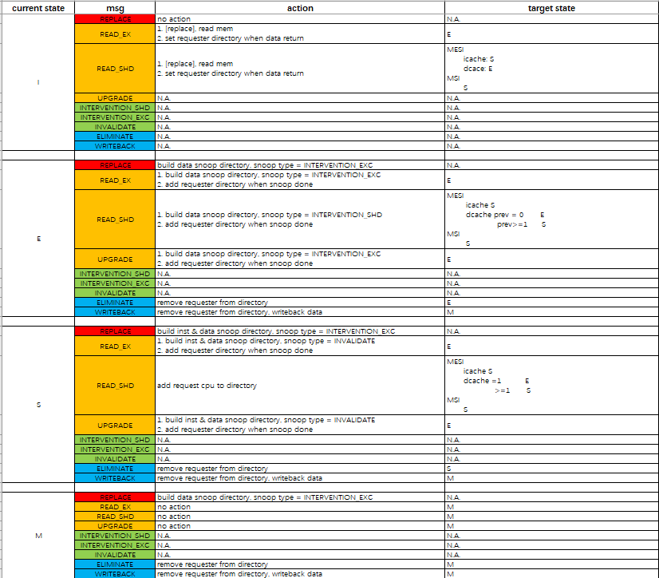
  
  - remote访问，等待remote L2返回结果
  
- MODIFY_L1

  需要snoop本地的L1 Cache，当snoop结束后，将相应的snoop结果返回给发起方

  - 对于local miss，切换状态到REPLACE_L1
  - 对于remote snoop，切换状态到EXTRDY

- L2_MISS

  当L2 miss的时候，missq进行如下处理(同时)：

  - 依次给remote的L1 cache发送snoop，并等待ack
  - 如果所有的ack done且还没有发送请求到memory bus，发送响应请求到memory bus进行读取
  - 发送snoop给本地L1 cache

- REPLACE_L1

  当L2的data已经返回后，则开始L1 cache block的替换，发送replace request 给L1 Cache。需要注意的是，当开始L1 Cache的replace后，则当前L2 访问L1的通道就被当前request占据，后续4T进行refill的处理，中间不能被其他的snoop和replace/refill打断

- REFILL_L1

  连续发送4次refill请求给L1 Cache，当4次refill的请求完成后，则标记设置当前entry为DELAY1，延时4T后回收

- EXTRDY

  当当前request是remote request的时候，当请求已经完成，则通过NoC的RESP通道发送resp给requester返回结果

- MEMREF

  表明当前request进行memory read，push memory request queue；模拟器中一定成功(假设memory request queue无限大)。等待memory read的若干延时，切换状态为REFILL_L2

- REFILL_L2

  当memory data返回后

  - replace block=M，写回memory
  - 延时4T，写入L2 Cache，并更新directory status

- DELAY_X

  仅仅进行一些延时处理，目前没有想明白对应到HW 实现中是什么情况

L2访问L1的通道只有一个，所以当有多个状态下的entry都需要进行L1的访问时，仲裁优先级如下：

​	L1 refill > remote snoop  > local snoop > replace > L2 miss snoop

#### L2 Cache和memory的仿真

- L2的读/写均为4T时延
- Memory的读时延：第1个子块 1T；后续的子块1T (模拟器中配置与论文中不一致)
- Memory的写时延： 1T

#### NoC的设计

- 物理地址划分：对整个物理空间按照核的个数均分
- 拓扑：2D-mesh拓扑；UP和DOWN改变行y，LEFT和RIGHT改变列x
- 协议控制：分为4个分离的通道
  - REQ：cache发起的数据请求进入REQ
  - INVN：传输snoop消息
  - WTBK：传递因为replace和snoop被kick off的cache line
  - RESP：返回response(包括data和snoop的结果)
- 数据包大小：2个flit
- 路由器结构：5个端口(HOME, UP, DOWN, LEFT, RIGHT)
  - router输入fifo，每个方向上都有一个input fifo，大小是8
  - 本地端口输出，没有fifo控制，直接发送给对应的miss queue和writeback queue和response queue
    - missq大小：8
    - wrbkq大小：8
    - respq大小：1
- 流水线：接收flit, 路由&仲裁，交换&传输
- 路由算法：XY路由，先在同行内移动，再在同列移动。进行仲裁的时候进行本级路由计算
- 冲裁算法：round-robin，顺序为：HOME，UP，DOWN，LEFT，RIGHT。每一次仲裁后保留上一次仲裁结果，下一次冲裁从上一次grant之后开始
- 流量控制：credit-base流量控制
  - 本地端口，missq的个数作为REQ， INVN通道的credit；wrbkq的个数作为WTBK通道的credit；resp buffer的个数作为RESP通道的credit
  - router上的credit由router的输入fifo的个数决定，5个方向每个通道上都有
  - 当flit离开router，进入本地端口时，本地credit-1
  - 当flit离开输入fifo时，前一级credit+1
- 物理特性：线路延迟为1T

------

## 龙芯Loongson-3A相较Loongson-2A的改进

龙芯 Loongson-3A相较于Loongson-2A的变化总结：

- Core没有改动
- 增加了一个Accelerator用于加速浮点运算
- 增加了NoC网络和Crossbar结构

基本上，所有的改动集中于互联和加速器的设计上

参见Hotchip 2008 "Micro-architecture of Godson-3 Multi-Core Processor"

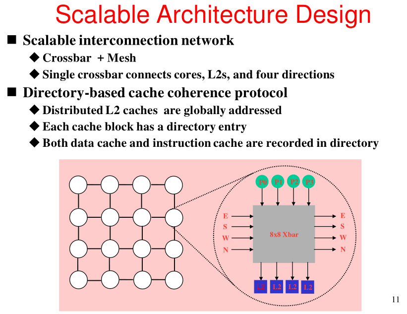

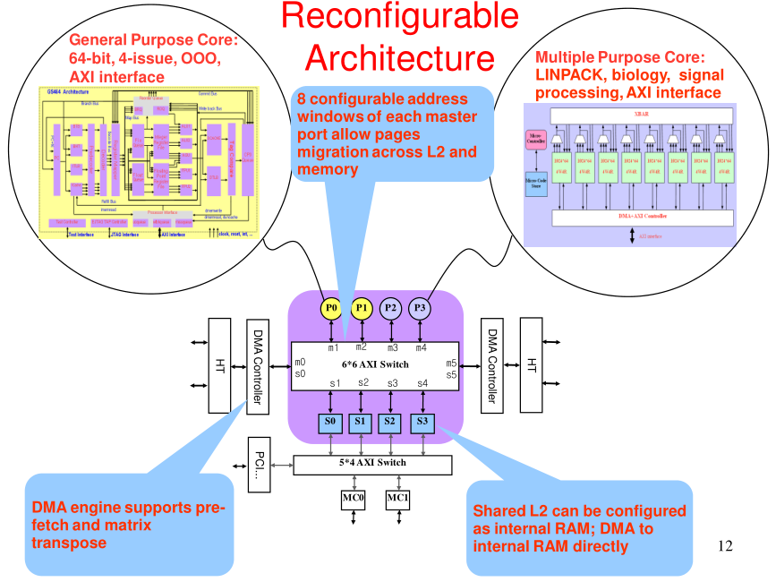

