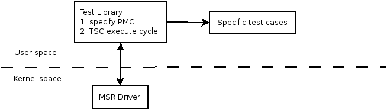

# Ango's cpu-test framework

### Overall structure



### Driver & Test-Library interface

| SMSRInOut                                           |                                                              |
| --------------------------------------------------- | ------------------------------------------------------------ |
| msr_command                                         | 指定 当前MSR寄存器的操作<br />MSR_IGNORE             无操作<br />MSR_STOP                  结束当前配置<br />MSR_READ                 读取寄存器<br />MSR_WRITE                写入寄存器<br />CR_READ                     读取控制寄存器<br />CR_WRITE                    写入控制寄存器<br />PMC_ENABLE              使能readpmc指令<br />PMC_DISABLE             禁止readpmc指令<br />PROC_SET                   设置 driver affinity<br />PROC_GET                   获得 driver affinity |
| register_number                                     | 操作的寄存器index                                            |
| register_val union{uint64_t value; uint32_t val[2]} | 寄存器的值                                                   |

Test Library使用SMSRInOut[MAX_QUE_ENTRIES]的操作队列设置一组MSR&CR的设置；通过/dev/MSRdrv的文件节点发送ioctl的操作进行交互

### Test Library的工作流程

```c++
int main()
{
  // 测试当前System的Core个数，根据设定的需要测试的Thread个数分配每个Thread对应的processor id
  // 设置driver和测试thread在相同的processor id[Linux不需要这步]，并使能readpmc指令
  // 根据测试程序设置的需要使用的PMC COUNTER设置SMSRInOut队列
  // 创建测试线程，开始进行测试
  // 等待所有测试线程结束，并打印所有thread的测试结果
}
```

#### Library内部使用的数据结构

- Sys namespace: 提供Linux环境下的processor的绑定相关API


- CMSRInOutQue: 和Driver中的SMSRInOut对接的Queue


- SCounterDefinition: 定义所有平台的Counter结构

  ```c++
  typedef SCounterDefinition {
    int 				CounterType;			// 程序自定义的ID,相同功能的PMC使用相同ID
    EPMCScheme	PMCScheme;				// 定义测试平台上Core使用的PMC结构；不同的微架构PMC的实现不同，例如PMC的配置寄存器地址，相同的PMC event使用不同的event id & mask等
    EProcFamily	ProcessorFamily;	// 定义不同的Core架构下支持的PMC列表
    int 				CounterFirst, CounterLast;	// 定义某个PMC可以使用的PMC register。在x86中，PMC register主要分为2类: Fixed-Counter只能统计固定功能；General-Counter可以配置为统计不同的功能。通常，First/Last对于General-Counter来说即配置当前PMC可以使用的General-Counter个数，而使用Fixed-Counter的PMC则只配置First即可
    int					EventSelectReg;		// PMC的寄存器配置地址，貌似只针对Intel P4有效
    int					Event;						// PMC对应的event id
    int					EventMask;				// PMC对应的umask id，umask+event id构成一个完整PMC event
    const char 	*Description;			// PMC对应的名字
  };
  ```

- CCounters: 定义当前测试中使用到的所有 PMC Counters，通过CMSRInOutQue进行PMC的配置


​	queue1[64]			测试开始时的PMC配置序列

​	queue2[64]			测试结束后的PMC配置序列

​	两者对应的PMC index registers的差值为当前测试的PMC统计值

- PMC Lists

  参见PMC_List.xlsx

### Test程序框架结构

#### 定制的变量

定义的变量通过宏变量来定义

| 宏变量                   | 说明                                                |
| ------------------------ | --------------------------------------------------- |
| REPETITIONS              | 指定测试程序的循环次数                              |
| NUM_THREADS              | 指定特定测试程序使用几个线程进行同样测试，默认为1   |
| USE_PERFORMANCE_COUNTERS | 是否使用PMC，默认为1                                |
| SUBTRACT_OVERHEAD        | 是否统计循环测试引入的误差，默认为1                 |
| OVERHEAD_REPETITIONS     | 计算循环引入的误差时使用的迭代次数，默认为5         |
| CACHELINESIZE            | 指定特定平台的cache line大小，默认为64B，通常不会变 |

#### 数据结构设计

```c++
// PMC related
int CounterTypesDesired[MAXCOUNTERS] = {};	// 定义某次测试需要的PMC list
ALIGNEDSTRUCTURE(PMCData, CACHELINE) {
 	int CounterTemp[MAXCOUNTERS+1];						// 测试获得的中间结果
  int CounterOverhead[MAXCOUNTERS+1];				// 测试使用循环等结构的overhead，与具体测试无关
  int	ClockResults[REPETITIONS];						// 每次循环测试后通过readtsc获得的cycle结果
  int PMCResults[REPETITIONS*MAXCOUNTERS];	// 每次循环测试后的PMC结果
};

// Control Data
PMCData threadData[MAXTHREADS];					// 每个测试线程对应的PMC data
int NumThreads;
int NumCores;
int MaxNumCounters = MAXCOUNTERS;				// 一次测试最大支持的PMC数量
int UsePMC;
int *pPMCData = threadData;
int clockResultOS;
int PMCResultOS;
long rspsaved;													// 保存之前的栈指针
int Counters[MAXCOUNTERS];							// 记录当前已经使用的PMC counter control reg idx
int EventRegisterUsed[MAXCOUNTERS];			// 只针对Intel P4有效
int RatioOut[4];												// ???
int TempOut;														// ???
const char *RatioOutFile;
const char *TempOutFile;

// User related Data
// define any custom data structure for test program
```

#### 测试程序的流程

测试程序和TestLibrary间的接口通过函数定义`void TestLoop(int threadnumber)`关联

##### TestLoop程序的结构流程

```c++
void TestLoop(void)
{
  // Step1. initialize the PMCOverhead part
  // Step2. custom initialize code
  // Step3. 主测试流程run_tes
}
```

##### 测试原理run_test

```c++
// read_PMC 通过 readpmc指令实现
for iteration_times:
	PMC_loop_before[i] = read_PMC();
	PMC_loop_after[i] = read_PMC();
	PMC_loop_overhead = min(PMC_loop_overhead, (PMC_loop_after[i]-PMC_loop_before[i]));	

for iteration_times:
	PMC_before[i] = read_PMC();
	custom_test();
	PMC_after[i] = read_PMC();
	PMC_value[i] = PMC_after[i] - PMC_before[i];
	PMC_final[i] = PMC_value[i] - PMC_loop_overhead;
```

##### 实际使用的汇编模板

```assembly
; 寄存器约定
;		r13: ThreadData pointer
;		r14: loop counter
;		r15: thread number, from TestLoop(parameter)
; 	rax, rbx, rcx, rdx: scratch register
;		others: available to use
TestLoop:
	; Step1. initialization for UserData
	;					use %testinit1 macro define UserData initialization
	;					UserData is max 0x400B size for each thread
	;					rsi = start of thread's UserData
	;					rdi = rsi+0x200
	; Step2. calc loop overhead
	; Step3. Main Loop Start
	;				TEST_LOOP2:
	;						%testinitc		;	测试开始前的初始化代码
	;						read_initpmc
	;						%testinit2		; 每次循环测试开始前的初始化代码, test loop
	;						mov r12d, repeat1
	;				repeat1loop:
	;						%testinit3		; 宏展开开始时的初始化, macro expand
	;				%rep repeat2			; 测试模板代码展开
	;						%testcode			; 测试模板代码
	;				%endrep
	;						%testafter1		; 宏展开测试完成后的收尾, end of macro expand
	;						dec r12d
	;						jnz repeat1loop
	;						%testafter2		; 循环测试结束后的收尾, end of test loop
	;						counter_collect
	;						inc r14d
	;						cmp r14d, REPETITIONS(%repeat0)
	;						jb TEST_LOOP2
	;						%testafter3		; 整个测试结束后的收尾
	;						cleanup
```

测试模板代码定制的宏模板变量

| 宏模板变量   | 说明                                                         |
| ------------ | ------------------------------------------------------------ |
| instruction  | 被测试的单一x86指令, default nop                             |
| instruction2 | 跟在instruction宏模板后的若干指令, default nothing           |
| regsize      | 指定寄存器大小， 8/16/32/64/128/256/512, default 64          |
| regtype      | 寄存器类型，r(general reg)/h(high 8bit reg)/v(>=128 vector reg)/mmx(mmx reg)/k(mask reg), default r for regsize<=64, v for regsize>=128 |
| numop        | register operands number, 0-3, default 0                     |
| numimm       | immediate operands number, 0-1, default 0                    |
| immvalue     | immediate value, default 0                                   |
| testcode     | test code piece<br /> default<br />       %instruction<br />       %instruction2 |
| testdata     | user defined test data, default array[0x1000B]               |
| testinit1    | initialization code for testdata, default nothing            |
| testinit2    | 循环测试开始前的初始化代码, default nothing                  |
| testinit3    | 宏展开开始前的初始化代码, default nothing                    |
| testinitc    | 每次循环测试前，读取PMC初始值前的初始化代码                  |
| testafter1   | 宏展开结束后的收尾, default nothing                          |
| testafter2   | 循环测试结束后的收尾, default nothing                        |
| testafter3   | 整体测试结束后的收尾, default nothing                        |
| repeat0      | 整个测试的循环次数, default 8                                |
| repeat1      | 循环测试的次数, default 0                                    |
| repeat2      | 宏展开的次数, default 100                                    |
| nthreads     | 使用的thread个数, default 1                                  |
| counters     | 本次测试使用的PMC list, default in "countertypes.inc"        |

### 针对ZX CPU的Porting

- Test Library部分
  - 添加ZX CHX002的PMC list到SCounterDefinition的PMC定义中
  - 修改CCounters的DefineCounter函数，添加CHX002平台的PMC register设置定义
  - 添加CHX002的CPUID相关信息
    - library本身的修改
    - cpugetinfo.cpp的应用程序


