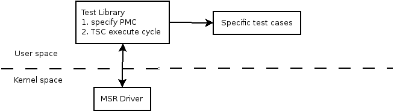

# Ango's cpu-test framework

Overall structure



Driver & Test-Library interface

| SMSRInOut                                           |                                                              |
| --------------------------------------------------- | ------------------------------------------------------------ |
| msr_command                                         | 指定 当前MSR寄存器的操作<br />MSR_IGNORE             无操作<br />MSR_STOP                  结束当前配置<br />MSR_READ                 读取寄存器<br />MSR_WRITE                写入寄存器<br />CR_READ                     读取控制寄存器<br />CR_WRITE                    写入控制寄存器<br />PMC_ENABLE              使能readpmc指令<br />PMC_DISABLE             禁止readpmc指令<br />PROC_SET                   设置 driver affinity<br />PROC_GET                   获得 driver affinity |
| register_number                                     | 操作的寄存器index                                            |
| register_val union{uint64_t value; uint32_t val[2]} | 寄存器的值                                                   |

Test Library使用SMSRInOut[MAX_QUE_ENTRIES]的操作队列设置一组MSR&CR的设置；通过/dev/MSRdrv的文件节点发送ioctl的操作进行交互

Test Library的工作流程

```c++
int main()
{
  // 测试当前System的Core个数，根据设定的需要测试的Thread个数分配每个Thread对应的processor id
  // 设置driver和测试thread在相同的processor id[Linux不需要这步]，并使能readpmc指令
  // 根据测试程序设置的需要使用的PMC COUNTER设置SMSRInOut队列
  // 创建测试线程，开始进行测试
  // 等待所有测试线程结束，并打印所有thread的测试结果
}
```

测试原理

```c++
// read_PMC 通过 readpmc指令实现
PMC_loop_before = read_PMC();
for iteration_times:
	;
PMC_loop_after = read_PMC();
PMC_loop_overhead = PMC_loop_after - PMC_loop_before;

PMC_before = read_PMC();
for iteration_times:
	test_loop();
PMC_after = read_PMC();

PMC_value = PMC_after - PMC_before;
PMC_final = PMC_value - PMC_loop_overhead;
```

Library内部使用的数据结构

Sys namespace: 提供Linux环境下的processor的绑定相关API

CMSRInOutQue: 和Driver中的SMSRInOut对接的Queue

SCounterDefinition: 定义所有平台的Counter结构

```c++
typedef SCounterDefinition {
  int 				CounterType;			// 程序自定义的ID,相同功能的PMC使用相同ID
  EPMCScheme	PMCScheme;				// 定义测试平台上Core使用的PMC结构；不同的微架构PMC的实现不同，例如PMC的配置寄存器地址，相同的PMC event使用不同的event id & mask等
  EProcFamily	ProcessorFamily;	// 定义不同的Core架构下支持的PMC列表
  int 				CounterFirst, CounterLast;	// 定义某个PMC可以使用的PMC register。在x86中，PMC register主要分为2类: Fixed-Counter只能统计固定功能；General-Counter可以配置为统计不同的功能。通常，First/Last对于General-Counter来说即配置当前PMC可以使用的General-Counter个数，而使用Fixed-Counter的PMC则只配置First即可
  int					EventSelectReg;		// PMC的寄存器配置地址，貌似只针对Intel P4有效
  int					Event;						// PMC对应的event id
  int					EventMask;				// PMC对应的umask id，umask+event id构成一个完整PMC event
  const char 	*Description;			// PMC对应的名字
};
```

CCounters: 定义当前测试中使用到的所有 PMC Counters，通过CMSRInOutQue进行PMC的配置

​	queue1[64]			测试开始时的PMC配置序列

​	queue2[64]			测试结束后的PMC配置序列

​	两者对应的PMC index registers的差值为当前测试的PMC统计值

PMC Lists

参见PMC_List.xlsx

Test程序框架结构

```c++
// PMC related
int CounterTypesDesired[MAXCOUNTERS] = {};		// 定义某次测试需要的PMC list
ALIGNEDSTRUCTURE(PMCData, CACHELINE) {
 	int CounterTemp[MAXCOUNTERS+1];				// 测试获得的中间结果
  int CounterOverhead[MAXCOUNTERS+1];		// 测试使用循环等结构的overhead，与具体测试无关
  int	ClockResults[REPETITIONS];				// 每次循环测试后通过readtsc获得的cycle结果
  int PMCResults[REPETITIONS];					// 每次循环测试后的PMC结果
};

```

针对ZX CPU的Porting

不同测试分类分析