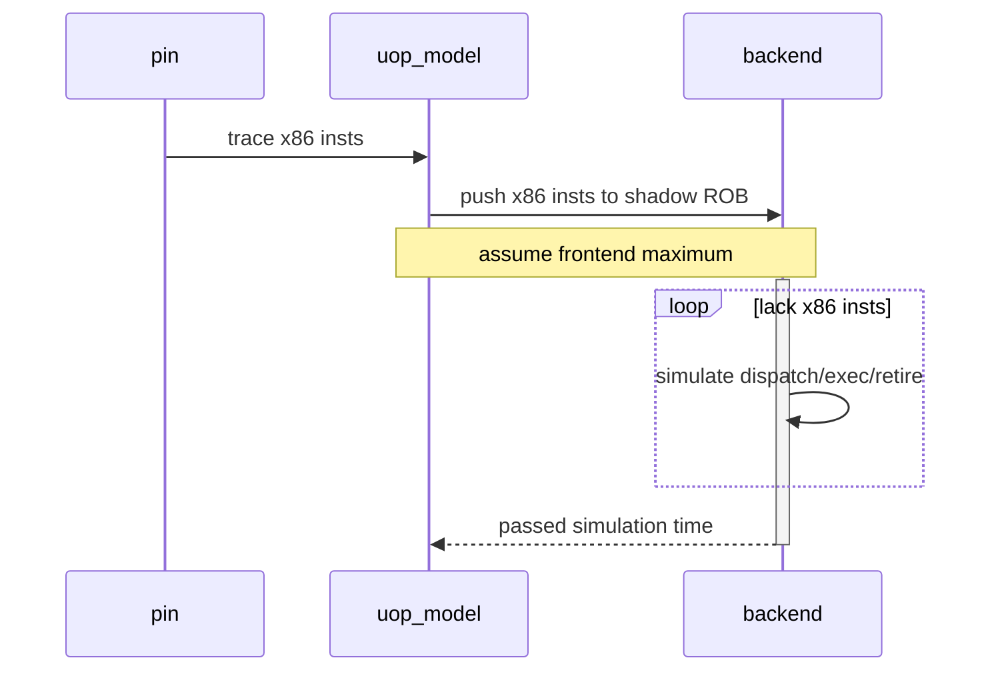
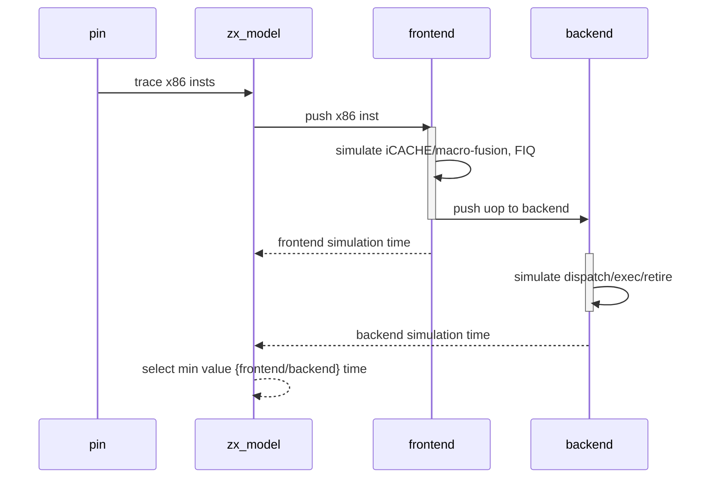

# 兆芯单核memory带宽分析

## glibc的memcpy实现分析

测试环境

- OS: Ubuntu 18.04
- glic: 2.27

glic memcpy代码分析

在glibc的2.27的实现中，对于memcpy的函数实现，glibc无论在动态链接还是静态链接的情况下，都采用了一种ifunc的机制进行处理。ifunc机制的引入主要是为了针对特定的硬件平台提供针对该平台的特定优化版本。

ifunc的实现机制

​	ifunc机制借助于.rela.plt和.plt两个elf section实现。其中，.plt字段定义了运行时候memcpy的具体的调用版本，整个代码的结构如下

```assembly
ENTRY_memcpy:
	jmpq	*offset(%rip)			# <GLOBAL_OFFSET_TABLE offset_memcpy>
	xchg	%ax, %ax
```

在静态链接的情况下：

​	这个`GLOBAL_OFFSET_TABLE(offset_memcpy)`的修改是在整个程序启动时，由glibc的初始化程序负责调用完成的，具体的位置是在libc_start_main(libc-start.c[csu])->ARCH_SETUP_IREL函数中完成的。这个函数会依次调用.rela.plt section中的需要重定位的函数的selector函数进行.plt中的重定位处理

具体的selector函数通过如下的格式进行定义

```c
#define foo __redirect_foo
#include <foo.h>
#undef foo

extern __typeof(__redirect_foo) __foo_default attribute_hidden;
extern __typeof(__redirect_foo) __foo_specail attribute_hidden;

libc_ifunc_redirect(__redirect_foo, __new_foo, IFUNC_SELECTOR());	// IFUNC_SELECTOR宏用于定义selector函数
versioned_symbol(libc, __new_foo, foo, GLIBC_2_14);
```

一个典型的selector函数的实现：

```c
static inline void *
IFUNC_SELECTOR (void)
{
  const struct cpu_features* cpu_features = __get_cpu_features ();

  if (CPU_FEATURES_ARCH_P (cpu_features, Prefer_ERMS))
    return OPTIMIZE (erms);

  if (CPU_FEATURES_ARCH_P (cpu_features, AVX512F_Usable)
      && !CPU_FEATURES_ARCH_P (cpu_features, Prefer_No_AVX512))
    {
      if (CPU_FEATURES_ARCH_P (cpu_features, Prefer_No_VZEROUPPER))
	return OPTIMIZE (avx512_no_vzeroupper);

      if (CPU_FEATURES_CPU_P (cpu_features, ERMS))
	return OPTIMIZE (avx512_unaligned_erms);

      return OPTIMIZE (avx512_unaligned);
    }
	...
}
```

基本通过判断cpu_feature的信息来进行函数版本的不同选择，这里cpu_feature的结构定义如下(sysdeps/x86/cpu-features.h)；可以看到仅仅针对intel/amd进行了定义和处理

```c
struct cpu_features
{
  enum cpu_features_kind
    {
      arch_kind_unknown = 0,
      arch_kind_intel,
      arch_kind_amd,
      arch_kind_other
    } kind;
  int max_cpuid;
  struct cpuid_registers
  {
    unsigned int eax;
    unsigned int ebx;
    unsigned int ecx;
    unsigned int edx;
  } cpuid[COMMON_CPUID_INDEX_MAX];			// <= 硬件定义的feature
  unsigned int family;
  unsigned int model;
  /* The state size for XSAVEC or XSAVE.  The type must be unsigned long
     int so that we use
	sub xsave_state_size_offset(%rip) %RSP_LP
     in _dl_runtime_resolve.  */
  unsigned long int xsave_state_size;
  /* The full state size for XSAVE when XSAVEC is disabled by
     GLIBC_TUNABLES=glibc.tune.hwcaps=-XSAVEC_Usable
   */
  unsigned int xsave_state_full_size;
  unsigned int feature[FEATURE_INDEX_MAX];	// <= glibc自定义的一些feature字段
  /* Data cache size for use in memory and string routines, typically
     L1 size.  */
  unsigned long int data_cache_size;
  /* Shared cache size for use in memory and string routines, typically
     L2 or L3 size.  */
  unsigned long int shared_cache_size;
  /* Threshold to use non temporal store.  */
  unsigned long int non_temporal_threshold;
};
```

在静态链接下，cpu-feature的初始化是在 libc_start_main->ARCH_INIT_CPU_FEATURES()的宏中完成的。

至此，在不同的CPU硬件上如何选择最优的memcpy的版本的过程基本解释完毕。

在测试的两台机器上，memcpy分别对应的版本如下：

CHX002 Cent_id

​	__memmove_sse2_unaligned		sysdeps/x86_64/multiarch/memmove-vec-unaligned-erms.S

HASWELL

​	__memmove_avx_unaligned_erms	sysdeps/x86_64/multiarch/memmove-vec-unaligned-erms.S

两者使用的代码模板一致，而使用的指令略有不同

|                                  | CHX002      | HASWELL  |
| -------------------------------- | ----------- | -------- |
| VEC_SIZE  (一次load/store的大小) | 16B         | 32B      |
| VEC  (使用的vector寄存器)        | xmm         | ymm      |
| PREFETCHNT (模板指令中没有使用)  | prefetchnta |          |
| VMOVNT  (non-temporal move)      | movntdq     | vmovntdq |
| VMOVU  (unaligned move)          | movups      | vmovdqu  |
| VMOVA  (aglined move)            | movaps      | vmovdqa  |

模板代码实现结构

TBD

```assembly
/* memmove/memcpy/mempcpy is implemented as:
   1. Use overlapping load and store to avoid branch.
   2. Load all sources into registers and store them together to avoid
      possible address overlap between source and destination.
   3. If size is 8 * VEC_SIZE or less, load all sources into registers
      and store them together.
   4. Otherwise, if address of destination > address of source, backward copy
      4 * VEC_SIZE at a time with unaligned load and aligned store.
      Load the first 4 * VEC and last VEC before the loop and store
      them after the loop to support overlapping addresses.
   5. Otherwise, forward copy 4 * VEC_SIZE at a time with unaligned
      load and aligned store.  Load the last 4 * VEC and first VEC
      before the loop and store them after the loop to support
      overlapping addresses.
   6. If size >= __x86_shared_non_temporal_threshold and there is no
      overlap between destination and source, use non-temporal store
      instead of aligned store.
*/
```

| 条件 | 使用的copy指令 |
| ---- | -------------- |
|      |                |
|      |                |
|      |                |
|      |                |
|      |                |
|      |                |

对于CHX002使用Intel_id的情况，memcpy执行的代码路径为

CHX002 Intel_id

​	__memcpy_ssse3		sysdeps/x86_64/multiarch/memcpy-ssse3.S

对于glibc而言，对于CHX002 Intel_id的路径选择与Cent_id不同，主要在于init_cpu_features函数中，没有对于`cpuid 0x1`的结果进行保存[只针对Intel/AMD的CPU保存`cpuid 0x1`的结果]

__memcpy_sse3使用的代码模板如下：

TBD

------

GCC/ICC编译的openmp程序的结构分析

TBD

------

## glibc memcpy的性能测试结果

对于GCC O2优化下编译的stream copy程序，其主要汇编代码如下：

```assembly
		xor %rax, %rax
LL: movsd (%r15, %rax, 8), %xmm0
	  movsd %xmm0, 0x0(%r13, %rax, 8)
	  add $0x1, %rax
	  cmp $0x989680, %rax ;对于非openmp的编译
	  cmp %rax, %rdx			;对于openmp的编译，rdx包含0x989680
	  jne LL
```

更具体的数据请参考[memcpy_test.xlsx](./memcpy_test.xlsx)

1. Case-1 不进行memcpy的动作，单纯测试循环的差别

   |          | CHX002                         | INTEL                          |
   | -------- | ------------------------------ | ------------------------------ |
   | 非openmp | 30000000/2000000, uop=30000000 | 30000000/1000000, uop=20000000 |
   | openmp   | 30000000/1000000, uop=20000000 | 30000000/1000000, uop=20000000 |

   可以看到，在非openmp的方式下，CHX002没有使用macro-fusion，导致uop个数与指令个数相同

2. Case-2 进行基于不同数组大小的stream memcpy测试

   统计不同Core在不同Cache level hit情况下的throughput情况

   测试在开启prefetch的情况下进行

   |               | Intel Haswell 2.7GHz | CHX002 2.7GHz |
   | ------------- | -------------------- | ------------- |
   | L1 Cache Hit  | 40.70GB/s            | 25.78GB/s     |
   | L2 Cache Hit  | 32.01GB/s            | N/A           |
   | LLC Cache Hit | 25.64GB/s            | 15.29GB/s     |
   | DRAM Hit      | 12.42GB/s            | 9.04GB/s      |

3. Case-3根据不同的数组大小测试各级Cache的latency

   测试在关闭prefetch的情况下进行

   |               | Intel Haswell 2.7GHz | CHX002 2.7GHz |
   | ------------- | -------------------- | ------------- |
   | L1 Cache Hit  | ~4                   | 4             |
   | L2 Cache Hit  | 12-4=8               | N/A           |
   | LLC Cache Hit | ~40-12-4=24          | 34-2*4=26     |
   | DRAM Hit      | \~130-\~215          | \~225-\~300   |

4. TBD

------

## memcpy在sniper中的模拟仿真

整个仿真基于sniper中的rob_performance_model进行仿真，主要添加macro-fusion、port-binding、LSQ的模拟等功能。在实际仿真测试过程中，发现CHX002的前端设计存在瓶颈，在包含macro-fusion的情况下(3条x86指令对应2条uop)，前端无法达到最大的throughput。所以必须重新设计sniper中的performance model来进行前端的模拟。

原始的sniper中rob_performance_model的实现



对于这种实现方法，始终认为backend是贡献性能的瓶颈，而前端总是可以满足backend的最大的指令throughput的需求，在这里指dispatch_width

而对于CHX002来说，无法满足这个假设条件，所以需要重新设计一个新的performance model。这个是预想的performance model的工作流程



这样设计的方式，会增加仿真时的运行时开销，因为增加一个frontend的仿真，原来的sniper设计只需要把ROB填满，然后循环仿真backend即可；按照目前的设计，则必须每来一条x86都进行一次仿真，只有当frontend的instruction_queue(FIQ)满了之后，才能进行循环仿真

