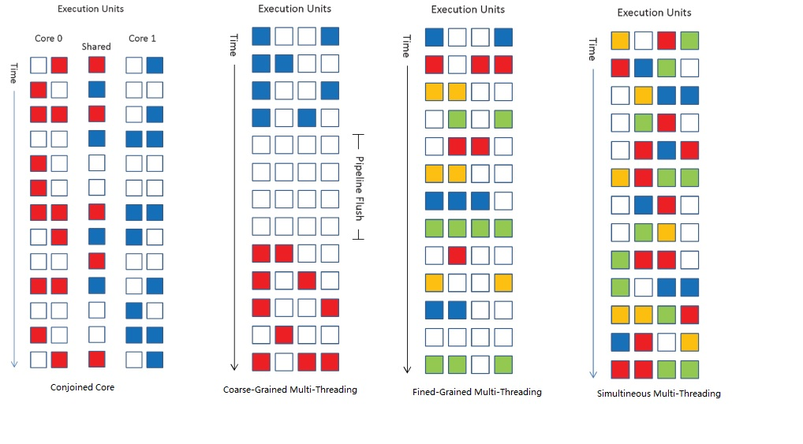
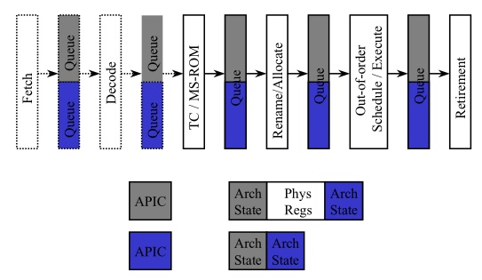
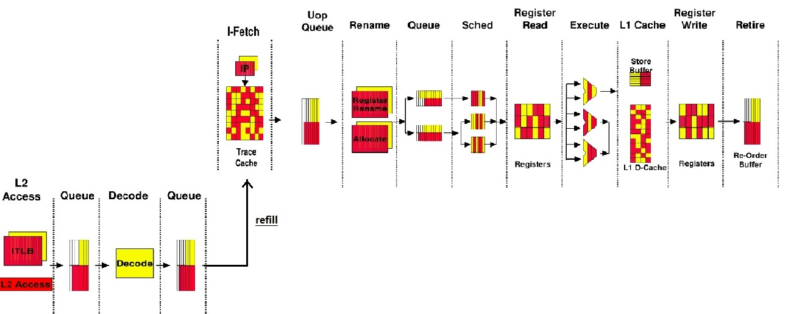
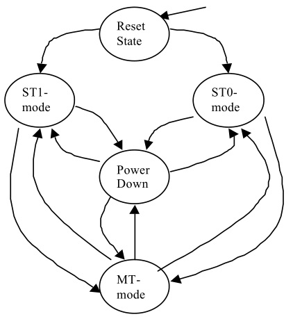
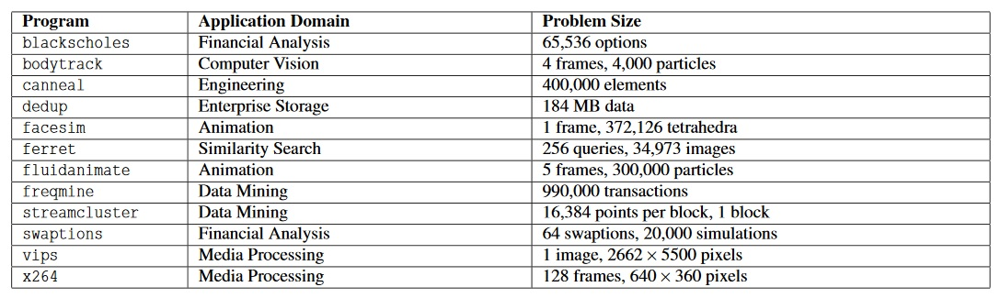
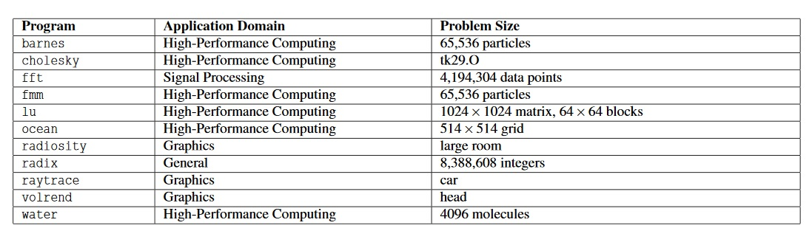

[TOC]

## 理论原理

乱序处理、超标量技术奠定了现代处理器的技术基础，极大地提高了现代处理器的处理效率；并且这个处理效率的提升对软件是透明的，完全由硬件实现。乱序处理、超标量技术本质上都是提高处理器处理带宽的技术(throughput)，但是在提高带宽的同时，并没有影响(或者较少影响)每一条指令的完成时延(latency)。

- 乱序处理——不按照程序的执行顺序执行软件，而是按照程序的实际数据流来执行软件；这样带来的一个明显好处是 不互相依赖的指令可以提前并行执行，只要处理器提供了足够的处理单元，那么每周期可以执行的指令数就会大大增加，直接提高了指令处理的带宽。
- 超标量——乱序处理实际上提高了处理器的后端吞吐能力，但是仅仅有一个高效的后端依然无法整体提高处理器效率，高效的后端需要一个高效的前端配合才能实现。而为了提高前端的吞吐率，最为直观的方式就是直接提高每周期可以发送到后端的指令个数，这个指标就是处理器发射宽度，当发射宽度>1时，这时的处理器被称为超标量处理器。较大的发射宽度、较大的缓存(ROB)为后端乱序处理提供了更多发现ILP(Instruction-level parallelism)的可能。

但是随着处理器技术的进步，设计者们发现在实际硬件设计的限制下，无法持续的增加发射宽度和增大缓存来实现更高的ILP特性，这也成为目前处理器ILP(IPC)提高较为缓慢的一个主要原因；再者，现代处理器为了维持较高的指令吞吐率，采用了很多投机的机制，但是这些机制不能保证总是正确的，且在更宽的发射宽度下，精度还会损失，导致更宽的发射宽度导致更多的功耗消耗，无法达到一个合理的功耗比。

从硬件结构提高程序的性能来看，ILP技术是一种细粒度的提高系统吞吐率(带宽)的技术——在指令层面；为此，设计者开始考虑从任务层面提供更高的系统吞吐率，这既是TLP(Thread-level parallelism)。为了实现TLP，首先需要回答的问题是：TLP是否可以有效提高系统吞吐率？这里有两个著名的理论对这个问题进行了探讨，得出的结果不尽相同。

- Amdahl定律
  $$
  speed = \frac {Time_{serial}} {Time_{parallel}} = \frac {T_{s} + T_{p}} {T_{s} + T_{p}/n} = \frac {1} {1-p + p/ n};  p表示程序中可并行的百分比
  $$
  Amdahl定律表明： 对于固定的程序，使用更多的任务(thread)并不一定能显著提高系统的性能，还与系统中的串行占比部分相关。而目前的程序大部分是串行程序，这意味着单纯的使用更多核心，并不能为系统带来实质加速效果。这个定律主要评估在TLP情况下，某个串行程序改造为并行程序时，可获得的收益。

- Gustafson定律
  $$
  speed  = \frac {Time_{serial}} {Time_{parallel}} = \frac {T_s + n \times T_{p}} {T_{s} + T_{p}} = 1 - p + n \times p; p表示程序中可并行的百分比， n为任务量
  $$
  Gustafson定律表明：即使程序的可并行度不高，但是随着任务量的增加，增加更多的任务(thread)依然可以获得一定的加速效果；这也是TLP得以发展的理论基础。

从两个定律可以总结出，如果一个任务具有良好的并行度，那么两个定律都反映出这个程序可以获得极高的加速比；如果并行度不高，效率会有下降，但是增加任务数依然会提高加速比；没有并行度的程序，增加任务数则只能是浪费。

## TLP (Thread-level parallelism)分类

为系统提供更多的可行任务，对于硬件设计者来说即增加系统的处理器资源。在实际的设计中，处理器资源的添加主要包含如下几种可能的实现方法 (随着可共享的资源越来越多)：

| 类型            | 应用范围              | 特点                                                         | 软件模型                                    |
| --------------- | --------------------- | ------------------------------------------------------------ | ------------------------------------------- |
| Cluster         | 超算、大型集群网络    | 共享网络；多个线程间信息和数据交换使用软件显示控制；<br />系统共享，成本最高 | MPI<br />多个线程最好没有共享               |
| SMP (UMA/NUMA)  | 主流服务器/桌面机系统 | 共享内存/片上网络；随着发展，共享的Memory可以位于不同的位置，导致不同处理器芯片访问不同Memory的延时不同，这种系统称为NUMA，反之则为UMA系统；软件不需要显示控制线程间信息和数据交换<br />芯片共享，需要多个封装的芯片 | OMP/Pthread<br />多个线程最好没有共享或少量 |
| CMP             | 主流服务器/桌面机系统 | 共享LLC或是最后几级Cache；相对于SMP系统而言，共享的资源更靠近处理器核心，当多个线程间有较多的数据共享的时候，会降低多线程间的通讯开销；软件不需要显示控制线程间信息和数据交换<br />芯片内共享，需要增大芯片面积 | OMP/Pthread<br />多个线程存在相当的共享     |
| Multi-Threading | 主流服务器/桌面机系统 | 共享处理器核心，核心内的计算资源完全为多个核心共有；可以更加有效的利用每个核心内的计算资源，但同时过多的线程会干扰彼此的执行，从而增大每个线程的执行时延；软件不需要显示控制线程间信息和数据交换，但是需要更加精细的进行线程调度 | OMP/Pthread<br />多个线程存在大量共享       |

对于Multi-Threading级别的TLP系统，按照不同的实现，可以进一步分类为如下几类实现：

- Conjoined Core

  处理器中只有特定的资源进行共享，其他的资源则每个处理器核心单独所有；典型的产品包括AMD Bulldozer，共享浮点运算核心

- Coarse-Grained Multi-Threading (CGMT)

  类似于软件中的分时复用的概念，对于一个处理器核心在一段时间内只能有一个Thread运行，其他Thread处于等待状态，只有当运行的Thread出现Cache-miss, TLB-miss等比较大的Stall时，处理器核心会切换到其他就绪的Thread执行。CGMT可以有效较少long-latency stall造成的指令带宽浪费

- Fine-Grained Multi-Threading (FGMT)

  与CGMT不同的地方在于FGMT基于指令进行调度，而不是基于一些stall event，这意味着在同一个时刻，不同的pipeline stage只会有一个thread执行，但是不同的pipeline stage可以执行不同的thread。FGMT可以有效较少short/long-latency stall造成的指令带宽浪费，但是处理器基于指令调度每个Thread，所以指令带宽的浪费受限于每个Thread中的软件ILP

- Simultaneous Multi-Threading (SMT)

  SMT与FGMT不同的地方在于，pipeline的stage可以同一时刻可以同时执行多个Thread的指令，最大限度的利用处理器硬件提供的指令带宽 (尽管在实际实现中，大部分只有后端可以同时执行多个Thread指令，而前端依然按照FGMT的方式进行调度)

<center>图1-1 MultiThreading分类</center>


## SMT实现

从上面的分类可以看出，MultiThreading的结构为TLP在硬件层面提供了最大资源的共享，而SMT方式在MultiThreading中是期望对共享的硬件资源利用率最高的一种技术实现。本质上，TLP期望硬件提供足够高的处理带宽，对于SMT而言，因为共享的是处理器核心，所以需要处理器核心提供足够的处理带宽，这个带宽可以通过IPC反映——进而反映了一款处理器核心的ILP设计能力。从而：

<center><u>SMT需要实现在具有足够ILP能力的处理器核心上，即处理器发射宽度必须足够宽(超标量、乱序处理满足要求)</u></center>
在处理器带宽设计满足需求的情况下，SMT要求处理器核心的流水线处理阶段 (pipeline stage) 必须每个周期都可以同时或是选择执行不同Thread的代码流，所以SMT的设计主要考虑流水线各阶段的资源和处理单元在各个Thread间的共享、分配问题，这个分配需要满足**公平、效率**的原则。

### Pentium 4 SMT 流水线实现

下面以Pentium 4为例，说明在商业处理器设计中SMT的设计

Pentium 4是Intel公司第一款支持SMT的处理器核心，在Pentium-EP的服务器版本中发布，每个处理器核心支持2个硬件Thread，即SMT-2，核心本身是一款4发射、超标量、深流水乱序处理器。

下图是Pentium 4 SMT处理器核心基本的实现框图



从图中可以看出：

1. 软件可见的硬件资源——Arch Stage(软件可见寄存器、机器状态)、APIC(中断资源)——全部都是每个线程独立所有
2. 硬件内部的流水线资源——流水线中各阶段的Queue资源采用静态均分、动态分配等多种方式在两个线程间共享

下面，基于详细的流水线设计流程详细介绍流水线各阶段资源在线程间的共享情况



| 流水线阶段         | 资源共享                                                     | 处理流程                                                     |
| ------------------ | ------------------------------------------------------------ | ------------------------------------------------------------ |
| I-Fetch            | **IP(Arch Stage)**: Duplicate<br />**Trace-Cache (TC)**: Dynamic Shared with Thread tagged<br />**MSRom**: totally shared (no modification), TC entry has 2 MSRom pointers respectively<br />**Uop Queues**: static partitioned between Thread (half) | Trace-Cache round-robin each cycle between 2 Threads<br />MSRom round-robin between 2 Threads<br />Above resources, if one thread stall, others will use all bandwidth |
| L2 Access(IF miss) | **ITLB**: duplicate<br />**I-FillQ**: FIFO, reserved 1 entry for each Thread<br />**Streaming Buffer (Fetch Data buffer)**: duplicated, each has 2 set of 64B<br />**BP-RAS**: duplicated<br />**BP-Branch_History_Buffer**: dynamic shared with Thread tagged<br />**BP-global_history**: duplicated<br />**L2 visit logic**: share, exclusive access | L2 is accessed by FIFO in I-FillQ                            |
| Decode (IF miss)   | **Decode State (remember decode where)**: Duplicate<br />**Decode logic**: share, exclusive access | Decode arbitrate between Threads. Decoder will decode series instructions before switching to another thread, switch policy is designed by cost & complexity |
| Rename             | **ROB**: static partition, total 126, 64 each<br />**LSQ**: static partition, LoadQ total 48, 24 each; StoreQ total 24, 12each<br />**Register mapping table**: duplicate<br />**Physical Register File**: Shared, 128 Integer, 128 FP<br />**Rename logic**: shared, exclusive access<br />**Uop Queues**: static partition (half); one for memory uop, one for general uop | Rename round-robin each cycle between Threads. If one thread stall, others will use all bandwidth |
| Sched              | **scheduler queue**: 5 schedulers, each has scheduler queue, queue size 8-12; total shared, regardless of Threads. But each scheduler queue will has limitation for each Thread for preventing deadlock and faireness | scheduler will schedule uop based on input readiness, no aware of Thread's uop |
| Register Read      | **physical register file read logic**:  total shared         | no aware of Threads                                          |
| Execute            | **FU & bypass network**: total shared                        |                                                              |
| Memory Subsystem   | **DTLB**: shared with tagged, each Thread reserved one entry for fairness<br />**Caches**: total shared, no aware of Threads<br />**Bus**: Bus queue entries with tagged | service logic no aware of Thread, but track on request's Thread |
| Register Write     | **physical register file write logic**:  total shared        | no aware of Threads                                          |
| Retire             | **Retire state**: duplicate<br />**Retire logic**: shared, alternate one by one<br />**commit-store**: shared, alternate each cycle | retire will alternate between Threads one by one, if one thread stall, then the other used up total retire bandwidth<br />commit-store is selected alternatively between ready commit stores between Threads |

### Pentium 4 SMT工作模式

从上面的流水线资源划分来看，大部分的处理器内部关键资源当两个Thread同时运行的时候，基本都处于均分的状态，这会导致每个Thread的执行latency相较于单独运行的处理器核心要慢；所以，当某个处理器核心仅有一个Thread工作时，而另外一个处于HALT状态时，工作的Thread享有全部的处理器内部资源，这在Pentium 4中被称为**Single-Task(ST)**模式。ST模式进入的模式有以下条件决定：

- 某个处理器执行了HALT指令，或者进入了C-State，那么处理器处于ST模式
- 当有中中断唤醒另外一个HALT的核心时，处理器退出ST模式回到Multi-Threading模式，关于切换时间和切换方式，并没有更多描述



### Pentium 4 SMT性能评测

Pentium 4 SMT在服务器的应用OLTP/Web server/Server-side java等基准测试中，平均可以提供10-30%的性能提升相对于没有使能SMT的服务器

## SMT问题

SMT作为共享处理器资源最多的一种TLP实现，其主要包括如下的问题：

- 如何选择合理的仲裁策略在每级的流水线阶段，从而可以显著提升TLP的系统性能，而不引入过多的线程间的资源竞争。目前，大多数的仲裁策略的目标是：**尽量不调度"Stall"或"即将Stall"的Thread，从而最大限度的服务与没有Stall的线程，达到硬件资源的利用率**。同时，调度策略和资源分配要保证公平(fairness)——当线程Ready时，可以尽快得到执行
- 对于Memory系统，SMT在Cache系统上既增加了Thread间的数据共享能力，也大大增加了因为Cache共享导致的"互踢"现象。选择什么样的Cache设计参数(associativity, block-size, 替换策略等)可以较少Thread在Cache间的互相影响
- SMT中多个线程间的共享不仅仅存在于Cache/Memory间，也同样存在于执行单元的bypass network和load-store forwarding中，但是这种forwarding因为属于不同的Thread，是否会带来多线程程序间的同步和数据一致性问题？
- OS对于SMT-aware的调度策略，尽量把大量数据共享、不存在计算资源竞争的Threads调度到相同物理核心的线程逻辑核心上

## SMT评估

SMT作为一种TLP技术，在性能评估中面临新的问题：

- 如何评估两种不同的SMT实现间的性能优劣
- 对于性能评估工具，如何选择需要评估的性能评估的程序片段，哪些片段具有代表性；选定程序片段后，优化目标是什么
- 评估什么？我们的处理器的定位是什么？

### SMT Benchmark

- parsec

  2008年发布，为Stanford和Intel合作开发的benchmark，包含12个应用，从不同的设计领域广泛选择的benchmark，目前版本为3.0

  

- splash2

  20世纪90年代初发布，包含11个应用，大部分为原有的高性能计算的benchmark，已停止开发；不过有别的美国大学继续开发了splash3

  

- NAS parallel benchmark (npb)

- SPEC CPU

  权威的CPU性能测试工具，SPEC CPU更多关注单核性能和multi-task的多核性能，目前演进到2017

- handed-write microbench

### SMT可用评估流程

定义程序的speedup为
$$
speedup = T_{serial} / T_{parallel}, 理想情况下的speedup为SMT的逻辑核心数 
$$

1. 测试单线程程序，设置基准比较数据 (baseline) —— 上面任意的SMT Benchmark

2. 对于x86系统，使用`pause`指令在SMT的逻辑核上执行无效操作，在唯一有效逻辑核上执行上述单线程程序，评估SMT enable情况下，资源划分下，SMT引入的speedup (这时的speedup < 1)，这个值一定比原始的baseline数据要差——评估SMT对于单线程程序性能的影响

3. Multi-Threading程序的测试

   测试方法的具体实施 (对于1、3有效)， 2使用benchmark自身的测试和评价方法

   ```c
   parent_task() {
       int run_workloads = 0;
       int pid[SMT_NUM] = {0,};
       
       time_t start = time();
       for (int i = 0; i < SMT_NUM; i++) {
           pid[i] = create_task(task[i]);	// 可能是创建线程，也可能是创建进程
           run_workloads++;
       }
       
       // WORKLOADS_THRESHOLD表示运行多少个workload后，整体测试停止
       // 这个过程中需要保证: 运行时间最长的workload至少要有3次完整运行
       // 这个测试的flow考虑的问题：
       //	1. 消除benchmark运行时间长短不一、导致统计时SMT只有1个线程运行的情况
       //	2. 交错的任务启动时间在测量中是极为次要的影响因素
       // 可以认为执行中，SMT是满速运行的状态
       while (true) {
           wait(any of pid[SMT_NUM]);
           if (pid[i] is done) {
               run_workloads++;
               if (num_workload < WORKLOADS_THRESHOLD) {
               	time_t stop = time();
                   break;
               }
               re-execute(task[i]);
           }
       }
       time_t diff = stop - start;
   }
   ```

   1. Multi-Programmed版本

      SMT上运行多个单线程程序的副本，模拟multi-task的行为；这种情况下多个程序间没有共享或只有少量的共享，程序行为模式和使用的处理器资源也不尽相同。

      评价方法：每个单线程程序的speedup之和定义为multi-programmed的speedup

   2. Parallel程序版本

      Parallel程序通常为多线程程序，程序间可能有更多的线程共享相同的行为模式，或者线程间有更多的共享或者同步需求；导致Parallel程序对于SMT中的资源竞争更为剧烈

      1. benchmark自身的测试

      2. 对于同步、交互共享的单独测试

         需要单独构造锁的例子，使用临界区的方式进行测试，测试锁的交互次数，并进一步评估每次锁内临界区的操作代价

         1. 临界区内只读
         2. 临界区内读写更新临界区变量
         3. 其他形式的多线程共享模式的测试

   3. Heterogeneous / Homogeneous 版本

      将不同的benchmark中的测试程序混合起来一起测试(可以采用不同的问题规模) (Heterogeneous )，或者相同的测试程序用相同的问题规模 (Homogeneous )，查看不同的组合在SMT中的运行影响；尤其可以考虑INT-INT， INT-FP， FP-FP等组合时对于处理器资源的竞争

4. compiler对于SMT的影响

5. OS调度器实现对于SMT的影响， 是否SMT-aware

**4和5目前不在考虑范围之内**

### TLP的编程模型

多线程或者是多进程的软件编程模型主要包括如下两个方面的范式：

1. 将数据进行规模缩减的divide-and-conque算法

   特点：

   - 缩小数据规模小，多个子任务间通常不需要sync(仅仅在最终完成时，可能需要对结果进行merge)
   - 多个子任务的代码逻辑基本一致

   典型应用：

   - 科学计算中对于大矩阵的运算——分解为小规模的子矩阵运算，再做结果合并

   - 多媒体应用中，对于视频流或是图像数据的各种数据格式的处理变换，比如IQ(量化处理)，IDCT/DCT(余玄变换)等

     

2. 按照业务逻辑，进行数据流水作业的pipeline形式处理方式

   特点：

   - 各个子任务间是按照业务逻辑，串行加工数据流，存在较多的任务间同步(多为生产者、消费者模式)
   - 各个子任务间的代码逻辑通常不一致，可能存在较大的差别

   典型应用：

   - 多媒体应用中，对于MPEG压缩视频流的处理过程等

     

## SMT应用

- 硬件架构设计中的优化

  Speculation Processing， 将一个单核串行程序，找到其中的某些可并行的执行点，使用SMT的处理器投机执行某些代码片段用于加速串行程序。目前，比较常用的Speculation Processing是预测程序中一些对于性能较大的cache-miss的load，使用SMT的另外核心投机读取其地址，使得load从miss转为hit，从而达到完成一些Hardware-Prefetching不能预测出的复杂load的行为

## 参考文献

1. Intel Technology Journal， Hyper-Threading Technology, Vol06, Issue01, 2002.2